# *A. The Concurrency-Capacity Trade-off*

In traditional inference, increasing the maximum number of concurrent sequences (max\_num\_seqs) is the primary lever to amortize kernel launch overheads and hide HBM latency. We evaluate this heuristic with DeepSeek-8B model for a

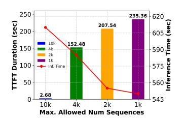

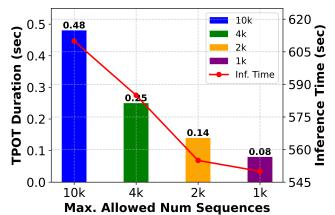

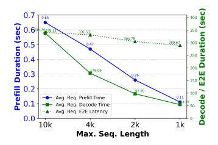

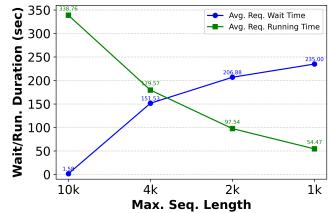

- (a) Average Request TTFT and Inference Duration
- (b) Average Request TPOT and Inference Duration
- (c) Average Request Prefill, Decode, and E2E latency.
- (d) Average Request Waiting and Running Durations.

Fig. 3: Overall serving statistics on scaling maximum number of sequences for DeepSeek-8B on one H200 GPU.

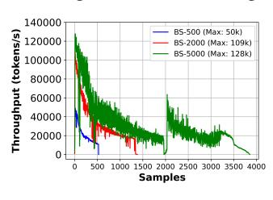

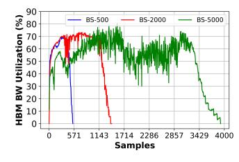

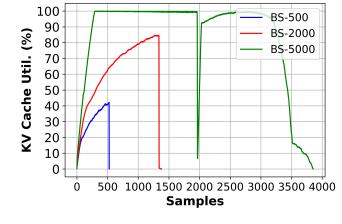

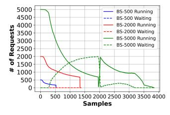

- (a) Generation Throughput (b) Average HBM BW Util. (c) Aggregated KV Cache Util. (d) Request Analysis

Fig. 4: Batch size scaling for DeepSeek-8B on 8x H200 GPUs with 8-way DP.

batch of 10K input sequences while scaling concurrency with 'max num seqs' from 1K to 10K on one H200 GPU.

The Occupancy-Saturation Conflict: Our maxsequence scaling experiments (Figure 2) reveal a fundamental conflict between compute utilization and memory availability. Figure 2 illustrates the temporal evolution of throughput, bandwidth utilization, KV occupancy, and request state as concurrency scales. While higher concurrency initially increases throughput (Figure 2a), the corresponding rise in KV utilization (Figure 2c) rapidly saturates HBM, triggering scheduler preemption events (Figure 2d), which in turn cause drops in bandwidth utilization ((Figure 2b)). The x-axis samples represent uniformly spaced measurements and are proportional to elapsed time. Increasing concurrent sequences to 10K (Figure 2a) achieves the highest *initial* throughput because the scheduler can immediately saturate the SMs with prefill tokens. However, this advantage is transient due to limited memory capacity. Similarly, the bandwidth utilization (Figure 2b) closely follows the generation throughput trend, while dropping during memory saturation and re-scheduling.

The Preemption Cliff: As shown in Figure 2c, the 10K configuration drives the aggregated KV usage to 100% almost instantly. Unlike smaller batch settings (1K), which maintain a stable memory footprint, the 10K setting forces the vLLM scheduler into a thrashing regime. To prevent OOM errors, the scheduler must preempt active (Running) requests (Figure 2d), demoting them to the Waiting queue.

The Re-computation Penalty: This thrashing introduces a severe latency penalty. When preempted requests are rescheduled, the engine attempts to recover their state via *prefix caching*. However, under memory exhaustion, typically, the prefix match fails, and the system falls back to full prefill re-computation [37]. Even with successful partial matching, the overhead of searching blocks (either GPU-resident cached by vLLM or offloaded prefixes cached through LMCache [9], MoonCake [29], [30], etc.) and partial recomputations destroys tail latency stability.

Analytical KV Sizing: While KV-cache capacity can be analytically estimated from model and batching parameters to guide admission control, our results show that such estimates are insufficient to prevent preemptions under dynamic, longcontext reasoning workloads, where scheduling effects and KV fragmentation create transient capacity spikes.

Observation 1: For reasoning workloads, increasing concurrency improves GPU occupancy only until the cumulative KV footprint from long-lived reasoning tokens saturates HBM creating a Capacity Trap. Beyond this point, additional requests trigger preemption and recomputation, causing throughput gains to collapse. Hence, schedulers should avoid maximizing concurrency blindly; instead, enforce a KV-aware concurrency cap based on available HBM headroom, active sequence length, and expected decode growth.

## *B. The Latency Decoupling: TTFT vs. TPOT*

While the Capacity Trap explains *why* the system struggles, the impact on service quality is best understood by studying the request TTFT, TPOT, and E2E. Figure 3 quantifies this Pareto frontier. Importantly, the convex E2E latency curve reflects not a tuning artifact, but a fundamental trade-off between admission latency and KV-limited decode progress, defining a concurrency sweet spot intrinsic to reasoning workloads. We define inference time as the total execution time of prefill and decode after request scheduling, while the E2E latency captures the full request lifecycle, including queuing, scheduling, and inference.

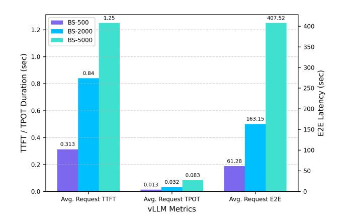

Fig. 5: vLLM Metrics for 500, 2000 and 5000 batch sizes for DS-8B for 8-way DP.

The Inverse Scaling Law: We observe a sharp divergence in metric behavior as concurrency scales: (1) TTFT (Queue-Bound): TTFT is minimized at maximum concurrency (10K), dropping to ≈2.7s (Figure 3a). This is intuitive: with more open slots, a request spends less time in the admission queue. High concurrency more efficiently utilizes GPU's parallelization capabilities; (2) TPOT (Bandwidth and Capacity Bound): Conversely, TPOT degrades linearly with concurrency, rising from ≈0.08s at 1K to ≈0.48s at 10K (Figure 3b). In addition to being bandwidth-bound (frequent reads and limited writes per iteration), the decode phase is also capacity bound. For an increasing number of requests, preemptions due to memory constraints worsen TPOT.

The End-to-End Convexity: The End-to-End (E2E) latency (Figure 3c) reveals the net effect of these opposing forces and exhibits a non-monotonic convexity with a distinct sweet spot at the concurrency level of ≈2K sequences. This 2K point provides the best latency–capacity trade-off as it captures most of the latency improvement from reducing concurrency from 10K to 1K, while still preserving twice the sequence capacity of the 1K setting. Reducing further to 1K yields diminishing returns relative to the loss in context capacity, as reflected by higher TTFT (Figure 3a) and increased request wait time (Figure 3d), despite only marginal capacity gains. In contrast, beyond 2K, capacity degrades rapidly due to increasing decode KV pressure (Figure 3a– 3d). We also agree that the observed batch-E2E behavior is sub-linear and will correct this characterization.

- Low Concurrency Regime (<2K): E2E latency is dominated by *Queueing Delay*. Although the GPU processes active requests fast (low TPOT), new requests wait too long to enter the system (Figure 3d) indicating insufficient inflight work to keep the system saturated, resulting in poor throughput efficiency despite low per-request latency.
- High Concurrency Regime (>2K): E2E latency is dominated by *Execution Dilution* and *Preemption*. The active requests run slowly (high TPOT) due to capacity and bandwidth contention, and the tail latency spikes due to the preemption artifacts described in Observation 1. New

requests enter the system the fastest but spend longer durations in the running state (Figure 3d).

Observation 2: Reasoning workloads expose a direct trade-off between admission latency (TTFT) and generation latency (TPOT). Larger batches reduce queuing delay and improve TTFT, but they also reduce perrequest available memory capacity and bandwidth, increasing TPOT during long decode phases. The optimal operating point is therefore the batch size where TTFT reduction no longer compensates for TPOT degradation. This motivates online batch-size tuning using TTFT, TPOT, KV occupancy, and HBM bandwidth as feedback signals.

#### *C. Batch Size Scaling on 8 GPUs*

To counter the effects reduced memory capacity and bandwidth during the decode phase, we use DP to scale the workload to 8 GPUs. Intuitively, DP would alleviate the pressure by distributing the requests across independent model replicas. We investigate this by fixing the cluster size (8×H200, DP=8) and scaling the input Batch Size (BS) from 500 to 5000 requests (Figure 4).

Persisting DP Memory Saturation: Despite the cluster having ≈1.1 TB of aggregate HBM, Figure 4c shows that the "Capacity Trap" persists at scale (e.g., BS-5000) while lower load shows under-utilized KV cache. Specifically: (1) Throughput vs. Latency Divergence: Scaling from BS-500 to BS-5000 increases aggregate throughput (Figure 4a). However, Figure 5 shows that End-to-End (E2E) latency grows sub-linearly (61s → 165s). Similarly, the TTFT and TPOT also increase with increase load on the compute cluster while observing request throttling for BS-5000 due to fully utilized KV cache (Figure 4d); (2) Why DP Fails to buffer Capacity: At BS-5000, each of the 8 GPUs is assigned ≈625 requests. Since DP does not pool memory, each GPU effectively operates as an isolated island facing the same overload scenario characterized in Observation 1. The HBM bandwidth utilization (Figure 4b) saturates but exhibits dips corresponding to scheduler thrashing, proving that adding GPUs via DP scales *compute* but does not resolve the perstream *memory pressure*, which we investigate next.

Observation 3: Data Parallelism allows the system to admit more requests across replicas, but each GPU still stores a full copy of the model and independently faces the same KV capacity limit. Thus, DP improves aggregate serving capacity only when each replica remains below its local HBM saturation point. For reasoning-heavy workloads, DP should be combined with admission control or memory-aware routing to prevent each replica from independently entering a preemption-heavy regime.

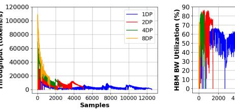

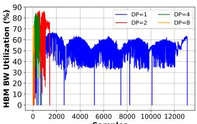

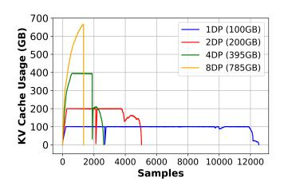

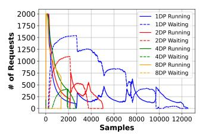

- (a) Generation Throughput (b) Average HBM BW Util. (c) Aggregated KV Cache Util. (d) Request Analysis

Fig. 6: Scale up for DeepSeek-8B model (best strategy: DP scaling).

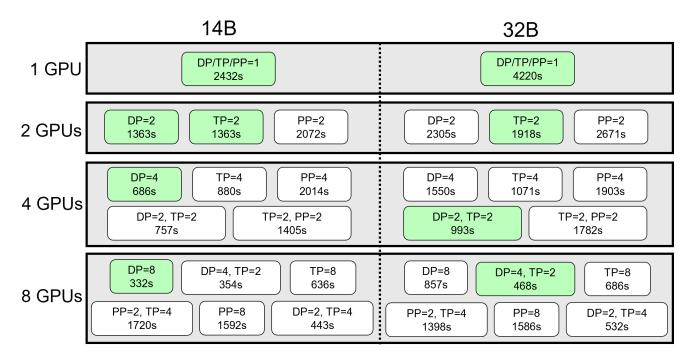

Fig. 7: Mixed config scaling for small models (2k BS).

## *D. The Limits of Data Parallelism (DP)*

Data Parallelism (DP) is often the default scaling strategy as it avoids inter-GPU communication. We investigate its efficacy by scaling the 8B model from 1 to 8 GPUs (Figure 6). This setup provides an idealized view of near-linear throughput scaling under independent replicas. However, it also exposes inefficiencies arising from request skew and memory imbalance, which limit achievable gains in practice.

Throughput Linearity vs. Resource Efficiency: Figure 6a confirms that DP achieves near-linear scaling in aggregate throughput (4× gains from 2 to 8 GPUs). However, this masks a critical inefficiency: the system achieves throughput by processing more streams of requests in parallel on different DP replicas, not by accelerating the throughput of any request.

- Stranded Capacity: DP relies on a shared-nothing memory architecture, where a request on GPU 0 cannot access free memory on GPU 1. This creates "stranded capacity", where one replica thrashes (triggering preemption) while another has idle pages. The imbalance worsens under skewed request arrival patterns and dynamic KV growth, leading to underutilized HBM and degraded throughput/latency efficiency across the cluster.
- Bandwidth Interference: Figure 6b shows HBM bandwidth oscillating violently (40%–85%) rather than staying saturated. This "sawtooth" pattern represents the forced interleaving of compute-bound prefills (from the waiting queue) with memory-bound decodes. Because DP replicas are capacity-constrained (Figure 6c), they must constantly ingest new requests to fill voids left by completed ones, causing resource contention that destabilizes tail latency. The capacity contention triggers request preemption (Figure 6d) with lower degrees of DP experiencing throttling.

Observation 4: DP replicates model weights and partitions requests rather than pooling memory, and does not increase the KV capacity available to an individual long-running request. For reasoning workloads with long and variable chain-of-thought lengths, tail latency is therefore dominated by the replica that reaches KV saturation first. This indicates that DP-only scaling is insufficient when performance is limited by per-request KV growth; memory pooling, TP, or KV offload is required to increase the effective capacity margin.

## V. ANALYSIS II: 3D PARALLELISM FOR LARGE MODELS

While Analysis I (§ IV) characterized the "Capacity Trap" inherent to DP, this section investigates the "What-If" scenario: *Do alternative parallelism strategies like TP or PP offer acceleration remedies, or do they introduce new bottlenecks as models scale?* We trace the scaling efficacy from 14B to 671B parameters to uncover divergences in optimal strategies.

#### *A. From DP to TP Scaling*

To determine where DP fails, we compare its scaling efficiency against Tensor Parallelism (TP) for small-to-medium models (Figure 9 vs. Figure 8) with batch size of 2K requests.

DP vs TP Inflection Point: For the 8B and 14B models, TP introduces communication overhead that outweighs its benefits. However, the 32B model reveals a critical architectural inflection point:

- Sublinear DP vs. higher-efficiency TP: As shown in Figure 8, DP scaling for the 32B model yields diminishing returns, achieving a 4.9× speedup on 8 GPUs. In contrast, Figure 9 shows that TP achieves a higher, though still sublinear, speedup of 6.15× by reducing inference duration from 4219s to 686s.
- Why TP Wins (The Capacity Release): The 32B model weights consume ≈64 GB in FP16. In a DP configuration, every GPU must replicate this 64 GB, leaving only ≈77 GB of the 141 GB HBM for KV cache. This creates a hard capacity ceiling that forces preemption. In contrast, TP shards the weights; at TP=8, the model consumes only ≈8 GB per GPU, freeing up ≈133 GB per device for KV cache. This massive release of HBM capacity allows TP to sustain a much larger active batch size without preemption, eliminating the re-computation overhead that throttles DP.

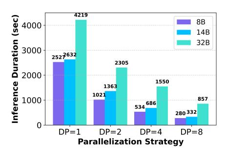

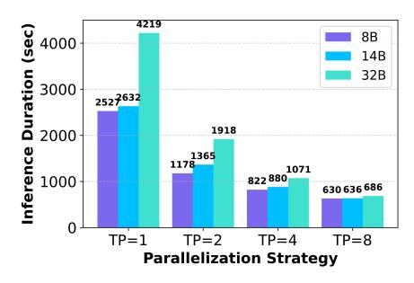

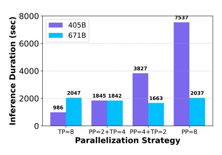

Fig. 8: DP Scaling for small models. Fig. 9: TP Scaling for small models. Fig. 10: E2E for large models (2k BS).

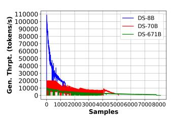

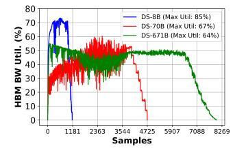

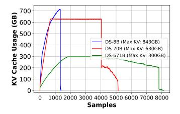

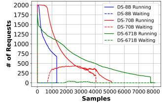

- (a) Generation Throughput (b) Average HBM BW Util. (c) Aggregated KV Cache Util. (d) Request Analysis

Fig. 11: Model parameter scaling on 8x H200 GPUs.

These results indicate that the benefit of TP arises primarily from released KV capacity rather than improved kernel efficiency, as the performance inflection aligns with the point at which DP replicas become KV-capacity-bound. This suggests that memory headroom, not compute efficiency, is the dominant scaling bottleneck, and that TP's gains stem from alleviating KV pressure rather than accelerating execution.

## *B. Hybrid Parallelism Sweet Spot for Small Models*

Figure 7 explores the trade-off space of hybrid configurations (DP+TP, TP+PP) for 14B and 32B models on a fixed 8-GPU budget. It highlights how combining parallelism strategies balances communication overhead and HBM efficiency, revealing regimes where hybrid schemes outperform pure DP or TP by reducing preemption while maintaining scalable throughput.

Balancing Communication Overhead vs. Memory Capacity: The data reveals that optimal performance requires balancing per-device latency (TP) with cluster-level concurrency (DP).

- 14B (DP Dominant): The optimal configuration is pure DP=8 (332s). Hybrid strategies like P P = 2 + T P = 4 (1172s) are ≈ 3.5× slower. The model is too small to justify the synchronization costs of model parallelism; simply running more independent streams is most efficient.
- 32B (Hybrid Dominant): The optimal configuration is neither pure DP (857s) nor pure TP (686s), but the hybrid DP=4 + TP=2 (484s). This configuration uses minimal TP (T P = 2) to alleviate the per-device capacity/bandwidth bottleneck to prevent preemption, while dedicating the remaining scaling factor (DP = 4) to concurrency. This "Right-Sized" TP approach outperforms pure TP by

≈ 30%, proving that for medium models, minimizing communication degree is as critical as maximizing bandwidth.

Observation 5: The preferred parallelism strategy depends on whether the dominant overhead is communication or capacity-induced preemption. Smaller models, such as 14B, favor DP because their weights fit comfortably within per-GPU HBM and TP communication overhead is not justified. For larger models, such as 32B, TP becomes beneficial because sharding model weights releases HBM for KV cache. Once the cost of DP preemption and recomputation exceeds TP's NVLink communication overhead, TP becomes the better scaling strategy.

#### *C. Frontier Scaling: Dense vs. MoE Divergence*

Scaling to frontier-class models (405B and 671B) requires adaptation of "Parallelism" based on model architecture. As shown in Figure 10, there is no single universal strategy; instead, the optimal approach varies based on model density.

Llama-405B (Dense): For the dense Llama-405B, due to large KV footprint the combined memory capacity of all GPUs is needed limiting DP=1. TP=8 or PP=8 are the only viable strategies, with TP=8 completing in 986s, while PP=8 is catastrophic (7537s).

• The Penalty of Density: Llama-405B activates all parameters for every token. This creates a massive computational workload that should theoretically hide pipeline bubbles. However, the 7.6× slowdown of PP suggests the opposite. The massive KV state of 405B (1.05 MB/token) restricts the number of micro-batches that can fit in memory, forcing

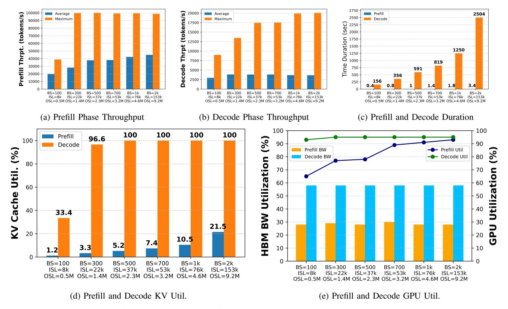

Fig. 12: Analysis of Prefill and Decode Phase during AI Inference.

the pipeline to run with large bubbles (idle time). Despite high arithmetic intensity, dense models such as Llama-405B cannot amortize pipeline bubbles due to insufficient KV capacity per stage, causing PP to exacerbate rather than alleviate decode-phase stalls.

• Inter-Stage Traffic: Furthermore, moving the dense activation tensors between PP stages saturates the interconnect. The TP=8 configuration avoids this by keeping activations node-local and only exchanging reduced gradients/activations over NVLink, which offers higher bandwidth than the PCIe/Link paths often used for PP stage transitions.

DeepSeek-R1-671B (MoE): In stark contrast, the sparse DeepSeek-R1 model favors a Hybrid PP=4 + TP=2 strategy (1663s), beating pure TP=8 (2047s).

- Sensitivity to Synchronization: While R1 is larger (671B), it is a MoE model with only ≈37B active parameters. This low active parameter count means the compute-tocommunication ratio is much lower than 405B. In a TP=8 setup, the constant all-reduce synchronization becomes a bottleneck because the GPU spends less time computing between syncs.
- The MLA Advantage: R1 employs MLA, which significantly compresses KV cache. This architectural feature works synergistically with PP. The reduced memory footprint allows R1 to support a higher micro-batch depth than 405B, effectively filling the pipeline bubbles.

• Optimal Balance: With P P = 4, R1 splits the model into smaller stages that fit in memory, and by using T P = 2, it minimizes pipeline bubble overhead while using combined GPU capacity. This result (1663s vs 2047s) confirms that for sparse reasoning models, minimizing TP degree is preferred over aggregating capacity and bandwidth.

Observation 6: Dense models benefit from higherdegree TP when inference is limited by HBM bandwidth and model-state footprint, since TP aggregates both memory capacity and bandwidth across GPUs. In contrast, sparse MoE models can become more sensitive to synchronization and pipeline imbalance; therefore, hybrid strategies with higher PP and lower TP may be preferable when TP communication dominates. This suggests that serving systems should choose DP/TP/PP configurations using model-specific profiling rather than a fixed parallelism policy.

#### *D. Impact of Scaling Model Parameters*

To isolate the impact of model scale on inference dynamics, we evaluate three distinct model classes—DeepSeek-8B (Small/Dense), DeepSeek-70B (Medium/Dense), and DeepSeek-R1-671B (Frontier/Sparse)—on a fixed hardware budget of 8×H200 GPUs. Each model uses its optimal parallelization strategy: pure DP for 8B, Hybrid TP for 70B, and Hybrid PP+TP for 671B.

The Sublinear Throughput Degradation: Figure 11a illustrates the generation throughput. As expected, the peak throughput drops as parameter count increases, but the degradation is notably *sublinear*. A 9× parameter increase from 8B to 70B results in only a 5×–6× drop in peak throughput. This efficiency gain is driven by Tensor Parallelism (used for 70B), which aggregates memory bandwidth across GPUs, partially offsetting the increased FLOPs requirement. However, the 671B model (green curve) exhibits a long, flat tail, reflecting the extended "reasoning" nature of its output compared to the bursty completion of the smaller distilled models.

The Bandwidth-Compute Inversion: Telemetry reveals a fundamental shift in bottlenecks as models scale:

- Small Models (8B): Exhibit the highest HBM utilization (≈85%, Figure 11b). The workload is memory-bandwidth bound because the small weight matrices are loaded rapidly, saturating the bus.
- Frontier Models (671B): Despite their size, they show *lower* average HBM utilization (≈50–60%). This counterintuitive result confirms that ultra-large sparse models are bound by synchronization and routing latency, not raw memory bandwidth. The overhead of Pipeline Parallelism bubbles and MoE expert routing prevents the system from saturating the HBM links.

The MLA Anomaly in Capacity: Figure 11c highlights a critical architectural advantage of DeepSeek-R1. Despite having 10× the parameters of the 70B model, its rate of KVcache consumption is surprisingly moderate. This is due to Multi-Head Latent Attention (MLA), which compresses the KV state. In contrast, the dense 70B model (red line) aggressively consumes capacity, reaching its ceiling faster relative to its throughput resulting in request throttling (Figure 11d). This suggests that for future reasoning systems, architectural compression (like MLA) is as critical as hardware capacity for sustaining long-context inference.

## VI. ANALYSIS III: PREFILL VS DECODE RESOURCE REQUIREMENT DIVERGENCE

The preceding analyses established that reasoning workloads are capacity-constrained (Analysis I) and sensitive to parallelism overheads (Analysis II). This section investigates the underlying physical cause: the extreme *resource divergence* between the Prefill and Decode phases. We characterize the "What-If" scenario: *Can a monolithic accelerator architecture efficiently serve a workload that oscillates between two orthogonal hardware bottlenecks?*

## *A. Compute vs Memory Bound Phases*

Inference is often treated as a single workload, but telemetry from the 8B model (Figure 12) and frontier models (Figure 13) reveals that the system effectively behaves as two distinct machines. In this series of experiments, we vary the batch size from 100 to 2000 requests to observe how the resource profile evolves. Figures 12–15 collectively trace how resource utilization shifts across inference phases and model scales, revealing that reasoning workloads operate almost entirely in a decode-dominated regime where memory bandwidth and KV capacity, rather than compute, determine the inference throughput and latency.

The Compute-Bound Prefill: During the prefill phase, the engine processes all input tokens in parallel. Figure 12a shows high prefill throughput for varying batch sizes showcasing the increase in average throughput with increasing context, while Figure 12e reveals the corresponding resource signature: SM Occupancy is high, but HBM bandwidth utilization remains low (≈30%) for the 8B model and ≈20% for the larger 405B and 671B models (Figure 13b). This indicates that prefill is *Compute-Bound*. The arithmetic intensity (FLOPs/Byte) is high because the matrix-matrix multiplications (GEMMs) can reuse loaded weights across all tokens in the prompt. In this phase, the H200's 4.8 TB/s bandwidth is underutilized and the KV footprint (Figure 12d) also staying lower and increasing moderately for higher context, effectively leaving performance on the table. Lower prefill utilization (Figure 12e) for 8B model at small batches arises because prefill is memory/synchronization-limited rather than compute-bound. Frequent kernel launches and cross-GPU synchronization reduce sustained SM occupancy, while short prefill duration (Figure 12c), minimal KV usage (Figure 12d), and moderate HBM bandwidth (Figure 12e) indicate stall-dominated execution. Decode operates in a steady-state with fewer synchronizations/better locality, leading to higher utilization. As ISL increases, prefill utilization improves due to higher arithmetic intensity from MLP/attention computations.

The Bandwidth-Bound Decode: The transition to the decode phase inverts this profile as shown in Figure 12b showcasing lower throughput compared to prefill but shows a rising trend with increasing context. Figure 12e shows high HBM bandwidth saturation (≈85% for 8B, ≈65% for 405B in Figure 13a), while SM occupancy drops or becomes variable. This phase is *Memory-Bound*. The arithmetic intensity collapses because the auto-regressive generation requires loading the entire model and KV cache to generate a single token. For reasoning workloads where OSL ≫ ISL, the system spends the vast majority of wall-clock time in this inefficient, bandwidth-limited regime.

Observation 7: Reasoning workloads increase the fraction of time spent in decode, where arithmetic intensity is lower than prefill and performance is more constrained by KV movement and HBM bandwidth. As a result, high-FLOP compute units can remain underutilized even while latency remains high. This suggests that reasoning-serving optimization should prioritize KV locality, bandwidth efficiency, and decode scheduling rather than only maximizing peak compute utilization.

