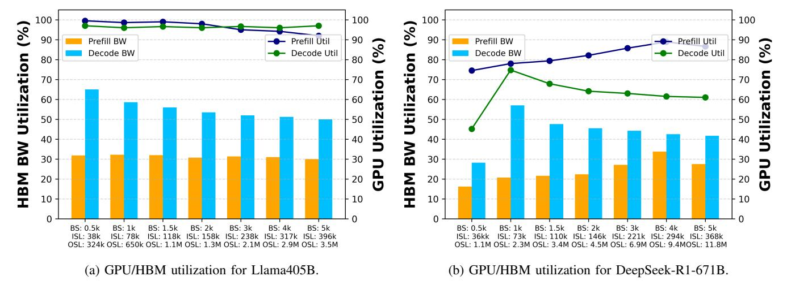
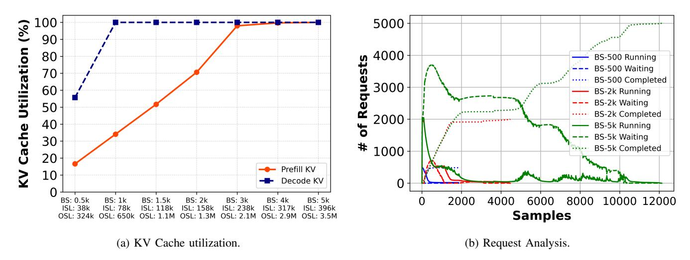
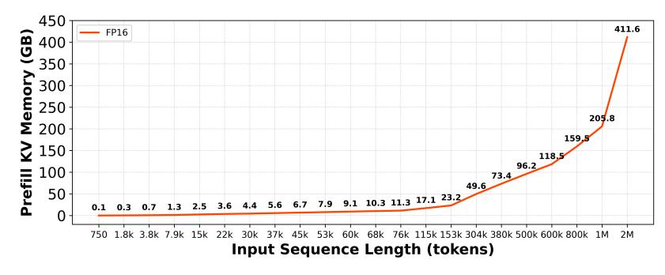
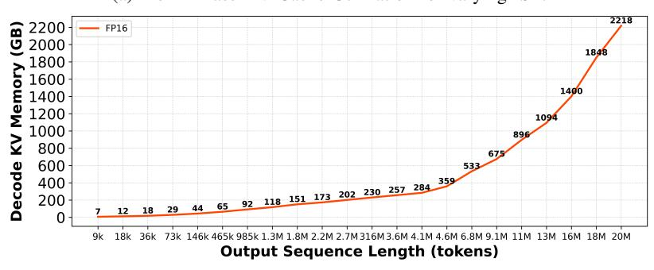

# *B. The Reasoning Cliff: KV Scaling*

The severity of the memory bottleneck is dictated by the growth of the KV cache relative to the model weights. We

Fig. 13: Analysis of Prefill and Decode resource utilization for varying context lengths.

Fig. 14: Analysis of Prefill and Decode resource utilization of Llama405B for varying context lengths.

characterize this scaling behavior in Figure 15 for the 8B model and Figure 14 for the 405B model.

Observation 8: The "reasoning cliff" occurs when the growing KV cache exceeds available HBM capacity and forces the scheduler to preempt, recompute, or reject additional work. For short-output workloads, this cliff typically appears later in decode. For reasoning workloads with long outputs, KV growth pulls the cliff earlier, sometimes limiting admission during prefill. Systems should therefore estimate future KV growth at admission time and reserve HBM capacity for longrunning decode phases instead of admitting requests based only on current memory usage.

Linearity vs. Capacity: Figure 15b demonstrates that the decode-phase KV footprint grows linearly with OSL. For the 8B model, a 20M token output (simulating aggregate reasoning across a batch) demands over 2 TB of memory. While prefill KV also grows linearly (Figure 15a), it is transient. The decode KV is persistent. For the Llama-405B model (Figure 14a), this scaling creates a "Reasoning Cliff." At a batch size of 1K with long context, the KV cache hits 100% utilization during the decode phase. However, as the batch size increases to 4K or 5K, the saturation point shifts *forward* in time as the cache exhausts during the prefill phase. This observation implies that for massive reasoning batches, the system cannot initialize requests before hitting the HBM wall.

#### *C. System Mitigation: Chunked Prefills and Preemption*

To survive the "Reasoning Cliff" mentioned above, the inference engine must dynamically degrade service, which introduces a negative dimension that is interesting to study. To this end, we analyze the vLLM scheduler's response to this pressure using the Llama-405B request analysis, as depicted in Figure 14b.

(a) Prefill Phase KV Cache Utilization for varying ISL.

(b) Decode Phase KV Cache Utilization for varying OSL.

Fig. 15: Analysis of Prefill and Decode Memory Requirements during AI Inference.

Observation 9: For reasoning workloads, the scheduler must regulate the number and length of concurrent decode streams to keep KV usage within the HBM envelope. This makes scheduling a memory-traffic shaping problem: HBM capacity bounds sustainable throughput, while HBM bandwidth bounds per-token latency. Practical schedulers should therefore incorporate KV-aware admission control, decode throttling, and priority policies that balance TTFT, TPOT, and preemption risk.

Throttling Dynamics: When the batch size reaches 5K (green line), the system cannot fit the full state in memory. The scheduler activates Chunked Prefill, processing only a subset of the prompt tokens per iteration.

- Queueing Behavior: The "Running" curve (solid green) plateaus while the "Waiting" curve (dashed green) remains high. This indicates the system is serializing the admission of requests. Unlike the 500-batch case (blue), where requests enter and exit quickly, the 5K case forces the system into a "convoy" mode where new reasoning traces are only admitted as old ones finish and free their KV blocks.
- Throughput-Latency Tradeoff: By chunking prefills, the system prevents OOM crashes but introduces a "Start-Up Latency" for reasoning tasks. The GPU utilization remains high, but it is effectively stalling on memory capacity management rather than productive token generation.

#### VII. DISCUSSION

A forward-looking view of architecture design reveals a clear bifurcation between compute-intensive prefill and bandwidth-bound decode, motivating a decisive shift toward hardware disaggregation. Empirical characterizations underscore the fundamentally different bottlenecks of these phases, prompting next-generation systems to physically and logically decouple their execution paths to improve performance [15].

To meet the divergent requirements of large-scale inference, a tiered architecture that offloads the prefill phase to accelerators optimized for dense compute is optimal [19]. High-TFLOP devices with HBM having moderate bandwidth can deliver superior arithmetic throughput while providing sufficient capacity and bandwidth for prompt ingestion, as long as the memory subsystem can sustain the higher core utilization. When capacity or bandwidth becomes a constraint, the system can bank on offloading to system memory and utilize multiple tiers together with high-speed interconnects such as NVLink. This arrangement balances prefill throughput against the cost and constraints of the GPU-HBM complex, achieving an efficient trade-off between compute, capacity, and interconnect provisioning.

In contrast, the decode phase is governed by memory bandwidth and capacity, making it a better fit for scalable, memorycentric hierarchies. Combinations of HBM with CXL [7], [13] and near-memory compute solutions, including 3D-stacked memory (e.g., SRAM-based designs from D-Matrix [14]), alleviate the bandwidth pressure on KV reads. Operationally, decode benefits from explicit pooling and tiered offload across HBM → DDR/LP → CXL → NVMe, underpinned by fast links such as NVLink or optical to preserve fleet-wide latency and throughput. 3D-stacked options that add DRAM atop HBM at the same pin speed can raise effective bandwidth to KV accesses without widening I/O, reducing the need to proliferate external HBM stacks. The principal trade-off is that bandwidth scales faster than usable per-stack capacity due to thermal limits, yield, and stack height. If decode continues to demand both higher bandwidth and larger KV stores, deeper 3D stacks primarily address the bandwidth side while capacity grows more slowly and at higher cost and complexity. Balanced designs therefore pair 3D bandwidth tiers with pooled DRAM/CXL/NVMe for capacity, tied together with fast optical interconnects. Software can exploit this bifurcation by reserving high-bandwidth resources exclusively for token generation while routing prefill to cost-optimized tiers, using advanced runtime strategies to maximize efficiency.

High-bandwidth flash (HBF) [32] approaches that augment HBM with a NAND tier are a potential fit for both phases. For prefill, HBF can stream model weights effectively; for decode, it offers higher capacity for colder KV entries and weights. However, HBF introduces challenges: higher power, read/write asymmetry, lower bandwidth, and substantial software uplift. Prefill's mixed read/write behavior makes it sensitive to this asymmetry, potentially depressing throughput even as NAND capacity helps accommodate growing input contexts. For decode, the extra capacity is beneficial for long output sequence lengths and reasoning-heavy workloads, but the higher bandwidth demands necessitate intelligent KV management and caching. In practice, funneling traffic through the limited HBM channels in HBF can create bottlenecks unless the software stack tightly orchestrates placement, prefetching, and eviction.

Agentic AI further amplifies memory-system pressure by transforming inference from a single long reasoning trajectory into a stateful, multi-step execution spanning both accelerator and CPU domains. A request may invoke planner, executor, verifier, retrieval, and tool-augmented model calls, each propagating intermediate context, reasoning traces, and active KV state across iterations. As a result, the memory footprint scales not only with model size and CoT length, but also with agent fan-out, branching depth, tool interaction frequency, and concurrent sessions. Modern agentic architectures further rely on tightly coupled CPU–GPU execution, where CPUs sustain large numbers of independent agent environments, manage tool execution, and maintain per-agent state, queues, and retrieval data. Each agent incurs persistent DRAM overhead for context staging, tool outputs, sandbox execution, and vector data, placing host memory capacity and bandwidth directly on the execution path. This shifts the bottleneck from isolated GPU memory capacity to a system-wide problem: HBM must sustain high KV residency and reuse, while host DRAM actively participates in context management, data staging, and CPU-side processing. Compared with single-shot inference, agentic workloads create a multiplicative demand across HBM and DRAM, stressing both per-GPU limits and rack-level scheduling, motivating KV-aware placement, migration, and tiered memory management across HBM, host, CXL, and storage tiers under strict TTFT, throughput, and ms/token SLAs.

Given sublinear performance scaling with model size and tight KV capacity constraints, future systems should move beyond monolithic, GPU-local KV caches and adopt explicit control over KV placement and migration. Offloading, pooling, and hierarchical tiering across HBM and host memory enable proactive eviction, compression, and reuse of pre-generated blocks, materially reducing time to first token. This memory flexibility allows heterogeneous deployments that combine small, distilled models for high-throughput speculative decoding with large foundation models for complex queries. To bind these disaggregated components, next-generation interconnects especially NVLink and optical links are essential across both prefill and decode paths, delivering the low-latency, highthroughput data movement required across tiers and between accelerators.

#### VIII. CONCLUSIONS

This work presented a systematic characterization of GPUbased inference for reasoning-centric LLMs, evaluating models from 8B to 671B parameters across diverse parallelization strategies. Our results highlight a fundamental divergence in scaling behavior: Data Parallelism achieves near-linear throughput for small models but faces hard capacity limits from KV-cache saturation, while Tensor Parallelism is essential for ultra-large models yet remains bottlenecked by memory bandwidth and synchronization costs. A key contribution of this study is the quantification of the "performance cliff" in reasoning workloads. We demonstrated that the extended context lengths required for multi-step reasoning exacerbate the disparity between the compute-bound prefill phase and the memory-bandwidth-bound decode phase. As sequence lengths grow, the KV cache aggressively consumes HBM capacity, leading to rapid throughput degradation and request throttling once memory limits are exceeded. These insights suggest that standard monolithic scaling is reaching its limits for reasoningdense applications. Future inference systems must prioritize architectural disaggregation, effectively decoupling the prefill and decode phases to optimize for their respective compute and bandwidth requirements. Furthermore, realizing the full potential of frontier-scale models will require innovations in tiered memory management and hardware-software co-design to mitigate the severe capacity and bandwidth constraints identified in this analysis.

#### ACKNOWLEDGEMENTS

This work was supported in part by the U.S. Department of Energy under Contract DE-AC02-06CH11357, as well as the National Science Foundation (NSF), Office of Advanced Cyberinfrastructure, under grants CSSI-2411386 and CSSI-2514056.

## REFERENCES

[1] A. Agrawal, N. Kedia, J. Mohan, A. Panwar, N. Kwatra, B. S. Gulavani, R. Ramjee, and A. Tumanov, "Vidur: A large-scale simulation framework for llm inference," *Proceedings of Machine Learning and Systems*, vol. 6, pp. 351–366, 2024.

- [2] A. Agrawal, N. Kedia, A. Panwar, J. Mohan, N. Kwatra, B. Gulavani, A. Tumanov, and R. Ramjee, "Taming {Throughput-Latency} tradeoff in {LLM} inference with {Sarathi-Serve}," in *18th USENIX Symposium on Operating Systems Design and Implementation (OSDI 24)*, 2024, pp. 117–134.
- [3] A. Agrawal, A. Panwar, J. Mohan, N. Kwatra, B. S. Gulavani, and R. Ramjee, "Sarathi: Efficient llm inference by piggybacking decodes with chunked prefills," *arXiv preprint arXiv:2308.16369*, 2023.
- [4] J. Ainslie, J. Lee-Thorp, M. de Jong, Y. Zemlyanskiy, F. Lebron, and S. Sanghai, "Gqa: Training generalized multi-query transformer models from multi-head checkpoints," *arXiv preprint arXiv:2305.13245*, 2023.
- [5] K. Alizadeh, S. I. Mirzadeh, D. Belenko, S. Khatamifard, M. Cho, C. C. Del Mundo, M. Rastegari, and M. Farajtabar, "Llm in a flash: Efficient large language model inference with limited memory," in *Proceedings of the 62nd Annual Meeting of the Association for Computational Linguistics (Volume 1: Long Papers)*, 2024, pp. 12 562–12 584.
- [6] M. Arif, K. Assogba, M. M. Rafique, and S. Vazhkudai, "Exploiting cxl-based memory for distributed deep learning," in *Proceedings of the 51st International Conference on Parallel Processing*, ser. ICPP '22. New York, NY, USA: Association for Computing Machinery, 2023. [Online]. Available: https://doi.org/10.1145/3545008.3545054
- [7] M. Arif, A. Maurya, and M. M. Rafique, "Accelerating performance of gpu-based workloads using cxl," in *Proceedings of the 13th Workshop on AI and Scientific Computing at Scale Using Flexible Computing*, ser. FlexScience '23. New York, NY, USA: Association for Computing Machinery, 2023, p. 27–31. [Online]. Available: https://doi.org/10.1145/3589013.3596678
- [8] S. Cao, S. Liu, T. Griggs, P. Schafhalter, X. Liu, Y. Sheng, J. E. Gonzalez, M. Zaharia, and I. Stoica, "Moe-lightning: High-throughput moe inference on memory-constrained gpus," in *Proceedings of the 30th ACM International Conference on Architectural Support for Programming Languages and Operating Systems, Volume 1*, 2025, pp. 715–730.
- [9] Y. Cheng, Y. Liu, J. Yao, Y. An, X. Chen, S. Feng, Y. Huang, S. Shen, K. Du, and J. Jiang, "Lmcache: An efficient kv cache layer for enterprise-scale llm inference," *arXiv preprint arXiv:2510.09665*, 2025.
- [10] K. T. Chitty-Venkata, S. Raskar, B. Kale, F. Ferdaus, A. Tanikanti, K. Raffenetti, V. Taylor, M. Emani, and V. Vishwanath, "Llm-inferencebench: Inference benchmarking of large language models on ai accelerators," in *SC24-W: Workshops of the International Conference for High Performance Computing, Networking, Storage and Analysis*. IEEE, 2024, pp. 1362–1379.
- [11] K. T. Chitty-Venkata, J. Ye, S. Raskar, A. Kougkas, X. Sun, M. Emani, V. Vishwanath, and B. Nicolae, "PagedEviction: Structured block-wise KV cache pruning for efficient large language model inference," in *EACL 2026: 19th Conference of the European Chapter of the Association for Computational Linguistics*, Rabat, Morocco, 2026, pp. 3207–3218.
- [12] J.-B. Cordonnier, A. Loukas, and M. Jaggi, "Multi-head attention: Collaborate instead of concatenate," *arXiv preprint arXiv:2006.16362*, 2020.
- [13] CXL, "Compute express link," 2025, accessed: 2025-12-12. [Online]. Available: https://computeexpresslink.org/
- [14] D-Matrix, "Corsair™. built for generative a," 2025, accessed: 2025-12- 12. [Online]. Available: https://www.d-matrix.ai/product/
- [15] ——, "Why we decoupled execution to accelerate i/o," 2025, accessed: 2025-12-12. [Online]. Available: https://www.d-matrix.ai/ why-we-decoupled-execution-to-accelerate-i-o/
- [16] DeepSeek-AI, D. Guo, D. Yang, H. Zhang, J. Song, R. Zhang, R. Xu, Q. Zhu, S. Ma, P. Wang, X. Bi, X. Zhang, X. Yu, Y. Wu, Z. F. Wu, Z. Gou, Z. Sun, Z. Zhu, M. Zhang, M. Cheng, S. Li, M. A. R. Bigas, Y. Hu, S. Zhu, and Z. Kuang, "Deepseek-r1: Incentivizing reasoning capability in llms via reinforcement learning," 2025. [Online]. Available: https://arxiv.org/abs/2501.12948
- [17] Y. Dong, Y. Miao, W. Li, X. Zheng, C. Wang, J. Wu, and F. Lyu, "Accelerating LLM inference throughput via asynchronous KV cache prefetching," in *AAAI'26: The 2026 AAAI Conference on Artificial Intelligence*, vol. 40, no. 25, 2026, pp. 20 844–20 851.
- [18] A. Dubey, A. Jauhri, A. Pandey, A. Kadian, A. Al-Dahle *et al.*, "The llama 3 herd of models," 2024. [Online]. Available: https: //arxiv.org/abs/2407.21783
- [19] Dynamo, "Nvidia dynamo," 2025, accessed: 2025-12-12. [Online]. Available: https://developer.nvidia.com/dynamo
- [20] Y. Huang, Y. Cheng, A. Bapna, O. Firat, D. Chen, M. Chen, H. Lee, J. Ngiam, Q. V. Le, Y. Wu, and Z. Chen, "Gpipe: Efficient training of

- giant neural networks using pipeline parallelism," in *Advances in Neural Information Processing Systems (NeurIPS)*, 2019.
- [21] M. Isaev, N. Mcdonald, L. Dennison, and R. Vuduc, "Calculon: a methodology and tool for high-level co-design of systems and large language models," in *Proceedings of the International Conference for High Performance Computing, Networking, Storage and Analysis*, 2023, pp. 1–14.
- [22] W. Kwon, Z. Li, S. Zhuang, Y. Sheng, L. Zheng, C. H. Yu, J. E. Gonzalez, H. Zhang, and I. Stoica, "Efficient memory management for large language model serving with pagedattention," in *Proceedings of the 29th Symposium on Operating Systems Principles (SOSP)*, 2023.
- [23] B. Li, Y. Jiang, V. Gadepally, and D. Tiwari, "Llm inference serving: Survey of recent advances and opportunities," in *2024 IEEE High Performance Extreme Computing Conference (HPEC)*. IEEE, 2024, pp. 1–8.
- [24] H. Li, Y. Li, A. Tian, T. Tang, Z. Xu, X. Chen, N. Hu, W. Dong, Q. Li, and L. Chen, "A survey on large language model acceleration based on kv cache management," *arXiv preprint arXiv:2412.19442*, 2024.
- [25] A. Liu, B. Feng, B. Wang, B. Wang, B. Liu *et al.*, "Deepseek-v3 technical report," 2024. [Online]. Available: https://arxiv.org/abs/2412. 19437
- [26] A. Liu, J. Liu, Z. Pan, Y. He, G. Haffari, and B. Zhuang, "Minicache: Kv cache compression in depth dimension for large language models," *Advances in Neural Information Processing Systems*, vol. 37, pp. 139 997– 140 031, 2024.
- [27] A. Maurya, M. Rafique, F. Cappello, and B. Nicolae, "Mlp-offload: Multi-level, multi-path offloading for llm pre-training to break the gpu memory wall," in *SC'25: 38th International Conference for High Performance Computing, Networking, Storage and Analytics*, St Louis, USA, 2025.
- [28] OpenAI, "Openai o1 system card," 2024, accessed: 2025-02-12. [Online]. Available: https://openai.com/index/openai-o1-system-card/
- [29] S. Park, S. Jeon, C. Lee, S. Jeon, B.-S. Kim, and J. Lee, "A survey on inference engines for large language models: Perspectives on optimization and efficiency," *arXiv preprint arXiv:2505.01658*, 2025.
- [30] R. Qin, Z. Li, W. He, J. Cui, H. Tang, F. Ren, T. Ma, S. Cai, Y. Zhang, M. Zhang *et al.*, "Mooncake: A kvcache-centric disaggregated architecture for llm serving," *ACM Transactions on Storage*, 2024.
- [31] S. Saereesitthipitak, A. Rao, C. Zhou, and W. Li, "Prophet: An llm inference engine optimized for head-of-line blocking," Stanford University, Technical Report (CS244B), 2024.
- [32] Sandisk, "Hbf: High bandwidth flash," 2025, accessed: 2025-12-12. [Online]. Available: https://www.sandisk.com/company/newsroom/ blogs/2025/memory-centric-ai-sandisks-high-bandwidth-flash-willredefine-ai-infrastructure
- [33] M. Shoeybi, M. Patwary, R. Puri, P. LeGresley, J. Casper, and B. Catanzaro, "Megatron-lm: Training multi-billion parameter language models using model parallelism," *arXiv preprint arXiv:1909.08053*, 2019.
- [34] Y. Wang and Z. Li, "Mechanistic interpretability of attention heads in reasoning llms," in *Proceedings of the 63rd Annual Meeting of the Association for Computational Linguistics (ACL)*, 2025, explains the "thinking" process at the attention layer level.
- [35] J. Wei, X. Wang, D. Schuurmans, M. Bosma, E. Chi, Q. Le, and D. Zhou, "Chain-of-thought prompting elicits reasoning in large language models," in *Advances in Neural Information Processing Systems (NeurIPS)*, 2022.
- [36] F. Xu, Q. Hao, Z. Zong, J. Wang, Y. Zhang, J. Wang, X. Lan, J. Gong, T. Ouyang, F. Meng *et al.*, "Towards large reasoning models: A survey of reinforced reasoning with large language models," *arXiv preprint arXiv:2501.09686*, 2025.
- [37] J. Ye, J. Cernuda, A. Maurya, X.-H. Sun, A. Kougas, and B. Nicolae, "Characterizing the behavior and impact of kv caching on transformer inferences under concurrency," in *IPDPS'25: The 39th IEEE International Parallel and Distributed Processing Symposium*, Milan, Italy, 2025. [Online]. Available: https://hal.inria.fr/hal-04984000
- [38] W. Yuan, J. Yu, S. Jiang, K. Padthe, Y. Li, I. Kulikov, K. Cho, D. Wang, Y. Tian, J. E. Weston *et al.*, "Naturalreasoning: Reasoning in the wild with 2.8 m challenging questions," *arXiv preprint arXiv:2502.13124*, 2025.
- [39] C. Zhao, C. Deng, C. Ruan, D. Dai, H. Gao, J. Li, L. Zhang, P. Huang, S. Zhou, S. Ma *et al.*, "Insights into deepseek-v3: Scaling challenges and reflections on hardware for ai architectures," in *Proceedings of the 52nd Annual International Symposium on Computer Architecture*, 2025, pp. 1731–1745.