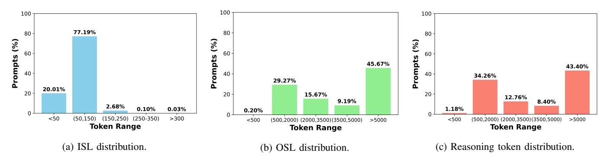
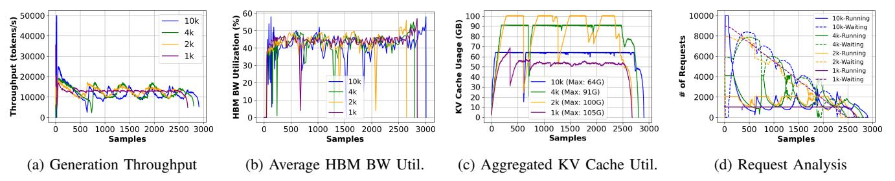

# *C. Model Selection*

We evaluate a spectrum of models representing both the current dense architecture and the emerging reasoning-centric sparse architectures.

Small-Scale Reasoning (Distilled): We utilize DeepSeek-R1-Distill-Llama/Qwen variants (Llama-8B, Qwen-14B, Qwen-32B, Llama-70B). These models are architecturally dense but fine-tuned to output long chain-ofthought traces, allowing us to test the capacity trap of running heavy reasoning workloads on commodity-class parameters. These models utilize Grouped-Query Attention (GQA) to reduce the KV footprint by 3×–8× compared to the classical Multi-Head Attention (MHA) but the memory cost remains linear with layer count. For instance, the 32B model (≈64 layers) consumes ≈262 KB/token in FP16, whereas the 70B model (≈80 layers) reaches ≈328 KB/token.

Frontier-Scale Baselines: We consider the case of Llama-3.1-405B, a standard dense transformer serving as the heavy-compute baseline. With ≈126 layers and dense activation, it exerts maximum pressure on HBM bandwidth. Its KV footprint is massive (≈1.05 MB/token in FP16), necessitating aggressive quantization or paging for long-context inference. Next, we consider DeepSeek-R1-671B, a MoE model with ≈37B active parameters per token utilizing Multi-Head Latent Attention (MLA), which compresses the KV cache into a low-rank latent vector (smaller than GQA). This architectural

Fig. 1: Input, output, and reasoning token distributions for 100k samples from Meta's Natural Reasoning dataset.

Fig. 2: Timeline of inference engine metrics on scaling the number of sequences for DeepSeek-8B on one H200 GPU.

choice decouples KV size from the number of attention heads, allowing R1 to sustain long reasoning contexts with a significantly lower memory footprint per generated token compared to a dense model of equivalent scale.

#### *D. Profiling Methodology*

We employ a multi-layered instrumentation strategy, capturing high-level service metrics via the inference engine and low-level resource telemetry via hardware counters. This dual-view approach allows us to correlate end-to-end latency artifacts with specific micro-architectural bottlenecks.

- Time-To-First-Token (TTFT): The latency from request arrival to the generation of the first token. In reasoning workloads, TTFT is dominated by the prefill phase and queueing delays. High TTFT indicates prefill compute saturation or head-of-line blocking [31] caused by longrunning decode phases of prior requests.
- Time-Per-Output-Token (TPOT): The average inter-token latency during the generation phase. This metric is a direct proxy for memory bandwidth efficiency during autoregressive decoding. Increases in TPOT signal HBM bandwidth saturation or excessive communication overhead in tensorparallel configurations.
- Generation Throughput: The aggregate number of tokens generated per second across all GPUs. This system-level metric captures the efficacy of batching; sublinear scaling of throughput with batch size reveals the concurrency wall where memory capacity limits active slots.
- End-to-End (E2E) Latency: The total elapsed time from request submission to the completion of the final token. This metric aggregates queueing delays, prefill compute, and the extended decoding phase.

- Request Lifecycle Tracking: We trace the state transitions of individual requests to decompose latency into Waiting (queueing) and Running (execution) components. This granular tracking allows us to isolate scheduler-induced delays, such as preemption or admission throttling caused by KV-cache fragmentation, from hardware execution time.
- GPU/HBM Bandwidth Utilization: Measured via nvidiasmi to track GPU utilization and memory bandwidth.
- KV-Cache Saturation: We monitor the KV cache utilization against the total allocated KV cache. This metric is the critical indicator of the capacity trap; nearing 100% saturation forces the scheduler to preempt requests to free memory, causing catastrophic spikes in end-to-end latency due to re-computation costs.

Together, these metrics allow us to distinguish compute saturation, memory bandwidth saturation, and KV-capacitydriven preemption effects, enabling causal attribution of endto-end latency degradation under scaling.

## IV. ANALYSIS I: CAPACITY TRAP FOR SMALL MODELS

This section characterizes the performance boundaries of small-sized models (8B–32B) when serving memory-intensive reasoning workloads. We investigate the "What-If" scenario: *Does maximizing GPU occupancy via high concurrency yield sustainable throughput for reasoning, or does it trigger a resource collapse?*

