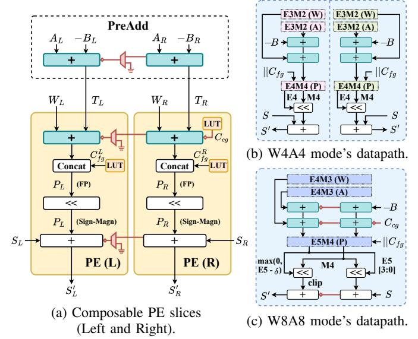

# A. Overview

Figure 7 illustrates the UNICORE architecture using 4/8bit support as an example; this is for clarity only, and the design naturally generalizes to other bit-widths. UNICORE employs a weight-stationary dataflow where both weights (W)and activations (A) are fed vertically in the column direction. Before entering the array, both are processed by the Unified Format Converter, which performs the dual role of translating low-bit inputs into an internal format to normalize subnormal values (i.e., E3M2) as well as supporting our quantization framework to enhance data representation (Section VII). All tensors remain stored and transferred in their original lowbit formats; the E3M2 encoding is confined to the compute datapath. Following this unified conversion, their data paths diverge: weights are pre-loaded and held stationary within the PE columns, while activations are first routed to a PreAdd (PA) unit. This PA unit computes an intermediate value T = A - Bby applying an exponent bias correction (-B). This corrected activation T is then streamed continuously downward for column-wide reuse. Each PE is built from a dual-slice S-FPMA that supports bit-flexible approximate multiplication. In independent mode, the Left (L) and Right (R) slices

Fig. 8: Composable Processing Element (C-PE) efficiently supports W4A4 and W8A8 MAC by reusing operators.

compute two separate low-bit MACs (e.g., two W4 lanes). In fused mode, the same slices are combined through an internal carry chain so that  $W_L$  and  $W_R$  form the low/high bits of a single wider operand (e.g., W8), enabling dynamic precision scaling. The outputs of PEs feed into a dual-chain accumulation datapath, where separate  $S_L$  and  $S_R$  horizontal chains maintain bit-width-adaptive partial sums. Finally, the post-processing pipeline performs dequantization via Rescale and combines the scaled results with previously stored values in the Accumulator.

