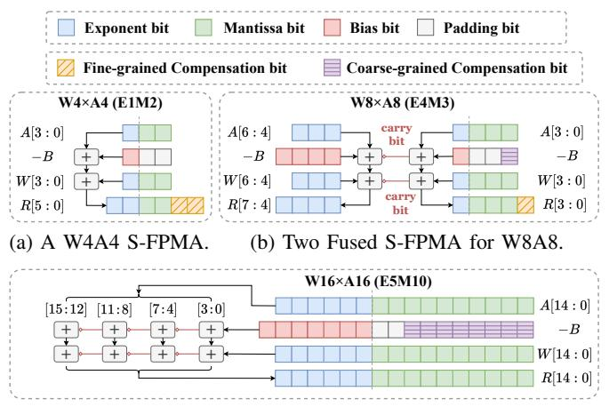

# B. Dual-Path Error Compensation for FPMA

After subnormal normalization, all FPMA operands are represented as normal floating-point numbers. The remaining inaccuracy then comes purely from FPMA's approximate realization of multiplication in the logarithmic domain. This approximation distorts the exact product across mantissa bits.

1) Limitation of Coarse-grained Compensation: To achieve hardware-efficient error compensation, existing FPMA designs (e.g., April [6]) introduce a coarse-grained (CG) compensation term where a down-sampled or error of nearby mantissa combinations is injected into the mantissa field of the FPMA result. This works reasonably well at higher precision. Figure 5a illustrates an example with FP8 (E4M3) operands. FPMA underestimates the exact product (66) and produces 60. Adding a 1-bit coarse compensation shifts the result to 64, which already aligns closely with the true product. The remaining fine-grain error is small because the 3-bit mantissa still preserves most of the significant information.

However, this method is not effective in ultra-low-bit formats such as FP4 (E1M2). As shown in Figure 5b, FPMA again underestimates the exact product (36) and yields 32. However, the mantissa is now only 2 bits wide. Since CG-Comp operates at this coarse 2-bit granularity, it fails to represent the correction, as the error magnitude is too small to trigger the last bit. In the example, even after CG-Comp, the result remains 32, and the large error persists.

2) Fine-grained Compensation via Bit Concatenation: To overcome this limitation, we introduce fine-grained (FG) compensation, which explicitly reconstructs the missing low-order information by extending the effective mantissa width of the FPMA result. For a given mantissa pair  $(M_A, M_W)$ , FPMA and exact multiplication are both deterministic. We

(c) Four Fused S-FPMA for W16A16.

Fig. 6: Illustration of the fusible S-FPMA arithmetic.

therefore precompute, offline, the residual between the exact product and the FPMA result in an extended-precision domain. We then encode the fine-grained portion of this residual as a short bit-pattern and store it in a tiny LUT indexed by  $(M_A, M_W)$ . At runtime, FPMA produces its approximate result within the original mantissa width, and the corresponding FG compensation bits  $C_{fg}(M_A, M_W)$  are concatenated to the LSB side of this result, effectively extending the mantissa. It is noteworthy that the two error compensation methods together enable FPMA to achieve exact results under the FP4 format.

This mechanism is illustrated in Figure 5: for FP8 (E4M3), FPMA produces 60. CG-Comp adjusts the high-order bits to 64, and FG-Comp concatenates the missing fine bits ("01"), recovering the exact result 66, while for FP4 (E1M2), CG-Comp cannot change the result (still 32), but once FG-Comp appends the fine bits ("01"), the result becomes 36, exactly matching full-precision multiplication.

