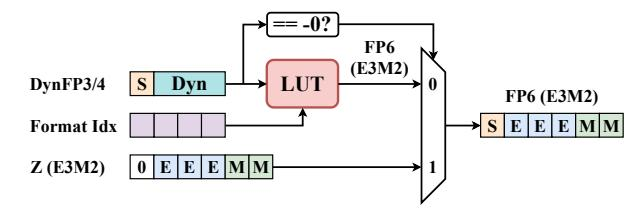

# B. Dynamic Floating-Point (DynFP) Data Format

To address this diversity, UNICORE introduces Dynamic Floating-Point (DynFP), a per-group configurable 4-bit (or 3-bit) format, which is defined as:

$$DynFP(W_E, W_M, Z, I)$$

where  $W_E$  and  $W_M$  are exponent and mantissa bit-widths, respectively. Z is the remapped special value replacing the redundant "-0" code, and I is the optional "gap-insertion" flag that inserts an empty bit to improve representability of non-uniform distributions. DynFP provides the following features.

**Adaptive E/M Allocation.** First, as shown in Figure 12, each group chooses its floating-point layout (e.g., E3M0, E2M1, E1M2) to prioritize either dynamic range (larger exponent) or precision (more mantissa bits). This follows the findings of AxCore [50] and M-ANT [18] that optimal E/M allocation significantly reduces quantization error.

Range Extension via Empty-Bit Insertion (I-flag). Second, inserting a small "gap" between exponent and mantissa codes reshapes the ladder of representable values. This helps match odd-shaped distributions—e.g., clusters separated by wide gaps—without increasing bit-width. Formally, for a raw exponent code  $E \in [0, 2^{W_E} - 1]$ , we split E at position  $\ell$  into  $E_{\rm hi} = \lfloor E/2^\ell \rfloor$  and  $E_{\rm lo} = E \bmod 2^\ell$ . With the I-flag enabled, we define the effective exponent mapping  $\Phi(I, \ell, E)$  such that  $\Phi(0, \ell, E) = E$  and  $\Phi(1, \ell, E) = E_{\rm hi} \cdot 2^{\ell+1} + E_{\rm lo}$ , which is equivalent to inserting a zero bit between the two parts. This remapping introduces a controlled gap in the exponent ladder, modestly extending the covered range to better fit irregular value distributions.

Fig. 12: Overview of the proposed DynFP format. (S: sign, E: exponent, M: mantissa).

Fig. 13: Unified Format Converter with DynFP support.

