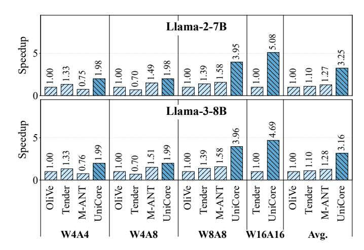

# C. Compute Density Evaluation

- 1) PE Level: Figure 15 shows the normalized C-PE compute density (throughput/area) in the 4–8 bit setting. In W8A8 mode, UNICORE achieves a PE efficiency of 3.51, outperforming all baselines by  $2.31\times-3.51\times$  and clearly reflecting the benefit of linear S-FPMA scaling. The same trend holds even at lower precision: UNICORE delivers the highest W4A4 efficiency (7.02), a  $1.15\times-1.76\times$  improvement, and in mixed-precision W4A8 mode it retains its 8-bit efficiency while still exceeding all baselines by  $1.20\times-2.31\times$ . For the extended 4–16 bit PE scaling, the gap widens further with precision: UNICORE is only slightly ahead of Tender at W4A4, grows to over  $2\times$  at W8A8, and exceeds  $4\times$  at W16A16, where multiplier-based designs suffer from quadratic overhead.
- 2) GEMM Level: These PE-level gains translate directly into higher GEMM-level compute density (Figure 16). Across all bit-width modes, UNICORE achieves the highest TOPS/mm2: in W4A4 it provides 1.44×-1.98× higher efficiency, in W4A8 it improves upon baselines by 1.23×-2.88×, and in W8A8 it reaches 3.95 TOPS/mm2, a 2.47×-3.95× advantage over prior designs. Extending the comparison to

Fig. 17: Normalized speedup of UNICORE compared with baselines under diverse precisions.

16-bit execution further highlights the benefit of the S-FPMA datapath. As precision increases, UNICORE's advantage grows rapidly: it delivers 1.32× higher TOPS/mm² than Tender at W4A4, rises to 2.63× at W8A8, and reaches 5.26× at W16A16. This widening gap reflects the fundamental architectural difference—UNICORE's S-FPMA scales linearly, whereas multiplier-based composable designs such as Tender incur quadratic performance collapse as bit-width increases.

