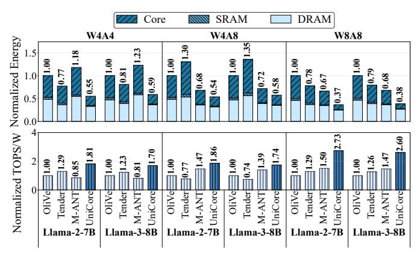

# D. Performance and Energy Efficiency

We evaluate end-to-end prefill and decode performance and energy efficiency using Llama-2-7B and Llama-3-8B with a sequence length of 8192, a configuration commonly used in real-world deployments [34].

1) Performance: Figure 17 presents normalized prefill performance under four precision settings: W4A4, W4A8, W8A8, and W16A16. Tender, M-ANT, and UNICORE quantize the K/V cache using the same bit-width as activations, whereas OliVe retains 16-bit K/V due to the lack of compatible quantization support. With normalized GEMM compute area, UNICORE consistently achieves higher speedups than every baseline, with particularly pronounced gains at higher bit-widths owing to the linear scalability of S-FPMA. On average across OliVe, Tender, and M-ANT, UNICORE delivers 3.21×, 2.91×, and 2.51× speedups, respectively.

As decode is more memory-bound than prefill, we evaluate decode performance (batch size = 128) under DDR4 (25.6 GB/s) and HBM2 (256 GB/s), as shown in Figure 19 and Figure 20. UNICORE achieves average speedups of  $2.96\times$ ,  $1.04\times$ , and  $1.08\times$  over OliVe, Tender, and M-ANT under DDR4, and  $2.00\times$ ,  $1.35\times$ , and  $1.60\times$  under HBM2.

2) Energy: Figure 18 reports the energy breakdown and normalized energy efficiency under the DDR4 prefill setting. With K/V cache quantization, UNICORE, M-ANT, and Tender significantly reduce DRAM energy compared to OliVe. Across all precision settings, UNICORE achieves the lowest overall energy, enabled by its addition-only C-PE, bit-flexible dataflow, and linear-complexity multiplication structure. In

Fig. 18: Energy breakdown and normalized energy efficiency of UNICORE compared with baselines.

TABLE I: WikiText-2 perplexity (PPL) of different quantization methods across various models. UNICORE-Q enables distribution-adaptive DynFP quantization.

| FP16                                                                                                                                                                                                                                                                                                                                                                                                                                                                                                                                                                                                                                                                                                                                                                                                                                                                                                                                                                                                                                                                                                                                                                                                                                                                                                      | Method    | Bits     | OPT     | Llar  | na-2  | Llama-3 | Qw    | en3   |
|-----------------------------------------------------------------------------------------------------------------------------------------------------------------------------------------------------------------------------------------------------------------------------------------------------------------------------------------------------------------------------------------------------------------------------------------------------------------------------------------------------------------------------------------------------------------------------------------------------------------------------------------------------------------------------------------------------------------------------------------------------------------------------------------------------------------------------------------------------------------------------------------------------------------------------------------------------------------------------------------------------------------------------------------------------------------------------------------------------------------------------------------------------------------------------------------------------------------------------------------------------------------------------------------------------------|-----------|----------|---------|-------|-------|---------|-------|-------|
| UNICORE   16/16/16   10.88   5.48   3.32   6.17   9.69   8.64   INT   8/8/16   22.85   5.58   3.48   6.27   9.63   8.70   Tender   8/8/16   10.93   5.77   3.48   /                                                                                                                                                                                                                                                                                                                                                                                                                                                                                                                                                                                                                                                                                                                                                                                                                                                                                                                                                                                                                                                                                                                                       | Method    | W/A/KV   | 6.7B    | 7B    | 70B   | 8B      | 8B    | 14B   |
| INT                                                                                                                                                                                                                                                                                                                                                                                                                                                                                                                                                                                                                                                                                                                                                                                                                                                                                                                                                                                                                                                                                                                                                                                                                                                                                                       | FP16      | 16/16/16 | 10.86   | 5.47  | 3.32  | 6.14    | 9.72  | 8.64  |
| Tender OliVe         8/8/16         10.93         5.77         3.48         /         /         /         /         /         /         /         /         /         /         /         /         /         /         /         /         /         /         /         /         /         /         /         /         /         /         /         /         /         /         /         /         /         /         /         /         /         /         /         /         /         /         /         /         /         /         /         /         /         /         /         /         /         /         /         /         /         /         /         /         /         /         /         /         /         /         /         /         /         /         /         /         /         /         /         /         /         /         /         /         /         /         /         /         /         /         /         /         /         /         /         /         /         /         /         /         /         /         /         /         /<                                                                                                                                                                                    | UNICORE   | 16/16/16 | 10.88   | 5.48  | 3.32  | 6.17    | 9.69  | 8.64  |
| Olive         8/8/16         11.24         5.73         /         /         /         /         /         /         /         /         /         /         /         /         /         /         /         /         /         /         /         /         /         /         /         /         /         /         /         /         /         /         /         /         /         /         /         /         /         /         /         /         /         /         /         /         /         /         /         /         /         /         /         /         /         /         /         /         /         /         /         /         /         /         /         /         /         /         /         /         /         /         /         /         /         /         /         /         /         /         /         /         /         /         /         /         /         /         /         /         /         /         /         /         /         /         /         /         /         /         /         /         /         /                                                                                                                                                                                               | INT       | 8/8/16   | 22.85   | 5.58  | 3.48  | 6.27    | 9.63  | 8.70  |
| UNICORE   8/8/16   10.98   5.50   3.34   6.20   9.77   8.72   INT   4/4/16   11.18   5.95   3.62   7.39   10.51   9.22   Tender   4/4/16   13.56   36.47   13.43   /                                                                                                                                                                                                                                                                                                                                                                                                                                                                                                                                                                                                                                                                                                                                                                                                                                                                                                                                                                                                                                                                                                                                      | Tender    | 8/8/16   | 10.93   | 5.77  | 3.48  | /       | /     | /     |
| INT                                                                                                                                                                                                                                                                                                                                                                                                                                                                                                                                                                                                                                                                                                                                                                                                                                                                                                                                                                                                                                                                                                                                                                                                                                                                                                       | OliVe     | 8/8/16   | 11.24   | 5.73  | /     | /       | /     | /     |
| Tender Olive         4/4/16 4/4/16         13.56 36.47         13.43 7 7 7 7 7 7 7 7 7 7 7 7 7 7 7 7 7 7 7                                                                                                                                                                                                                                                                                                                                                                                                                                                                                                                                                                                                                                                                                                                                                                                                                                                                                                                                                                                                                                                                                                                                                                                                | UNICORE   | 8/8/16   | 10.98   | 5.50  | 3.34  | 6.20    | 9.77  | 8.72  |
| OliVe         4/4/16         39.18         44.07         /         /         /         /         /         /         /         /         /         /         /         /         /         /         /         /         /         /         /         /         /         /         /         /         /         /         /         /         /         /         /         /         /         /         /         /         /         /         /         /         /         /         /         /         /         /         /         /         /         /         /         /         /         /         /         /         /         /         /         /         /         /         /         /         /         /         /         /         /         /         /         /         /         /         /         /         /         /         /         /         /         /         /         /         /         /         /         /         /         /         /         /         /         /         /         /         /         /         /         /         /         /                                                                                                                                                                                              | INT       | 4/4/16   | 11.18   | 5.95  | 3.62  | 7.39    | 10.51 | 9.22  |
| MXFP4         4/4/16         11.26         5.99         3.61         7.50         10.74         9.50           BitMoD         4/4/16         11.08         5.82         3.56         7.13         10.33         9.20           M-ANT         4/4/16         11.14         5.85         3.56         7.11         10.33         9.29           UNICORE         4/4/16         11.15         5.81         3.55         7.05         10.37         9.16           UNICORE-Q         4/4/16         10.93         5.76         3.51         6.85         10.09         9.07           INT         4/8/16         79.26         5.76         3.51         6.82         10.00         8.93           BitMoD         4/8/16         45.95         5.67         3.55         6.60         9.92         8.84           M-ANT         4/8/16         44.12         5.70         3.55         6.69         9.28         8.90           UNICORE         4/8/16         11.11         5.67         3.44         6.66         10.26         8.97           UNICORE-Q         4/8/16         11.06         5.72         3.44         6.69         10.11         8.86           INT                                                                                                                                       | Tender    | 4/4/16   | 13.56   | 36.47 | 13.43 | /       | /     | /     |
| BitMoD         4/4/16         11.08         5.82         3.56         7.13         10.33         9.20           M-ANT         4/4/16         11.14         5.85         3.56         7.11         10.33         9.29           UNICORE         4/4/16         11.15         5.81         3.55         7.05         10.37         9.16           UNICORE-Q         4/4/16         10.93         5.76         3.51         6.85         10.09         9.07           INT         4/8/16         79.26         5.76         3.61         6.82         10.00         8.93           BitMoD         4/8/16         45.95         5.67         3.55         6.60         9.92         8.84           M-ANT         4/8/16         44.12         5.70         3.55         6.69         9.92         8.84           UNICORE         4/8/16         11.11         5.67         3.44         6.66         10.26         8.97           UNICORE-Q         4/8/16         11.06         5.72         3.44         6.69         10.11         8.86           INT         3/8/16         2158.19         6.97         4.27         13.92         13.84         12.53           BitMoD                                                                                                                                  | OliVe     | 4/4/16   | 39.18   | 44.07 | /     | /       | /     | /     |
| M-ANT         4/4/16         11.14         5.85         3.56         7.11         10.33         9.29           UNICORE         4/4/16         11.15         5.81         3.55         7.05         10.37         9.16           UNICORE-Q         4/4/16         10.93         5.76         3.51         6.85         10.09         9.07           INT         4/8/16         79.26         5.76         3.61         6.82         10.00         8.93           BitMoD         4/8/16         45.95         5.67         3.55         6.60         9.92         8.84           M-ANT         4/8/16         44.12         5.70         3.55         6.59         9.86         8.90           UNICORE         4/8/16         11.11         5.67         3.44         6.66         10.26         8.97           UNICORE-Q         4/8/16         10.88         5.62         3.40         6.46         9.93         8.90           AxCore         4/16/16         11.06         5.72         3.44         6.69         10.11         8.86           INT         3/8/16         2158.19         6.97         4.27         13.92         13.84         12.53           BitMoD                                                                                                                                  | MXFP4     | 4/4/16   | 11.26   | 5.99  | 3.61  | 7.50    | 10.74 | 9.50  |
| UNICORE         4/4/16         11.15         5.81         3.55         7.05         10.37         9.16           UNICORE-Q         4/4/16         10.93         5.76         3.51         6.85         10.09         9.07           INT         4/8/16         79.26         5.76         3.61         6.82         10.00         8.93           BitMoD         4/8/16         45.95         5.67         3.55         6.60         9.92         8.84           M-ANT         4/8/16         44.12         5.70         3.55         6.59         9.86         8.90           UNICORE         4/8/16         11.11         5.67         3.44         6.66         10.26         8.97           UNICORE-Q         4/8/16         11.06         5.72         3.44         6.69         10.11         8.86           INT         3/8/16         2158.19         6.97         4.27         13.92         13.84         12.53           BitMoD         3/8/16         190.12         6.13         3.84         7.82         11.20         9.61           UNICORE         3/8/16         14.60         6.40         3.94         9.27         12.32         9.95           UNICORE-                                                                                                                             | BitMoD    | 4/4/16   | 11.08   | 5.82  | 3.56  | 7.13    | 10.33 | 9.20  |
| UNICORE-Q         4/4/16         10.93         5.76         3.51         6.85         10.09         9.07           INT         4/8/16         79.26         5.76         3.61         6.82         10.00         8.93           BitMoD         4/8/16         45.95         5.67         3.55         6.60         9.92         8.84           M-ANT         4/8/16         44.12         5.70         3.55         6.59         9.86         8.90           UNICORE         4/8/16         11.11         5.67         3.44         6.66         10.26         8.97           UNICORE-Q         4/8/16         10.88         5.62         3.40         6.46         9.93         8.90           AxCore         4/16/16         11.06         5.72         3.44         6.69         10.11         8.86           INT         3/8/16         2158.19         6.97         4.27         13.92         13.84         12.53           BitMoD         3/8/16         190.12         6.13         3.84         7.82         10.96           UNICORE         3/8/16         14.60         6.40         3.94         9.27         12.32         9.95           UNICORE-Q         3/8/                                                                                                                             | M-ANT     | 4/4/16   | 11.14   | 5.85  | 3.56  | 7.11    | 10.33 | 9.29  |
| INT         4/8/16         79.26         5.76         3.61         6.82         10.00         8.93           BitMoD         4/8/16         45.95         5.67         3.55         6.60         9.92         8.84           M-ANT         4/8/16         44.12         5.70         3.55         6.59         9.86         8.90           UNICORE         4/8/16         11.11         5.67         3.44         6.66         10.26         8.97           UNICORE-Q         4/8/16         10.88         5.62         3.40         6.46         9.93         8.90           AxCore         4/16/16         11.06         5.72         3.44         6.69         10.11         8.86           INT         3/8/16         2158.19         6.97         4.27         13.92         13.84         12.53           BitMoD         3/8/16         190.12         6.13         3.84         7.82         11.20         9.61           UNICORE         3/8/16         14.60         6.40         3.94         9.27         12.32         9.95           UNICORE-Q         3/8/16         11.77         5.95         3.63         7.42         10.45         9.44           INT                                                                                                                                   | UNICORE   | 4/4/16   | 11.15   | 5.81  | 3.55  | 7.05    | 10.37 | 9.16  |
| BitMoD         4/8/16         45.95         5.67         3.55         6.60         9.92         8.84           M-ANT         4/8/16         44.12         5.70         3.55         6.59         9.86         8.90           UNICORE         4/8/16         11.11         5.67         3.44         6.66         10.26         8.97           UNICORE-Q         4/8/16         10.88         5.62         3.40         6.46         9.93         8.90           AxCore         4/16/16         11.06         5.72         3.44         6.69         10.11         8.86           INT         3/8/16         2158.19         6.97         4.27         13.92         13.84         12.53           BitMoD         3/8/16         19.012         6.13         3.84         7.82         11.20         9.61           UNICORE         3/8/16         14.60         6.40         3.94         9.27         12.32         9.95           UNICORE-Q         3/8/16         11.77         5.95         3.63         7.42         10.45         9.44           INT         4/4/4         11.33         6.73         4.57         8.38         11.27         10.00           UNICORE </td <td>UNICORE-Q</td> <td>4/4/16</td> <td>10.93</td> <td>5.76</td> <td>3.51</td> <td>6.85</td> <td>10.09</td> <td>9.07</td> | UNICORE-Q | 4/4/16   | 10.93   | 5.76  | 3.51  | 6.85    | 10.09 | 9.07  |
| M-ANT         4/8/16         44.12         5.70         3.55         6.59         9.86         8.90           UNICORE         4/8/16         11.11         5.67         3.44         6.66         10.26         8.97           UNICORE-Q         4/8/16         10.88         5.62         3.40         6.46         9.93         8.90           AxCore         4/16/16         11.06         5.72         3.44         6.69         10.11         8.86           INT         3/8/16         2158.19         6.97         4.27         13.92         13.84         12.53           BitMoD         3/8/16         190.12         6.13         3.84         7.82         11.20         9.95           UNICORE         3/8/16         14.60         6.40         3.94         9.27         12.32         9.95           UNICORE-Q         3/8/16         11.77         5.95         3.63         7.42         10.45         9.44           INT         4/4/4         11.33         6.73         4.57         8.38         11.27         10.00           UNICORE         4/4/4         11.54         6.23         3.82         7.86         10.78         9.39                                                                                                                                                | INT       | 4/8/16   | 79.26   | 5.76  | 3.61  | 6.82    | 10.00 | 8.93  |
| UNICORE         4/8/16         11.11         5.67         3.44         6.66         10.26         8.97           UNICORE-Q         4/8/16         10.88         5.62         3.40         6.46         9.93         8.90           AxCore         4/16/16         11.06         5.72         3.44         6.69         10.11         8.86           INT         3/8/16         2158.19         6.97         4.27         13.92         13.84         12.53           BitMoD         3/8/16         190.12         6.13         3.84         7.82         11.20         9.61           UNICORE         3/8/16         14.60         6.40         3.94         9.27         12.32         9.95           UNICORE-Q         3/8/16         11.77         5.95         3.63         7.42         10.45         9.44           INT         4/4/4         11.33         6.73         4.57         8.38         11.27         10.00           UNICORE         4/4/4         11.54         6.23         3.82         7.86         10.78         9.39                                                                                                                                                                                                                                                              | BitMoD    | 4/8/16   | 45.95   | 5.67  | 3.55  | 6.60    | 9.92  | 8.84  |
| UNICORE-Q         4/8/16         10.88         5.62         3.40         6.46         9.93         8.90           AXCORE         4/16/16         11.06         5.72         3.44         6.69         10.11         8.86           INT         3/8/16         2158.19         6.97         4.27         13.92         13.84         12.53           BitMoD         3/8/16         190.12         6.13         3.84         7.82         11.20         9.61           UNICORE         3/8/16         14.60         6.40         3.94         9.27         12.32         9.95           UNICORE-Q         3/8/16         11.77         5.95         3.63         7.42         10.45         9.44           INT         4/4/4         11.33         6.73         4.57         8.38         11.27         10.00           UNICORE         4/4/4         11.54         6.23         3.82         7.86         10.78         9.39                                                                                                                                                                                                                                                                                                                                                                               | M-ANT     | 4/8/16   | 44.12   | 5.70  | 3.55  | 6.59    | 9.86  | 8.90  |
| AxCore         4/16/16         11.06         5.72         3.44         6.69         10.11         8.86           INT         3/8/16         2158.19         6.97         4.27         13.92         13.84         12.53           BitMoD         3/8/16         190.12         6.13         3.84         7.82         11.20         9.61           UNICORE         3/8/16         14.60         6.40         3.94         9.27         12.32         9.95           UNICORE-Q         3/8/16         11.77         5.95         3.63         7.42         10.45         9.44           INT         4/4/4         11.33         6.73         4.57         8.38         11.27         10.00           UNICORE         4/4/4         11.54         6.23         3.82         7.86         10.78         9.39                                                                                                                                                                                                                                                                                                                                                                                                                                                                                                 | UniCore   | 4/8/16   | 11.11   | 5.67  | 3.44  | 6.66    | 10.26 | 8.97  |
| INT         3/8/16         2158.19         6.97         4.27         13.92         13.84         12.53           BitMoD         3/8/16         190.12         6.13         3.84         7.82         11.20         9.61           UNICORE         3/8/16         14.60         6.40         3.94         9.27         12.32         9.95           UNICORE-Q         3/8/16         11.77         5.95         3.63         7.42         10.45         9.44           INT         4/4/4         11.33         6.73         4.57         8.38         11.27         10.00           UNICORE         4/4/4         11.54         6.23         3.82         7.86         10.78         9.39                                                                                                                                                                                                                                                                                                                                                                                                                                                                                                                                                                                                                  | UniCore-Q | 4/8/16   | 10.88   | 5.62  | 3.40  | 6.46    | 9.93  | 8.90  |
| BitMoD         3/8/16         190.12         6.13         3.84         7.82         11.20         9.61           UNICORE         3/8/16         14.60         6.40         3.94         9.27         12.32         9.95           UNICORE-Q         3/8/16         11.77         5.95         3.63         7.42         10.45         9.44           INT         4/4/4         11.33         6.73         4.57         8.38         11.27         10.00           UNICORE         4/4/4         11.54         6.23         3.82         7.86         10.78         9.39                                                                                                                                                                                                                                                                                                                                                                                                                                                                                                                                                                                                                                                                                                                                   | AxCore    | 4/16/16  | 11.06   | 5.72  | 3.44  | 6.69    | 10.11 | 8.86  |
| UNICORE         3/8/16         14.60         6.40         3.94         9.27         12.32         9.95           UNICORE-Q         3/8/16         11.77         5.95         3.63         7.42         10.45         9.44           INT         4/4/4         11.33         6.73         4.57         8.38         11.27         10.00           UNICORE         4/4/4         11.54         6.23         3.82         7.86         10.78         9.39                                                                                                                                                                                                                                                                                                                                                                                                                                                                                                                                                                                                                                                                                                                                                                                                                                                    | INT       | 3/8/16   | 2158.19 | 6.97  | 4.27  | 13.92   | 13.84 | 12.53 |
| UNICORE-Q         3/8/16         11.77         5.95         3.63         7.42         10.45         9.44           INT         4/4/4         11.33         6.73         4.57         8.38         11.27         10.00           UNICORE         4/4/4         11.54         6.23         3.82         7.86         10.78         9.39                                                                                                                                                                                                                                                                                                                                                                                                                                                                                                                                                                                                                                                                                                                                                                                                                                                                                                                                                                     | BitMoD    | 3/8/16   | 190.12  | 6.13  | 3.84  | 7.82    | 11.20 | 9.61  |
| INT 4/4/4 11.33 6.73 4.57 8.38 11.27 10.00 UNICORE 4/4/4 11.54 6.23 3.82 7.86 10.78 9.39                                                                                                                                                                                                                                                                                                                                                                                                                                                                                                                                                                                                                                                                                                                                                                                                                                                                                                                                                                                                                                                                                                                                                                                                                  | UNICORE   | 3/8/16   | 14.60   | 6.40  | 3.94  | 9.27    | 12.32 | 9.95  |
| UNICORE 4/4/4 11.54 6.23 3.82 7.86 10.78 9.39                                                                                                                                                                                                                                                                                                                                                                                                                                                                                                                                                                                                                                                                                                                                                                                                                                                                                                                                                                                                                                                                                                                                                                                                                                                             | UniCore-Q | 3/8/16   | 11.77   | 5.95  | 3.63  | 7.42    | 10.45 | 9.44  |
|                                                                                                                                                                                                                                                                                                                                                                                                                                                                                                                                                                                                                                                                                                                                                                                                                                                                                                                                                                                                                                                                                                                                                                                                                                                                                                           | INT       | 4/4/4    | 11.33   | 6.73  | 4.57  | 8.38    | 11.27 | 10.00 |
|                                                                                                                                                                                                                                                                                                                                                                                                                                                                                                                                                                                                                                                                                                                                                                                                                                                                                                                                                                                                                                                                                                                                                                                                                                                                                                           | UniCore   | 4/4/4    | 11.54   | 6.23  | 3.82  | 7.86    | 10.78 | 9.39  |
| UNICORE-Q 4/4/4 11.10 6.19 3.78 7.59 10.45 9.28                                                                                                                                                                                                                                                                                                                                                                                                                                                                                                                                                                                                                                                                                                                                                                                                                                                                                                                                                                                                                                                                                                                                                                                                                                                           | UNICORE-Q | 4/4/4    | 11.10   | 6.19  | 3.78  | 7.59    | 10.45 | 9.28  |

terms of energy efficiency, UNICORE delivers the highest normalized TOPS/W under every precision and model combination. Overall, UNICORE provides 1.86× higher TOPS/W than baselines, reaching up to 2.73× improvement in some settings. As shown in Figure 19 and Figure 20, in the decode phase under both DDR4 and HBM2 configurations, UNICORE achieves the lowest total energy consumption and the highest TOPS/W in nearly all evaluated settings, demonstrating that its energy advantage persists even in memory-bound scenarios.

