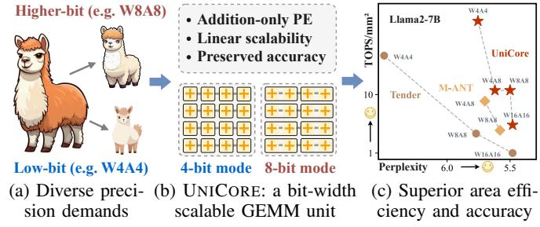

# UniCore: A Bit-Width Scalable GEMM Unit for Unified LLM Inference

Yonghao Chen\*, Jiaxiang Zou\*, Xingyu Chen, Chenxi Xu, Jingyu Guo, Xinyu Chen†

The Hong Kong University of Science and Technology (Guangzhou)

Guangzhou, China

{ychen433, jzou521, xchen740, cxu930, jyguo012}@connect.hkust-gz.edu.cn,

xinyuchen@hkust-gz.edu.cn

Abstract—Large Language Models (LLMs) have achieved remarkable success across a broad range of applications but impose extreme computational and memory demands due to their reliance on massive General Matrix-Matrix Multiplication (GEMM) operations. Quantization has emerged as a key approach to improve efficiency by reducing data precision; however, modern LLMs exhibit diverse sensitivities to quantization, requiring multiple precision settings. Existing hardware accelerators fail to efficiently support this diversity: fixed-function accelerators are limited to a few discrete formats, while bitcomposable architectures suffer from quadratic resource scaling, leading to severe performance degradation at higher precision. We propose UniCore, a unified GEMM architecture that achieves both bit-width scalability and accuracy preservation through a hardware-software co-design. UniCore introduces Scalable FPMA (S-FPMA), the first composable FPMA primitive that fuses into different precisions using uniform adder slices, maintaining linear hardware scaling. To ensure numerical fidelity, UniCore integrates a lightweight format-conversion and dualpath compensation pipeline that corrects FPMA's structured approximation error. Complementing the architecture, DvnFP, a distribution-adaptive low-bit floating-point format, improves representational accuracy for diverse LLM weight and activation distributions. UniCore delivers 1.24×-3.95× higher area efficiency for W4A4/W4A8/W8A8 and up to 5.26× at W16A16 compared to prior composable-multiplier accelerators, while achieving the highest accuracy in nearly all configurations. UniCore is opensourced at: https://github.com/CLab-HKUST-GZ/isca53-unicore Index Terms—Large Language Model, Approximate Comput-

#### I. Introduction

ing, Quantization, Hardware Accelerator.

Large Language Models (LLMs) have demonstrated remarkable capabilities across tasks such as language understanding, translation, and generative content creation [27], [35], [40], [46], [48]. However, their inference remains computationally intensive due to the heavy use of general matrix multiplication (GEMM) operations over billions of parameters. To make large-scale LLM deployment practical, quantization has become a widely adopted technique. By reducing the precision of weights (W) and activations (A), quantization effectively lowers memory footprint and computational cost.

Quantization introduces a trade-off between computational efficiency and model accuracy. This trade-off is complex, as

Fig. 1: UNICORE enables efficient and accurate LLM inference across diverse quantization formats.

different LLMs exhibit diverse sensitivities to precision. For instance, models such as Llama-1&2 [40], [41] and OPT [48] maintain accuracy under 4-bit weight-activation quantization, whereas larger or activation-sensitive models (e.g., Llama-3 [14]) require higher-bit settings (e.g., W8A8) to alleviate accuracy loss [25], [45], [49]. Furthermore, even a single model may require different precision to meet the demands of diverse use cases, such as a high-throughput, low-precision "draft" mode versus a high-precision "quality" mode [21]. This creates a critical design challenge for LLM accelerators: *no single quantization format is universally applicable*. Therefore, an ideal hardware solution must provide *bit-width flexibility* to accommodate varying quantization methods.

However, existing hardware architectures remain limited in achieving bit-width flexibility. Most of the LLM accelerators [13], [19], [33], [50] are overly rigid, supporting only a fixed-format or singular precision that cannot efficiently map to the wide spectrum of quantization formats. Bit-composable architectures [15], [18], [22], [39] offer configurability by fusing small compute units, but they suffer from a fundamental quadratic performance collapse: their throughput decreases roughly in proportion to  $1/n^2$ , because multiplier resources scale as  $O(n^2)$  in both area and delay [39]. This inherent limitation allows high throughput at low-bit settings (e.g., W4A4) but causes severe degradation at higher precisions (e.g., W8A8, W16A16). Consequently, there remains a critical architectural gap: no existing architecture scales efficiently with bit-width while maintaining high utilization.

Our core insight is that the computational primitive determines whether a GEMM engine can scale efficiently

\*Contributed equally to this work.

†Corresponding author.

with bit width. While prior work has explored *floating-point* multiplication approximation with integer addition (FPMA) for specific quantization settings [50], we recognize that its addition-based structure enables hardware cost to scale linearly, O(n), with bit-width, offering a far more scalable alternative to multiplier-based designs. However, this promising path presents two critical challenges: 1) Accuracy Preservation: FPMA is an approximation, and its inherent computational error, especially in low-bit modes, can lead to inevitable losses in model fidelity. 2) Architectural Unification: Existing FPMA units [50] are fixed-function (e.g., W4A16) and cannot be fused or decomposed to support different precisions. Achieving bit-width flexibility requires a unified FPMA architecture that scales efficiently.

In this paper, we propose UNICORE, a unified GEMM architecture that harnesses the linear-scaling potential of FPMA through a holistic software-hardware co-design (Figure 1).

- We introduce a lightweight format-conversion and compensation pipeline that addresses FPMA's structured approximation error. Through subnormal removal, mantissa reconstruction, and dual-path fine- and coarse-grained compensation, UNICORE maintains high numerical fidelity.
- We design a unified GEMM engine built on S-FPMA, a dynamically fusible FPMA compute primitive composed of uniform adder slices. By cascading these slices, UNICORE achieves strictly linear (O(n)) hardware scaling and can be reconfigured on demand to support diverse formats.
- To complement the compute architecture, we propose DynFP, a configurable low-bit floating-point format that adapts exponent—mantissa allocation, eliminates redundant encodings, and better captures the diverse weight and K/V distributions in LLMs.

Experimental results show that UNICORE achieves 1.24×-3.95× higher area efficiency for W4A4/W4A8/W8A8 and up to 5.26× higher efficiency at W16A16 compared to state-of-the-art accelerators. Meanwhile, UNICORE achieves the highest accuracy across nearly all configurations. It provides the lowest perplexity in 4-bit modes and near-FP16 accuracy at higher bit-widths (e.g., 8-bit).

