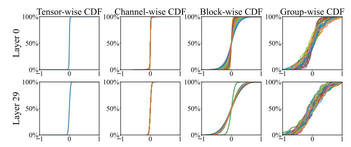

# VII. DISTRIBUTION-ADAPTIVE QUANTIZATION WITH DYNAMIC FLOATING-POINT FORMAT

Aggressive low-bit quantization (e.g., 3–4 bits) is essential for reducing GEMM compute cost, yet standard low-bit floating-point formats (FP4/FP3) struggle to represent the highly diverse, fine-grained data distributions seen in modern LLMs. UNICORE therefore integrates a distribution-aware quantization framework that co-designs the numerical format with the S-FPMA datapath to achieve high fidelity under ultralow bit precision.

### A. Non-uniform Data Distribution in LLMs

Although tensor-wise activation or weight distributions appear well-behaved, their per-group distributions (e.g., 32-element groups used in modern scaling quantization) are highly non-uniform and vary dramatically across layers and channels. Figure 11 shows that while tensor-level CDFs are

Fig. 11: Cumulative distribution functions (CDFs) of the Llama-2-7B attention output projection (layers 0 and 29) at tensor-, channel-, block-, and group-level granularities. Specifically, block-wise and group-wise granularities refer to partition sizes of  $64 \times 64$  and  $1 \times 64$ , respectively. Tensor-wise plots use a single tensor, whereas the other plots show CDFs for 32 sampled instances from the corresponding tensor.

smooth, per-group distributions can be heavy-tailed, asymmetric, or tightly concentrated. Consequently, a single static format (e.g., standard FP4) is ill-equipped to represent this wide spectrum of group-level distributions under aggressive quantization, resulting in notable accuracy degradation compared with higher-bit-width formats [7], [15], [16], [18], [22], [38], [42], [45]. This motivates a flexible, per-group floating-point format tailored to each distribution.

