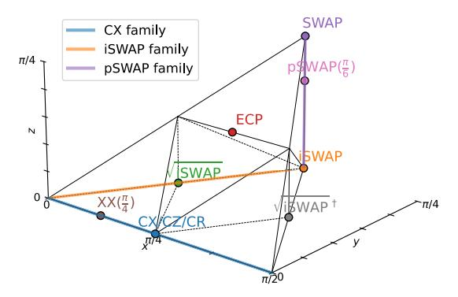

# A. Qubit mapping/routing

Real quantum hardware typically has connectivity constraints, whereas algorithms often assume arbitrary interactions. To execute quantum circuits on topology-constrained hardware, logical qubits must first be mapped to physical qubit positions. This is called the initial mapping. In most cases, even an optimal initial mapping cannot guarantee all logical 2Q gates are mapped on physically connected qubit pairs. The common solution is to dynamically change logical-to-physical qubit mappings by inserting SWAP gates, as a SWAP gate exchanges state subspaces of two operand qubits, such that non-adjacent logical qubit states can be moved next to each other. Therefore, the qubit placement and routing compilation stage takes a logical circuit and hardware coupling graph as the input and outputs a transformed circuit within which each 2Q gate, with respect to a qubit mapping, is hardware compliant. An example is depicted in Fig. 2.

#### B. Canonical description of 2Q gates

Any 2Q gate can be represented by a  $4 \times 4$  matrix in SU(4), up to a global phase, with its canonical form defined as:

Fig. 3. Geometric illustration of canonical gates confined to the Weyl chamber. For visualization convenience, herein the Weyl chamber is confined to  $\left\{\frac{\pi}{4} \geq x \geq y \geq z \geq 0\right\} \cup \left\{\frac{\pi}{4} \geq \frac{\pi}{2} - x \geq y \geq z \geq 0\right\}$ , equivalent to the canonical coefficient convention  $\left\{(a,b,c) \mid \frac{1}{2} \geq a \geq b \geq |c|\right\}$ .

**Definition 1** (Canonical gate). Any 2Q gate  $U \in SU(4)$  can be expressed by the composition of its unique canonical form

$$\operatorname{Can}(a, b, c) := e^{-i\frac{\pi}{2}(a \, XX + b \, YY + c \, ZZ)}, \, \frac{1}{2} \ge a \ge b \ge |c|$$

sandwiched by 1Q gates such that we say U is locally equivalent to  $(\sim)$  the canonical form  $\operatorname{Can}(a,b,c)$ .

The canonical coefficients (a, b, c) are confined to a tetrahedron known as the *Weyl chamber*, which provides a geometric representation of all local equivalence classes of 2Q gates [76]. Fig. 3 visualizes some common 2Q gates. E.g.,

- CX, CZ, and CR are all equivalent to  $Can(\frac{1}{2}, 0, 0)$ .
- CX family:  $XX(\theta) \sim YY(\theta) \sim ZZ(\theta) \sim Can(\frac{\theta}{\pi}, 0, 0)$ .
- Param-SWAP family:  $pSWAP(\theta) \sim Can(\frac{1}{2}, \frac{1}{2}, \frac{1}{2} \frac{\theta}{\pi})$ .

In practice, the canonical form is acquired by KAK decomposition [66] and has been widely used [9], [12]. Appendix A and Appendix B provides a more detailed introduction to the canonical form and its properties.

#### C. Gate realization cost on hardware

The transformed circuits via qubit routing will be ultimately converted into basis gates for execution on hardware. Basis gates refer to those natively implemented and calibrated on physical platforms. Typical native gates in superconducting platforms are CR [61], CZ, and iSWAP gates [36]. The realization cost of basis gates involves multiple aspects, including the benchmarked fidelity, gate duration, calibration efficiency, etc. For example, gates with shorter duration are more likely to achieve high fidelity, as qubit decoherence dominates the noise source; although some gate schemes can now implement more basis gates [13], [51], those with simpler pulse control are more likely to be calibrated with high precision, such as the iSWAP-family gates on flux-tunable transmons.

2Q gates are not natively implemented and must be synthesized by native gates. Their realization cost is determined by the basis gates used for synthesis. For example, any 2Q gate can be minimally synthesized by 3 CX gates, except for Can(a,b,0) for which the required CX count is 2. Conventionally, SWAP is regarded as 3 times that of CX realization

cost, while it can also be synthesized by "1 CX + 1 iSWAP" or "3 √ iSWAP" gates. The monodromy polytope theory was recently proposed to determine the optimal synthesis cost for any 2Q gate given a specific set of basis gates through analysis of local invariants of canonical gates [\[56\]](#page-15-15). By this method, the set of gates realizable by a specified number of 2Q gates from the basis set, with arbitrary 1Q gates, corresponds to a polytope within the Weyl chamber. For instance, the polytope reachable by 2 √ iSWAP gates with arbitrary 1Q gates is a tetrahedron confined to {1/2 ≥ a ≥ b + |c|} [\[29\]](#page-14-5).

