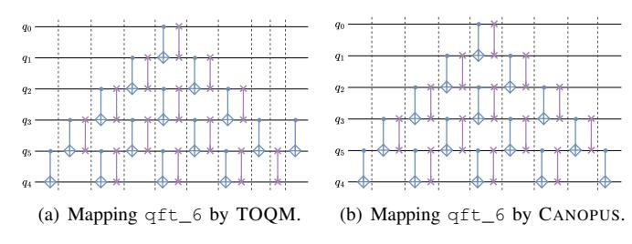
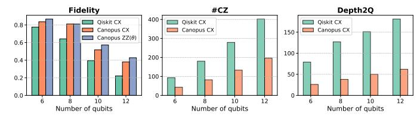
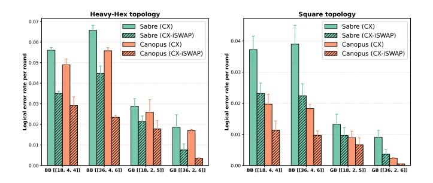

# **Algorithm 2:** Update D when adding a SWAP gate

```
Input: swap (encountered SWAP gate), can (canonical gate within L on the same qubits as swap), D, C

Output: Updated D

1 if (swap.q_0, swap.q_1) \in C then

2 q'_0, q'_1 \leftarrow C[(swap.q_0, swap.q_1)];
/* Adjust D by finding matched qubits q_i \in \{swap.q_0, swap.q_1\} and q'_j \in \{q'_0, q'_1\} */

3 D[q_i] \leftarrow D[q'_j] + \text{SYNTHCOST(can)};
4 D[\text{the other swap qubit}] \leftarrow D[q_i];
5 d \leftarrow \text{MAX}(D[\text{swap.}q_0], D[\text{swap.}q_1]) + \text{SYNTHCOST(can.MIRROR())} - \text{SYNTHCOST(can)};
6 D[\text{swap.}q_0] \leftarrow d; D[\text{swap.}q_1] \leftarrow d;
```

#### E. Scalability and implementation

The overall algorithm framework to implement CANOPUS resembles SABRE. To efficiently implement the sophisticated SWAP insertion mechanism in CANOPUS, we develop specific core algorithms. Algorithm 1 specifies how the essential data structures—the last mapped layer L, commutative canonical gate pairs C within L, wire duration record D—will be updated when adding an executable 2Q gate to the routed circuit DAG. Algorithm 2 shows how the wire durations D should be correctly updated when encountering a SWAP insertion that can exploit the canonical gate commutativity optimization opportunity. That is also crucial to evaluate the total circuit cost after mapping. Notably, all the computation processes within these algorithms are based on conditional control and operations on hashed data structures, achieving  $\mathcal{O}(1)$  time complexity. The synthesis cost of a target 2Q gate is quantified by identifying the convex polytope containing its canonical coordinate, for which the computation process is highly efficient with linear time complexity. CANOPUS also caches canonical gate costs it has computed to avoid repetitive computation. Consequently, the overall scalability of CANOPUS is on par with that of SABRE, ensuring its practical applicability to large-scale circuits.

For the specific hyperparameter values, we set  $k_E$  to 0.5, consistent with SABRE. Both  $w_g$  and  $w_d$  are also set to 0.5. This configuration ensures that the synthesis-aware optimization significantly influences routing decisions without overshadowing the primary objective of minimizing topological distance. The depth weight  $w_d$  is further scaled by a topology-adaptive factor  $\bar{d}/(2+\bar{d})$ , where  $\bar{d}$  is the average degree of the device coupling graph, reflecting that depth optimization is more impactful on denser topologies. The sensitivity of these choices is evaluated in Section VI-G.

The implementation of CANOPUS which is accessible on GitHub [1] builds on qiskit, monodromy, and pytket, along with additional self-implemented utilities. The core routing algorithm is realized as a native QISKIT TransformationPass, allowing seamless integration into existing QISKIT transpilation pipelines without any refactoring. Extending CANOPUS to a new ISA requires only a simple configuration step—specifying the unit costs for the target



<span id="page-7-1"></span>Fig. 8. Mapping/routing comparison for the QFT kernel. For convenient visualization, only CPhase and SWAP gates are shown. (a) TOQM generates a sub-optimal mapping scheme, with 2Q depth of 10. (b) CANOPUS generates the optimal scheme in a perfect butterfly structure, with 2Q depth of 9.

<span id="page-7-0"></span> $\label{thm:comparison} TABLE\ I$  Qubit routing comparison for the QFT kernel.

<span id="page-7-2"></span>

| Benchmark |         | qft_6 |         | qft_12    |           |  |
|-----------|---------|-------|---------|-----------|-----------|--|
| Topology  | Method  | #Can  | Depth2Q | #Can      | Depth2Q   |  |
|           | Optimal | 15    | 9       | 66        | 21        |  |
| 1D Chain  | TOQM    | 16    | 10      | 67        | 22        |  |
|           | CANOPUS | 15    | 9       | 66        | 21        |  |
| 2D Square | TOQM    | 21    | 13      | 100       | 39        |  |
| 2D Square | CANOPUS | 15    | 9       | 75 (±10%) | 33 (±10%) |  |

basis gates—without requiring any algorithmic modification.

#### V. CASE STUDIES

We validate the practical advantages of CANOPUS through two realistic case studies: the real-machine execution of quantum Fourier transform (QFT) circuits on IBM's QPU ibm\_marrakesh, and the end-to-end simulation of quantum low-density parity-check (qLDPC) stabilizer measurement circuits to assess its impact on the logical error rate.

## <span id="page-7-5"></span>A. QFT kernel

QFT is a fundamental subroutine in many promising quantum algorithms like Shor's algorithm [62] and quantum phase estimation [35]. Amid extensive research on dedicated QFT compilers [33], [47], [75], we select the specialized SOTA TOQM [75] as our primary baseline.

A key finding is that CANOPUS always achieves the optimal QFT routing scheme on the 1D chain topology, while TOQM does not. It can be proven that the minimal number of SWAP insertions to route an n-qubit QFT is  $\frac{n(n-1)}{2} - 2$ , that is, 2 fewer than the original CPhase count. This results in a perfect, symmetric butterfly circuit structure, as exemplified in Fig. 8(b), with minimal #Can and 2Q circuit depth. Notably, this result is indeed optimal, surpassing the manually designed scheme previously reported as optimal by Maslov [47] where 2 more SWAP gates are required. This optimal scheme is irrespective of the target ISA. In contrast, our experiments show that TOQM despite claiming to realize the scheme from [47], fails to reproduce it and consistently yields inferior results to CANOPUS, as illustrated in Fig. 8.

We compare compilation performance for both 6- and 12-qubit QFT kernels on both 1D chain and 2D square topologies, with results summarized in Table I. On the 1D chain, CANOPUS always produces the theoretically optimal routing



<span id="page-7-3"></span>Fig. 9. QFT kernel fidelity comparison benchmarked on IBM® Quantum Platform (ibm\_marrakesh). ibm\_marrakesh is a Heron-R2 QPU with native gate set  $\{CZ, \sqrt{X}, Z(\theta), ZZ(\theta)\}$ .



<span id="page-7-4"></span>Fig. 10. Logical error rates with error correction via qLDPC stabilizer circuits compiled for 2D heavy-hex (left) and square (right) topologies.

result, while TOQM does not. For the small-scale qft\_6 kernel on the 2D square, CANOPUS also achieves the optimal routing, superior to TOQM in both #Can and 2Q depth. For the large-scale qft\_12 kernel, CANOPUS consistently outperforms TOQM in both metrics.

To further validate these results, we performed real-machine experiments on IBM's ibm\_marrakesh QPU. We compiled QFT circuits of sizes  $n \in \{6, 8, 10, 12\}$  for a 1D chain topology using both CANOPUS and the default QISKIT compiler. Although ibm\_marrakesh has a heavy-hex topology, it contains linear chains of sufficient size for these benchmarks. Fidelity was measured using the Hellinger fidelity between the experimental and ideal output distributions, with the number of shots set to MAX $\{4096, 2^n \times 10\}$ . A layer of Hadamard gates is appended to each circuit execution so that the ideal final state will be  $|0\rangle^{\otimes n}$ . In Fig. 9, circuits compiled with CANOPUS achieve, on average, a 52.9% reduction in CZ gate count, a 66.4% reduction in 2Q-gate depth, and a 26.89% error reduction for the CZ/CX and 34.98% for the ZZ( $\theta$ ) gate set, respectively, compared to QISKIT with default settings. These results unequivocally demonstrate the practical advantages of CANOPUS for QFT kernel compilation.

#### B. qLDPC stabilizer circuit

For our second case study, we shift to the fault-tolerant quantum computing (FTQC) context by looking at an important class of quantum error correction circuit—the stabilizer measurement circuit for qLDPC codes. qLDPC codes are rapidly moving from a topic of theoretical interest to a cornerstone of experimental FTQC research, mainly because of their superior encoding efficiency [6], [7]. However, due to their frequent long-range interactions for stabilizer measurement [7], [53], realizing qLDPC codes on superconducting

processors with fixed, local connectivity is still hampered by significant routing overhead [67].

We demonstrate that the ISA-aware optimization mechanism of CANOPUS is crucial to mitigating the routing overhead across a diverse set of qLDPC codes. Here we attempt to compile the stabilizer measurement circuits with two ISAs: (1) CX ISA with CX as the 2Q basis gate; (2) CX-iSWAP ISA with both CX and iSWAP as basis gates, assumed to have an identical cost. Particularly, the CX-iSWAP ISA aligns with practical hardware realities, e.g., both CZ and iSWAP can be natively supported by mainstream superconducting platforms [5], [36], [68]. In addition, an ISA incorporating both iSWAP and CX leads to significant opportunities to "piggyback" a SWAP insertion on a CX without incurring extra 2Q gate count, as the composite block is equivalent to an iSWAP, enabling the possibility of optimizing qubit routing overhead during the execution of stabilizer measurements.

We further build an end-to-end evaluation pipeline with qLDPC code examples from [53], [67], including the generalized bicycle (GB) and bivariate bicycle (BB) codes. We simulate the standard memory experiments using stim [23] to evaluate the fault-tolerant performance of our compiled stabilizer measurement circuits, under the same circuit-level noise model as described in [6]. Finally, all syndromes are decoded using the BP-OSD decoder [28], [53] to determine the logical qubit error rate.

As shown in Fig. 10, CANOPUS consistently achieves lower logical error rates than SABRE, as the ISA-aware approach of CANOPUS results in compiled circuits with less CX/iSWAP gate count and circuit depth. Under the CX ISA, CANOPUS yields an average logical error suppression of 49.4% on the square topology and 11.4% on the heavyhex topology compared to SABRE. The advantage becomes even more pronounced with the CX-iSWAP combinatorial ISA, where CANOPUS achieves a 52.6% (square) and 29.3% (heavy-hex) error suppression, resulting from that there are many opportunities for SWAP insertions piggybacked on CX gates without incurring extra 2Q gate count. These results highlight two key findings: first, the ISA-aware mechanism in CANOPUS is highly effective for compiling QEC circuits, and second, the dedicated use of a hybrid CX-iSWAP gate set offers a significant practical advantage for qLDPC code demonstrations on superconducting hardware.

## VI. EVALUATION

We further holistically evaluate CANOPUS compared to other leading methods, across representative ISAs and hardware topologies. The evaluation provides both cross-compiler and cross-ISA comparisons under the coherent settings for basis gate cost and routing overhead metric.

#### A. Experimental settings

1) ISAs and basis gate costs: We consider six different ISAs (including the conventional CX ISA) listed in Table II. These cover a wide range of basis gates from individual CX-family or iSWAP-family gates to combinatorial ones.

TABLE II SELECTED QUANTUM ISAS.

<span id="page-8-0"></span>

| ISA      | 2Q basis gates                                                                                                             | Description                                                                                   |  |  |  |
|----------|----------------------------------------------------------------------------------------------------------------------------|-----------------------------------------------------------------------------------------------|--|--|--|
| CX       | {CX}                                                                                                                       | Conventional CX gate                                                                          |  |  |  |
|          |                                                                                                                            | Discrete CX-                                                                                  |  |  |  |
| ZZPhase  | $\left\{ ZZ_{\frac{\pi}{6}}, ZZ_{\frac{\pi}{4}}, ZZ_{\frac{\pi}{2}} \right\}$                                              | family gates, i.e.,                                                                           |  |  |  |
|          | 6 4 2                                                                                                                      | family gates, i.e., $\left\{ \sqrt[3]{\text{CX}}, \sqrt{\text{CX}}, \text{CX} \right\} $ [55] |  |  |  |
| SQiSW    | $\{\sqrt{\text{iSWAP}}, \text{iSWAP}\}$                                                                                    | Half evolution of iSWAP                                                                       |  |  |  |
| PÕTPM    | VISWAI, ISWAI                                                                                                              | and iSWAP [29]                                                                                |  |  |  |
| ZZPhase_ | ZZPhase + $\left\{pSWAP_{\frac{\pi}{6}, \frac{\pi}{4}, \frac{\pi}{2}}\right\}$                                             | ZZPhase ISA with the                                                                          |  |  |  |
|          | $\begin{bmatrix} 221 \text{ flase} + \left( \text{PSWM} \frac{\pi}{6}, \frac{\pi}{4}, \frac{\pi}{2} \right) \end{bmatrix}$ | minor Button                                                                                  |  |  |  |
| SOiSW    | sqisw + {ECP, CX}                                                                                                          | SQiSW ISA with the mir-                                                                       |  |  |  |
| DOTOW_   | SQISW + (LOI, OA)                                                                                                          | ror gates [50]                                                                                |  |  |  |
| Het      | ZZPhase + SQiSW                                                                                                            | Heterogeneous CX-family                                                                       |  |  |  |
| 1160     | 12111036 + 2013W                                                                                                           | and iSWAP-family gates                                                                        |  |  |  |

<span id="page-8-2"></span>TABLE III BENCHMARKS INFORMATION. THESE METRICS ARE COLLECTED FROM TKET-OPTIMIZED LOGICAL CIRCUITS WITH ONLY Can AND U3 GATES. CIRCUIT COST ( $C_{\rm count}$  AND  $C_{\rm depth}$ ) IS CALCULATED IN CX ISA.

| Program         | #Qubit | #Can | Depth2Q | $C_{\mathrm{count}}$ | $C_{\text{depth}}$ |
|-----------------|--------|------|---------|----------------------|--------------------|
| bigadder [42]   | 18     | 114  | 79      | 130.0                | 88.0               |
| bv [42]         | 19     | 18   | 18      | 18.0                 | 18.0               |
| ising [42]      | 26     | 25   | 2       | 50.0                 | 4.0                |
| knn [42]        | 25     | 72   | 50      | 84.0                 | 62.0               |
| multiplier [42] | 15     | 198  | 122     | 222.0                | 133.0              |
| qec9xz [42]     | 17     | 32   | 12      | 32.0                 | 12.0               |
| qft [60]        | 18     | 153  | 33      | 306.0                | 66.0               |
| qpeexact [60]   | 16     | 127  | 43      | 260.0                | 86.0               |
| qram [42]       | 20     | 110  | 70      | 130.0                | 78.0               |
| sat [42]        | 11     | 210  | 182     | 252.0                | 204.0              |
| swap_test [42]  | 25     | 72   | 50      | 84.0                 | 62.0               |
| wstate [42]     | 27     | 52   | 28      | 52.0                 | 28.0               |

Particularly, SQiSW [29] proves to be a powerful ISA option and has been adopted by recent software projects [25], [50]. ZZPhase ISA containing three fractional  $ZZ(\theta)$  rotation gates (equivalently,  $\left\{\sqrt[3]{CX}, \sqrt{CX}, CX\right\}$ ) is adopted by QISKIT's latest synthesis functionalities [31], [55]. For ZZPhase and SQiSW, we also consider the mirror-enhanced version by incorporating the mirrored basis gates [17], [50] into the ISAs. We also include the Het ISA that is the composition of ZZPhase and SQiSW. Their synthesis capabilities are visualized as coverage sets within Weyl chamber, respectively, as demonstrated in Figs. 15 to 20 in Appendix.

To conduct a coherent cross-ISA performance comparison, we use a consistent basis gate cost setting:

<span id="page-8-1"></span>
$$\left\{ \begin{array}{l} \operatorname{CX}: 1, \operatorname{ZZ}(\frac{\pi}{t}): \frac{2}{t}, \sqrt{\operatorname{iSWAP}}: 0.75, \\ \operatorname{iSWAP}: 1.5, \operatorname{ECP}: 1.25, \operatorname{pSWAP}(\frac{\pi}{t}): 2 - \frac{1}{t} \end{array} \right\}, \quad (3)$$

where CX gate is the unit cost. Such a setting ensures the continuity of gate costs along the critical edges in the Weyl chamber. For example, pSWAP( $\pi/2$ ) is equivalent to iSWAP and they have the same cost of 1.5. With a specific gate family, basis gates with larger canonical coefficients usually requires proportionally longer interaction time on physical devices, which was reflected in the cost setting. Note that this setting is a comprehensive consideration for current gate schemes and hardware-implemented gate fidelities in superconducting [3],

[\[5\]](#page-13-0), [\[13\]](#page-14-7), [\[51\]](#page-15-10), [\[68\]](#page-15-11). It is neither limited to a specific gate scheme nor a specific hardware platform.

- *2) Metrics:* With the consistent basis gate cost settings above, we can evaluate cross-ISA circuit cost comparison, in terms of both gate count (Ccount) and circuit depth (Cdepth). Specifically, Ccount refers to the sum of all 2Q gate costs according to the basis gate setting in Equation [\(3\)](#page-8-1). Cdepth refers to the length of the cost-weighted critical path within the circuit DAG. Ccount and Cdepth are naturally the generalized metrics for 2Q gate count and circuit depth. To quantify the routing effects across ISAs and topologies, we define the routing overhead as the ratio of routed circuit cost to the pre-routed circuit cost, for which the pre-routed logical-level circuit cost is uniformly computed in the CX ISA.
- *3) Benchmarks:* We select medium-size benchmarks from QASMBench [\[42\]](#page-15-25) and MQTBench [\[60\]](#page-15-26) spanning various categories of quantum programs. These benchmarks first go through logical-level optimization by TKET and are rebased to {Can, U3} as the input of the evaluated compilers, with their detailed characteristics summarized in Table [III.](#page-8-2)
- *4) Baselines:* The leading methods SABRE, TOQM, and BQSKIT are selected as our baselines, as they represent the most practical, scalable qubit routing approaches currently available. We implement SABRE and CANOPUS in the Pythonbased QISKIT framework, that is, we do not use the Rustaccelerated SABRE in the latest QISKIT version, for fair runtime comparison. TOQM is the SOTA circuit depth driven qubit routing method [\[75\]](#page-15-5). We also select BQSKIT as a baseline as it represents another different cross-ISA compilation paradigm [\[73\]](#page-15-27). Given a target gate set and coupling graph, BQSKIT performs end-to-end compilation via numerical optimization, that is, finally the rebased circuit is generated.

Hyperparameters for SABRE and CANOPUS are of the same settings. Each performs 10 times layout procedure, within which 8-round bidirectional passes are proceeded and each pass performs 10 trials. The best result across all attempts is selected. TOQM can obtain the deterministic routing result in one go. Compiled circuits by BQSKIT, although in terms of only the 2Q gate arrangement, is also random. Thus we perform 3 trials for each input case and report the best result.

