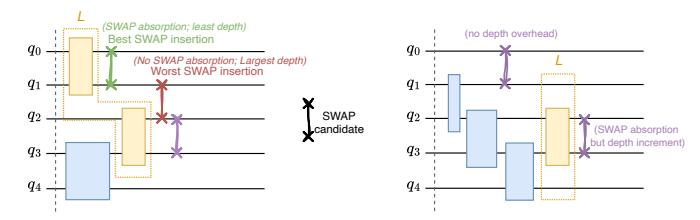

# C. Routing in canonical form

Our ISA-aware routing primarily leverages the mechanism that some inserted SWAP gates can "piggyback" a preceding 2Q gate with the same qubit pair acted on and thus result in lower (even negative) routing overhead than what naïve SWAP synthesis cost may imply. Based on the ISA-specific synthesis cost model, CANOPUS utilizes a holistic heuristic cost function that considers various requirements of qubit routing for simultaneous reduction of both gate count and circuit depth overhead in a unified, quantitative approach.

Instead of treating SWAP as an independent, fixed-cost insertion, we evaluate its cost based on how it interacts with the "last mapped layer" L, defined as the set of 2Q gates in the current DAG that have no succeeding interactions. When a candidate SWAP acts on the same physical qubit pair as a gate  $U \in L$ , it can be "absorbed" by consolidating them into a single composite unitary  $U' = \text{SWAP} \cdot U$ , dubbed "SWAP mirroring", as detailed in Appendix C. This SWAP insertion cost is then defined as the marginal synthesis cost increment:  $c_g = \text{COST}(\text{SWAP} \cdot U) - \text{COST}(U)$ . The cost component  $c_g$  is typically lower than the naïve cost  $c_{\text{swap}}$  of an independent SWAP gate, and it can even be negative when the composite unitary is cheaper to synthesize than U. For instance, under

(a) ISA-aware SWAP insertion in a local circuit window.

(b) SWAP insertion patterns with different gate count and depth costs.

Fig. 6. Qubit routing with the canonical 2Q gate representation.

CX basis, if the absorption location is an iSWAP-equivalent gate, the composite SWAP · iSWAP ~  $\operatorname{Can}\left(\frac{1}{2},0,0\right)$  requires only one CX gate to synthesize, leading to a negative gate count increment  $(c_g = c_{\text{cx}} - 2\,c_{\text{cx}} = -c_{\text{cx}})$ ; similarly, with  $\sqrt{\text{iSWAP}}$  basis, the resulting  $c_q$  is zero.

As illustrated in Fig. 6(a), CANOPUS evaluates SWAP insertions by regarding all 2Q gates/blocks as canonical gates and quantifying their synthesis costs based on the target ISA. Without loss of generality, this example considers only the overhead of SWAP insertion, omitting topological distance and circuit depth heuristics. According to the synthesis cost reference table in Fig. 6(a), an independent SWAP gate normally costs three 2Q gates under both the CX and √iSWAP gate set. However, in the first SWAP search step, absorbing a SWAP candidate into a preceding Can(0.5, 0, 0) gate (left selection) forms the mirror gate Can(0.5, 0.5, 0), merely yielding a marginal synthesis cost increment of  $c_g = 1 \times c_{\mathrm{cx}}$  or  $c_g = 0 \times c_{\sqrt{\text{iswap}}}$ . In the second step, both selections offer absorbable SWAP candidates with identical  $c_g$  costs under the CX basis. Yet, targeting the  $\sqrt{iSWAP}$  basis prioritizes the left selection ( $c_g = 0 \times c_{\sqrt{\text{iswap}}}$  vs.  $1 \times c_{\sqrt{\text{iswap}}}$ ). This example demonstrates how ISA-aware cost evaluation steers routing to effectively exploit the specific synthesis capabilities of the underlying hardware.

To optimize circuit execution time, we also evaluate the "circuit depth" cost increment ( $\Delta_{\rm depth}$ ) by tracking the accumulated duration on each physical qubit wire via a data structure D. As Fig. 6(b) illustrates, different SWAP insertion choices yield varying trade-offs between gate count and circuit depth, necessitating a comprehensive consideration. Notably,

we quantify circuit depth based on the predefined costs of the underlying basis gates which reflect their physical durations, through tracking the length of the weighted critical path on the mapped DAG. By integrating both gate count and depth costs into a unified heuristic, CANOPUS can make informed decisions that balance these two critical metrics. The detailed heuristic cost function is defined as:

$$H = w_g c_g + w_d \Delta_{\text{depth}} + (\Delta_{\text{Avg}\{\text{dist}[i,i]\}_E} + k_E \Delta_{\text{Avg}\{\text{dist}[i,i]\}_E}) c_{\text{swap}}, \quad (1)$$

where  $w_q$  and  $w_d$  weight the count and depth cost components. The final term adapts SABRE's topological heuristic  $(H_{SABRE} = Avg\{dist[i,j]\}_F + k_E Avg\{dist[i,j]\}_E),$  which relies on the average shortest-path distance between physical qubits mapped to demanded logical interactions in the front layer F and the lookahead extended set E. Instead of using absolute topological distances, CANOPUS computes the "differential" average distance  $(\Delta_{Avg\{dist\}})$  resulting from a candidate SWAP, scaled by the ISA-specific SWAP cost  $(c_{\text{swap}})$ . This securely translates topological distance reduction into a concrete basis-gate cost metric. Because  $c_q$  and  $\Delta_{\text{depth}}$ provide highly accurate, hardware-aware feedback for countdepth co-optimization, the empirical decay factor originally required in SABRE is no longer needed. Ultimately, every term in Equation (1) represents a marginal cost increment, allowing the heuristic to holistically minimize routing overhead.

