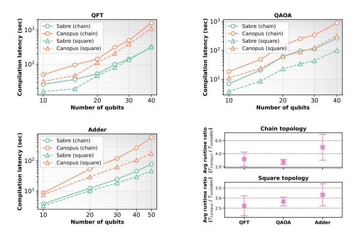

# CX/CZ and iSWAP gates are included.

The real-machine experiment in Section V-A showcases how our method can help achieve superior compilation results and thus higher program fidelities for QFT kernels using the CX and ZZPhase ISAs via IBM Quantum Cloud. However, there are current practical hurdles to extending this realmachine validation to alternative ISAs—ones that arise primarily from the continued scarcity of quantum processors with well-calibrated heterogeneous gate sets. Fortunately, a path forward is emerging with the recently proposed AshN gate scheme [12] and its extended generalization [72] that enable directly implementing any basis gates with the optimal gate durations. It is also experimentally demonstrated on transmon qubits by Chen et al. [13], where multiple basis gates are calibrated with high fidelity, which aligns with our cost model as well. This development may enable comprehensive, realmachine program-ISA-topology co-exploration in the near future.

#### D. Diverse-ISA compilation paradigms

Prior to this work, there are two major compilation paradigms targeting diverse ISAs: (1) Use the conventional compiler that operates entirely on the CX-based circuit representation before ISA rebase. The final-stage rebase pass can usually be completed via optimal synthesis in efficient analytical or numerical computation [29], [49], [55], [66]. (2) Use brute-force approximate synthesis to perform structural search and numerical optimization to determine the synthesized circuit with minimal gate count [19], [37], [54]. SABRE/TOQM

Fig. 12. Compilation latency comparison.

and BOSKIT are representative of these two paradigms, respectively. In our evaluation, BQSKIT even underperforms the industrial-standard SABRE in most cases. As an exception, in terms of the circuit depth, BQSKIT leads to better results than other baselines on sparse topologies (chain, heavy-hex), as its A\*-based search for 2Q gate arrangement could exhibit advantages over long-range qubit routing, but this advantage does not hold for more connected topologies. Besides, the second numerical optimization based paradigm is of exponential computational complexity. For benchmarking the 216 medium-size cases, the Rust-backend BQSKIT requires on average 18 minutes to process each circuit with an Apple M3 Max CPU; in contrast, the Python-implemented SABRE requires only 17 seconds. Consequently, this second paradigm is ill-suited for compiling real-world programs, proving both ineffective and inefficient when targeting diverse ISAs (at least for discrete gate sets). Instead, although there is a gap between the conventional routing model and backend ISA properties, by means of the routing-synthesis co-optimization mechanism of CANOPUS, the first paradigm is enhanced to bridge the gap between the routing model and backend ISA properties and thus provides a more viable path.

