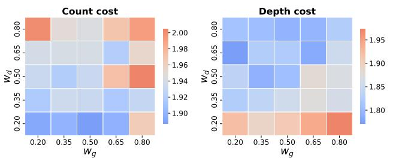
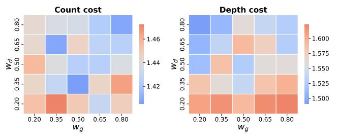

# E. Runtime analysis

In our field tests for the 216 cases above, CANOPUS consistently exhibits  $1\text{--}2\times$  runtime latency of SABRE. To further evaluate runtime scalability, we benchmark CANOPUS against SABRE on three representative quantum algorithms including QFT [62], QAOA (MaxCut on random 3-regular graphs) [21], and CDKM ripple-carry adder [18], across 1D chain and 2D square topologies, with qubit counts ranging from 10 to 40 or 50. As shown in Fig. 12, both methods exhibit polynomial scaling (linear trends on log-log axes), confirming that CANOPUS preserves the asymptotic complexity of the underlying SABRE routing procedure. The near-constant-factor overhead arises from (1) evaluating the heuristic cost for each SWAP candidate, including computing the cost component  $c_g$  and depth overhead  $\Delta_{\rm depth}$  and (2) updating the state tracking variables (L, D, and C in Algorithm 1 and Algorithm 2)

after inserting the best SWAP or mapping an executable gate. All these operations do not involve matrix-level numerical computations and full data structure rebuilds, thus CANOPUS does not change the asymptotic scaling. Across all sizes of benchmarks, the average runtime ratio  $T_{\rm CANOPUS}/T_{\rm SABRE}$  remains within 2–5× (Fig. 12), with lower ratios observed on the square topology (2.3–3.4×), where higher connectivity requires fewer SWAP candidate evaluations, and moderately higher on the sparser chain (2.6–4.8×). Overall, despite its sophisticated data structures and computation mechanisms, CANOPUS achieves practical compilation scalability comparable to the industry-standard SABRE algorithm.

#### F. Ablation study

To isolate the contribution of the canonical commutativity optimization (Section IV-D), we run CANOPUS with and without it across all 216 test cases. A prerequisite for this optimization is the availability of commutative 2Q gate pairs in the circuit DAG. As shown in Fig. 13, canonical-basis circuits exhibit significantly higher commutative pair ratio (always near 100%) among all successive 2Q gates, meaning that almost all consecutive 2Q canonical gates in these real-world applications are commutative, whose commutation patterns are partly illustrated by Fig. 7(b). This substantially larger pool of reorderable gates translates into concrete routing improvements. Table V reports the gate count and circuit depth reductions achieved by enabling commutativity optimization. Across all ISA-topology combinations in our field tests, enabling commutativity yields an average gate count reduction of 2–11% and depth reduction of 2–10%, with peak improvements reaching 37-48% on individual benchmarks. The gains are most pronounced on the chain topology under CX ISA, where the limited connectivity forces more SWAP insertions and thus creates more opportunities for commutation-based reordering to find lower-cost SWAP insertions.

Specifically, circuits with dense, non-local interaction patterns benefit most: knn and swap\_test on chain achieve 31-37% count reduction, as their high density of overlapping two-qubit gates provides abundant commutation opportunities for the router to exploit. Arithmetic circuits such as bigadder and multiplier also see consistent improvements across topologies, since their structured but nontrivial qubit interaction graphs produce many reorderable gate pairs. In contrast, circuits with inherently local connectivity (e.g., ising, wstate) show negligible change, as their routing overhead is already minimal and leaves little room for commutation-based improvement. On denser topologies such as heavy-hex and square, the absolute reductions are smaller but remain consistent. Notably, ISAs with mirror-enhanced gate sets such as SQiSW\_ show smaller marginal gains from commutativity, as their richer native gate repertoire already reduces the baseline routing overhead, leaving less room for further optimization through gate reordering.

TABLE V
ROUTING OVERHEAD IMPROVEMENT OF CANOPUS VS. ROUTING WITHOUT COMMUTATIVE OPTIMIZATION (No\_comm).

| $C_{\text{count}}$ improv.  | Chain                              |                                       | HHex                               |                                      | Square                            |                                     |  |
|-----------------------------|------------------------------------|---------------------------------------|------------------------------------|--------------------------------------|-----------------------------------|-------------------------------------|--|
| vs. no_comm                 | Avg.                               | Мах.                                  | Avg.                               | Max.                                 | Avg.                              | Max.                                |  |
| CX                          | -10.56%                            | -37.57%                               | -0.77%                             | -12.35%                              | -4.1%                             | -20.59%                             |  |
| ZZPhase                     | -4.31%                             | -34.81%                               | -8.44%                             | -35.29%                              | -2.51%                            | -15.62%                             |  |
| SQiSW                       | -5.81%                             | -30.97%                               | -6.13%                             | -42.86%                              | -4.82%                            | -20.0%                              |  |
| ZZPhase_                    | 0.04%                              | -5.38%                                | -5.44%                             | -26.58%                              | -2.56%                            | -8.0%                               |  |
| SQiSW_                      | -2.88%                             | -12.12%                               | -5.9%                              | -27.14%                              | -2.86%                            | -11.86%                             |  |
| Het                         | -3.59%                             | -26.67%                               | -8.74%                             | -47.92%                              | -3.59%                            | -18.52%                             |  |
|                             |                                    | Chain                                 |                                    | HHex                                 |                                   | Square                              |  |
| $C_{\text{depth}}$ improv.  | Ch                                 | ain                                   | HE                                 | łex                                  | Squ                               | uare                                |  |
| $C_{\rm depth}$ improv.     | Avg.                               | ain Max.                           | Avg.                               | Hex Max.                          | Sqı Avg.                       | mare Max.                           |  |
|                             |                                    |                                       |                                    |                                      |                                   |                                     |  |
| vs. no_comm                 | Avg.                               | Мах.                                  | Avg.                               | Max.                                 | Avg.                              | Мах.                                |  |
| vs. no_comm                 | Avg9.15%                           | <i>Max.</i> -38.57%                   | Avg1.99%                           | Max20.0%                             | Avg.                              | Max10.13%                           |  |
| Vs. no_comm CX ZZPhase      | Avg. -9.15% -4.76%           | Max. -38.57% -40.44%            | Avg. -1.99% -10.61%          | Max. -20.0% -31.08%            | Avg. -1.88% 0.16%           | Max. -10.13% -12.89%          |  |
| vs.no_comm CX ZZPhase SQiSW | Avg. -9.15% -4.76% -3.26% | Max. -38.57% -40.44% -31.71% | Avg. -1.99% -10.61% 1.14% | Max. -20.0% -31.08% -29.63% | Avg. -1.88% 0.16% -2.16% | <i>Max.</i> -10.13% -12.89% -13.75% |  |

Fig. 13. Commutative pairs within successive 2Q Gates. X-axis ticks indicate the benchmark name and the total number of successively occurring 2Q gate pairs, i.e., [#CX\_pairs | #Can\_pairs] shown below the circuit name; Y-axis indicates the ratio of commutative pairs among all successive 2Q gates.

(a) Average routing overhead wrt. varying weight on 1D chain.

(b) Average routing overhead wrt. varying weight on 2D square.

Fig. 14. Sensitivity analysis for the weight factors  $w_g$  and  $w_d$  in the heuristic cost function. Routing overhead is geometric-mean average across all 12 benchmarks under CX ISA on (a) 1D chain or (b) 2D square topologies.

#### G. Sensitivity and trade-off analysis

To assess the sensitivity to the weight factors  $w_a$  and  $w_d$ (Equation (1)), we sweep both parameters from 0.2 to 0.8 in steps of 0.15 (totally 25 combinations). For each configuration, we evaluate the average routing overhead across all 12 benchmarks using the CX ISA on both 1D chain and 2D square topologies. To accelerate this extensive evaluation, all data points are generated using a reduced number of bidirectional routing iterations. Fig. 14 demonstrates that the heuristic is robust to the choice of weights: across the central region  $(w_q, w_d \in [0.35, 0.65])$ , the average count overhead varies by less than 3.5% on both topologies (chain: 1.92–1.97; square: 1.41-1.45), and the default setting  $(w_q = w_d = 0.5)$  lies within 2.5% of the global optimum in all four heatmaps. The worst overhead consistently occurs at low  $w_d$  values (bottom rows), where the synthesis-aware depth optimization is effectively disabled and the heuristic degrades toward vanilla gate count driven routing; increasing  $w_d$  progressively improves depth quality, an effect especially pronounced on 2D square. The default  $w_q = w_d = 0.5$  setting therefore provides a wellbalanced operating point that sits close to the Pareto front between gate count and circuit depth.

#### VII. RELATED WORK

Qubit mapping/routing is one of the most well-explored topics of quantum compiler research [78], as it shares similar methodologies with instruction scheduling [15], [27] and register allocation [10], [57] in classical computing.

To perform scalable qubit routing, Zulehner et al. [80] introduces an A\*-based algorithm to minimize SWAP gate overhead for concurrent CX gate layers. The approach partitions the circuit into layers and solves the mapping problem subsequently. Li et al. [43] also utilizes the circuit DAG layering thought and proposes a bidirectional routing procedure SABRE to find better initial mappings thus with lower SWAP insertion count. It also briefly discusses the trade-off between the inserted SWAP count and the circuit depth but does not prioritize optimizing circuit depth. Subsequent works have aimed to improve circuit depth and parallelism, either by using SABRE-like heuristics [4], [40], [79] or graph matching techniques [14]. Zhang et al. [75] systematically investigates the depth-optimality of qubit mapping and proposes an A\*based method TOQM that reported superior performance over existing solver-based depth-driven approaches [63]. However, holistic optimality of qubit routing is contingent on the specific ISA, device topology, and circuit cost model, and is rarely guaranteed by theoretical bounds. Indeed, our evaluation reveals that TOQM does not always produce depth-optimal results compared to our heuristic, CANOPUS. For instance, the case study in Section V-A demonstrates that the mapping scheme for the QFT kernel, purported to be optimal in their analysis, can be further improved. Besides, while several studies have explored merging SWAP gates with preceding operations and reordering commutative gates during routing to enhance performance [38], [44], [50], [64], these approaches remain largely restricted to specific routing models, program patterns, or basis gate sets.

With the recent development of advanced quantum ISAs such as superconducting fractional gates [\[30\]](#page-14-8) and fSim [\[22\]](#page-14-28), [\[39\]](#page-15-37) or XY [\[2\]](#page-13-4) family gates, ion-trapped partial entangling gates [\[32\]](#page-14-9), [\[70\]](#page-15-38), and the AshN gates [\[12\]](#page-14-12), [\[13\]](#page-14-7), [\[72\]](#page-15-28), some works have begun exploring how to efficiently utilize these ISAs to make compiler optimizations closer to hardware characteristics. McKinney et al. [\[50\]](#page-15-8) investigates the practical performance of SQiSW ISA proposed by Huang et al. [\[29\]](#page-14-5) and the synthesis capability when incorporating the basis gates' mirrors into the ISA. Their modified SABRE algorithm offers a preliminary attempt at the collaborative gate decomposition and qubit routing approach, while the optimization opportunities considered therein are limited and the algorithmic techniques are not sophisticated. BQSKIT [\[73\]](#page-15-27) and the series of works behind it [\[19\]](#page-14-13), [\[37\]](#page-14-21), [\[69\]](#page-15-39), [\[74\]](#page-15-20) provide a toolkit to rebase arbitrary 2Q unitaries to specific ISAs through approximate synthesis (structural search and numerical optimization) which is not computationally efficient. Approximate synthesis by BQSKIT does not ensure optimal schemes for two-qubit and multi-qubit circuit synthesis. In addition, due to the lack of native compilation strategies and a rational synthesis cost model, Kalloor et al. [\[34\]](#page-14-10) claims that alternative ISAs are hardly comparable to CX when evaluating quantum hardware roofline by BQSKIT. As for the applicability of expanded ISAs to QEC, Google's latest theoretical [\[48\]](#page-15-40) and experimental [\[20\]](#page-14-29) works demonstrate that the CX-iSWAP combination ISA could help suppress the fault-tolerant threshold. Zhou et al. [\[77\]](#page-15-14) proposes a routing-based method enhanced by CXiSWAP for overcoming ancilla defects among surface code blocks while preserving encoded logical information, but it relies on manual design and experience.

