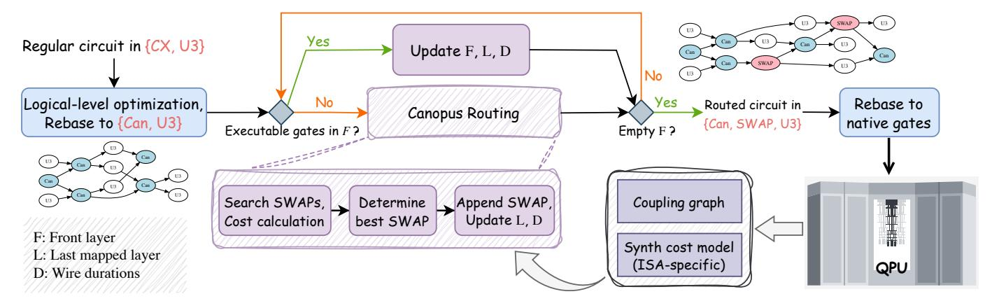

# III. MOTIVATION

*a) Limitations of conventional qubit routing models:* Conventional qubit routing models are ill-equipped to exploit the versatility of modern quantum hardware. First, whether optimizing for gate count or circuit depth, they typically assume that a SWAP costs three CX gates according to the textbook decomposition. This assumption is divorced from hardware reality. For example, a combination of CX and iSWAP is sufficient to realize a SWAP while both CZ (locally equivalent to CX) and iSWAP are natively supported on mainstream superconducting platforms like Google's Sycamore [\[5\]](#page-13-0). Such platforms can even directly implement a high-fidelity SWAP gate, with the pulse duration only 1.5 times that of CZ [\[13\]](#page-14-7). Thus, SWAP is not as costly as assumed in previous qubit routing frameworks. Second, while prior works [\[44\]](#page-15-16), [\[64\]](#page-15-18) do assume the cost of a SWAP is context-dependent, their analysis remains strictly confined to the CX-centric routing model. By relying on this overly simplistic model, conventional routers cannot accurately predict circuit execution costs and remain blind to the substantial optimization opportunities offered by richer, more diverse ISAs.

*b) Co-optimization as the key to unlocking the superiority of advanced ISAs:* In response to the limitations of the CXonly paradigm, a new generation of sophisticated quantum processors has emerged, featuring advanced ISAs with more powerful basis gates. Notable examples include the √ iSWAP gate proposed by Huang et al. [\[29\]](#page-14-5), the continuous ZZ(θ) (equivalent to XX(θ), ZX(θ), MS(0, 0, θ/2)) jointly adopted by major vendors [\[30\]](#page-14-8), [\[32\]](#page-14-9), [\[59\]](#page-15-13), and selected fractional or heterogeneous basis gates [\[50\]](#page-15-8). Despite their theoretical promise for greater synthesis power and noise resilience, these advanced ISAs have largely remained in the proof-of-concept stage, with no systematic framework to harness their full potential in real-world quantum applications.

Prior efforts have been narrowly focused on local 2Q or multi-qubit synthesis tasks [\[29\]](#page-14-5), [\[65\]](#page-15-19) or brute-force numerical optimizations [\[19\]](#page-14-13), [\[74\]](#page-15-20). Such rebase passes are tailored to a specific quantum ISA and fail to deliver clear benefits when applied to advanced ISAs in realistic workloads [\[34\]](#page-14-10). This has led to a critical question lingering in the community: "Are these more expressive, noise-resilient ISAs actually better?" Recently there have been attempts to harness the properties of advanced ISAs, although through manual, adhoc heuristics, such as the √ iSWAP-based routing-synthesis optimization [\[50\]](#page-15-8) and the CX-iSWAP based routing for defect

effect mitigation [\[77\]](#page-15-14). In our work, we highlight that collaborative compiler optimization, especially at the stage following logical-level circuit optimization and followed by the final ISA rebase pass, is a key to fully exploiting the capabilities of those powerful ISAs: First, high-level algorithms are predominantly expressed in the CX representation, which then undergo template-based and peephole optimizations that are highly sophisticated and tailored for CX-based circuit patterns (e.g., commutativity, Clifford equivalence); Second, the disconnect between na¨ıve qubit routing models and backend ISA properties apparently leaves a large untapped co-optimization space. Thus we aim to validate this point through a systematic ISAaware routing framework.

*c) The "Tower of Babel dilemma" for utilizing diverse ISAs:* The proliferation of diverse quantum ISAs—from monolithic to complex, heterogeneous basis gate sets supported by various physical platforms—has created a "Tower of Babel dilemma" in the architecture and systems community. Developing bespoke compiler optimizations for each unique hardware backend is unsustainable, leading to the same software fragmentation that we have encountered in classical computing. Consequently, it is important to seek a unified approach that can effectively handle various platformspecific abstractions resembling the LLVM compiler [\[41\]](#page-15-21). The recently proposed monodromy polytope theory [\[56\]](#page-15-15), for example, provides a method for optimal analysis of ISA synthesis capabilities. Specifically regarding the circuit-level compiler optimization, the monodromy polytope with canonical 2Q gate representations offers a unified approach to evaluating circuit cost and modeling routing-synthesis co-optimization. Building on this, CANOPUS proves to be an elegant and unified solution to the Tower of Babel dilemma at the compiler level.

*d) Coherent cross-ISA, topology, and program pattern co-exploration:* Ultimately, the goal of quantum computing systems is not just to optimize software for existing hardware, but to co-design the entire stack—from algorithms to architecture—to build the most efficient system possible. This requires a holistic exploration of a vast and complex design space, asking critical questions like: Which ISA is best suited for a given class of applications (e.g., quantum error correction vs. quantum simulation)? How does the choice of qubit topology interact with the ISA to affect performance? Answering these questions is currently an ad-hoc, laborintensive process, hindering systematic progress. Therefore, our work aims to provide the missing piece: a unified and automated framework for this co-exploration. By integrating qubit routing with a formal, ISA-aware synthesis cost model, CANOPUS can systematically evaluate the performance of various program patterns across heterogeneous ISAs and diverse hardware topologies. This empowers researchers with informed, data-driven insights to identify optimal co-design points, accelerating the development of robust, fault-tolerant quantum systems.

Fig. 4. Overview of the CANOPUS framework.

Fig. 5. Synthesis coverage for  $\{\sqrt{iSWAP}, ECP\}$  gate set. The trivial points  $(\sqrt{iSWAP})$  and ECP themselves) are not shown in this figure. 2Q overage regions correspond to those that require (a)  $2\sqrt{iSWAP}$  gates or 2 ECP gates; (b)  $1\sqrt{iSWAP} + 1$  ECP; (c) 3 gates ( $3\sqrt{iSWAP}$ , 3 ECP,  $2\sqrt{iSWAP} + 1$  ECP, etc.) from this gate set for synthesis, respectively.

#### IV. CANOPUS FRAMEWORK

#### A. Overview

The overall qubit routing procedure of CANOPUS is illustrated in Fig. 4. Prior to routing, the input circuit is rebased to {Can, U3} gate set. All subsequent processes operate on the directed acyclic graph (DAG) representation of the circuit. During the routing pass, CANOPUS integrates the ISA-specific synthesis cost model into its SWAP search process, dynamically determining the most appropriate SWAP at each route step. The routing cost is efficiently computed via formal analysis of 2Q canonical forms, without explicitly performing any ISA rebase process. Thus, the output is still a circuit DAG represented in {Can, U3} with inserted SWAP gates.

Notably, CANOPUS inherits the basic concepts and data structures introduced in SABRE [43], which is one of the industrial-standard qubit mapping/routing algorithms. Given the input circuit DAG, CANOPUS first attempts to map 2Q gates layer by layer via extracting the front layer F, peeling executable gates and searching SWAP gates to minimize the routing cost according to a unified heuristic cost function. On the backbone of SABRE, we further introduce several key data structures such as the last mapped layer L and the wire duration record D, to support the efficient implementation of ISA-aware routing and reducing both gate count and depth related routing overhead.

