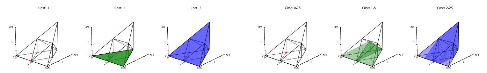
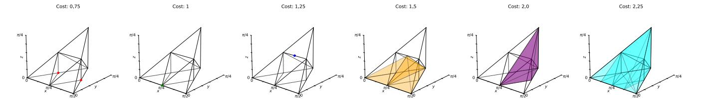
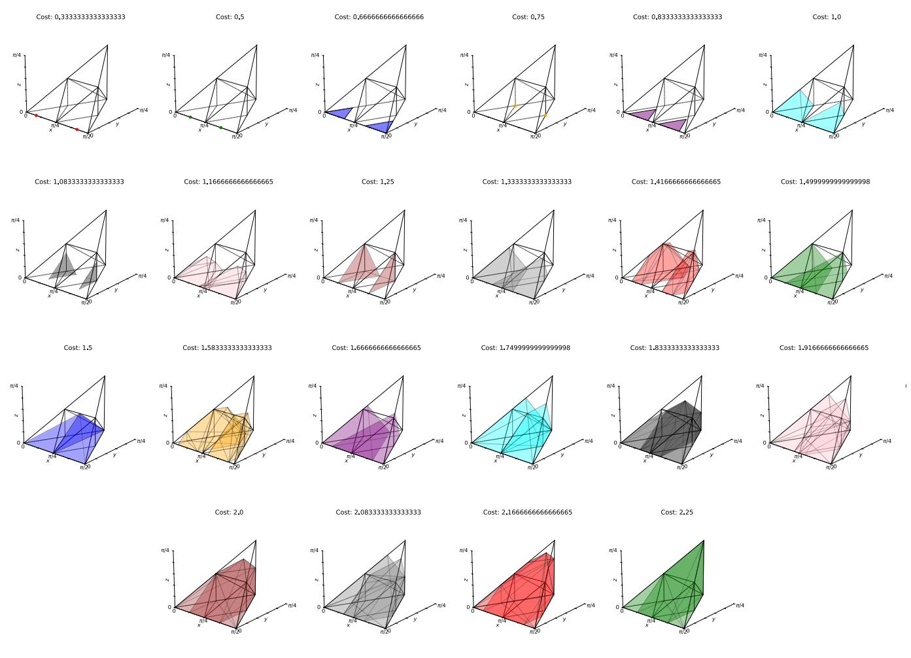
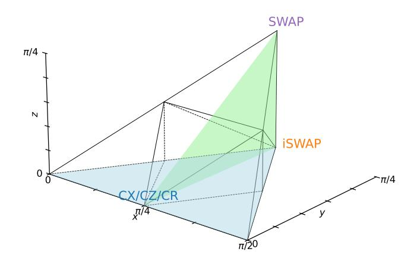

# REFERENCES

- [1] "CANOPUS GitHub repo," [https://github.com/Youngcius/canopus,](https://github.com/Youngcius/canopus) 2025.
- [2] D. M. Abrams, N. Didier, B. R. Johnson, M. P. d. Silva, and C. A. Ryan, "Implementation of xy entangling gates with a single calibrated pulse," *Nature Electronics*, vol. 3, no. 12, pp. 744–750, 2020.
- [3] R. Acharya, D. A. Abanin, L. Aghababaie-Beni, I. Aleiner, T. I. Andersen, M. Ansmann, F. Arute, K. Arya, A. Asfaw, N. Astrakhantsev, J. Atalaya, R. Babbush, D. Bacon, B. Ballard, J. C. Bardin, J. Bausch, A. Bengtsson, A. Bilmes, S. Blackwell, S. Boixo, G. Bortoli, A. Boussass, J. Bovaird, L. Brill, M. Broughton, D. A. Browne, B. Buchea, B. B. Buckley, D. A. Buell, T. Burger, B. Burkett, N. Bushnell, A. Cabrera, J. Campero, H.-S. Chang, Y. Chen, Z. Chen, B. Chiaro, D. Chik, C. Chou, J. Claes, A. Y. Clambaneanu, J. Cong, R. Collins, P. Conner, W. Cournier, A. L. Crook, B. Curtin, S. Das, A. Davies, L. De Lorezzo, D. M. Debry, S. Denver, M. Devoret, A. Di Paolo, P. Donoho, I. Drozdov, A. Dunsworth, C. Eark, T. Elich, A. Eickbusch, A. M. Elbag, M. Elzouka, C. Erickson, L. Faoro, E. Farhi, V. S. Ferreira, L. F. Burgos, E. Forati, A. G. Fowler, B. Foxen, S. Ganjam, G. Garcia, R. Gasca, E. Genois, W. Giang, C. Gidney, D. Gilboa, R. Gokhale, A. G. Daul, D. Grauman, A. Greene, J. A. Gross, S. Habegger, J. Hall, M. C. Hamilton, M. Hansen, M. Harrigan, S. D. Harrington, F. J. Heras, S. Hincks, P. Hoel, O. Higgott, G. Hill, J. Hilton, G. Holland, S. Hong, H.-Y. Huang, A. Huff, W. J. Huggins, L. B. Ioffe, S. V. Isakov, J. J. Iveland, E. Jeffrey, Z. Jiang, C. Jones, S. Jordan, C. John, P. Juhas, D. Kafri, H. Kang, A. H. Karamlou, K. Kechedzhi, J. Kelly, T. Khaire, T. H. Khattar, S. Kim, P. V. Klimov, A. R. Klots, B. Kobrin, P. Kohli, A. N. Korotkov, F. Kostritsa, R. Kothari, B. Kozlovskii, J. M. Kreikebaum, V. D. Kurilovich, N. Lacroix, D. Landhuis, T. Lange-Dei, B. W. Langley, P. Laptev, K.-M. Lau, L. Le Guevel, J. Ledford, J. Lee, K. Lee, Y. D. Lensky, S. Leon, B. J. Lester, W. Y. Li, Y. Li, A. T. Lili, W. Liu, W. P. Livingston, A. Locharla, E. Lucero, D. Lundahl, A. Luni, S. Madhuk, F. D. Malone, A. Maloney, S. Mandra, J. Manyika, L. S. Martin, O. Martin, S. Martin, C. Marfield, J. R. McClean, M. McEwen, S. Meeks, A. Megrant, X. Mi, K. C. Miao, A. Mieszala, R. Mola, S. Molina, S. Montazeri, A. Morvan, R. Moussa, W. Muczkiewicz, O. Naaman, M. Neeley, C. Neil, A. Nersisyan, H. Neven, M. Newman, J. H. Ng, A. Nguyen, M. Nguyen, C.-H. Ni, M. Y. Niu, T. E. O'Brien, W. D. Oliver, A. Opremcak, K. Ottosson, A. Petukhov, A. Pizzito, J. Platt, R. Potter, O. Pritchard, L. P. Pryadko, C. Quintana, G. Ramachandran, M. J. Reagor, J. Redding, D. M. Rados, G. Roberts, E. Rosenberg, E. Rosenfeld, P. Roushan, N. C. Rubin, N. Y. Saei, D. Sank, K. Sankaragomathi, K. J. Satzinger, H. F. Schurkus, C. Schuster, A. W. Senior, M. J. Shearn, A. Shorter, N. Shutty, V. Shvarts, S. Singh, V. Sivak, J. Skruzny, S. Small, V. Smelyanskiy, W. C. Smith, R. Somma, S. Springer, G. Sterling, D. Strain, J. Suchard, A. Szasz, A. Sztein, D. Thor, A. Torres, M. M. Torubaldi, A. Vishnav, J. Vargas, S. Vdovichev, G. Vidal, B. Villalonga, C. V. Heidweiller, S. Waltman, S. X. Wang, B. Ware, K. Weber, T. Weidel, T. White, K. Wong, B. W. Woo, C. Xing, Z. J. Yao, P. Yeh, B. Ying, J. Yoo, N. Yost, G. Young, A. Zalcman, Y. Zhang, N. Zhu, and N. Zobrist, "Quantum error correction below the surface code threshold," *Nature*, vol. 638, no. 8052, p. 920, 2024.
- [4] A. Annechini, M. Venere, D. Sciuto, and M. D. Santambrogio, "Ddroute: A novel depth-driven approach to the qubit routing problem," in *2025 62nd ACM/IEEE Design Automation Conference (DAC)*. IEEE, 2025, pp. 1–7.
- [5] F. Arute, K. Arya, R. Babbush, D. Bacon, J. C. Bardin, R. Barends, R. Biswas, S. Boixo, F. G. S. L. Brandao, D. A. Buell, B. Burkett, Y. Chen, Z. Chen, B. Chiaro, R. Collins, W. Courtney, A. Dunsworth, E. Farhi, B. Foxen, A. Fowler, C. Gidney, M. Giustina, R. Graff, K. Guerin, S. Habegger, M. P. Harrigan, M. J. Hartmann, A. Ho, M. Hoffmann, T. Huang, T. S. Humble, S. V. Isakov, E. Jeffrey, Z. Jiang, D. Kafri, K. Kechedzhi, J. Kelly, P. V. Klimov, S. Knysh, A. Korotkov, F. Kostritsa, D. Landhuis, M. Lindmark, E. Lucero, D. Lyakh, S. Mandra,` J. R. McClean, M. McEwen, A. Megrant, X. Mi, K. Michielsen, M. Mohseni, J. Mutus, O. Naaman, M. Neeley, C. Neill, M. Y. Niu, E. Ostby, A. Petukhov, J. C. Platt, C. Quintana, E. G. Rieffel, P. Roushan, N. C. Rubin, D. Sank, K. J. Satzinger, V. Smelyanskiy, K. J. Sung, M. D. Trevithick, A. Vainsencher, B. Villalonga, T. White, Z. J. Yao, P. Yeh,

- A. Zalcman, H. Neven, and J. M. Martinis, "Quantum supremacy using a programmable superconducting processor," *Nature*, vol. 574, no. 7779, pp. 505–510, 2019.
- [6] S. Bravyi, A. W. Cross, J. M. Gambetta, D. Maslov, P. Rall, and T. J. Yoder, "High-threshold and low-overhead fault-tolerant quantum memory," *Nature*, vol. 627, no. 8005, pp. 778–782, 2024.
- [7] N. P. Breuckmann and J. N. Eberhardt, "Quantum low-density paritycheck codes," *PRX Quantum*, vol. 2, no. 4, p. 040101, 2021.
- [8] C. D. Bruzewicz, J. Chiaverini, R. McConnell, and J. M. Sage, "Trappedion quantum computing: Progress and challenges," *Applied Physics Reviews*, vol. 6, no. 2, p. 021314, 2019.
- [9] S. S. Bullock and I. L. Markov, "An arbitrary two-qubit computation in 23 elementary gates or less," in *Proceedings of the 40th Annual Design Automation Conference*. Anaheim, CA, USA: IEEE, 2003, pp. 324– 329.
- [10] G. J. Chaitin, "Register allocation & spilling via graph coloring," *ACM Sigplan Notices*, vol. 17, no. 6, pp. 98–101, 1982.
- [11] C. Chamberland, G. Zhu, T. J. Yoder, J. B. Hertzberg, and A. W. Cross, "Topological and subsystem codes on low-degree graphs with flag qubits," *Physical Review X*, vol. 10, no. 1, p. 011022, 2020.
- [12] J. Chen, D. Ding, W. Gong, C. Huang, and Q. Ye, "One gate scheme to rule them all: Introducing a complex yet reduced instruction set for quantum computing," in *Proceedings of the 29th ACM International Conference on Architectural Support for Programming Languages and Operating Systems, Volume 2*. La Jolla, CA, USA: ACM, 2024, pp. 779–796.
- [13] Z. Chen, W. Liu, Y. Ma, W. Sun, R. Wang, H. Wang, H. Xu, G. Xue, H. Yan, Z. Yang, J. Ding, Y. Gao, F. Li, Y. Zhang, Z. Zhang, Y. Jin, H. Yu, J. Chen, and F. Yan, "Efficient implementation of arbitrary two-qubit gates using unified control," *Nature Physics*, Aug 2025. [Online]. Available: <https://doi.org/10.1038/s41567-025-02990-x>
- [14] A. M. Childs, E. Schoute, and C. M. Unsal, "Circuit transformations for quantum architectures," *arXiv preprint arXiv:1902.09102*, 2019.
- [15] J. M. Codina, J. Sanchez, and A. Gonz ´ alez, "A unified modulo ´ scheduling and register allocation technique for clustered processors," in *Proceedings 2001 International Conference on Parallel Architectures and Compilation Techniques*. IEEE, 2001, pp. 175–184.
- [16] G. E. Crooks, "Gates, states, and circuits," 2020, available at [https://](https://threeplusone.com/pubs/on-gates-v0-5/) [threeplusone.com/pubs/on-gates-v0-5/.](https://threeplusone.com/pubs/on-gates-v0-5/)
- [17] A. W. Cross, L. S. Bishop, S. Sheldon, P. D. Nation, and J. M. Gambetta, "Validating quantum computers using randomized model circuits," *Physical Review A*, vol. 100, no. 3, p. 032328, 2019.
- [18] S. A. Cuccaro, T. G. Draper, S. A. Kutin, and D. P. Moulton, "A new quantum ripple-carry addition circuit," 2004. [Online]. Available: <https://arxiv.org/abs/quant-ph/0410184>
- [19] M. G. Davis, E. Smith, A. Tudor, K. Sen, I. Siddiqi, and C. Iancu, "Heuristics for quantum compiling with a continuous gate set," 2019, arXiv preprint arXiv:1912.02727.
- [20] A. Eickbusch, M. McEwen, V. Sivak, A. Bourassa, J. Atalaya, J. Claes, D. Kafri, C. Gidney, C. W. Warren, J. Gross, A. Opremcak, N. Zobrist, K. C. Miao, G. Roberts, K. J. Satzinger, A. Bengtsson, M. Neeley, W. P. Livingston, A. Greene, R. Acharya, L. A. Beni, G. Aigeldinger, R. Alcaraz, T. I. Andersen, M. Ansmann, F. Arute, K. Arya, A. Asfaw, R. Babbush, B. Ballard, J. C. Bardin, A. Bilmes, J. Bovaird, D. Bowers, L. Brill, M. Broughton, D. A. Browne, B. Buchea, B. B. Buckley, T. Burger, B. Burkett, N. Bushnell, A. Cabrera, J. Campero, H.-S. Chang, B. Chiaro, L.-Y. Chih, A. Y. Cleland, J. Cogan, R. Collins, P. Conner, W. Courtney, A. L. Crook, B. Curtin, S. Das, A. Del Toro Barba, S. Demura, L. De Lorenzo, A. Di Paolo, P. Donohoe, I. K. Drozdov, A. Dunsworth, A. M. Elbag, M. Elzouka, C. Erickson, V. S. Ferreira, L. Flores Burgos, E. Forati, A. G. Fowler, B. Foxen, S. Ganjam, G. Garcia, R. Gasca, E. Genois, W. Giang, D. Gilboa, R. Gosula, ´ A. Grajales Dau, D. Graumann, T. Ha, S. Habegger, M. Hansen, M. P. Harrigan, S. D. Harrington, S. Heslin, P. Heu, O. Higgott, R. Hiltermann, J. Hilton, H.-Y. Huang, A. Huff, W. J. Huggins, E. Jeffrey, Z. Jiang, X. Jin, C. Jones, C. Joshi, P. Juhas, A. Kabel, H. Kang, A. H. Karamlou, K. Kechedzhi, T. Khaire, T. Khattar, M. Khezri, S. Kim, B. Kobrin, A. N. Korotkov, F. Kostritsa, J. M. Kreikebaum, V. D. Kurilovich, D. Landhuis, T. Lange-Dei, B. W. Langley, K.-M. Lau, J. Ledford, K. Lee, B. J. Lester, L. Le Guevel, W. Y. Li, A. T. Lill, A. Locharla, E. Lucero, D. Lundahl, A. Lunt, S. Madhuk, A. Maloney, S. Mandra, L. S. ` Martin, O. Martin, C. Maxfield, J. R. McClean, S. Meeks, A. Megrant, R. Molavi, S. Molina, S. Montazeri, R. Movassagh, M. Newman, A. Nguyen, M. Nguyen, C.-H. Ni, L. Oas, R. Orosco, K. Ottosson,

- A. Pizzuto, R. Potter, O. Pritchard, C. Quintana, G. Ramachandran, M. J. Reagor, D. M. Rhodes, E. Rosenberg, E. Rossi, K. Sankaragomathi, H. F. Schurkus, M. J. Shearn, A. Shorter, N. Shutty, V. Shvarts, S. Small, W. C. Smith, S. Springer, G. Sterling, J. Suchard, A. Szasz, A. Sztein, D. Thor, E. Tomita, A. Torres, M. M. Torunbalci, A. Vaishnav, J. Vargas, S. Vdovichev, G. Vidal, C. Vollgraff Heidweiller, S. Waltman, J. Waltz, S. X. Wang, B. Ware, T. Weidel, T. White, K. Wong, B. W. K. Woo, M. Woodson, C. Xing, Z. J. Yao, P. Yeh, B. Ying, J. Yoo, N. Yosri, G. Young, A. Zalcman, Y. Zhang, N. Zhu, S. Boixo, J. Kelly, V. Smelyanskiy, H. Neven, D. Bacon, Z. Chen, P. V. Klimov, P. Roushan, C. Neill, Y. Chen, and A. Morvan, "Demonstration of dynamic surface codes," *Nature Physics*, pp. 1–8, 2025.
- [21] E. Farhi, J. Goldstone, and S. Gutmann, "A quantum approximate optimization algorithm," *arXiv preprint arXiv:1411.4028*, 2014.
- [22] B. Foxen, C. Neill, A. Dunsworth, P. Roushan, B. Chiaro, A. Megrant, J. Kelly, Z. Chen, K. Satzinger, R. Barends, F. Arute, K. Arya, R. Babbush, D. Bacon, J. Bardin, S. Boixo, D. Buell, B. Burkett, Y. Chen, R. Collins, E. Farhi, A. Fowler, C. Gidney, M. Giustina, R. Graff, M. Harrigan, T. Huang, S. Isakov, E. Jeffrey, Z. Jiang, D. Kafri, K. Kechedzhi, P. Klimov, A. Korotkov, F. Kostritsa, D. Landhuis, E. Lucero, J. McClean, M. McEwen, X. Mi, M. Mohseni, J. Mutus, O. Naaman, M. Neeley, M. Niu, A. Petukhov, C. Quintana, N. Rubin, D. Sank, V. Smelyanskiy, A. Vainsencher, T. White, Z. Yao, P. Yeh, A. Zalcman, H. Neven, and J. M. Martinis, "Demonstrating a continuous set of two-qubit gates for near-term quantum algorithms," *Physical Review Letters*, vol. 125, no. 12, p. 120504, 2020.
- [23] C. Gidney, "Stim: a fast stabilizer circuit simulator," *Quantum*, vol. 5, p. 497, 2021. [Online]. Available: [https://api.semanticscholar.](https://api.semanticscholar.org/CorpusID:232104816) [org/CorpusID:232104816](https://api.semanticscholar.org/CorpusID:232104816)
- [24] M. Goerz and E. McKinney, "weylchamber: Python package for analyzing two-qubit gates in the weyl chamber," [https://pypi.org/project/](https://pypi.org/project/weylchamber/) [weylchamber/,](https://pypi.org/project/weylchamber/) 2024, python package.
- [25] Google Quantum AI, "Cirq api," [https://quantumai.google/reference/](https://quantumai.google/reference/python/cirq/two_qubit_matrix_to_sqrt_iswap_operations) [python/cirq/two](https://quantumai.google/reference/python/cirq/two_qubit_matrix_to_sqrt_iswap_operations) qubit matrix to sqrt iswap operations, 2025.
- [26] A. W. Harrow, A. Hassidim, and S. Lloyd, "Quantum algorithm for linear systems of equations," *Physical review letters*, vol. 103, no. 15, p. 150502, 2009.
- [27] J. L. Hennessy and T. Gross, "Postpass code optimization of pipeline constraints," *ACM Transactions on Programming Languages and Systems (TOPLAS)*, vol. 5, no. 3, pp. 422–448, 1983.
- [28] T. Hillmann, L. Berent, A. O. Quintavalle, J. Eisert, R. Wille, and J. Roffe, "Localized statistics decoding: A parallel decoding algorithm for quantum low-density parity-check codes," *arXiv preprint arXiv:2406.18655*, 2024.
- [29] C. Huang, T. Wang, F. Wu, D. Ding, Q. Ye, L. Kong, F. Zhang, X. Ni, Z. Song, Y. Shi, H.-H. Zhao, C. Deng, and J. Chen, "Quantum instruction set design for performance," *Physical Review Letters*, vol. 130, p. 070601, Feb 2023. [Online]. Available: <https://link.aps.org/doi/10.1103/PhysRevLett.130.070601>
- [30] IBM Quantum, "New fractional gates reduce circuit depth for utilityscale workloads," [https://www.ibm.com/quantum/blog/fractional-gates,](https://www.ibm.com/quantum/blog/fractional-gates) 2024, accessed: Nov. 18, 2024.
- [31] ——, "Qiskit api," [https://quantum.cloud.ibm.com/docs/en/api/qiskit/](https://quantum.cloud.ibm.com/docs/en/api/qiskit/qiskit.synthesis.XXDecomposer) [qiskit.synthesis.XXDecomposer,](https://quantum.cloud.ibm.com/docs/en/api/qiskit/qiskit.synthesis.XXDecomposer) 2025.
- [32] IonQ, "Getting started with ionq's hardware-native gateset," [https://docs.](https://docs.ionq.com/guides/getting-started-with-native-gates) [ionq.com/guides/getting-started-with-native-gates,](https://docs.ionq.com/guides/getting-started-with-native-gates) 2023.
- [33] Y. Jin, X. Gao, M. Guo, H. Chen, F. Hua, C. Zhang, and E. Z. Zhang, "Optimizing quantum fourier transformation (qft) kernels for modern nisq and ft architectures," in *SC24: International Conference for High Performance Computing, Networking, Storage and Analysis*. IEEE, 2024, pp. 1–15.
- [34] J. Kalloor, M. Weiden, E. Younis, J. Kubiatowicz, B. De Jong, and C. Iancu, "Quantum hardware roofline: Evaluating the impact of gate expressivity on quantum processor design," in *2024 IEEE International Conference on Quantum Computing and Engineering (QCE)*, vol. 1. IEEE, 2024, pp. 805–816.
- [35] A. Y. Kitaev, "Quantum measurements and the abelian stabilizer problem," *arXiv preprint quant-ph/9511026*, 1995.
- [36] P. Krantz, M. Kjaergaard, F. Yan, T. P. Orlando, S. Gustavsson, and W. D. Oliver, "A quantum engineer's guide to superconducting qubits," *Applied Physics Reviews*, vol. 6, no. 2, p. 021318, 2019.
- [37] A. Kukliansky, E. Younis, L. Cincio, and C. Iancu, "Qfactor: A domainspecific optimizer for quantum circuit instantiation," in *2023 IEEE International Conference on Quantum Computing and Engineering (QCE)*, vol. 1. IEEE, 2023, pp. 814–824.

- [38] L. Lao and D. E. Browne, "2qan: a quantum compiler for 2-local qubit hamiltonian simulation algorithms," in *Proceedings of the 49th Annual International Symposium on Computer Architecture*, 2022, pp. 430–445.
- [39] L. Lao, P. Murali, M. Martonosi, and D. Browne, "Designing calibration and expressivity-efficient instruction sets for quantum computing," in *Proceedings of the 48th Annual International Symposium on Computer Architecture*, 2021, pp. 363–376.
- [40] L. Lao, H. Van Someren, I. Ashraf, and C. G. Almudever, "Timing and resource-aware mapping of quantum circuits to superconducting processors," *IEEE Transactions on Computer-Aided Design of Integrated Circuits and Systems*, vol. 41, no. 2, pp. 359–371, 2021.
- [41] C. Lattner and V. Adve, "Llvm: A compilation framework for lifelong program analysis & transformation," in *Proceedings of the International Symposium on Code Generation and Optimization (CGO)*. Washington, DC, USA: IEEE Computer Society, 2004, pp. 75–86.
- [42] A. Li, S. Stein, S. Krishnamoorthy, and J. Ang, "Qasmbench: A lowlevel quantum benchmark suite for nisq evaluation and simulation," *ACM Transactions on Quantum Computing*, vol. 4, no. 2, pp. 1–26, 2023.
- [43] G. Li, Y. Ding, and Y. Xie, "Tackling the qubit mapping problem for nisq-era quantum devices," in *Proceedings of the twenty-fourth international conference on architectural support for programming languages and operating systems*, 2019, pp. 1001–1014.
- [44] J. Liu, P. Li, and H. Zhou, "Not all swaps have the same cost: A case for optimization-aware qubit routing," in *2022 IEEE International Symposium on High-Performance Computer Architecture (HPCA)*. IEEE, 2022, pp. 709–725.
- [45] J. Liu, E. Younis, M. Weiden, P. Hovland, J. Kubiatowicz, and C. Iancu, "Tackling the qubit mapping problem with permutation-aware synthesis," in *2023 IEEE International Conference on Quantum Computing and Engineering (QCE)*, vol. 1. IEEE, 2023, pp. 745–756.
- [46] S. Lloyd, "Universal quantum simulators," *Science*, vol. 273, no. 5278, pp. 1073–1078, 1996.
- [47] D. Maslov, "Linear depth stabilizer and quantum fourier transformation circuits with no auxiliary qubits in finite-neighbor quantum architectures," *Physical Review A—Atomic, Molecular, and Optical Physics*, vol. 76, no. 5, p. 052310, 2007.
- [48] M. McEwen, D. Bacon, and C. Gidney, "Relaxing hardware requirements for surface code circuits using time-dynamics," *Quantum*, vol. 7, p. 1172, 2023.
- [49] E. McKinney and L. S. Bishop, "Two-qubit gate synthesis via linear programming for heterogeneous instruction sets," *arXiv preprint arXiv:2505.00543*, 2025.
- [50] E. McKinney, M. Hatridge, and A. K. Jones, "Mirage: Quantum circuit decomposition and routing collaborative design using mirror gates," in *2024 IEEE International Symposium on High-Performance Computer Architecture (HPCA)*. IEEE, 2024, pp. 704–718.
- [51] L. B. Nguyen, Y. Kim, A. Hashim, N. Goss, B. Marinelli, B. Bhandari, D. Das, R. K. Naik, J. M. Kreikebaum, A. N. Jordan, D. I. Santiago, and I. Siddiqi, "Programmable heisenberg interactions between floquet qubits," *Nature Physics*, vol. 20, no. 2, pp. 240–246, 2024.
- [52] M. A. Nielsen and I. L. Chuang, *Quantum computation and quantum information*. Cambridge university press, 2010.
- [53] P. Panteleev and G. Kalachev, "Degenerate quantum ldpc codes with good finite length performance," *Quantum*, vol. 5, p. 585, 2021.
- [54] T. Patel, E. Younis, C. Iancu, W. de Jong, and D. Tiwari, "Quest: systematically approximating quantum circuits for higher output fidelity," in *Proceedings of the 27th ACM International Conference on Architectural Support for Programming Languages and Operating Systems*, 2022, pp. 514–528.
- [55] E. C. Peterson, L. S. Bishop, and A. Javadi-Abhari, "Optimal synthesis into fixed xx interactions," *Quantum*, vol. 6, p. 696, 2022.
- [56] E. C. Peterson, G. E. Crooks, and R. S. Smith, "Fixed-depth two-qubit circuits and the monodromy polytope," *Quantum*, vol. 4, p. 247, 2020.
- [57] M. Poletto and V. Sarkar, "Linear scan register allocation," *ACM Transactions on Programming Languages and Systems (TOPLAS)*, vol. 21, no. 5, pp. 895–913, 1999.
- [58] T. Proctor, K. Rudinger, K. Young, E. Nielsen, and R. Blume-Kohout, "Measuring the capabilities of quantum computers," *Nature Physics*, vol. 18, no. 1, pp. 75–79, 2022.
- [59] Quantinuum, "Native parameterized angle hardware gates," [https://docs.quantinuum.com/systems/trainings/helios/getting](https://docs.quantinuum.com/systems/trainings/helios/getting_started/parameterized_angle_2_qubit_gates.html) started/ [parameterized](https://docs.quantinuum.com/systems/trainings/helios/getting_started/parameterized_angle_2_qubit_gates.html) angle 2 qubit gates.html, 2024.

- [60] N. Quetschlich, L. Burgholzer, and R. Wille, "Mqt bench: Benchmarking software and design automation tools for quantum computing," *Quantum*, vol. 7, p. 1062, 2023.
- [61] C. Rigetti and M. Devoret, "Fully microwave-tunable universal gates in superconducting qubits with linear couplings and fixed transition frequencies," *Physical Review B—Condensed Matter and Materials Physics*, vol. 81, no. 13, p. 134507, 2010.
- [62] P. W. Shor, "Algorithms for quantum computation: discrete logarithms and factoring," in *Proceedings 35th annual symposium on foundations of computer science*. Ieee, 1994, pp. 124–134.
- [63] B. Tan and J. Cong, "Optimal layout synthesis for quantum computing," in *Proceedings of the 39th International Conference on Computer-Aided Design*, 2020, pp. 1–9.
- [64] ——, "Optimal qubit mapping with simultaneous gate absorption," in *2021 IEEE/ACM International Conference On Computer Aided Design (ICCAD)*. IEEE, 2021, pp. 1–8.
- [65] J. Tang, J. Zhang, and X. Sun, "Quantum circuit synthesis with sqisw," *arXiv preprint arXiv:2412.14828*, 2024.
- [66] R. R. Tucci, "An introduction to cartan's kak decomposition for qc programmers," 2005, arXiv preprint quant-ph/0507171.
- [67] K. Wang, Z. Lu, C. Zhang, G. Liu, J. Chen, Y. Wang, Y. Wu, S. Xu, X. Zhu, F. Jin *et al.*, "Demonstration of low-overhead quantum error correction codes," *Nature Physics*, pp. 1–7, 2026.
- [68] K. X. Wei, I. Lauer, E. Pritchett, W. Shanks, D. C. McKay, and A. Javadi-Abhari, "Native two-qubit gates in fixed-coupling, fixed-frequency transmons beyond cross-resonance interaction," *PRX Quantum*, vol. 5, no. 2, p. 020338, 2024.
- [69] X.-C. Wu, M. G. Davis, F. T. Chong, and C. Iancu, "Qgo: Scalable quantum circuit optimization using automated synthesis," *arXiv preprint arXiv:2012.09835*, 2020.
- [70] C. G. Yale, A. D. Burch, M. N. Chow, B. P. Ruzic, D. S. Lobser, B. K. McFarland, M. C. Revelle, and S. M. Clark, "Realization and calibration of continuously parameterized two-qubit gates on a trapped-ion quantum processor," *arXiv preprint arXiv:2504.06259*, 2025.
- [71] C. G. Yale, R. Rines, V. Omole, B. Thotakura, A. D. Burch, M. N. Chow, M. Ivory, D. Lobser, B. K. McFarland, M. C. Revelle, S. M. Clark, and P. Gokhale, "Noise-aware circuit compilations for a continuously parameterized two-qubit gateset," *arXiv preprint arXiv:2411.01094*, 2024.
- [72] Z. Yang, D. Ding, Q. Ye, C. Huang, J. Chen, and Y. Xie, "Reconfigurable quantum instruction set computers for high performance attainable on hardware," in *Proceedings of the 31st ACM International Conference on Architectural Support for Programming Languages and Operating Systems, Volume 2*, 2026, pp. 1523–1546.
- [73] E. Younis, C. C. Iancu, W. Lavrijsen, M. Davis, and E. Smith, "Berkeley Quantum Synthesis Toolkit (BQSKit)," GitHub, 4 2021.
- [74] E. Younis, K. Sen, K. Yelick, and C. Iancu, "Qfast: Conflating search and numerical optimization for scalable quantum circuit synthesis," in *2021 IEEE International Conference on Quantum Computing and Engineering (QCE)*. IEEE, 2021, pp. 232–243.
- [75] C. Zhang, A. B. Hayes, L. Qiu, Y. Jin, Y. Chen, and E. Z. Zhang, "Timeoptimal qubit mapping," in *Proceedings of the 26th ACM International Conference on Architectural Support for Programming Languages and Operating Systems*, 2021, pp. 360–374.
- [76] J. Zhang, J. Vala, S. Sastry, and K. B. Whaley, "Geometric theory of nonlocal two-qubit operations," *Physical Review A*, vol. 67, no. 4, p. 042313, 2003.
- [77] R. Zhou, F. Zhang, L. Kong, and J. Chen, "Halma: a routing-based technique for defect mitigation in quantum error correction," *arXiv preprint arXiv:2412.21000*, 2024.
- [78] C. Zhu, X. Wu, Z. Yang, J. Wang, A. Wu, S. Zheng, and X. Wang, "Quantum compiler design for qubit mapping and routing: A crossarchitectural survey of superconducting, trapped-ion, and neutral atom systems," *arXiv preprint arXiv:2505.16891*, 2025.
- [79] H. Zou, M. Treinish, K. Hartman, A. Ivrii, and J. Lishman, "Lightsabre: A lightweight and enhanced sabre algorithm," *arXiv preprint arXiv:2409.08368*, 2024.
- [80] A. Zulehner, A. Paler, and R. Wille, "An efficient methodology for mapping quantum circuits to the ibm qx architectures," *IEEE Transactions on Computer-Aided Design of Integrated Circuits and Systems*, vol. 38, no. 7, pp. 1226–1236, 2018.
- [81] A. Zulehner and R. Wille, "Compiling su (4) quantum circuits to ibm qx architectures," in *Proceedings of the 24th Asia and South Pacific Design Automation Conference*. Tokyo, Japan: ACM New York, NY, USA, 2019, pp. 185–190.

#### A. Canonical decomposition

 $\mathbf{SU}(N)$  is a real manifold with dimension  $N^2-1$ , within which any element is a *special unitary* matrix with determinant equal to 1. Since the global phase does not affect quantum computation processes, it is sufficient to focus on the mathematical properties of special unitaries in the area of circuit synthesis. A generic 2Q gate, despite having 15 real parameters, can have its nonlocal behavior fully characterized by only 3 real parameters. This method, known as *Canonical decomposition* or *KAK decomposition* from Lie algebra theory, is widely adopted in quantum computing [9], [66], [76], [81]. Specifically, for any  $U \in \mathbf{SU}(4)$ , there exists a unique  $\vec{\eta} = (x, y, z) \in W \subseteq \mathbb{R}^3$ , along with  $V_1, V_2, V_3, V_4 \in \mathbf{SU}(2)$  and a global phase, such that

$$U = g \cdot (V_1 \otimes V_2) e^{-i\vec{\eta} \cdot \vec{\Sigma}} (V_3 \otimes V_4), g \in \{1, i\}$$

$$\tag{4}$$

where  $\vec{\Sigma} \equiv (XX, YY, ZZ)$  [66]. The set

$$W := \left\{ (x, y, z) \in \mathbb{R}^3 \mid \frac{\pi}{4} \ge x \ge y \ge |z|, \ z \ge 0 \text{ if } x = \frac{\pi}{4} \right\}$$
 (5)

is known as the Weyl chamber [76], and  $\vec{\eta} \in W$  is known as the Weyl coordinate of U. We also refer to a gate of the form

$$\mathrm{Can}(a,b,c) := e^{-i\frac{\pi}{2}(a\,XX + b\,YY + c\,ZZ)} = \begin{pmatrix} e^{-i\frac{c\pi}{2}}\cos\frac{(a-b)\pi}{2} & 0 & 0 & -ie^{-i\frac{c\pi}{2}}\sin\frac{(a-b)\pi}{2} \\ 0 & e^{i\frac{c\pi}{2}}\cos\frac{(a+b)\pi}{2} & -ie^{i\frac{c\pi}{2}}\sin\frac{(a+b)\pi}{2} & 0 \\ 0 & -ie^{i\frac{c\pi}{2}}\sin\frac{(a+b)\pi}{2} & e^{i\frac{c\pi}{2}}\cos\frac{(a+b)\pi}{2} & 0 \\ -ie^{-i\frac{c\pi}{2}}\sin\frac{(a-b)\pi}{2} & 0 & 0 & e^{-i\frac{c\pi}{2}}\cos\frac{(a-b)\pi}{2} \end{pmatrix}$$

as a *canonical* gate. Two 2Q gates U and V are considered *locally equivalent* if they differ only by 1Q gates, meaning their canonical coefficients can be transformed into one another via the equivalence rules [16]:

- 1)  $(a,b,c) \sim (b,a,c)$  or  $(a,b,c) \sim (c,b,a)$ , i.e., any permutation of the coefficients;
- 2)  $(a, b, c) \sim (-a, -b, c)$ ;
- 3)  $(a,b,c) \sim (a-1,b,c)$ ;
- 4)  $(1/2, b, c) \sim (1/2, b, -c)$ .

Note that we align the conventional that canonical coefficient (a,b,c) differs from Weyl coordinate (x,y,z) by a  $\frac{\pi}{2}$  factor. Unless otherwise specified, the canonical coefficients of gates in quantum ISAs and circuits are confined to  $\frac{1}{2} \geq a \geq b \geq |c|$ . While for the Weyl chamber visualization by means of weylchamber [24], we assume the Weyl coordinates are confined to  $\left\{\frac{\pi}{4} \geq x \geq y \geq z \geq 0\right\} \cup \left\{\frac{\pi}{4} \geq \frac{\pi}{2} - x \geq y \geq z \geq 0\right\}$ , as illustrated by Fig. 3. Conversion of Weyl coordinates for different conventions is simple according to the equivalence rules above.

#### B. Quantum ISA and the synthesis capability

A quantum ISA typically includes qubit initialization, a universal gate set, and measurement. It serves as an interface between software and hardware by mapping high-level semantics of quantum programs to low-level native quantum operations or pulse

Fig. 15. Coverage set for CX ISA.

Fig. 16. Coverage set for SQiSW ISA.

Fig. 17. Coverage set for SQiSW\_ISA.

Fig. 18. Coverage set for ZZPhase ISA.

sequences on hardware. The universal gate set, especially specified by its 2Q basis gates, is the key component of a quantum ISA that dominates its hardware-implementation accuracy and cost, as well as software-expressivity sufficiency.

CX or CNOT is the most popular basis gate provides by hardware vendors and considered by various quantum compiler optimization methods. The superconducting Cross-Resonance gate [61] and ion-trapped Mølmer-Sørensen gate [8] are both CX-equivalent gates with the same canonical form  $\operatorname{Can}\left(\frac{1}{2},0,0\right)$ . In the superconducting platforms with XY-coupled Hamiltonian like Google's Sycamore [5], iSWAP  $\sim \operatorname{Can}\left(\frac{1}{2},\frac{1}{2},0\right)$  is another representative native 2Q basis gate and could be less sensitive to leakage error than the native CZ gate. Recent experimental advances demonstrate that more basis gates could be implemented natively and calibrated in high precision [13], [68], [70]. Particularly, some basis gates like  $\sqrt{\mathrm{iSWAP}} \sim \operatorname{Can}\left(\frac{1}{4},\frac{1}{4},0\right)$  and fractional  $\mathrm{ZZ}(\theta) \sim \operatorname{Can}\left(a,0,0\right)$  gates offers more promising ISA selections as they exhibit shorter gate duration, higher gate accuracy, and stronger synthesis capability.

The synthesis capability or computational power of basis gates can be geometrically illustrated by monodromy polytopes within the Weyl chamber. The coverage set for CX depicted in Fig. 15 implies that

- 1) One CX gate is required to synthesize 2Q gates  $\sim \operatorname{Can}(\frac{1}{2},0,0)$ , i.e., CX-equivalent gates  $(V_1 \otimes V_2)\operatorname{CX}(V_3 \otimes V_4)$ ;
- 2) Two CX gates are required to synthesize 2Q gates  $\sim \text{Can}(a,b,0)$ , i.e.,  $(V_1 \otimes V_2)\text{CX}(V_3 \otimes V_4)\text{CX}(V_5 \otimes V_6)$ ;
- 3) Three CX gates are required to synthesize 2Q gates  $\sim \text{Can}(a,b,c)$ , i.e.,  $(V_1 \otimes V_2)\text{CX}(V_3 \otimes V_4)\text{CX}(V_5 \otimes V_6)\text{CX}(V_7 \otimes V_8)$ .

We assume the cost of one CX gate is 1.0. Polytopes in different colors denotes the minimal circuit cost (duration) for the coverage set if synthesized by CX and arbitrary 1Q gates. That is, on average, the number of CX gates required to synthesize arbitrary 2Q gates is 3. In contrast, the number for SQiSW ISA is 2.21 [29].

Monodromy polytope theory [56] provides a framework for determining the synthesis coverage set and circuit cost (in 2Q depth) for any set of basis gates with specified costs, while the specific gate decomposition process is left to the synthesizer to complete. For the selected ISAs in Table II with the basis gate costs assumed in Equation (3), Figs. 15 to 20 describes their coverage sets, respectively. With the enrichment of quantum ISA (e.g., combining gate families, involving mirror gates) and heterogeneous basis gate cost settings, the coverage set reveals a richer variety of convex polyhedra. That implies more optimization effects for the ISA-ware routing mechanism in CANOPUS.

#### C. 20 gate mirroring

The mirror symmetry of a 2Q gate U is defined as the composition of the original gate and a SWAP gate [58], i.e., SWAP  $\cdot U$ . For example, CX and iSWAP is a typical pair of mirror gates as shown below.

Fig. 19. Coverage set for ZZPhase\_ ISA.

$$= \begin{array}{c} S^{\dagger} \\ -H \\ S^{\dagger} \end{array}$$
 iswap

In general, the mirroring rule for Canonical coefficients is described as

$$\text{SWAP} \cdot \text{Can}(a,b,c) \sim \left(a + \frac{1}{2}, b + \frac{1}{2}, c + \frac{1}{2}\right) \\ \sim \left(a + \frac{1}{2} - 1, b + \frac{1}{2} - 1, c + \frac{1}{2} - 1\right) \sim \begin{cases} \left(\frac{1}{2} - c, \frac{1}{2} - b, a - \frac{1}{2}\right), & \text{if } c \geq 0 \\ \left(\frac{1}{2} + c, \frac{1}{2} - b, \frac{1}{2} - a\right), & \text{if } c < 0 \end{cases}$$

The mirror pair of CX and iSWAP is a special case implying that a CX-iSWAP combination ISA could result in lower overhead in routing-synthesis collaborative optimization. Yale et al. [71] once considers inserting SWAP gates to get mirrored gates with lower synthesis overhead compared to the original gates, given the all-to-all topology and continuous  $ZZ(\theta)$  gate set on ion-trapped hardware. McKinney et al. [50] discusses that integrating  $\sqrt{iSWAP}$ 's mirror gate, i.e.,  $ECP \sim Can(\frac{1}{4}, \frac{1}{4}, 0)$  gate, into the powerful SQiSW ISA, could further improve the ISA's synthesis capability and end-to-end routing-synthesis co-optimization on limited topologies.

## D. Commutative relation of canonical gates

Herein we present detailed proof for Theorem 1. The *if* direction is trivial, and hence we justify the *only if* direction, relying on the following two lemmas.

**Lemma 1.** Let A, B be two Hermitian matrices with eigenvalues in the range [-2,2). If  $[e^{-i\frac{\pi}{2}A},e^{-i\frac{\pi}{2}B}]=0$  then [A,B]=0.

Fig. 20. Coverage set for Het ISA.

Fig. 21. Mirror symmetry for  $\operatorname{Can}(a,b,0)$  and  $\operatorname{Can}(\frac{1}{2},b',c')$  gate families.

*Proof.* This follows from the fact that compatible observables (commuting operators) can be simultaneously diagonalized. In this case, the respective unitary matrix  $e^{-i\frac{\pi}{2}A}$  commutes with  $e^{-i\frac{\pi}{2}B}$ . Denote by  $A_{\lambda}$  the eigenspace corresponding to the eigenvalue  $\lambda$  of  $e^{-i\frac{\pi}{2}A}$ , i.e.  $e^{-i\frac{\pi}{2}A}=\oplus_{\lambda}\lambda A_{\lambda}$ . Then we have

$$\forall \vec{v} \in A_{\lambda}, \, e^{-i\frac{\pi}{2}B} e^{-i\frac{\pi}{2}A} \vec{v} = e^{-i\frac{\pi}{2}B} \lambda \vec{v} = \lambda e^{-i\frac{\pi}{2}B} \vec{v} = e^{-i\frac{\pi}{2}A} e^{-i\frac{\pi}{2}B} \vec{v}, \tag{6}$$

and thus  $e^{-i\frac{\pi}{2}B}\vec{v}\in A_\lambda$ . Thus  $A_\lambda$  is  $e^{-i\frac{\pi}{2}B}$ -invariant and the restriction  $e^{-i\frac{\pi}{2}B}\big|_{A_\lambda}$  of  $e^{-i\frac{\pi}{2}B}$  to  $A_\lambda$  is still unitary since it preserves inner products. Hence it is diagonalizable and we can find an orthonormal basis  $w_{\lambda_1}, w_{\lambda_2}, \dots, w_{\lambda_k}$  consisting of eigenvectors of  $e^{-i\frac{\pi}{2}B}\big|_{A_\lambda}$ . Note that these are also eigenvectors of  $e^{-i\frac{\pi}{2}A}$  (with eigenvalue  $\lambda$ ). Following the same token as above, for each eigenspace  $E_{\lambda_i}$  of  $e^{-i\frac{\pi}{2}A}$ , we can construct an orthonormal basis  $\beta_i$  for it consisting of eigenvectors of  $e^{-i\frac{\pi}{2}B}$ . Finally since the eigenspaces of different eigenvalues of  $e^{-i\frac{\pi}{2}A}$  are orthogonal to each other,  $\beta = \cup_i \beta_i$  forms an orthonormal basis of the entire Hilbert space  $\mathcal{H}_n$  consisting of the coeigenvectors of both  $e^{-i\frac{\pi}{2}A}$  and  $e^{-i\frac{\pi}{2}B}$ .

Now let U be a unitary matrix with the vectors in  $\beta$  being its columns, then

$$U^{\dagger}e^{-i\frac{\pi}{2}A}U = D_A$$

$$U^{\dagger}e^{-i\frac{\pi}{2}B}U = D_B$$
(7)

In general, an eigenvector of  $e^{-i\frac{\pi}{2}A}$  need *not* be that of A. However, since A has its eigenvalues in the range [-2,2), the map

$$f: [-2,2) \to U(1), a \to e^{-i\frac{\pi}{2}a}$$
 (8)

is injective. Consequently different eigenvalues of A correspond to different eigenvalues of  $e^{-i\frac{\pi}{2}A}$ , and hence the eigenspaces of  $e^{-i\frac{\pi}{2}A}$  and A coincide. Therefore, we have that

$$U^{\dagger}AU = \Sigma_A$$

$$U^{\dagger}BU = \Sigma_B$$
(9)

П

and since  $[\Sigma_A, \Sigma_B] = 0$  as they are diagonal, [A, B] = 0. We obtain the desired result.

**Lemma 2.** Let  $P_1=(a_1X_1X_2+b_1Y_1Y_2+c_1Z_1Z_2)I_3$ ,  $P_2=I_1(a_2X_2X_3+b_2Y_2Y_3+c_2Z_2Z_3)$  with  $|c_1|\leq b_1\leq a_1\leq \frac{1}{2}$ ,  $|c_2|\leq b_2\leq a_2\leq \frac{1}{2}$ . If  $[P_1,P_2]=0$  and  $P_1,P_2\neq 0$ , then  $b_1=b_2=c_1=c_2=0$ .

*Proof.* Consider the product  $P_1P_2$ . We assume for the sake of contradiction that  $b_1 \neq 0$ . Using [X,Y] = 2iZ, [Y,Z] = 2iX, [Z,X] = 2iY, we expand

$$[P_1, P_2] = 2i(a_1b_2X_1Z_2Y_3 - b_1a_2Y_1Z_2X_3 + b_1c_2Y_1X_2Z_3) - 2i(a_1c_2X_1Y_2Z_3 + c_1a_2Z_1Y_2X_3 + c_1b_2Z_1X_2Y_3).$$
(10)

Since the each Pauli string is linearly independent in the  $8 \times 8$  operator basis, e.g. term  $Y_1Z_2X_3$  cannot be canceled out by any other terms, contradictory to the fact that  $[P_1, P_2] = 0$ . Hence, vanishing of  $[P_1, P_2]$  requires

$$a_1b_2 = a_1c_2 = b_1c_2 = b_1a_2 = c_1a_2 = c_1b_2 = 0.$$
 (11)

Since  $P_1, P_2 \neq 0$ , at least  $a_1, a_2$  is nonzero, leading to  $b_1 = b_2 = c_1 = c_2 = 0$ .

Using Lemma 1 and Lemma 2 above, it is straightforward to prove Theorem 1. We see that  $\|P_1\| \leq \|a_1X_1X_2I_3\| + \|b_1Y_1Y_2I_3\| + \|c_1Z_1Z_2I_3\| \leq |a_1| + |b_1| + |c_1| \leq \frac{3}{2}$ , where  $\|\cdot\|$  is the operator norm. Hence, eigenvalues of  $P_1$  are in range of [-2,2). Same as the eigenvalues of  $P_2$ . Now if  $[e^{-i\frac{\pi}{2}P_1},e^{-i\frac{\pi}{2}P_2}]=0$ , then we have that  $[P_1,P_2]=0$  according to Lemma 1, and thus  $b_1=b_2=c_1=c_2=0$  according to Lemma 2, which proves the *only if* direction.