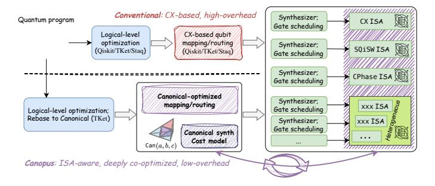

# Unifying Qubit Routing Across Diverse Quantum ISAs via Canonical Representation

Zhaohui Yang\*, Kai Zhang†‡, Xinyang Tian§, Xiangyu Ren¶, Yingjian Liu∥, Yunfeng Li\*\*, Dawei Ding††‡‡, Jianxin Chen⊠†, Yuan Xie\*

\*Department of Electronic and Computer Engineering, The Hong Kong University of Science and Technology, Hong Kong

†Department of Computer Science and Technology, Tsinghua University, Beijing 100084, China

‡Department of Intelligent Computing, Pengcheng Laboratory, Guangdong 518066, China

§Institute for Interdisciplinary Information Sciences, Tsinghua University, Beijing 100084, China

¶Institute for Computer System Architecture, The University of Edinburgh, Edinburgh EH8 9AB, UK

µDepartment of Integrated Circuit, Shenzhen Polytechnic University, Guangdong 518055, China

\*\*Institute-Lorentz for Theoretical Physics, Leiden University, 2300 RA Leiden, The Netherlands

††Center for Mathematics and Interdisciplinary Sciences, Fudan University, Shanghai 200433, China

‡‡Shanghai Institute for Mathematics and Interdisciplinary Sciences, Shanghai 200433, China

Abstract—Qubit mapping/routing is a critical stage in compilation for both near-term and fault-tolerant quantum computers, yet existing scalable methods typically impose several times the routing overhead in terms of circuit depth or duration. This inefficiency stems from a fundamental disconnect: compilers rely on an abstract routing model (e.g., three-CX-unrolled SWAP insertion) that completely ignores the idiosyncrasies of native gates supported by physical devices.

Recent hardware breakthroughs have enabled high-precision implementations of diverse instruction set architectures (ISAs) beyond standard CX-based gates. Advanced ISAs involving gates such as  $\sqrt{iSWAP}$  and  $ZZ(\theta)$  gates offer superior circuit synthesis capabilities and can be realized with higher fidelities. However, systematic compiler optimization strategies tailored to these advanced ISAs are lacking.

To address this, we propose CANOPUS, a unified qubit mapping/routing framework applicable to diverse quantum ISAs. Built upon the canonical representation of two-qubit gates, CANOPUS centers on qubit routing to perform deep cooptimization in an ISA-aware approach. CANOPUS leverages the two-qubit canonical representation and the monodromy polytope theory to model the synthesis cost for more intelligent SWAP insertion during qubit routing. We also formalize the commutation relations between two-qubit gates through the canonical form, providing a generalized approach to commutativity-based optimization. Experiments show that CANOPUS consistently reduces routing overhead by 15%-35% compared to state-of-theart methods across various backend ISAs and device topologies. More broadly, this work establishes a coherent method for coexploration of program patterns, quantum ISAs, and hardware topologies, yielding concrete guidelines for hardware-software co-design. This is the first practical demonstration of how to efficiently utilize advanced quantum ISAs, opening the door to designing more powerful and synergistic quantum systems.

Index Terms—Quantum Computing, Qubit Routing, Compiler, Instruction Set Architecture, Co-Design.

#### I. INTRODUCTION

Quantum computing is a revolutionary computational paradigm leveraging quantum mechanical principles such as superposition and entanglement of qubit states [52]. It has

oxdiv Corresponding author: chenjianxin@tsinghua.edu.cn.

Fig. 1. Compilation workflows by means of conventional approaches (top) and CANOPUS (bottom) targeting diverse quantum ISAs. CANOPUS integrates the synthesis cost model (monodromy polytopes within the Weyl chamber) to consider backend ISA properties during the routing stage, enabling deeply cooptimized, ISA-aware compilation across heterogeneous hardware backends. CANOPUS routing operates in the 2Q canonical representation while the specific synthesis is completed by the backend synthesizer.

grown rapidly in recent decades due to the potential speedup in tasks such as integer factorization [62], solving linear equations [26], and simulation of quantum systems [46].

Holistic benchmarks of quantum computers such as quantum volume [17] are predicated on concurrent advancements in both hardware and software. Recently, numerous systematic techniques regarding compiler optimization and architecture design have been presented to push the limit of hardware performance. Quantum compilers play a pivotal role in this process, translating high-level programs into executable instructions, usually the native single-qubit (10) and two-qubit (2Q) gates on realistic quantum hardware. This typically involves several stages: (1) compiling programs into basic quantum gates, (2) performing hardware-agnostic (logicallevel) circuit optimization, (3) resolving backend topology constraints via qubit placement and routing, and (4) converting circuits to native gates for further optimization and scheduling. The primary goal of compiler optimization is to lower the 20 gate count and circuit depth while resolving backend constraints, with a particular emphasis on 2Q gates due to their significantly higher error rates compared to 1Q gates.

For mainstream quantum platforms such as superconducting qubits [\[36\]](#page-14-2), 2Q gates can only operate between nearestneighbor physical qubit pairs (e.g., Google's devices with 2D square topology [\[5\]](#page-13-0), IBM's devices with 2D heavy-hex topology [\[11\]](#page-14-3)). Consequently, qubit placement and SWAP-based routing are crucial for resolving this connectivity constraint by dynamically remapping logical qubits to physical ones by inserting SWAP gates acting on adjacent physical qubit pairs. This introduces a routing overhead that typically increases the gate count and circuit depth by a factor of 2–5× relative to the pre-mapped circuits when using state-of-the-art (SOTA) scalable routing methods [\[43\]](#page-15-3), [\[45\]](#page-15-4), [\[75\]](#page-15-5), [\[80\]](#page-15-6). Therefore, mitigating this routing overhead remains a central and longstanding challenge in compiler optimization.

Within the scope of NISQ and low-level fault-tolerant compilation especially for static, nearest-neighbor superconducting topologies—as opposed to dynamically reconfigurable systems like neutral atoms—most studies on qubit routing rely on a simplified routing model, where circuit cost is quantified by the CX-based gate count and circuit depth while each SWAP gate is unrolled into three CX gates according to the textbook pattern SWAPq0,q1 = CXq0,q1CXq1,q0CXq0,q1 . However, this CX-centric view is misaligned with the physical reality of modern quantum devices. Although quantum algorithms are typically expressed in terms of CX gates, the underlying hardware may not execute native CX-equivalent gates, nor does this gate cost or circuit cost quantification method accurately reflect the true operational cost. Indeed, beyond the native support for CX-equivalent gates (e.g., CZ [\[36\]](#page-14-2), Cross-Resonance [\[61\]](#page-15-7), Mølmer-Sørensen [\[8\]](#page-14-4)), modern quantum hardware increasingly features diverse native 2Q basis gates in recent years. These alternative basis gates, or the abstracted instruction set architectures (ISAs) in a narrow sense, can be more powerful than CX-equivalent gates in terms of synthesis capabilities (i.e., the efficiency of decomposing arbitrary two-qubit unitaries into hardware-native basis gates) and fidelity of realization, such as √ iSWAP [\[29\]](#page-14-5), the iSWAPfamily and CX-family fractional gates [\[31\]](#page-14-6), [\[50\]](#page-15-8), and heterogeneous basis gates [\[50\]](#page-15-8), [\[55\]](#page-15-9). With such ISAs, SWAP can be implemented with a lower cost than three CX gates or even be natively realized with high fidelity [\[13\]](#page-14-7), [\[51\]](#page-15-10), [\[68\]](#page-15-11). Therefore, the simplified routing model completely ignores the backend ISA properties, severely limiting the potential of compiler optimization. Furthermore, the absence of systematic compiler optimization methods across these diverse (even complex, heterogeneous) ISAs has prevented the community from fully exploiting their power and exploring the rich software-hardware co-design space.

In our work, we propose a unified qubit mapping/routing framework CANOPUS (Canonical-Optimized Placement Utility Suite) tailored to diverse quantum ISAs. Unlike conventional CX-based routing approaches, CANOPUS is fundamentally ISA-aware. As illustrated in Fig. [1,](#page-0-0) it considers the properties of the target ISA by formulating an appropriate cost model to facilitate deep co-optimization of routing and synthesis. By means of the canonical 2Q gate representation [\[76\]](#page-15-12), CANOPUS fully exploits the synthesis capabilities of the given ISA . This approach demonstrates that advanced ISAs can achieve significantly lower routing overhead than conventional models suggest.

The main ideas of CANOPUS are as follows: ① Significant optimization opportunities emerge when native gate synthesis costs are directly incorporated into the qubit routing process. For instance, synthesizing a 2Q block and a subsequent SWAP with the same qubit pair acted on as a single composite operation is often more efficient than synthesizing them individually. ② Expanding the quantum ISA is crucial for boosting the performance of real-world quantum applications. For example, the fractional ZZ(θ) gate set widely adopted by hardware vendors (e.g., IBM [\[30\]](#page-14-8), Quantinuum [\[59\]](#page-15-13), IonQ [\[32\]](#page-14-9)) enables more efficient execution of chemistry simulation kernels within which many 2-local Pauli rotations are involved. The combination of CX and iSWAP gates have been demonstrated to benefit stabilizer circuits to protect error-corrected qubit information [\[77\]](#page-15-14). ③ The monodromy polytope theory [\[56\]](#page-15-15) based on the canonical representation of 2Q gates [\[76\]](#page-15-12) provides a formal, universal, and quantitative description of the 2Q synthesis cost for arbitrary quantum ISAs, establishing a foundation for unified compiler optimization. Guided by these insights, CANOPUS performs intelligent SWAP insertion during qubit routing to holistically minimize post-mapping circuit cost (in terms of both gate count and depth) given any quantum ISA, thus performing deep routing-synthesis co-optimization with significantly lower routing overhead induced. Importantly, while CANOPUS is ISA-aware, it always operates on the canonical-form circuits, and the gate/circuit cost quantification via monodromy polytope is independent of backend's specific ISA rebase implementation. In this sense, CANOPUS offers LLVM-style compiler optimization.

Experimental results demonstrate that CANOPUS consistently provides 15%-35% reduction (in terms of both gate count and depth) of routing overhead compared to other SOTA methods across representative quantum ISAs, *including the conventional* CX *ISA*. This cross-ISA comparison also reveals some consistent or program-specific and topologyspecific guidelines for hardware-software co-design. Source code and data are available on [GitHub](https://github.com/Youngcius/canopus) [\[1\]](#page-13-1). Our work makes the following key contributions:

- ❶ We utilize the canonical 2Q gate representation and the monodromy polytope theory to quantify costs of 2Q gates and the overall circuit. This formal approach accurately guides synthesis-routing co-optimization and cross-ISA evaluation.
- ❷ We formalize the analysis of commutation relations between arbitrary 2Q canonical gates that share one qubit. This offers a generalized commutativity-based optimization mechanism, moving beyond those tailored only for CX gates [\[44\]](#page-15-16).
- ❸ We conduct comprehensive experiments across a wide range of real-world benchmarks, hardware topologies, and representative ISAs, showing that CANOPUS consistently reduces routing overhead by 15%-35% compared to scalable SOTA

Fig. 2. Mapping/routing to resolve topology constraints via SWAP insertion. With the initial mapping  $\{q_i : Q_i\}$  (upper right),  $g_3$  is not hardware compliant. Both SWAP $_{q_0,q_1}$  and SWAP $_{q_1,q_2}$  are sufficient to make  $g_3$  executable.

methods. Our results also yield holistic guidelines for the codesign of quantum programs, ISAs, and hardware.

**4** We confirm that theoretically expressive ISAs exhibit superior performance to the conventional CX ISA, challenging the conclusions of prior works [34]. We demonstrate some codesign guidelines for ISA-program-topology co-exploration.

Our case studies, including the real-machine QFT kernel execution and the end-to-end QEC circuit simulation, unequivocally showcase CANOPUS' superiority in both near-term and fault-tolerant applications. For example, on the task of mapping QFT on 1D chain topology, CANOPUS finds the provably optimal routing scheme, surpassing the results previously reported as optimal in prior work [75]; and experiments on IBM's QPUs demonstrate that, compared to QISKIT, CANOPUS reduces errors by an average of 26.89% and 34.98% for the CZ and  $ZZ(\theta)$  gate sets, respectively.

## II. BACKGROUND

