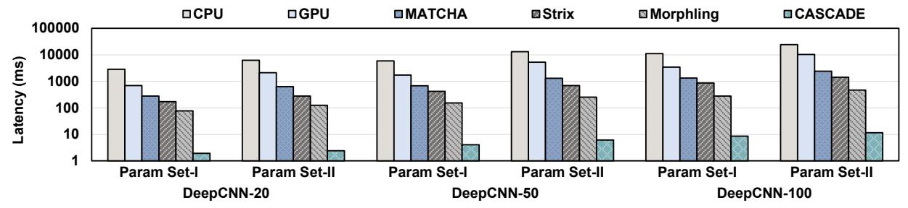
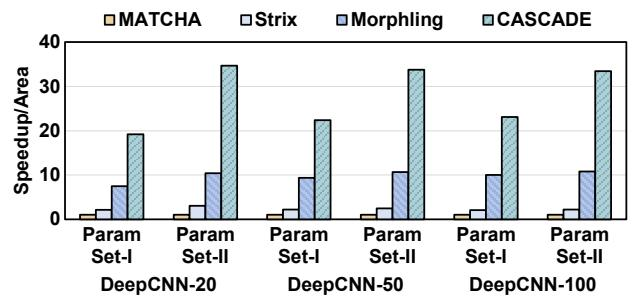

# *A. Experimental setup*

Hardware Implementation. We implemented one CAS-CADE HMUX Chiplet in RTL and synthesized it using Synopsys Design Compiler with the TSMC 28nm library to obtain area and power. The clock frequency is set to 1.2 GHz. For die-to-die (D2D) communication, we model the D2D interconnect using the Universal Chiplet Interconnect Express (UCIe) Advanced specification, with a data transfer rate of 16 GT/s (transfers per second, where a "transfer" refers to one signaling event on a 1-bit physical lane) and a 64-bit data width [27], achieving 1024 Gbps of D2D bandwidth. The UCIe PHY area and power are also estimated according to [27]. The full CASCADE accelerator organizes 12 HCs in a 4 × 3 grid. The hardware configuration of one HC is shown in Table II. The HC includes five function units, a 10.5 MB BSK SRAM, and 1 MB of internal buffers (768 KB for the local buffer, 128 KB for the input buffer, and 128 KB for the output buffer). CASCADE's fine-grained pipeline achieves a low memory footprint and therefore requires only small internal buffers. The total area of a single HC is 92.5

TABLE II HARDWARE CONFIGURATION OF HMUX CHIPLET AND CASCADE.

| Area (mm2 ) | TDP (W)    |
|----------------|------------|
|                | 0.1        |
| 35.5           | 5          |
| 16.2           | 2.2        |
| 8.1            | 2.6        |
|                | <0.1       |
| 22.2           | 11.6       |
| 1.9            | 0.4        |
| 8.1            | 8          |
| 92.5           | 29.91      |
| 60.1           | 13.8       |
| 1170.1         | 372.72     |
|                | 0.4 0.1 |

TABLE III COMPARISON OF CASCADE WITH BASELINES ACROSS DIFFERENT IMPLEMENTATION PLATFORMS.

|                | Platform                 | Param. Set     | Latency (ms)         | Thp (BSP/s)                       |
|----------------|--------------------------|----------------|----------------------|-----------------------------------|
| CPU            | Concrete [28]            | I II III | 15.6 26.2 80.8 | 64 36 15                    |
| GPU            | nuFHE [29] cuFHE [30] | I I         | 36 67             | 2,000 6,000                    |
| FTP [31]       | FPGA                     | I              | 0.7                  | 28,400                            |
| MATCHA [10]    | ASIC                     | I              | 0.2                  | 10,000                            |
| Strix [11]     | ASIC                     | I II III | 0.16 0.23 0.44 | 74,696 39,600 21,104        |
| Morphling [12] | ASIC                     | I II III | 0.11 0.2 0.38  | 147,615 78,692 41,850       |
| CASCADE        | ASIC                     | I II III | 0.01 0.02 0.04 | 2,133,624 1,235,248 416,408 |

mm2 . The first chiplet (HC0) consumes an additional 60.1 mm2 for the integrated Vector Processing Unit (VPU).

Performance Modeling. To evaluate the performance of CASCADE, we developed a cycle-accurate simulator based on the method in [32]. This simulator models the microarchitectural behavior of each function unit within the HCs and D2D communication, to measure execution time in cycles. The simulator integrates the proposed Offline Interleaved-Fusion Scheduler. It tracks data dependencies and communication between BSPs, determines the optimal Interleaved-Fusion mapping for a given workload, and measures the total execution time.

Baselines. We use CPU, GPU, and state-of-the-art (SOTA) TFHE accelerators as baselines. CPU: Intel(R) Xeon(R) Platinum 8275 CPU @ 3.00 GHz. GPU: NVIDIA A100, which has 2.4 TB/s memory bandwidth. SOTA TFHE accelerators include MATCHA [10], Strix [11], and Morphling [12]. These accelerators are equipped with HBM. For a fair comparison, all accelerators are scaled to the same technology node and the same frequency. For instance, MATCHA has an area of

Fig. 12. Performance comparison of CASCADE with baselines on DeepCNN-20, DeepCNN-50, and DeepCNN-100.

Fig. 13. Area-normalized performance (Speedup/Area) comparison with TFHE ASICs. All performance speedups are normalized to MATCHA.

Fig. 14. Power-normalized performance (Speedup/Power) comparison with TFHE ASICs. All performance speedups are normalized to MATCHA.

36.9 mm2 in PTM 16nm, equivalent to 156 mm2 when scaled to TSMC 28nm [33].

**Benchmarks.** We evaluate CASCADE using both microbenchmarks and end-to-end application benchmarks. The encryption parameters used in our evaluation are listed in Table I, which are recommended by [28], [34], [35].

- Micro-benchmark: bootstrapping. We evaluate bootstrapping steady-state throughput (n-iterations).
- Application benchmarks: We assess end-to-end performance on DeepCNNs, privacy-preserving inference (PI) workloads from ZAMA [3]. We evaluate three configurations: DeepCNN-20, DeepCNN-50, and DeepCNN-100, corresponding to networks with 20, 50, and 100 layers, respectively. We also evaluate XG-Classifier [36], Encrypted-AES [6], and VGG-9 for CIFAR-10 image classification [23].

#### B. Evaluation Results

1) **Performance on micro-benchmarks:** Table III presents the latency and steady-state throughput of CASCADE and prior works on micro-benchmarks.

TABLE IV
CASCADE UTILIZATION ON DIVERSE APPLICATIONS.

| Benchmarks    | CPU (s) | GPU (s) | CASCADE (ms) | Utilization |
|---------------|---------|---------|--------------|-------------|
| XG-Classifier | 8.7     | 0.9     | 0.16         | 91.03%      |
| AES           | 54.3    | 5.6     | 3.2          | 91.39%      |
| VGG9          | 146     | 9.4     | 5.9          | 97.18%      |

2) Performance on application benchmarks: Then, we evaluate CASCADE on DeepCNN inference. As shown in Figure 12, CASCADE achieves, on average, 2201.5×, 770.6×, 229.2×, 129.4×, and 48.5× speedup compared with CPU, GPU, MATCHA, Strix, and Morphling, respectively. When normalized by area, as shown in Figure 13, CASCADE achieves 30.5×, 15.6×, and 3.1× higher Speedup/Area than MATCHA, Strix, and Morphling, respectively. Then, we normalize speedup by power (Speedup/Power). As shown in Figure 14, CASCADE delivers 22.3×, 16.4×, and 5.2× higher performance-per-power than MATCHA, Strix, and Morphling, respectively. For the baseline accelerators, the power model includes the HBM stack power.

These results demonstrate the superior performance-per-area of CASCADE. The main reason for the high performance improvement is threefold. First, intra-HC and inter-HC polynomial coefficient-grained pipeline. CASCADE implements intra-HC and inter-HC polynomial coefficient-grained (PCG) pipelines, which achieve overlapped execution and significantly improve throughput. Meanwhile, the proposed BSK-distributed strategy enables pipeline parallelism without being overwhelmed by concurrent BSK accesses, removing the off-chip memory bandwidth bottleneck. Second, Interleaved-Fusion policy. CASCADE uses a novel Interleaved-Fusion policy to alleviate the frequent intermediate ciphertext transfers (ICTs) that cause severe D2D communication traffic. **Third, OIFS.** CASCADE uses OIFS to find the optimal mapping configuration for a given workload, minimizing pipeline empty-slot penalties and improving mapping utilization.

