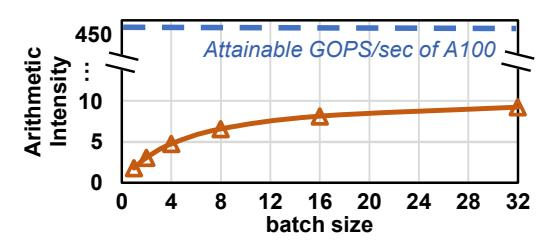

# A. Fully homomorphic encryption over the Torus (TFHE)

Fully homomorphic encryption (**FHE**) is a leading privacy-preserving cryptographic technique that enables direct computation on encrypted data and is resistant even to quantum attacks [15]–[17]. TFHE (FHE over the Torus) is an FHE scheme based on the learning with errors (LWE) problem [18], offering superior *bootstrapping* (BSP) efficiency. BSP can refresh noise accumulated in ciphertexts during computation without decryption [15].

TFHE offers several advantages, especially through its BSP mechanism. **First**, compared with alternative FHE schemes such as CKKS [19], TFHE has lower memory consumption. TFHE requires bootstrapping keys (BSKs) at the 10s–100s MB scale, while CKKS requires GB-scale BSKs. **Second**, with *programmable bootstrapping*, TFHE can efficiently evaluate arbitrary univariate functions [3]. Specifically, TFHE bootstrapping iteratively rotates a look-up table (LUT) across its *n* iterations. By encoding a function in the LUT, BSP evaluates that function homomorphically. This is why it is often called programmable bootstrapping. TFHE was initially limited to Boolean operations; it has been extended to include operations for integers [20]–[22]. ZAMA has deployed various TFHE-based neural networks for private inference (PI) [3], [21], [23].

Encrypted Parameters and Ciphertext Structure. TFHE encryption parameters are shown in Table I, which include parameter sets that achieve the 128-bit security level and are representative of practical, high-security scenarios. TFHE has several ciphertext structures: an LWE ciphertext is a vector of length n. Ring LWE (RLWE) is a (k+1)-vector of degree-N polynomials. General GSW (GGSW) ciphertext is an  $L \times (k+1) \times (k+1)$  polynomial matrix, where each element is a degree-N polynomial.

#### B. TFHE Bootstrapping

1) n-iteration HMUX in bootstrapping: TFHE faces a fundamental performance challenge: the iterative ciphertext

Fig. 1. *n*-iteration HMUX in bootstrapping. Each HMUX accesses a BSK and transfers intermediate ciphertext (ICT). The external product inside HMUX is a matrix-vector multiplication between the BSK and ACC.

TABLE I
TFHE ENCRYPTION PARAMETERS.

| Parameter Set | n   | N    | L | k | Security Level |
|---------------|-----|------|---|---|----------------|
| I             | 500 | 1024 | 2 | 1 | 80-bit         |
| II            | 600 | 1024 | 3 | 1 | 110-bit        |
| III           | 592 | 2048 | 3 | 1 | 128-bit        |
| IV            | 478 | 512  | 3 | 3 | 128-bit        |

manipulations in bootstrapping. Algorithm 1 describes bootstrapping. The core of BSP consists of the n iterations, as shown in Algorithm 1, lines 4–6, which perform **Homomorphic Multiplexer (HMUX)**. Figure 1 illustrates this iterative process. Each  $HMUX_i$  requires a bootstrapping key  $(BSK_i)$  and the intermediate ciphertext produced by the previous  $HMUX_{i-1}$ . As a result, these iterations are strictly sequential, forming a long chain of data dependencies and limiting computational throughput.

- 2) Data Operands and Computational Kernels: This iterative structure is defined by two key data flows:
  - Concurrent BSK Access: Each of the n HMUXs accesses a unique bootstrapping key (BSKi).
  - Intermediate Ciphertext Transfers (ICTs): Each  $HMUX_i$  requires the output of  $HMUX_{i-1}$  (ACC), creating intermediate ciphertext transfers.

The BSK is a GGSW ciphertext, an  $L \times (k+1) \times (k+1)$  polynomial matrix where each element is an N-degree polynomial. The intermediate ciphertext, ACC, is an RLWE ciphertext.

The computation within each  $HMUX_i$  involves two main steps: BSK rotation (Line 5) and external product (EP) (Line 6). The external product dominates the computational cost, performing a matrix-vector multiplication (an  $L \times (k+1) \times (k+1)$  matrix by a (k+1)-vector) where each element is an N-degree polynomial. To optimize polynomial multiplication, FFT/IFFT (Fast Fourier Transform) is used to convert polynomial multiplication into element-wise multiplication, reducing the complexity from  $O(N^2)$  to  $O(N\log_2 N)$ . After the n HMUXs, key switching is performed, which involves scalar multiplication between the LWE ciphertext and key-switching keys. BSKs serve as the parameters of BSP and can be reused across multiple BSP executions under the same encryption parameters. However, a BSK cannot be reused across different  $HMUX_i$  within a BSP.

3) **Performance Bottleneck**: This unique iterative nature makes BSP the dominant bottleneck in TFHE. We measure the execution time of TFHE computation on an Intel(R) Xeon(R) 6148 CPU. As shown in Figure 2 (a), the *n*-iteration HMUXs occupy 79% of the total execution time, making them the most severe performance bottleneck in BSP. Furthermore,

Fig. 2. (a) BSP execution-time breakdown on CPU (running parameter Set III). (b) Memory breakdown in bootstrapping.

Fig. 3. The arithmetic intensity of n-HMUX, which is significantly lower than the balanced machine balance point of the NVIDIA A100 GPU. The A100 GPU has a peak computational performance of 624 TOPS and a memory bandwidth of 1555 GB/s [24]. Its balanced machine balance point is 440 GOPS/s.

measurements of data movement in BSP show that BSK transfers dominate all other data movement, accounting for 80% of total data transfer, as shown in Figure 2 (b).

#### C. Motivational Study

1) Potentials of n-HMUX Pipeline Parallelism: Prior works process these n iterations sequentially, making their performance fundamentally constrained by serial execution dependencies. To quantify this, let  $t_{HMUX}$  denote the execution latency of one HMUX. The nominal throughput is approximately  $Thp_{seq} \approx \frac{1}{n \times t_{HMUX}}$ . In practice, n is large, because a high iteration count is often required to preserve cryptographic security. Thus, the achievable throughput faces a hard ceiling imposed by n, regardless of how well  $t_{HMUX}$  is optimized.

In contrast, pipeline parallelism across n HMUXs offers a transformative alternative. When the n HMUXs are ideally pipelined, the steady-state initiation interval becomes bounded by the latency of a single HMUX, and the ideal throughput becomes  $Thp_{pipe} \approx \frac{1}{t_{HMUX}}$ .

This reveals that pipeline parallelism can yield a theoretical throughput improvement of up to  $n \times$ . Unlocking this potential to achieve massive, large-scale TFHE speedups is the core motivation of this work.

2) Extreme Bandwidth Challenge of Pipeline Parallelism: Unleashing this pipeline parallelism introduces a severe challenge: massive **concurrent BSK access**. Pipeline parallelism across HMUXs requires each of the n HMUXs to access a unique, large-scale BSK and therefore requires concurrent access to n BSKs, creating dramatic memory-bandwidth pressure on hardware. This extreme memory-bandwidth pressure cannot be solved by increasing the batch size alone. Although batching multiple bootstrappings can improve BSK reuse, it does not fundamentally change the extremely low arithmetic intensity or remove the memory-bandwidth bottleneck, as

shown in Figure 3. Therefore, pipeline parallelism in n-HMUX remains severely challenged by concurrent BSK access.

Pipeline parallelism was not merely overlooked by prior studies [10]-[12]; it was actively foregone because prior TFHE accelerators rely on a centralized memory hierarchy that cannot sustain massive concurrent BSK access. For instance, Morphling [12] uses a centralized multi-level memory hierarchy (on-chip buffers and HBM) to improve data reuse. Although Morphling employs batching to increase BSK reuse, it still cannot resolve the significant memory-bandwidth demands caused by concurrent BSK access. Therefore, prior accelerators enforce sequential BSK access to avoid bandwidth collapse. To supply the required bandwidth, centralizedmemory TFHE accelerators would need to add more HBM stacks to support cross-HMUX pipeline parallelism. However, provisioning additional HBM stacks to match this dramatic bandwidth demand is fundamentally impractical, as it incurs prohibitive cost and power consumption. Therefore, a new architectural paradigm is required to unlock high-throughput TFHE acceleration.

