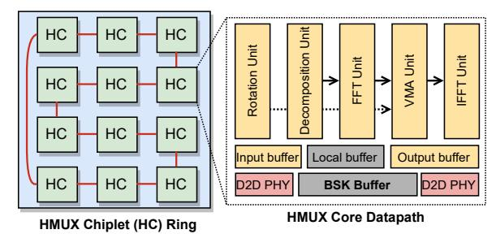
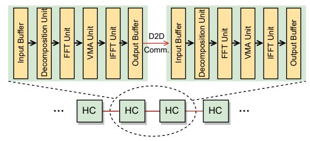
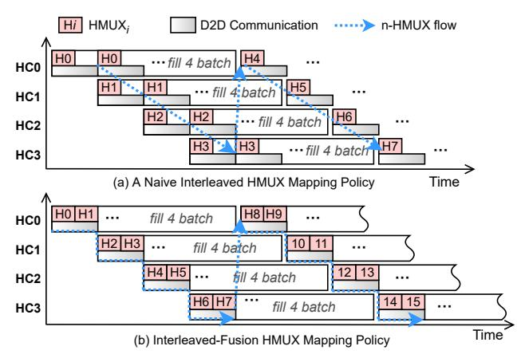
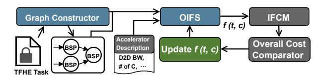

# B. HMUX Chiplet (HC) Organization

As shown in Figure 4 (right), each HC comprises multiple dedicated functional units designed to match the computational

Fig. 4. CASCADE Architecture Overview.

Fig. 5. Illustration of intra- and inter-HC pipeline execution.

flow of HMUX. Each HC includes a Rotation Unit, a Decomposition Unit, an FFT Unit, a Vector-Multiplication-Addition (VMA) Unit, and an IFFT Unit. These units are fully pipelined to process a stream of ciphertexts in a dataflow manner. A full traversal through these pipelined functional units corresponds to one complete HMUX. Each HC also contains input/output buffers, which are double-buffered to hide the D2D latency of receiving the next intermediate ciphertext while the core processes the current one. It also integrates BSK SRAM and a D2D PHY. All HCs are architecturally identical, with one exception: the first chiplet  $(HC_0)$  also integrates a Vector Processing Unit (VPU), which is responsible for key-switching and other pre- and post-processing operations, preventing them from disrupting the high-throughput HMUX pipeline.

#### C. Intra- and Inter-HC Pipeline

To satisfy the unique data dependency of bootstrapping  $(HMUX_i \rightarrow HMUX_{i+1})$ , CASCADE is designed with a fine-grained intra- and inter-HC pipeline. As shown in Figure 5, CASCADE has two levels of pipelining: an Intra-HC Pipeline and an Inter-HC Pipeline, both operating at polynomial coefficient granularity (PCG). The Intra-HC Pipeline streams the intermediate results between internal function units, which is supported by a streaming datapath inside the HC. Instead of waiting for an entire RLWE ciphertext to be processed at one stage, the PCG pipeline model streams the coefficients of a polynomial to the next functional unit as soon as they are computed. This fine-grained execution overlaps the execution, keeps all functional units busy, and achieves a high degree of internal parallelism.

The Inter-HC Pipeline streams the intermediate result (ACC) between HCs. As soon as an upstream HC completes the computation for a polynomial's coefficients, it transmits

Fig. 6. Microarchitecture of the HMUX Chiplet (HC).

the polynomial to its downstream HC without waiting for the entire RLWE result to complete. This fine-grained model effectively minimizes the memory footprint required for buffering. We use D2D PHYs compliant with the UCIe specification, supporting a data transfer rate of 16 GT/s [25].

#### D. Inter-HC BSK-Stationary Dataflow

CASCADE proposes a BSK-stationary, RLWE-flowing dataflow. Bootstrapping keys (BSKs) remain resident in the private SRAM of each HC as stationary data, while intermediate RLWE ciphertexts flow between chiplets via D2D links. All HCs compute in parallel: in every time slot, each HC transfers its output to its downstream HC and simultaneously receives a ciphertext from its upstream HC, ensuring high utilization of all compute resources. Furthermore, the ring topology allows the system to efficiently process HMUX chains where n is much larger than C. The intermediate RLWE ciphertexts simply circulate through the HC ring multiple times until all n iterations are complete.

The rationale for this BSK-stationary design, rather than an RLWE-stationary design, is that the BSK is significantly larger than the RLWE. By keeping the BSKs stationary, our dataflow avoids moving the largest data component across the D2D interface, thereby alleviating the D2D communication bottleneck.

#### E. Intra-HC Microarchitecture

The architecture of the HMUX Chiplet is shown in Figure 6. Each chiplet implements a streaming HMUX datapath composed of several dedicated processing units (PUs) that are deeply pipelined to sustain high throughput on incoming ciphertext streams. The primary PUs are the Rotation Unit, Decomposition Unit, VMA (Vector Multiplication-Add) Unit, and FFT/IFFT Modules.

- 1) Decomposition Unit: The Decomposition Unit performs bitwise decomposition for the coefficients in the polynomial. It decomposes (k+1) polynomials into  $(k+1) \times l$  polynomials. This allows the external product to be implemented as a series of multiplications and accumulations between BSK polynomials and ACC polynomials. The decomposition consists of two steps: bit-slicing each coefficient and then rounding the result.
- 2) VMA (Vector Multiplication-Add) Unit: The VMA Unit computes the external product, which is a vector-matrix multiplication of polynomials between ACC and BSK, as illustrated in Figure 6. The VMA Unit has a vector multiplication unit for element-wise multiplication, because the multiplications between BSK polynomials and ACC polynomials become

coefficient-wise multiplications after FFT, and an accumulator for coefficient-wise addition.

- 3) FFT/IFFT Unit: CASCADE implements the FFT/IFFT Unit to optimize polynomial multiplication in TFHE. FFT reduces the complexity of polynomial multiplication from  $O(N^2)$  to  $O(N \log_2 N)$ , where N is the degree of the polynomial. After the input polynomials are transformed by FFT, multiplication of two polynomials is performed as element-wise multiplication. The FFT transformation consists of  $\log_2 N$  stages of butterfly computations. Each stage can be executed by multiple parallel butterfly units. The microarchitecture of the butterfly unit is shown in Figure 6. We exploit parallelism and pipelining when computing and mapping FFT: BU butterfly units perform butterfly computations in parallel, processing  $2 \cdot BU$  coefficients of a polynomial. This allows us to execute the  $\log_2 N$  stages in approximately  $\log_2 N \cdot \frac{N}{2 \cdot BU}$  cycles. The FFT controller is responsible for address generation, which maps the data within each stage into the butterfly units using the address assignment method proposed in [26]. Based on the conflict-free index generation and address assignment principles in [26], we implement the FFT controller with an address generator to avoid access conflicts and ensure that the coefficients needed for parallel butterfly operations can be fetched in parallel. Since the Decomposition Unit decomposes polynomials into smaller-valued polynomials, it creates an imbalanced workload between FFT and IFFT: the FFT Unit needs to process more polynomials. To maintain pipeline utilization, the FFT Unit is allocated more resources than the IFFT Unit.
- 4) Rotation Unit: The Rotation Unit is responsible for performing negacyclic rotation and polynomial subtraction. It takes  $ACC_{i-1}$  and the corresponding mask, performs cyclic rotation, and subtracts polynomials.
- 5) Vector Processing Unit: The Vector Processing Unit (VPU) is responsible for executing other lightweight operations, such as key-switching, homomorphic addition, sample extraction, and scalar multiplication on ciphertexts. These operations account for a smaller fraction of the computational burden than blind rotation (n HMUXs). Because these operations are element-wise, the VPU is implemented with parallel multipliers, adders, and local buffers. This VPU is integrated into the first chiplet and works in parallel with the other functional units to avoid interrupting the HMUX pipeline.
- 6) Distributed BSK SRAMs: Each chiplet houses a BSK buffer that stores a partition of the BSK set. The chiplet also embeds a small local buffer that holds temporaries such as ACC, as well as input/output double buffers that enable overlap between computation and D2D transfer. For this purpose, each HC integrates a total of 11.5 MB of SRAM (10.5 MB for the BSK buffer, 768 KB for the local buffer, 128 KB for the input buffer, and 128 KB for the output buffer). The first chiplet  $(HC_0)$  integrates a slightly larger 12 MB SRAM to additionally store key-switching keys for the VPU.

Fig. 7. An example of mapping HMUXs on four HCs.

Fig. 8. An example of an intra-HC pipeline fusing two HMUXs in one HC.

#### IV. INTERLEAVED-FUSION MAPPING POLICY

CASCADE's BSK-distributed strategy decentralizes concurrent BSK accesses across chiplets and eliminates largescale BSK movement. However, this architecture introduces frequent intermediate ciphertext transfers (ICTs) between chiplets, which can lead to substantial D2D communication traffic. Figure 7 (a) shows that naively interleaving each HMUX across HCs to maximize parallelism makes D2D communication the bottleneck, because the D2D communication latency is higher than the HMUX computation time. As a result, the HCs are severely underutilized. This bottleneck cannot be resolved by simply increasing the inter-HC batch size. In the example in Figure 7 (a), the inter-HC batch size is four to keep four pipelined HCs busy. However, inter-HC batching proportionally increases the amount of ICTs that must cross chiplet boundaries and therefore does not reduce the total cross-chiplet communication volume.

We propose an Interleaved-Fusion (IF) mapping policy that fuses contiguous HMUXs into groups and interleaves these groups across different chiplets. The core insight of the IF policy is to execute multiple contiguous HMUXs locally, so that the intermediate ciphertexts between these HMUXs remain within the chiplet, thereby reducing the frequency of ICTs instead of issuing them after every HMUX. Meanwhile, the IF policy interleaves different fused groups to preserve high pipeline parallelism. Figure 7 (b) illustrates that, by fusing two HMUXs, the computation time of a stage ( $T_{Group} = T_{H0} + T_{H1}$ ) becomes close to the D2D communication latency.

When the IF policy fuses multiple HMUXs onto a chiplet, the intermediate result of one HMUX is fed back to the HC input and re-executed through the same functional units. As

illustrated in Figure 8, for RLWE1, the ciphertext traverses the streaming PCG pipeline to complete  $HMUX_1$ , and its output is then fed back to traverse the same functional units to complete  $HMUX_2$ . Because these functional units are organized as a polynomial coefficient-grained streaming pipeline, their executions can overlap in time rather than requiring one functional unit to finish the entire computation before the next functional unit starts; thus, the latency of one HMUX is approximately determined by the longest pipeline stage. To avoid bubbles in the functional units, multiple ciphertexts (e.g., RLWE2) are injected into a HC (intra-HC batching), allowing different ciphertext computations to overlap.

Figure 9 shows the two-step Interleaved-Fusion policy.

- First, the Interleaved-Fusion policy partitions n HMUXs into k contiguous groups  $(G_0 \dots G_k)$ .
- Then, it interleaves these contiguous groups across the C chiplets in a cyclic temporal-spatial order.

For instance, with four chiplets,  $G_0$  is assigned to  $C_0$  (0 mod 4),  $G_1$  to  $C_1$  (1 mod 4), and so on. This Interleaved-Fusion mapping can be represented by a two-dimensional temporal-spatial matrix f(t,c), where t denotes the temporal layer (interleaving stage) and c denotes the chiplet index, as shown in Figure 9. The function f(t,c) represents the HMUXs fused and assigned to the corresponding temporal-spatial slot.

#### V. OFFLINE INTERLEAVED-FUSION SCHEDULER

The Interleaved-Fusion policy combines spatial and temporal dimensions, offering strong potential for balancing D2D communication. However, this flexibility also greatly enlarges the mapping design space. Partitioning the n HMUX iterations into fused groups, represented by the mapping function f(t,c), becomes a nonlinear integer-partitioning problem that directly affects pipeline utilization, workload balance, and overall execution time. As a result, finding an efficient mapping is nontrivial. Two mapping penalties must be considered:

- Empty-slot penalty. When the fusion configuration in f(t,c) is suboptimal, many empty slots (f=0) appear in the mapping matrix. For example, in Figure 10, when n=17 and C=4, partitioning HMUXs into fixed-size groups (two in this example) leaves three empty slots ("NA" in the figure) in the final temporal layer, wasting compute cycles.
- **Bubble penalty.** When the fusion granularity is too coarse, each fused group contains more HMUXs, which increases pipeline bubble overhead ( $T_{bubble}$ ) during pipeline startup and draining. For example, segmented HMUX mapping evenly divides the n HMUXs into C segments, but this coarse-grained mapping increases bubble overhead.

We introduce an Offline Interleaved-Fusion Scheduler (OIFS) to determine the optimal f(t,c) configuration. Unlike fixed fusion, where every group contains the same number of HMUXs, OIFS allows groups to have different sizes. This flexibility is important because the scheduler can tolerate slight workload imbalance if doing so eliminates empty slots and reduces total execution time.

Fig. 9. Illustration of the Interleaved-Fusion Mapping Policy. In this example, the number of HCs is four.

- 1) Problem Formulation: OIFS formalizes the mapping task as a constrained 2D integer-partitioning problem, where n HMUXs are partitioned into groups and assigned to a mapping matrix f(t,c). The scheduler's goal is to search for an optimal f(t,c) that satisfies two conditions:
  - Completeness Constraint: The sum of the number of HMUXs in all fused groups must equal n,  $\sum_{t,c} |f(t,c)| = n$ .
  - Optimization Objective: Minimize the total execution time represented by a cost function Ttotal.

In this formulation, t indexes the interleaving layer  $(t=0,1,\ldots)$ , and c indexes the chiplet  $(c=0,\ldots,C-1)$ . Each f(t,c) represents the fused HMUXs assigned to chiplet c at temporal stage t, and |f(t,c)| denotes the number of HMUXs within that group. If |f(t,c)| = 0, the corresponding pipeline slot is idle; this empty slot contributes no progress but increases latency.

2) Interleaved-Fusion Cost Model (IFCM): To guide OIFS in finding the optimal f(t,c), we develop the Interleaved-Fusion Cost Model. This model accurately estimates the total execution time  $(T_{task})$  for a given B parallel BSPs.

We model the total execution time  $T_{task}$  as the sum of the steady-state pipeline runtime  $(T_{run})$  and the pipeline bubble overhead  $(T_{bubble})$ , as shown in Equation 1.

$$T_{task} = T_{run} + T_{bubble} \tag{1}$$

CASCADE can process multiple independent BSPs in parallel. We define the system batch size (bs) as the total number of RLWE bootstrappings that the C chiplets can sustain, which is C times the intra-HC batch size in one HC. An application layer with B total BSPs will therefore require W waves of execution, where  $W = \lceil B/bs \rceil$ , as shown in Equation 2. The execution time for processing bs RLWE bootstrappings is the duration from when the first RLWE enters the pipeline to when the last RLWE completes, which equals the sum of  $T_{exe}(t,c)$  across the temporal (t) and chiplet (c) dimensions.  $T_{exe}(t,c)$  is the execution time for a single fused group at a given temporal-spatial slot. This time is governed by the fundamental trade-off of our architecture: it is the maximum of the local computation time and the D2D communication latency  $(T_{comm})$  of ICTs. The local computation time is the time for a single HMUX  $(T_{comp})$  multiplied by the fusion size,

|    | c0     | c1     | c2     | сЗ     | <u> </u>      | <b>③</b> | f (t, c) | update |        |        |
|----|--------|--------|--------|--------|---------------|----------|----------|--------|--------|--------|
| t0 | H0,1   | H2,3   | H4,5   | H6,7   |               |          | c0       | c1     | c2     | с3     |
| t1 | H8,9   | H10,11 | H12,13 | H14,15 | $\Rightarrow$ | t0       | H0,1     | H2,3   | H4,5   | H6,7   |
| t3 | H16,17 | NA     | NA     | NA     |               | t1       | H8,9     | H10,11 | H12~14 | H15~17 |

Fig. 10. An example of updating f(t,c) to find the optimal configuration. Left: evenly dividing 17 HMUXs causes three empty slots ("NA").

|f(t,c)|, as shown in Equation 3. This equation accurately captures how fusion, through a larger |f(t,c)|, helps hide the  $T_{comm}$  bottleneck.

$$T_{run} = \left\lceil \frac{B}{bs} \right\rceil \sum_{t} \sum_{c} T_{exe}(t, c) \tag{2}$$

$$T_{exe}(t,c) = max(T_{comp} \times | f(t,c) |, T_{comm})$$
 (3)

3) Optimization Algorithm: To efficiently solve this complex nonlinear integer-programming problem, our core method is dynamic programming (DP). To find the optimal f(t,c), the proposed algorithm first fuses n HMUXs into k groups  $(f_1,f_2,\ldots,f_k)$ , where  $f_j$  is the size (number of HMUXs) of the j-th group, and the total sum  $\sum f_j = n$ . These k groups are placed into the 2D f(t,c) matrix, and our cost model (IFCM) then accurately calculates the total cost. The goal is to find the k and all  $f_j$  ( $f_j$  could be different across groups) that minimize the total cost.

We define the DP state as DP[j][r], which represents the minimum  $T_{run}$  cost to partition the first j HMUX tasks using exactly r fusion groups. The algorithm proceeds in two steps:

- DP pre-computation: The algorithm first fills the DP table to compute the row DP[n][k] for all possible group counts k (from 1 to n). This DP[n][k] state contains the optimal  $T_{run}$  cost for partitioning n HMUXs into exactly k groups, without requiring fixed fusion sizes across groups.
- O(n) search: After DP[n][k] is filled, the algorithm performs a simple linear scan over the possible group counts k. The k that minimizes  $T_{task}$  is the global optimum.

To make this DP algorithm scalable and computationally tractable, we introduce two key pruning strategies. First, we accelerate DP state transitions by enforcing a maximum fusion granularity,  $S_{max}$ . This prunes the search space by preventing the algorithm from exploring impractically large fusion groups that would create massive pipeline bubbles. Second, we prune

Fig. 11. Workflow of OIFS.

the final O(n) search by enforcing a minimum group count, kmin (e.g., kmin = C), which discards inefficient solutions that fail to utilize the available chiplet-level parallelism.

*4) Workflow of OIFS:* Building on the above analysis, OIFS finds the optimal f(t, c) for a given workload. As shown in Figure 11, the OIFS workflow consists of three main stages:

First, OIFS parses the input TFHE workload and builds a BSP-level computation graph. This graph is composed of layers of BSP nodes. Within a layer, BSP nodes can be processed in parallel, while nodes in different layers cannot be executed in parallel. Each BSP node also encapsulates other lightweight, non-BSP operations. OIFS analyzes the total number of parallelizable BSP tasks (B), which is used to estimate the total task execution time.

Next, OIFS uses the cost model (IFCM) and the DP algorithm to find the optimal 2D mapping matrix, f(t, c). The objective of the DP algorithm is to minimize the total task latency (Ttask), not just to optimize D2D communication.

Finally, OIFS compares the optimal cost across all possible k and finds the globally optimal f(t, c) matrix, guiding the CASCADE architecture to map HMUX tasks and place the BSKs, thereby achieving the minimum possible latency.

OIFS serves as the compiler-level scheduler that deploys the TFHE applications to CASCADE by automatically constructing the task graph from the input application and generating an optimized execution schedule.

