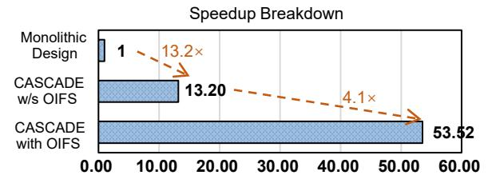

# C. Performance Analysis

1) Utilization Analysis: We evaluate CASCADE on diverse applications and measure its utilization. Table IV lists the results of CASCADE on XG-Classifier [36], Encrypted-AES [6], and VGG-9 [23] under parameter set III. XG-Classifier is a tree-based classification model that performs comparisons at

TABLE V LATENCY BREAKDOWN, HARDWARE UTILIZATION, AND D2D BANDWIDTH UTILIZATION OF CASCADE RUNNING DIFFERENT APPLICATIONS AND ENCRYPTION PARAMETERS WITH THE PROPOSED OIFS, SEGMENTED HMUX MAPPING (SHM), AND FIXED-FUSION MAPPING (FFM).

|                                 |      |            | Latency (ms) |              |        | Average Utilization |                         |                    |
|---------------------------------|------|------------|--------------|--------------|--------|---------------------|-------------------------|--------------------|
|                                 |      | Avg. Comp. | Avg. Comm.   | Pipeline Run | Bubble | Total Execution     | HC Resource Utilization | D2D BW Utilization |
| DeepCNN-50 (Param Set-I)     | OIFS | 1.15       | 0.92         | 3.93         | 0.15   | 4.08                | 95.9%                   | 76.8%              |
|                                 | SHM  | 1.15       | 0.12         | 3.93         | 1.06   | 5.00                | 76.8%                   | 7.7%               |
|                                 | FFM  | 1.15       | 0.96         | 4.20         | 0.13   | 4.33                | 90.7%                   | 75.7%              |
| DeepCNN-50 (Param Set-II)    | OIFS | 1.45       | 1.15         | 6.96         | 0.15   | 7.11                | 96.7%                   | 76.9%              |
|                                 | SHM  | 1.45       | 0.12         | 6.96         | 1.34   | 8.30                | 76.8%                   | 6.1%               |
|                                 | FFM  | 1.45       | 1.21         | 7.15         | 0.13   | 7.28                | 93.6%                   | 78.1%              |
| XG-Classifier (Parameter-IV) | OIFS | 0.04       | 0.04         | 0.11         | 0.01   | 0.12                | 94.7%                   | 77.9%              |
|                                 | SHM  | 0.04       | 0.005        | 0.11         | 0.04   | 0.15                | 72.4%                   | 7.4%               |
|                                 | FFM  | 0.04       | 0.04         | 0.12         | 0.01   | 0.13                | 87.9%                   | 73.9%              |

each decision node. Each comparison function is evaluated by programmable bootstrapping. Encrypted-AES homomorphically evaluates the AES algorithm by using programmable bootstrapping to implement all core operations [6]. In VGG for CIFAR-10 image classification, TFHE is used to compute linear operations and evaluate activation functions through programmable bootstrapping. Table IV shows the pipeline utilization of CASCADE. CASCADE achieves high pipeline utilization across all applications, ranging from 91.03% to 97.18%. CASCADE achieves such high utilization primarily because of its fine-grained pipeline and the proposed OIFS, which ensure high pipeline utilization and efficiency.

- *2) Execution Time Breakdown:* Next, we conduct an execution-time breakdown to understand the performance of CASCADE. Table V presents an execution-time breakdown. We use DeepCNN-50 and XG-Classifier benchmarks as case studies. The total execution time is divided into Pipeline Run Time (the time during which the pipeline actively processes data) and Pipeline Bubble Time (the time spent filling and draining the pipeline). Table V shows that CASCADE has:
- High Pipeline Efficiency: In CASCADE, Pipeline Run Time dominates Pipeline Bubble Time. This indicates high pipeline efficiency and utilization, which is a direct benefit of CASCADE's intra-HC and inter-HC polynomial coefficientgrained pipeline and OIFS.
- Balanced Compute vs. Communication: We sample the pipeline run time and measure the compute time and D2D communication time during this sampled execution. The results show that compute time is consistently slightly greater than D2D communication time. This confirms that our OIFS scheduler successfully hides D2D latency and balances computation and communication.
- *3) OIFS Analysis:* To quantify the benefit of OIFS, we compare it against two baseline mapping policies:
- Segmented HMUX Mapping (SHM) policy, which evenly divides the n HMUXs into C segments and executes segmentgrained mapping. In this policy, HMUXs are divided into 12 segments, one segment for each HC.
- Fixed-Fusion Mapping (FFM) policy, a simplified version of IF that uses a fixed fusion size for all groups. This is used to evaluate the effect of variable fusion sizes across groups.

Fig. 15. Speedup breakdown of CASCADE.

Table V shows that OIFS outperforms both. Compared with Segmented Mapping: OIFS reduces Pipeline Bubble Time. The segmented policy's coarse granularity reduces pipeline parallelism, leading to extremely long execution intervals per chiplet and large bubble overheads. Its low D2D bandwidth utilization further confirms its failure to exploit pipeline parallelism. Compared with Fixed-Fusion Mapping: OIFS primarily reduces Pipeline Run Time. The Fixed-Fusion policy, which uses a fixed fusion size, suffers from the Empty-Slot Penalty, forcing the pipeline to run empty cycles. OIFS's flexible, unequal group sizes eliminate these empty slots. The improved hardware utilization confirms that OIFS reduces empty slots compared with fixed-fusion mapping.

*4) Breakdown of Speedup:* We conduct a speedup breakdown on the DeepCNN-50 benchmark to isolate and quantify the individual performance contributions of the multi-chiplet pipelined architecture and its OIFS scheduler.

CASCADE unlocks deep pipeline parallelism, overcoming the sequential execution bottleneck in the monolithic design. To isolate this benefit, we establish a "Monolithic Design" baseline, which is configured with one chiplet and HBM3, without any pipeline or intra-HC batching strategy. This baseline processes ciphertexts sequentially. The "CASCADE w/o OIFS" configuration represents the multi-chiplet architecture with both intra-HC and inter-HC fine-grained pipelines, which process ciphertexts in a streaming manner. However, it uses a naive parallel strategy that interleaves all HMUXs across the HCs. As shown in Figure 15, this architectural design with fine-grained pipelining provides a 13.2× speedup over the Monolithic Design because "CASCADE w/o OIFS" exploits both intra- and inter-HC parallelism, whereas the "Monolithic

Fig. 16. Effects of the number of HCs and internal parallelism on performance-per-area.

Design" executes sequentially and keeps only one functional unit active at a time. Next, we apply the proposed OIFS to CASCADE. The "CASCADE with OIFS" delivers an additional  $4.1\times$  performance improvement by effectively hiding D2D communication latency. This clearly demonstrates that both the multi-chiplet pipelined architecture and the OIFS are essential for achieving the total  $53.5\times$  speedup.

#### D. Architectural Analysis

We analyze two key parameters: the number of HMUX Chiplets (C) and the internal parallelism of each HC (IP).

1) Impact of the Number of HCs: To analyze the effect of the number of HCs, we sweep the number of HCs (C) and perform design space exploration (DSE) to find the optimal performance. The optimization goal is to maximize areanormalized performance, defined as Throughput/Area, under the total system area budget. The total area budget used in this analysis corresponds to the area consumption of CASCADE. To determine this budget, we first constrain the area of a single HC die to 50-150 mm2, which lies within the mature high-yield region of industrial chiplet designs according to [37], [38]. We further restrict the number of chiplets to a practical range of  $C \in [4,32]$ , considering packaging feasibility. Then, we perform design space exploration and select the configuration that achieves the best performance-perarea. This configuration corresponds to the final CASCADE design, whose total area budget is used as the fixed budget in the following analysis. Figure 16 (a) shows the optimal normalized performance achieved for each chiplet count C. We use DeepCNN-50 as the benchmark. The results clearly show that performance is not monotonic with the number of chiplets. Performance-per-area increases until it peaks at C = 12. This trend is dictated by the trade-off between parallelism and fixed area overheads. When C is low (C < 12), adding more chiplets increases chiplet-level parallelism, leading to higher performance. When C is high (C > 12), each additional chiplet must pay a fixed area tax for its D2D PHY and interconnect logic. To stay within the fixed area budget, the area dedicated to computational logic within each chiplet must be reduced. After C=12, the diminishing return on computation, combined with the rising PHY area tax, outweighs the benefit of adding more chiplets, causing normalized performance to decline. This DSE guides our final design choice of C=12.

Fig. 17. Scalability analysis with varying chiplet counts. CASCADE-x denotes a configuration with x HC chiplets.

2) Impact of the Internal Parallelism Degree of HC: We sweep the internal parallelism of each HC (IP) to find the optimal configuration. IP denotes the hardware parallelism of the VMA unit, which fetches BSKs to perform externalproduct operations. Therefore, IP also represents the internal BSK SRAM bandwidth. The optimization goal is to maximize area-normalized performance (Throughput/Area) under a fixed total area budget. Figure 16 (b) plots the normalized performance for each IP configuration. The performance curve rises sharply as IP increases, reaches its peak at IP = 256, and then slowly declines. When IP is low, the HMUX Chiplet is compute-bound. In this region, increasing IP (e.g., from 16 to 32) dramatically shortens the latency, yielding significant performance improvement. However, as IP becomes larger, the marginal benefit of further increasing IP diminishes. After IP = 256, the area-normalized performance declines. Among these plateau regions, IP = 256 provides the best area-normalized performance because its power-of-two parallelism better aligns with the hardware execution granularity, improving effective utilization. Therefore, we select an internal parallelism of IP = 256 to maximize performance-per-area.

#### E. Scalability Analysis

We vary the chiplet count in CASCADE and measure the resulting performance to evaluate its scale-out capability. We increase or decrease the number of HC dies to construct different configurations, denoted as CASCADE-x, where x represents the HC chiplet count, and evaluate these configurations using the DeepCNN-100 workload. As shown in Figure 17, end-to-end execution latency consistently decreases as the number of chiplets increases. This trend demonstrates that CASCADE scales effectively with additional chiplets.

This scalability arises from two architectural properties. First, the **BSK-distributed strategy** ensures that off-chip memory pressure does not increase with the chiplet count. By distributing the BSKs across chiplets and keeping them resident in the local SRAM of each chiplet, CASCADE confines the most intensive BSK accesses within each chiplet and eliminates frequent off-chip memory accesses, thereby preventing memory-bandwidth collapse as the chiplet count increases. Second, the **proposed dataflow and Interleaved-Fusion** (**IF**) **strategy** effectively mitigate inter-chiplet communication overhead as CASCADE scales. CASCADE introduces a BSK-stationary, ciphertext-flowing dataflow, which ensures

Fig. 18. Sensitivity of throughput to total SRAM capacity.

that ICTs occur only between physically adjacent chiplets, thereby avoiding inter-chiplet communication congestion. Furthermore, the Interleaved-Fusion strategy overlaps communication with computation, effectively hiding ICT latency within pipeline execution. Therefore, by jointly optimizing memory access and inter-chiplet communication, CASCADE achieves excellent scale-out capability.

#### F. Sensitivity to SRAM Capacity

To evaluate the sensitivity of CASCADE to BSK SRAM capacity, we vary the total BSK SRAM capacity while **keeping the chiplet count unchanged.** Specifically, we sweep the total distributed BSK SRAM capacity from 28 MB to 160 MB and evaluate performance under high-security parameters. As shown in Figure 18, when the SRAM capacity is insufficient to fully accommodate all BSKs, performance is low. This occurs because CASCADE is forced to fetch data from off-chip memory, leading to noticeable performance degradation. However, once the SRAM capacity exceeds a critical threshold, performance rapidly reaches its peak, and further increasing SRAM capacity yields negligible marginal benefit. The results show that the current 126 MB distributed BSK SRAM configuration is sufficient to fully accommodate 128-bit security-level parameters (112 MB for parameter set III and 90 MB for parameter set IV).

Although CASCADE leverages a large SRAM capacity to maintain BSK residency, the architecture is designed with a distributed memory hierarchy to ensure that SRAM capacity remains flexible and scalable. CASCADE avoids reliance on a monolithic large memory structure. Instead, CASCADE introduces a distributed memory hierarchy, which converts a centralized large-capacity memory into multiple small SRAMs across chiplets, thereby preventing the bandwidth and flexibility limitations inherent to centralized memory. Therefore, CASCADE can flexibly scale total SRAM capacity by integrating additional chiplets, as analyzed in Sec. VI-E, allowing CASCADE to accommodate future increases in BSK size without architectural redesign.

