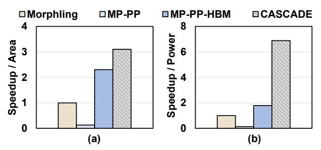

# G. Comparison with Alternative Solutions

To justify the design choices of CASCADE, we compare CASCADE against the state-of-the-art TFHE accelerator Morphling, which relies on a centralized multi-level memory hierarchy. Specifically, Morphling uses both on-chip SRAM and HBM, and employs batching to increase BSK reuse.

Fig. 19. (a) Area-normalized performance (Speedup/Area) and (b) power-normalized performance (Speedup/Power) compared with MP-PP and MP-PP-HBM. All performance speedups are normalized to Morphling. MP-PP: Morphling scaled to the same area as CASCADE with pipeline parallelism enabled. MP-PP-HBM: MP-PP augmented with additional HBM stacks.

However, to prevent bandwidth collapse under this centralized architecture, Morphling strictly enforces sequential execution during bootstrapping.

Comparison with MP-PP: We first establish a baseline denoted as MP-PP (Morphling-Pipeline Parallelism). This configuration scales the Morphling architecture to the same silicon area as CASCADE and equips it with inter-core communication capabilities to support cross-HMUX pipeline parallelism. We evaluate this configuration using the DeepCNN-100 workload under parameter Set II. As shown in Figure 19 (a), the area-normalized performance (Speedup/Area) of MP-PP is lower than that of the original Morphling baseline. This degradation occurs because, despite Morphling's optimized memory hierarchy and batching techniques, its centralized memory hierarchy cannot sustain the massive concurrent BSK accesses required by cross-HMUX pipelining. Consequently, the memory bandwidth quickly saturates, throttling the overall hardware utilization of MP-PP to only 14.3%.

Comparison with MP-PP-HBM: A straightforward alternative to alleviate this bandwidth bottleneck is to provision additional HBM stacks. To evaluate this, we establish the MP-PP-HBM baseline, which scales the number of HBM stacks to fully supply the required pipeline bandwidth. As shown in Figure 19 (b), CASCADE achieves 3.7× higher performanceper-watt (Speedup/Power) than MP-PP-HBM. This efficiency gap arises because scaling HBM bandwidth incurs prohibitive power overhead. A single HBM stack consumes approximately 30 W [39], and MP-PP-HBM requires eight stacks to sustain the pipeline, resulting in a high system-level power burden. While CASCADE introduces its own power overhead through die-to-die (D2D) communication, this overhead is much smaller than the combined power draw of multiple HBM stacks and the HBM PHY. Therefore, simply scaling HBM stacks to meet pipeline bandwidth demand is not a sustainable solution.

In contrast, CASCADE implements a fundamentally different distributed memory hierarchy using the BSK-distributed strategy, which avoids excessive reliance on HBM. By distributing memory across chiplets, CASCADE provides architectural flexibility and allows the system to scale its capacity linearly by adding more chiplets. Ultimately, CASCADE of-

fers a scalable solution for large-scale TFHE acceleration.

