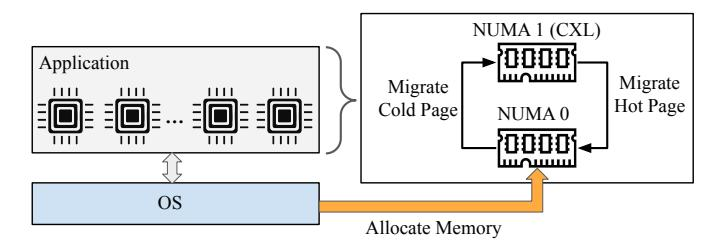

# *B. CXL-Memory Transparency*

*Transparent* CXL memory usage by applications and users is a requirement for hyperscale deployment. The Vistara software stack presents CXL-attached memory in a manner that closely resembles standard system memory, minimizing the need for application-level changes or awareness. This is necessary for seamless adoption across a diverse fleet, where application code-bases and deployment models vary widely.

As shown in Figure 7, the OS plays a critical role in achieving this transparency. By leveraging kernel memory tiering features, such as Transparent Page Placement (TPP) [24], and userland-driven proactive reclaim policy such as *Transparent Memory Offloading* [35] the OS dynamically identifies hot and cold memory pages based on access patterns. Hot pages are preferentially placed in local DRAM, while colder pages are migrated to CXL memory. This migration occurs without application intervention. We tune parameters based on production profiling, such as enabling NUMA demotion (numa\_demotion\_enabled=1), setting NUMA balancing to migrate pages (numa\_balancing=2), and enabling all zone reclaim policies (zone\_reclaim\_mode=7). We leave other settings at their default values.

Fig. 7. CXL memory in our fleet is transparent to the applications and is exposed as a NUMA node. OS allocates pages in the local DRAM (NUMA 0) and dynamically migrates pages across tiers based on access patterns.

Default Memory Policy. The default memory policy prioritizes allocations in local NUMA nodes, spilling over to CXL memory when local resources are exhausted. This fallback policy is in the Linux kernel memory management subsystem.

We deploy two methods of cold-page demotion. In the Linux Kernel, when DRAM pressure increases, the kernel's reclaim mechanism demotes eligible colder pages from DRAM to CXL. Additionally, we employ TMO to *proactively* demote cold pages. Both mechanisms free up DRAM for new or hot allocations. During testing, we discovered, patched, and published fixes for a variety of bugs in the Linux kernel related to fallback allocation and reclaim.

Page migration is guided by real-time access tracking and decoupled allocation/reclamation watermarks, so that sufficient DRAM headroom is always maintained for both new allocations and promotion of hot pages from CXL.

Advanced Memory Policies. The kernel supports advanced memory policies that optimize bandwidth and minimize unnecessary migrations, building on TPP. These policies are available to NUMA-aware applications and can be controlled directly from user-space via sysfs interfaces.

For example, the *cache-pages preferably allocated to remote node* policy steers file cache and tmpfs allocations to CXL memory by default, freeing up local DRAM for hot anonymous pages. This is effective during application warmup phases, when file I/O generates large caches that consume significant memory capacity but are accessed infrequently. By allocating these cold file caches to the remote node from the outset, the system avoids occupying local memory with inactive data and reduces the need for subsequent migrations of anonymous memory. If a cached page on CXL becomes hot, the kernel automatically promotes it back to DRAM.

We evaluated this policy on our caching workload. Specifically, when using this policy, on an experimental system with 20GB local memory and 76GB CXL-attached memory achieves the same throughput as a system with 96GB all-local memory.

Another advanced page placement policy is the *weighted interleave* policy which allocates a weighted (N:M) ratio of memory across NUMA nodes. Bandwidth-bound workloads can use this policy to tune the ratio between DRAM and CXL memory to balance bandwidth and latency. The ratio is dynamically configurable via sysfs to match workload and hardware characteristics. We implemented and upstreamed Linux support for auto-tuning weighted interleave.

