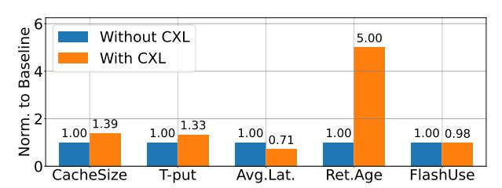

# *B. Caching Workloads*

*1) Workload Description:* Caching services are foundational to the delivery of user-facing content and internal data at hyperscale. They serve billions of requests per second, operating under stringent latency and reliability constraints.

The access patterns are highly skewed, typically following a Zipfian or power-law distribution, and the object catalogs are vast, often comprising billions of unique items. The operational environment is highly dynamic, with frequent shifts in object popularity and sudden traffic surges.

The workload is characterized by a mix of read and write operations, with caching tiers spanning DRAM, flash, and remote storage. These tiers are managed by sophisticated multi-level admission and eviction policies, including MLbased admission and LRU-tail age strategies.

The main metrics are *request rates* reaching tens of millions of QPS per cluster, *hit rates* ranging 80%-99% depending on the cache tier, and strict *latency targets*: sub-millisecond for DRAM and ≈10ms for flash. Finally, *write amplification* is an key metric for maintaining flash device longevity.

TABLE VII
IMPROVEMENTS WITH VISTARA CXL ACROSS SERVICES.

| Service    | Workload            | Primary Resource | Local Memory | CXL Memory | Improvement                                         |
|------------|---------------------|------------------|--------------|------------|-----------------------------------------------------|
| CacheA     | Caching             | Memory           | 730 GB       | 256 GB     | Improved t-put by 25%, retention time 5–10× longer  |
| CacheB     | Caching             | Network BW       | 745 GB       | 253 GB     | Reduced average query processing time by 29%        |
| Spark      | Data Warehouse      | Alloc Mem/CPU    | 700 GB       | 150-200 GB | Increased the number of executors per server by 25% |
| FtStorex   | Data Warehouse      | CPU              | 722 GB       | 252 GB     | Improved throughput by 8.6%                         |
| CI         | DevInfra            | Memory           | 585 GB       | 255 GB     | Increased the number of per-server jobs by 33%      |
| Devmachine | DevInfra            | Memory           | 751 GB       | 255 GB     | Increased the number of per-server VMs by 33%       |
| MRS        | ML Parameter Server | Memory           | 750 GB       | 123 GB     | Reduced number of servers by 25%, 12% higher t-put  |

2) Architectural Implications and CXL Benefits: In our hyperscale infrastructure, caching workloads are predominantly memory-capacity bound, with performance closely tied to the ability to retain hot objects in memory.

**Higher Hit Rates.** The introduction of CXL memory expansion alters this landscape: the expanded memory footprint allows a larger fraction of the working set to be cached inmemory, which in turn drives higher hit rates and reduces tail latency, as more requests are served directly from DRAM rather than slower flash or remote storage.

Longer Flash Endurance. Limited DRAM capacity forces a large fraction of write operations to be absorbed by SSDs, accelerating wear and ultimately reducing device longevity due to write amplification. By absorbing a greater proportion of writes in memory, CXL-enabled systems reduce the write pressure on flash devices. This reduction in write amplification translates to improved flash endurance, allowing SSDs to operate reliably for longer periods and reducing the frequency of costly device replacements and maintenance interventions.

Lower Infrastructure Cost. CXL memory expansion also contributes to overall infrastructure efficiency by reducing the volume of requests that must be served by backend storage systems. Fewer cache misses result in a lower rate of requests propagating to flash and remote storage tiers. This decreases the load on downstream storage systems and leads to tangible cost savings by minimizing the need for overprovisioning and reducing network bandwidth consumption.

Improved Retention Ages. With increased cache capacity, the system can support longer retention ages for cached objects, meaning that items remain in memory for extended periods before eviction. This extended retention reduces the frequency of cache rebalancing operations, which are triggered by shifts in object popularity or traffic surges. By smoothing out the rebalancing events, the system can better handle sudden changes in workload characteristics, such as load bursts, without incurring performance penalties or risking cache thrashing.

*3) Production Results:* Figure 9 summarizes the results for the caching workloads with Vistara CXL.

CacheA is a hybrid cache system that keeps frequently accessed objects in memory and less frequently accessed ones in storage. Objects in memory are actively accessed, as memory acts as the primary cache layer above the flash cache. As a result, cache objects or shared memory accesses can generally be considered uniform and random and also do not contribute significantly to the overall request processing

Fig. 9. Improvements across key metrics (cache size, throughput, average query latency, retention age, and hits in flash) in cache workloads.

times. However, there are smaller regions of the heap that are extremely hot, such as memory used for connections, hashtables or indexes, and in-flight request data. The addition of CXL memory expanded the memory tier from 680GB to 890GB. The architecture ensures the hot heap memory remains in local memory, while the cache is demoted to CXL memory with negligible impact on latency, thanks to kernel-level TPP and TMO. This enabled an increase of 33% in sustainable QPS per server while sustaining longer retention ages for cached objects (which increased from  $\approx 1$  minute to  $\approx 5$ -10 minutes), effectively recovering performance previously lost to endurance bottlenecks.

CacheB similarly benefited from CXL. The cache size increased from 590GB to 820GB. As a result, the average query processing time, on production traffic, got reduced by 29%. Enabling CXL memory shifted 2.3% of cache hits from flash to memory, effectively reducing the flash wear-out.

To enable CXL for CacheB, we performed A/B testing with and without CXL, comparing key metrics to validate that there were no regressions. Our main concern was read-side latency of CacheB, since CXL memory expansion increases such latency. However, under production operating conditions, we observed that CXL bandwidth usage remained under 9GBps, while local bandwidth was much higher at 160GBps, which typically drives higher latency. Hence, the gap between local and CXL latencies was imperceptible to the workload.

