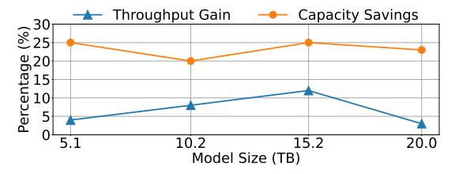

# C. Data Warehouse Workloads

1) Workload Description: Our data warehouse workloads are distributed analytics systems such as Spark and Hive, which routinely operate on PB-scale datasets. They are characterized by high concurrency, complex query patterns involving multi-stage joins, aggregations, and large-scale scans, and highly variable resource requirements. To maximize resource utilization, jobs are aggressively bin-packed onto servers: memory emerges as the primary bottleneck.

Typical metrics for these workloads include executor counts per server ranging from 10 to over 100, dataset sizes of TBs to PBs per job, and memory footprint of 100s of GBs per job.

However, in such environments, reliability is paramount, as out-of-memory (OOM) events can disrupt critical business analytics and ML pipelines. The target OOM rate needs to be kept below 0.1% per job to ensure robust operation.

2) Architectural Implications and CXL Benefits: The deployment of CXL memory expansion in our data warehouse infrastructure directly addresses memory bottlenecks in largescale analytics and opens new opportunities for optimizing resource allocation and operational efficiency.

**Denser Packing.** With CXL, servers can be provisioned with much more memory than previously possible, which directly enables denser bin-packing of analytic executors on each node. This increased density allows a single server to host a greater number of concurrent jobs, maximizing hardware utilization and reducing the total number of servers required to support a given workload.

**Improved Reliability.** The expanded memory headroom provided by CXL enhances system reliability. By mitigating the risk of out-of-memory (OOM) events, CXL reduces the frequency of job failures and the associated overhead of job restarts and resource fragmentation by 33%. This improvement is particularly impactful for complex, multi-stage queries that are sensitive to memory pressure and can be resource-intensive to re-execute. Recall, the benefits are realized transparently through kernel-level mechanisms such as TPP.

*3) Production Results:* Figure 10 summarizes the results for data warehouse services with Vistara CXL.

Fig. 10. Improvements across important metrics (number of executors, query performance, compute capacity, and MIPS) in data warehouse workloads.

Spark is a cornerstone of distributed analytics. With CXL, Spark is now able to bin-pack up to 33% more executors per server. This directly translates to higher hardware utilization and a reduction in the number of servers required to support the same workload. The result is a more efficient fleet, with lower power and management overhead.

Cosco is a distributed shuffle service. Cosco leveraged CXL to pack more executors per server, reducing the compute capacity by 30%, alongside an 11% increase in MIPS per cluster and a 10% reduction in executor runtime.

FtStoreX is a hybrid storage and serving system that efficiently manages and delivers feature data for large-scale, real-time applications. It uses CXL memory expansion to improve throughput and decrease its compute capacity by up to 8.4%. The improved memory efficiency in FtStoreX led to a decrease

in ZippyDB backend utilization, reducing storage usage and further improving infrastructure efficiency.

## D. DevInfra Services

1) Workload Description: DevInfra services are the backbone of our company's continuous integration (CI) pipelines, build systems, and developer productivity tools (devmachines). These workloads have high job concurrency, short-lived build artifacts, and highly bursty resource usage.

Build jobs are distributed across thousands of servers, with memory and I/O serving as the primary constraints. The system must balance throughput, resource efficiency, and reliability, as OOMs and resource contention have a direct and immediate impact on developer velocity.

Important metrics include build job concurrency of 10 to 100 per server, artifact sizes ranging from MBs to GBs per job, and throughput measured in 1000s of builds per hour. The target OOM rate is kept below 0.01% per job.

2) Architectural Implications and CXL Benefits: Vistara's CXL memory expansion addresses the acute memory constraints faced by DevInfra services in two ways: by improving the overall throughput and by reducing the frequency of OOM events. Overall, it results in higher developer productivity.

**Improved DevInfra Throughput.** With increased memory available per server, DevInfra platforms can support a higher degree of job concurrency, allowing more build and test jobs to run in parallel on each machine. This directly translates to improved throughput and reduced build latency, as developers experience faster feedback cycles and less queuing. The ability to stack more jobs per server also streamlines resource scheduling and reduces the need for overprovisioning.

**Less OOM.** In addition, the expanded memory headroom lowers the risk of OOM events, which are a major source of job failures and wasted compute cycles in CI environments. By minimizing OOMs, CXL reduces the frequency of job retries and the associated delays.

3) Production Results: Figure 11 summarizes the results for DevInfra workloads with Vistara CXL.

Fig. 11. Improvements across important metrics (number of containers and compute capacity) in DevInfra workloads.

Devmachine provides engineers with virtual development servers tailored for software development, debugging, and testing. These servers are available in various VM configurations, offering different levels of compute power and memory and storage sizes to efficiently support a wide range of use cases ranging from general debugging to AI/ML development. Collocating multiple VMs on a physical server maximizes resource utilization and enables more developers to work

simultaneously, reducing the inefficiency of assigning dedicated hardware to individual users. With CXL, devmachines increase the number of VMs per server by 33%, with each VM experiencing only a modest 10% performance regression due to CPU and storage sharing. Hence, the devmachine fleet needs 15% fewer servers for the same level of developer efficiency.

#### E. ML Parameter Server

1) Workload Description: ML parameter server workloads are foundational for the distributed training and inference of large-scale machine learning models, such as recommendation systems and LLMs. They have intense memory-capacity demands, as servers must host substantial model shards and facilitate high-throughput updates to ensure model freshness. The architecture is designed to support rapid and frequent parameter updates, in order to maintain the accuracy and relevance of models in production environments.

ML parameter server workloads have to balance several competing factors: model size, update rate, and serving latency. As models grow in complexity and scale, the system must efficiently manage the distribution of model shards across servers, while minimizing bottlenecks such as fan-out and rebatching. These bottlenecks can impact both the speed of updates and the responsiveness of inference requests.

Typical metrics for these workloads include model sizes that range from 10s to over 100 TB, with individual server shards spanning 100s of GBs. Update rates can reach millions of parameters per second. Serving QPS are also substantial, with clusters routinely handling hundreds of thousands of requests.

2) Architectural Implications and CXL Benefits: Vistara's CXL memory expansion transforms the architecture of ML parameter server workloads. In practice, Vistara reduced the overall capacity requirements of ML clusters, enhanced model freshness through more efficient updates, and provided a scalable foundation for managing future 100TB-scale models. **Capacity Reduction.** A primary benefit of CXL is the ability to consolidate larger model shards onto each server, reducing the total number of machines required to host a given model. This consolidation lowers capital and operational costs, simplifies cluster management, and reduces the system footprint. Improved Model Freshness. Beyond capacity reduction, CXL also improves model freshness and serving performance by reducing fan-out during parameter updates. With larger shards per server, each update operation touches fewer machines, decreasing network overhead and update latency. This streamlined communication path enables faster propagation of model changes, supporting real-time inference and training workloads with higher throughput and lower tail latency.

**Enabling 100TB Models.** Finally, the memory scalability provided by Vistara helps support the next generation of ML models, which are expected to reach sizes of 100TB and beyond. By breaking through traditional memory limitations, CXL future-proofs our infrastructure, ensuring that it can accommodate the rapid growth in model complexity and size without requiring disruptive architectural changes.

3) Production Results: In production, the deployment of ML parameter server workloads on MemServer led to improvements in both throughput and resource efficiency.

When serving a 5.1TB production model, the transition to MemServer platforms resulted in an increase in model serving throughput by 4%. This enhancement in throughput directly translates to faster inference and supports higher query rates.

Fig. 12. Improvements in throughput and compute capacity requirements with Vistara CXL device as we scale the model size.

The reduction in CPU serving cost due to CXL-based memory expansion is substantial. Specifically, with Vistara CXL, ML Parameter Server uses 25% less compute capacity. These savings are achieved through the consolidation of workloads onto fewer, more memory-rich servers.

As shown in Figure 12, with model sizes scaling further, up to 20TB, Vistara continues to yield throughput improvements by 4–12% compared to configurations without CXL. Additionally, we constantly need 20-25% less servers. This confirms the scalability benefits of memory expansion, particularly as next-generation models push the boundaries of memory capacity.

## F. TPP Performance Heuristics in Production

Table VIII analyzes the TPP performance heuristics across our production services. Across all services, we observe that CPU overheads from TPP, including the use of minor page faults to detect hot pages, remain low in practice, with no evidence of TPP-induced performance regressions. The bandwidth driven from CXL-attached memory is generally modest compared to local memory bandwidth, indicating that most production workloads are far from saturating CXL bandwidth. Additionally, CXL bandwidth utilization is primarily influenced by accesses to a broader range of cold pages, rather than frequent accesses to hot pages and hence we observe minimal traffic related to page promotions. Thus, approaches that leverage DMA engines to accelerate page migration [21] are unlikely to provide significant performance benefits.

TABLE VIII
TPP PERFORMANCE HEURISTICS ACROSS PRODUCTION SERVICES.

| Workload                                                   | LocalBW                                                                       | CXLBW                                                                     | NUMAhintfaults                                                                                  | Promotions                                                                                    |
|------------------------------------------------------------|-------------------------------------------------------------------------------|---------------------------------------------------------------------------|-------------------------------------------------------------------------------------------------|-----------------------------------------------------------------------------------------------|
| CacheA CacheB DevInfra DataWA DataWB DataWC | 225 GB/s 150 GB/s 50 GB/s 300 GB/s 273 GB/s 110 GB/s 2 GB/s | 5 GB/s 11 GB/s 13 GB/s 10 GB/s 10 GB/s 0.5 GB/s 94 MB/s | 32 per min 87 per min 24 per min 12K per min 36 per min 500 per min 2 per min | 7 per min 88 per min 33 per min 7K per min 10 per min 500 per min 2 per min |

