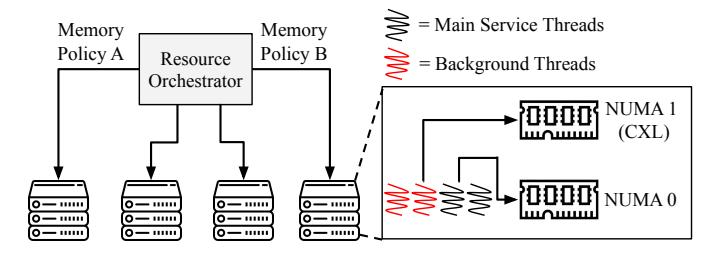

# *D. Flexible Opt-Out Support for Fungibility*

While uniformity is fundamental for large-scale operations, flexibility in memory usage is important for supporting diverse workload requirements and maximizing server fungibility. The Vistara software stack addresses this need by providing a software-based *opt-out mechanism* that allows workloads to selectively avoid using CXL memory when necessary.

This opt-out capability is implemented through the Linux cgroup framework, specifically the cpuset.mems controller. By configuring this controller to restrict a workload's memory allocations to the local NUMA node, operators can effectively disable access to CXL memory for that workload. This approach does not require any changes to BIOS settings or server reboots. Hence, the system can transition between memory configurations in a rapid and non-disruptive manner.

Opt-out policy is particularly useful for workloads with strict latency requirements or those that have not yet been validated for operation on tiered memory systems. It also enhances server fungibility, as nodes can be flexibly moved in and out of different service pools without hardware reconfiguration.

A server can be temporarily assigned to a latency-sensitive application that only uses local DRAM, and later returned to the general pool for capacity-bound workloads.

Memory Policy Automation. The opt-out feature is integrated with our infrastructure's existing resource orchestrator [32], allowing operators to automate memory policy enforcement based on workload characteristics and operational priorities. The orchestrator manages the cpuset.mems cgroup controller for each workload, dynamically setting the allowed NUMA nodes according to service profiles or host policies: enabling or disabling access to CXL memory as needed.

These memory policies can be specified declaratively and are automatically applied at job launch. Thus, the memory allocation rules are consistently enforced across the fleet without manual intervention. Furthermore, the orchestrator can react to real-time signals, such as workload migration, scaling events, or service health, to update memory policies on the fly, supporting rapid transitions between opt-in and opt-out states and maximizing both performance and server fungibility.

Fig. 8. The resource orchestrator deploys services with their memory policies. By default, all services use CXL memory, but some services can opt-out.

Fine-Grained Opt-Out Control. The opt-out mechanism also supports *selective use of CXL memory* within a single host. Background processes or less critical services can be directed to utilize CXL memory, freeing up local DRAM for primary workloads. This fine-grained control over memory allocation enables more efficient resource utilization and helps to balance performance and capacity across the fleet.

Lower-priority system services are defaulted to opt-in to CXL memory usage, as testing demonstrated most background services are neither memory-capacity nor memoryperformance sensitive. This maximizes available DRAM-tier capacity for all workloads, whether they opt in or out of CXL. This also provides telemetry on CXL memory reliability by ensuring some CXL memory is used at least some of the time.

As shown in Figure 8, the Vistara software stack's flexible opt-out support maintains high server fungibility and operational agility while enabling large-scale CXL deployment.

