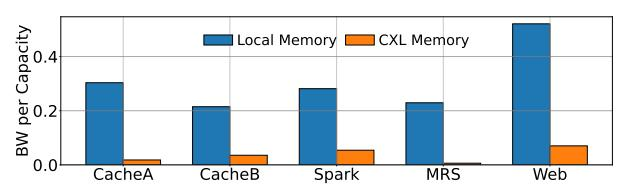

# II. MOTIVATION AND REQUIREMENTS

## A. Need for Memory Expansion

A large fraction of our general-purpose (CPU) server fleet is fundamentally constrained by *memory capacity*. Figure 1 shows the distribution of servers in our fleet bottlenecked by various resources, such as CPU cores, memory capacity, and memory bandwidth. We can see that 43.7% of all servers are fundamentally limited by the amount of available memory, i.e., *memory-capacity bound*.

Fig. 1. Fraction of servers bottlenecked by a given resource.

Memory pressure spans a diverse set of services: distributed caches, development infrastructure, large-scale data warehouse analytics, and modern ML workloads such as parameter servers, graph analytics, and real-time recommendation systems. The working set size of these workloads have outpaced per-node DRAM capacity growth, resulting in resource stranding: CPUs, storage, and network bandwidth are left underutilized because memory is exhausted first. For example, on prior hardware generations, memory-bound services routinely strand 25–40% of available CPU resources, with utilization rates for memory-bound jobs dropping as low as 25–35% on 64GB DRAM SKUs compared to the 128GB DRAM SKUs.

Moreover, in the context of large-scale ML serving, the inability to fit model parameters in memory leads to increased

fan-out, higher latency, and a proliferation of CPU shards, all of which inflate the TCO and degrade system efficiency.

The introduction of *CXL memory expansion* represents an architectural shift in our infrastructure. CXL decouples memory capacity from the constraints of on-socket DRAM channels. This directly addresses memory-capacity bottlenecks via CXL-enabled servers with up to 1TB of memory.

**Tolerance to Lower Memory Performance.** CXL memory expansion comes with increased access latency and reduced bandwidth compared to socket-attached memory. However, across our fleet, we observe the majority of workloads are memory capacity-bound rather than latency- or BW-bound.

Figure 2 shows the effective bandwidth per GB of memory capacity for local and CXL memory across five production services after we deployed and tuned workloads on CXL-expanded servers. For all services, the BW/GB observed on CXL memory is much lower than on local DRAM, because our software stack intentionally places cold pages on the CXL tier and thus accesses it infrequently. As a result, the lower achievable CXL-attached memory bandwidth does not impact end-to-end performance, since the majority of bandwidth-sensitive accesses continue to hit local memory.

Fig. 2. Bandwidth per capacity for local and CXL memory.

We further analyze memory access patterns of our workloads. We find a large portion of memory footprints consist of *cold* pages, i.e., infrequently accessed and idle for extended periods. A small fraction of memory is accessed at any given moment, the rest is cold. Table I quantifies *coldness* as the distribution of memory idle times across workloads.

TABLE I PER-WORKLOAD MEMORY IDLE TIME PERCENTILES.

|      | P25                                              | P50                                                        | P75                                                       | P99                                                |
|------|--------------------------------------------------|------------------------------------------------------------|-----------------------------------------------------------|----------------------------------------------------|
| Web1 | 22.5 seconds 4.3 minutes 7.9 seconds 4.2 seconds | 28.3 minutes 19.4 minutes 2.1 minutes 1.7 minutes | 1.3 hours 43.8 minutes 30.9 minutes 27.1 minutes | 1.9 hours 1.4 hours 38.5 hours 72.9 hours |

Table I shows the 25th–99th percentile idle times for pages, where *idle time* is defined as the duration since last access. For example, if 25% of memory was accessed at least once within the last minute, while the remaining 75% was not accessed at all, the P25 idle time is 1 minute. A large fraction of memory remains untouched for long intervals: most pages are cold.

Hence, placing cold pages in a slower CXL-memory tier will minimally impact overall application performance. Since these pages are rarely accessed, the increased latency and reduced bandwidth of CXL memory are unlikely to become bottlenecks. Even with basic memory-tiering mechanisms in the upstream Linux Kernel, systems can achieve higher memory capacity with CXL without sacrificing workload performance.

#### B. Need for System Reliability

CXL memory expansion has a direct impact on system reliability for hyperscale applications. Historically, memory overprovisioning has been required to meet reliability targets and avoid out-of-memory (OOM) events, which are a major source of wasted compute and failed jobs. For instance, in large-scale ML training and serving, the deployment of CXL memory has led to a 50% reduction in OOMs for certain workloads, and has enabled the stable serving of models that would otherwise be infeasible on DRAM-only configurations.

#### C. Need for Reduced Carbon Emissions

Beyond performance, improving the sustainability of datacenter infrastructure is increasingly important. Figure 3 shows a breakdown of per-component carbon emissions based on lifecycle assessment models, accounting for manufacturing, operation, and end-of-life phases. We can see that DRAM DIMMs are the single largest source of emissions (69%). CXL-based memory expansion directly addresses this challenge by enabling the reuse of existing DIMMs and extending their service life, thereby reducing both the need for new DRAM production and the overall carbon footprint of the fleet.

Fig. 3. Breakdown of carbon emissions across components.

## D. Requirement for Transparent Memory Tiering

For seamless deployment of CXL memory across a heterogeneous fleet, CXL memory must be transparently presented to applications, and applications must run largely unmodified on servers with or without CXL hardware. While many hyperscale applications are already NUMA-aware, the introduction of CXL-attached memory as an additional NUMA node required some refinement of NUMA policies and memory allocation strategies to ensure tiered memory was utilized without performance regressions.

## E. Requirement for CXL-Adoption Flexibility

Given the diversity of datacenter workloads, an opt-in mechanism for tiered memory is important. Some applications do not fully utilize the memory capacity, while others may experience performance regressions when accessing CXL-attached memory. As shown in Table I, certain workloads have low memory idle time at the P75/P99 percentile. These workloads are better served by opting out of CXL capacity to avoid regressions. Thus, we need a framework for workloads to selectively use or avoid CXL memory.

## III. VISTARA HARDWARE STACK

#### A. Chip Design

The Vistara ASIC is Meta's first-generation, custom CXL memory expander, designed to address the growing memory capacity needs in datacenters. The goal is to maximize

memory capacity and efficiency within strict power and area constraints. The system also minimizes the impact on bandwidth and access latency to approach the performance of local DRAM. Figure 4 shows the high-level Vistara architecture.

Fig. 4. High-level architecture of a Vistara ASIC.

Memory Subsystem. At its core, the Vistara ASIC is designed to bridge DDR4 memory to host processors via a CXL 2.0/1.1-compliant PCIe Gen5 x16 interface. Each Vistara ASIC integrates two independent 72-bit DDR4 memory channels, supporting speeds up to 3200 MT/s and up to 256GB per chip with 64GB DIMMs. In our production deployments, we use 32GB DIMMs, as this was the highest capacity available for reuse, resulting in 128GB per chip (typically 4x32GB DIMMs). With two Vistara ASICs per board, this enables 256GB of CXL-attached DDR4 memory expansion in production. Vistara provides enhanced DDR4 reliability through RS-based 2-symbol error correction and x4 chip-kill capability.

Table II summarizes Vistara ASIC's key specifications.

TABLE II VISTARA ASIC KEY SPECIFICATIONS.

| Parameter         | Specification                                |  |  |
|-------------------|----------------------------------------------|--|--|
| CXL Compliance    | CXL 2.0/1.1, Type-3 Memory Expander          |  |  |
| Host Interface    | PCIe Gen5 x16 (deployed as x8)               |  |  |
| DDR4 Channels     | 2 independent, 72-bit, 2DPC                  |  |  |
| Max DDR4 Speed    | Up to 3200 MT/s (prod: 2400 MT/s)            |  |  |
| Max Capacity      | 256 GB (4×64GB); prod: 128 GB (4×32GB)       |  |  |
| ECC               | RS(36,32), 2-symbol correction, x4 chip-kill |  |  |
| ASIC Idle Latency | ≈50 ns                                       |  |  |
| Management Cores  | 3× RISC-V (secure, control, boot)            |  |  |
| Interfaces        | CCI, SMBus, PCIe FW update                   |  |  |
| ASIC Power        | ≈9 W                                         |  |  |

The PCIe Gen5 interface delivers high-bandwidth (32GT/s per lane) and low-latency connectivity. Moreover, Vistara's memory controller pipeline is streamlined for efficient request handling, minimizing protocol overhead and supporting dynamic adjustment of link width and channel usage to optimize for power and cost. The memory controller and CXL protocol stack are co-optimized to minimize queuing delays and ensure robust performance across a range of operating conditions.

Vistara balances between maximizing aggregate memory bandwidth and minimizing die area and power consumption. The number of memory channels and the PCIe interface width were chosen to match the bandwidth requirements of capacity-bound workloads, while avoiding overprovisioning. Furthermore, the ASIC is fabricated in an advanced process node and incorporates aggressive clock and power gating.

Management Subsystem. Vistara features a robust management subsystem for configuration, health monitoring, and error reporting. This subsystem leverages multiple embedded RISC-V cores: a *secure processor* for secure boot and firmware authentication, a *control processor* for CXL memory expander firmware, and a *boot processor* for device initialization. The management subsystem supports advanced features: firmware updates over PCIe and SMBUS, comprehensive monitoring of DIMM and ASIC temperature and health, and error injection capabilities for validating various RAS flows required for atscale monitoring and service. Additionally, it implements the CXL Command Interface (CCI), enabling standard software to manage the device from both the host and the BMC.

Characterizing Vistara's Performance. We characterize Vistara's bandwidth and latency using a memory-intensive MLC streaming microbenchmark [11] on a single-socket MemServer node (Table VI). Threads are pinned to the target NUMA node (local DRAM or CXL) to isolate each memory tier. We sweep read-to-write ratios and concurrency levels, and report steadystate averages over 60-second measurement windows after a warm-up phase. Table III summarizes the measured peak bandwidth for both native (local DRAM) and Vistara's CXLattached memory under various read-to-write traffic patterns. We conduct measurements with a CPU frequency of 2.3GHz, with local DDR5 channels operating at 6400MT/s and CXLattached DDR4 channels at 2400MT/s. As expected, CXL memory bandwidth is lower than that of local DRAM, primarily due to DDR4 bus speed. The bandwidth gap persists across mixed read-write patterns, but remains within the requirements of the target workloads.

TABLE III PEAK BANDWIDTH IN GBPS (AND PERCENTAGE OF THEORETICAL PEAK) FOR NATIVE AND CXL MEMORY UNDER DIFFERENT READ:WRITE RATIOS.

| Traffic Pattern | Native Memory  | CXL Memory    |
|-----------------|----------------|---------------|
| ALL Reads       | 497 GBps (80%) | 48 GBps (62%) |
| 3:1 Read:Write  | 455 GBps (74%) | 41 GBps (54%) |
| 2:1 Read:Write  | 453 GBps (73%) | 42 GBps (55%) |
| 1:1 Read:Write  | 439 GBps (71%) | 42 GBps (55%) |

While the bandwidth of CXL-attached memory is lower than that of local DRAM, this is not a limiting factor for the majority of capacity-bound workloads in production (Figure 2). The operating point in production is around 60% native bandwidth utilization and less than 10% CXL bandwidth utilization.

Table IV shows the memory access latency for native and CXL memory at different bandwidth utilizations. As utilization increases, both native and CXL memory experience higher latencies, with CXL consistently incurring a greater penalty. For instance, at 60% bandwidth utilization native memory exhibits a latency of 234 ns, while CXL memory reaches 372 ns. Despite this gap, the absolute latency of CXL-attached memory remains within a range that is acceptable for the majority of capacity-bound workloads targeted by Vistara.

Contrary to the findings reported in [19], Vistara demonstrates stable tail latencies. Specifically, the variation in latency for CXL-attached memory is close to that observed with local

TABLE IV MEMORY ACCESS LATENCY FOR NATIVE AND CXL MEMORY AT DIFFERENT BANDWIDTH UTILIZATION POINTS.

| BW Util. [%] | Native Latency [ns] | CXL Latency [ns] |
|--------------|---------------------|------------------|
| 10           | 169                 | 269              |
| 30           | 173                 | 292              |
| 60           | 234                 | 372              |

memory. Figure 5 presents the cumulative distribution function (CDF) of memory access latency as the number of concurrent latency threads increases from 1 to 100, with all threads pinned either to local DRAM or to CXL-attached memory. For each thread count, the tail latency distribution for CXL-attached memory closely tracks that of local memory, indicating comparable variability under contention. With more threads, both configurations exhibit higher tail latencies due to increased contention for memory resources. In contrast, the FPGA device tested in [19] shows anomalous tail latencies, likely due to inherent FPGA limitations, such as limited SRAM, e.g., insufficient credit buffers for outstanding transactions.

Fig. 5. CDF of memory access latency in local and CXL-attached memory with different number of latency threads (1, 10, 50, and 100).

We also evaluate power and cost of CXL-attached memory. Table V compares the power consumption of CXL-attached memory alongside the cost per GB and power per GB, each normalized to the values for native DRAM. This comparison clarifies the practical trade-offs of deploying CXL memory, and shows its potential for cost-effective capacity expansion.

TABLE V COMPARISON OF LOCAL AND CXL MEMORY IN TERMS OF CAPACITY, BANDWIDTH, POWER, AND NORMALIZED COST/POWER PER GB.

| Memory | Capacity | BW     | Power | Relative | Relative |
|--------|----------|--------|-------|----------|----------|
| Type   | [GB]     | [GB/s] | [W]   | Power/GB | Cost/GB  |
| Local  | 768      | 614.4  | 132   | 1        | 1        |
| CXL    | 256      | 57.6   | 30    | 0.7      | 0.13     |

Performance Optimizations. To minimize the performance gap between local and CXL memory, the Vistara design incorporates a range of architectural and system-level optimizations.

We reduced ASIC *idle round-trip latency* to ≈50 ns, by: *1)* configuring the CXL and DDR controller IPs for low latency, *2)* minimizing clock-domain crossings, and *3)* targeted physical design optimizations, e.g., tight floorplanning of latencycritical blocks and selective low-Vt usage on critical datapaths.

We optimize the *loaded latency* with large completion buffers, wide flow-control windows, and sufficient replay depth in the CXL controller. Further, the DDR subsystem leverages multi-channel access, bank-level parallelism, and deep read data and command queues.

The *memory controller pipeline* is engineered to reduce queuing and arbitration delays by streamlining the scheduling of memory requests. This is achieved through a reduction in pipeline stages and implementation of fast-path logic for common transactions. Additionally, firmware-based interrupt rate limiting prevents error interrupt storms from overwhelming the controller, ensuring responsiveness under adverse conditions.

At the *protocol level*, the CXL stack is tightly integrated with the PCIe Gen5 physical layer. This direct coupling reduces protocol translation overhead and leverages the full bandwidth and low latency of the underlying transport. The firmware further accelerates mailbox command handling for CXL.io and CXL.mem operations, enabling efficient event logging, register access, and firmware management. Robust error recovery mechanisms are implemented to handle incomplete or stuck transactions, with coordinated resets across the CXL controller, DDR controller, and internal interconnect to ensure reliable operation following power cycles or reboots.

