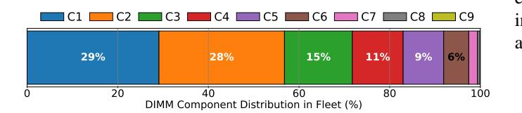

# VI. EXPERIENCES AND LEARNINGS

Our deployment surfaced a wide range of insights; we focus on the main learnings most relevant for future CXL systems.

DRAM Reuse and CXL ASIC Flexibility. Reusing DRAM from decommissioned servers faces practical challenges due to the variety of DDR4 DIMMs available. Figure 13 shows the distribution of DDR4 DIMM types in our fleet. This diversity requires CXL ASICs to support a wide range of DRAM devices and configurations. Additionally, managing the supply and demand of reused DIMMs is operationally complex. We developed specialized tooling and processes to prepare tested DIMM inventories for just-in-time manufacturing and to maintain spares for datacenter repairs.

Fig. 13. Distribution of available DDR4 DIMM components in the fleet.

CXL Bandwidth Utilization and PCIe Sizing. Our production data shows that the memory bandwidth drawn from CXL devices is relatively low for current workloads, making an x8 PCIe connection sufficient. The observed local-to-CXL bandwidth ratio of approximately 10:1 meets the needs of today's applications. However, as new use cases such as CXL memory compression emerge, future CXL devices may need to offer a more balanced bandwidth-to-capacity ratio.

Transparent Tiering Overheads. Contrary to some prior work, we find that the overheads introduced by transparent memory tiering are modest. Our measurements indicate that CPU and system overheads with CXL are not significantly higher than with local memory alone (less than 0.5%). This suggests that complex OS optimizations to reduce tiering overhead may not be necessary for most production scenarios.

Application Footprints and Memory Ratios. Many applications exhibit a substantial cold memory footprint and tolerate tier-2 (CXL) memory with minimal performance impact. This observation opens the door to more aggressive local-to-CXL memory ratios in future platforms, potentially moving beyond the current 3:1 ratio to further optimize for efficiency.

