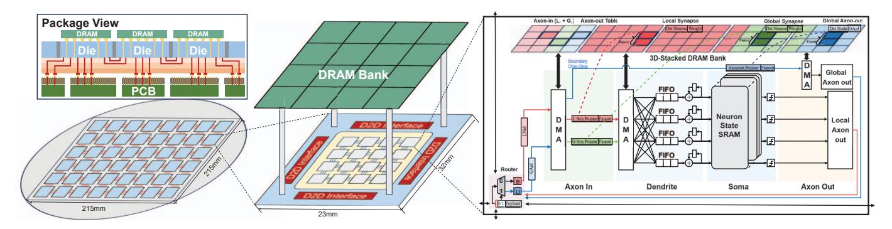
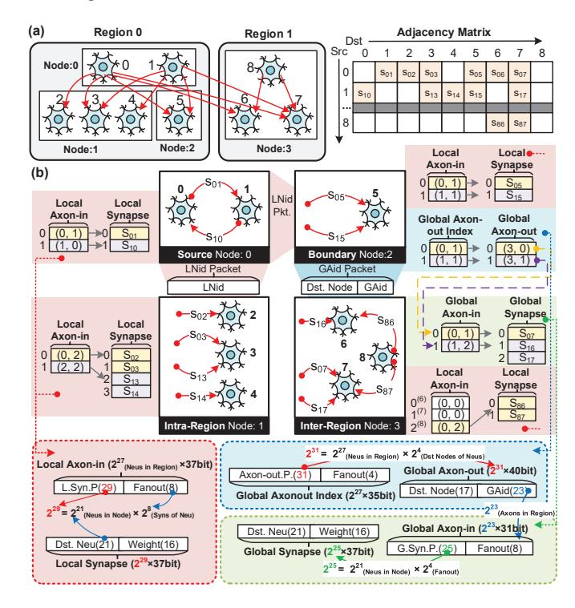

# A. 3D-WSI Neuromorphic Chip Architecture

Our wafer-scale chip adopts a 3D-enabled chiplet-based WSI architecture, where compute dies and DRAM dies are vertically stacked and interconnected across the entire wafer through hybrid bonding, as shown in Fig. 4.

(1) Wafer Architecture: In the proposed architecture, the 215 mm ×215 mm wafer integrates 6 × 8 compute dies in a 2D mesh topology, with each compute die vertically bonded to a dedicated 3D-stacked DRAM die. Compared with alternative topologies such as dragonfly, the mesh topology achieves a favorable balance of bandwidth, signal integrity, and scalability at the wafer level. Owing to its reliance solely on nearest-neighbor connections, the mesh exhibits a simplified interconnect pattern that is more compatible with packaging integration, making it particularly suited for large-scale chiplet networks on wafers. Furthermore, 3D-WSI provides low-latency D2D communication and efficient compute-to-memory data transfers, alleviating the latency penalties of large mesh scaling and enabling superior data locality.

(2) Chiplet Architecture: To accommodate a  $6 \times 8$  chiplet array on a 215 mm  $\times$ 215 mm wafer, each chiplet is allotted an area budget of 23 mm  $\times$  32 mm. Every chiplet integrates a 4  $\times$  4 array of Brain Processing Unit (BPU) nodes for domain-specific neuromorphic computing. A D2D interface enables

Fig. 4. Overview of wafer-scale chip architecture.

chiplet-level scale-out, while 3D-stacked DRAM provides high-capacity synapse storage. Each BPU node contains a lightweight network-on-chip (NoC) router that supports both unicast and broadcast dissemination of spiking events, together with four functional modules, including axon-in, dendrite, soma, and axon-out (Fig. 4).

**Axon-in module.** Ingests AER spikes from local and global sources and performs direct pointer/fan-out lookups in 3D-stacked DRAM. Pointer/fan-out tables map each spike to its target synapse lists (local or global), supplying the metadata needed to initiate memory accesses.

**Dendrite module.** A DMA engine fetches synaptic data encoded in an adjacency-list format from the 3D-stacked DRAM. Each synapse weight and related metadata is decoded and dispatched to different FIFOs based on the destination neuron ID. This realizes sparse synapse indexing in hardware and supports event-driven, asynchronously parallel accumulation of synaptic currents across FIFOs. The accumulated currents are then handed off to the soma for subsequent membrane-potential updates.

**Soma module.** Maintains neuron state in dedicated SRAM and updates membrane potentials according to the neuron model. Threshold crossings generate new spike events that are forwarded to the axon-out stage.

**Axon-out module.** Packages and distributes outgoing spikes along local or global paths. Axon-pointer/fan-out tables determine destinations within and across BPUs/chiplets, driving either NoC unicast or broadcast as appropriate.

This hierarchical organization enables efficient event-driven processing, scalable inter-chiplet communication, and dense synaptic storage, making the architecture well-suited for large-scale wafer-level neuromorphic integration.

(3) Package View: The package adopts a 3D-WSI scheme in which multiple compute dies and stacked DRAM dies are integrated on a silicon interposer. As shown in Fig. 4, DRAM dies are connected to the underlying redistribution layer (RDL) through through-silicon vias (TSVs), enabling dense vertical interconnects and minimizing memory—compute communication distance. The RDL provides fine-pitch routing for signals and power delivery across dies and further redistributes connections to the package substrate. Finally, the package substrate is bonded to the PCB, establishing external signal connections. This hierarchical integration eliminates

Fig. 5. The distributed data structure of NAHP. (a) A cross-region connectivity example. (b) Its NAHP mapping: red indicates local (LNid-based) connectivity; blue and green indicate global connectivity, corresponding to axon-out and axon-in metadata, respectively. Dashed boxes summarize each structure's format and storage scaling.

long PCB traces found in conventional multi-chip systems, thereby reducing interconnect latency, enhancing D2D bandwidth, and improving signal integrity.

