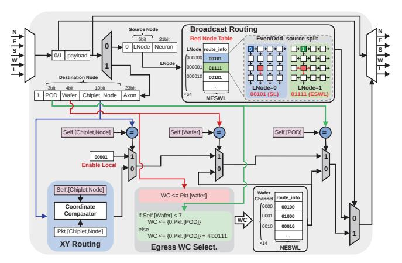
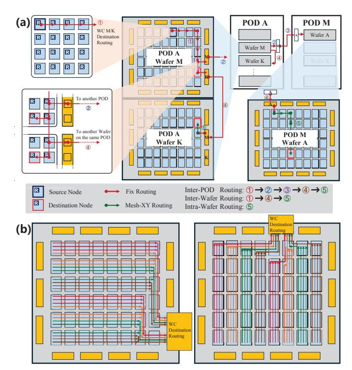
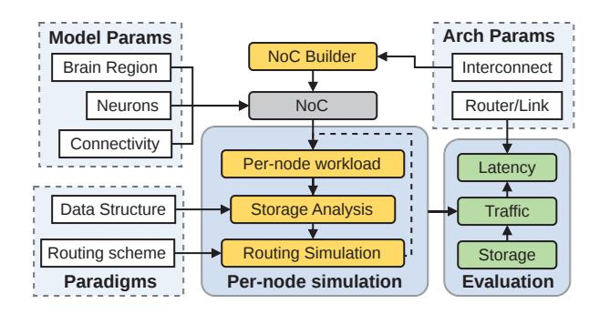

# B. Storage Organization for NAHP

**SRAM for hot state.** We dedicate on-chip SRAM (Fig. 4) to high-frequency neuron state and per-step event queues (e.g., membrane potential, refractory flags, and temporary accumulators). Keeping these hot variables in SRAM minimizes latency for neuron updates and prevents thrashing on frequently accessed state.

**DRAM for connectivity.** Connectivity metadata and synaptic weights are placed in 3D-stacked DRAM and organized as adjacency lists tailored to NAHP's two addressing modes (Fig. 5): a neuron-driven local layout for dense intra-region tar-


Fig. 6. NAHP communication scheme. Red arrows show intra-region broadcast within a configurable region (green region), and blue arrows show boundary-initiated inter-region unicast to inter-region destinations. In broadcast packets, *LNode* is the packet source's relative ID in its region; in unicast packets, *Physical Node* denotes the packet destination's absolute position in the global system.

gets, and an axon-driven global layout for sparse inter-region projections. Each block exposes a compact pointer/length header followed by a contiguous adjacency list, enabling coalesced accesses while keeping index overhead small.

- 1) Local (Neuron-Driven) Layout: When postsynaptic targets reside within the same region as the source neuron (intra-region node in Fig. 5), NAHP uses a neuron-driven representation:
  - Local Axon-in. Indexed by the local neuron identifier LNid; each entry returns a compact record with (L.Syn.Pointer,Fanout), where L.Syn.Pointer points to the local synapse address and Fanout provides the number of target synapses.
  - Local Synapse. A contiguous adjacency list for the neuron's intra-region fan-out, stored as entries \DstNeuron, Weight\rangle (or delay/plasticity flags).
- 2) Global (Axon-Driven) Layout: For targets outside the source region (inter-region node of Fig. 5), NAHP employs an axon-driven representation that factors long-range projections by destination node:
  - Global Axon-out Index. This table is the index that maps a source neuron to multiple axon-out entries. Indexed by source neuron (LNid). Each entry records the address pointer Axon-out. Pointer and Fanout of the neuron's global axon-outs.
  - Global Axon-out. For a specific remote destination node DstNode, the axon-out record carries the receiver-side axon identifier, i.e., \DstNode, GAid\). It serves as the compact directory that the sender uses to reference the corresponding receiver-side axon.
  - Global Axon-in. Indexed by the global axon identifier GAid local to the destination node DstNode; each entry returns (G.Syn.Pointer,Fanout), where G.Syn.Pointer points to the node-local global synapse block.



Fig. 7. The framework of the NAHP router. Packets are first classified by the 0/1 mode bit to select broadcast or unicast. For broadcast packets, routers use a small route\_info table indexed by *LNode*; the dashed box illustrates the even/odd source split used in broadcast routing. For unicast packets, routers perform on-wafer mesh-XY routing or egress WC selection, followed by deterministic-route forwarding based on the selected WC.

 Global Synapse. A contiguous list of (DstNeuron, Weight) entries for all inter-region synapses hosted in the same destination node.

In NAHP, hot, frequently updated neuron state resides in SRAM, while large, sparse connectivity and weights are stored in DRAM using two complementary block-contiguous layouts. This separation decouples compute from connectivity size, preserves locality at both intra- and inter-region scales. These storage layouts are complementary to off-chip sparse-aware memory-management techniques explored in prior neuromorphic systems (e.g., ActiveN [23]), and could be integrated to further improve irregular synapse-access efficiency.

## C. NAHP Communication Scheme

NAHP combines two communication modes to match brain connectivity: a local neuron-driven broadcast for dense intraregion fan-out and a global axon-driven unicast for sparse inter-region projections. As shown in Fig. 6, NAHP selects between the two modes based on the spatial distribution of destinations, and couples each mode with its corresponding metadata and storage organization.

1) Local Region Broadcast: For postsynaptic targets localized within the same cortical region (the green  $N \times M$  tile in Fig. 6, where N and M are configurable to match the size/shape of a brain region mapping), NAHP uses neuron-driven broadcast with packets carrying only  $LNid=\langle LNode, Neuron\rangle$ . Routers identify such packets by mode=0 and route solely based on LNode (the relative node ID in region). Each router implements broadcast via a table-based datapath (Fig. 7): a small per-node routing table, indexed by LNode, returns a 5-bit  $\{N, E, S, W, L\}$  mask specifying the enabled output ports when a broadcast packet from that source LNode traverses the router. The entries are precomputed for the configured region shape by broadcast-path planning and loaded into each router-local SRAM during system configuration, enabling one-cycle lookup and deadlock-free forwarding.

To balance link utilization in both dimensions, the planned broadcast paths adopt an even/odd source split: even LNodes use column-expansion broadcast, whereas odd LNodes use row-expansion broadcast. In the example of Fig. 7, an even source LNode=0 uses column-expansion broadcast; when its packet reaches the red router, the lookup returns 00101, corresponding to {S,L}, which matches the blue entry in the route info table. An odd source *LNode*=1 uses row-expansion broadcast; when its packet reaches the red router, the lookup returns 01111, corresponding to {E,S,W,L}, which matches the green entry in the route\_info table. By alternating these two expansion patterns across sources, the broadcast traffic is balanced across both dimensions of the region without any per-packet on-the-fly routing decision. Because forwarding depends only on the table entry indexed by *LNode*, changing the region size or tiling pattern requires only (i) assigning LNodes during region allocation and (ii) generating and loading the matching broadcast table; no packet-format change and no runtime computation are needed.

- 2) Inter-Region Unicast: For postsynaptic targets outside the source region, NAHP uses axon-driven unicast. Packets carry mode=1 and a destination physical ID \(\text{POD}, Wafer, Node\); the GAid is delivered to the receiver for synapse addressing but is not used by routing. As shown in Fig. 7, given mode=1, the router follows a unified unicast procedure with two cases:
- (1) Same wafer  $\Rightarrow$  Mesh-XY: First, the router determines whether the packet targets the local wafer. If so, it performs table-free XY routing by comparing the packet's destination coordinate against the router's current coordinate in the coordinate comparator, and selects the next hop until reaching the destination node.
- (2) Cross-wafer/cross-POD  $\Rightarrow$  channel egress: For any off-wafer destination, the router first selects an egress wafer channel (WC) based on the destination location (Egress-WCselection logic in Fig. 7). If the destination lies in a different POD, WC selection is driven primarily by the destination POD. If the destination is within the same POD but on a different wafer, WC selection is driven by the destination Wafer. How WCs are selected and how the deterministic paths are preplanned (including WC to node channel sharding and POD channel pairing) depends on the switchless-dragonfly interconnect and is detailed in Sec. III-E. Once the WC is determined, routers index a WC-selected routing table stored in router-local SRAM to obtain the preplanned next-hop mask, forwarding the packet along the deterministic path to the WC egress. After crossing to the target wafer, delivery within that wafer proceeds via mesh-XY routing to the destination node.
- 3) Region-Level Boundary Triggering: To exploit locality and avoid concentrating axon-driven unicasts near a firing source, NAHP introduces a region-level boundary triggering mechanism (Fig. 6). The key idea is that global unicasts are generated only at boundary nodes, never by interior nodes. When a neuron fires, the source node issues only the intraregion broadcast (mode=0, LNid=\langle LNode, Neuron \rangle); via this region-wide broadcast, all nodes in this region receive this

```
Algorithm 1 Deterministic Axon-to-Boundary Assignment
```

```
Input: Region size N \times M, source chip (i, j), destination chip
Output: Assigned boundary chip (i_b, j_b)
 1: if source and destination chips are on the same wafer then
        (i_a, j_a) \leftarrow (i_d, j_d) {Use destination chip as anchor}
        (i_a, j_a) \leftarrow \text{intra-wafer exit point to destination wafer}
 5: end if
 6: Initialize boundary set:
 7: \mathcal{B} \leftarrow \{(i,0), (i,M-1), (0,j), (N-1,j)\}
 8: d_{\min} \leftarrow \infty, (i_b, j_b) \leftarrow \emptyset
 9: for all (i_c, j_c) \in \mathcal{B} do
        d \leftarrow |i_a - i_c| + |j_a - j_c|
        if d < d_{\min} then
11:
            d_{\min} \leftarrow d
12:
            (i_b, j_b) \leftarrow (i_c, j_c)
13:
        end if
14:
15: end for
16: return (i_b, j_b)
```

event. The boundary node that holds the corresponding axonout metadata then triggers inter-region delivery by sending a unicast packet (mode=1) addressed to the destination  $\langle \texttt{POD}, \texttt{Wafer}, \texttt{Node} \rangle$ . Thus, global propagation is decomposed into two stages: (i) an intra-region broadcast and (ii) a boundary-triggered unicast to the remote destination. This shares the intra-region path, avoids redundant far-field delivery, and reduces unicast hotspots near the source.

To enable boundary-initiated inter-region unicasts, NAHP assigns each inter-region axon to a unique boundary owner within the source region, which stores the axon-out metadata and is responsible for initiating the unicast. For a source node (i, j) in an  $N \times M$  region, NAHP first designates four boundary candidates on the same row/column,  $\{(i,0),(i,M-$ 1), (0, j), (N-1, j)}, as potential owners to hold its interregion axon-out metadata (illustrated by the four yellow boundary nodes in Fig. 6). For each inter-region axon, NAHP select its unique owner from these four candidates using the nearest-boundary rule, i.e., minimum Manhattan distance to the routing anchor  $(i_a, j_a)$ . For same-wafer unicast,  $(i_a, j_a)$  is the destination node; otherwise,  $(i_a, j_a)$  is the node that hosts the selected WC egress for cross-wafer/cross-POD unicast. Ties are broken lexicographically to ensure a unique owner. The complete procedure is summarized in Algorithm 1.

To accommodate the additional axon-out metadata, each boundary node reduces its neuron placement by 20%, and the displaced neurons are redistributed evenly within the region to keep storage pressure uniform and preserve broadcast fan-out symmetry. If each neuron has k inter-region axons, assigning senders to boundary owners reduces the average cumulative routing distance per neuron by  $(N+M-2)\cdot k/4$ , lowering link contention and improving reuse of the shared intra-region path before the boundary-triggered unicast.


Fig. 8. Switchless dragonfly interconnect across three scales. (a) A wafer aggregates edge links into 14 WCs. (b) A WaferPOD connects 14 wafers in an all-to-all using WCs. (c) Seven WaferPODs form a 98-wafer cluster, where paired outward WCs form PCs.

## D. Switchless Dragonfly Inter-Wafer Fabric

To support whole-brain—scale simulation, we propose a 3D-WSI scale-out fabric. Unlike mesh/torus topologies with large diameters or switch-based dragonfly networks that rely on high-radix switches, our design aggregates on-wafer edge links into switchless wafer- and POD-level channels. We define three channel levels: a die-level node channel (NC), a wafer channel (WC) formed by aggregating eight NCs from an adjacent boundary-die pair, and a POD channel (PC) used between WaferPODs. At larger scales, these channels instantiate a hierarchical switchless dragonfly in which wafer-boundary dies act as direct communication channels, eliminating switches while maintaining high throughput and low diameter [9]. Fig. 8 illustrates the resulting hierarchy across wafer, WaferPOD, and cluster scales.

- (1) Wafer-level (14 WCs). Each wafer integrates a  $6\times8$  grid of dies, and each die contains a  $4\times4$  array of processing nodes. As shown in Fig. 8(a), each adjacent boundary-die pair along the wafer perimeter exposes a shared WC that aggregates eight NCs. In total, the wafer provides 14 bidirectional WCs, indexed 0–13, as its scale-out interfaces.
- (2) WaferPOD level (intra-POD). A WaferPOD connects 14 wafers in a full all-to-all topology using WCs. We denote  $WC_k(w)$  as the k-th wafer channel of wafer w. As shown in Fig. 8(b),  $WC_j(i)$  connects directly to  $WC_i(j)$ , so any two wafers are one hop apart. Each wafer uses 13 of its 14 WCs for intra-POD all-to-all links and reserves its diagonal channel  $WC_i(i)$  as the outward interface, yielding 14 outward WCs per WaferPOD for the next level.
- (3) Cluster level (inter-POD). Seven WaferPODs are interconnected via their outward WCs, which are paired to form PCs. We denote by  $PC_i(k)$  the *i*-th PC of WaferPOD k. In our design,  $PC_i(k)$  is realized by bonding two outward WCs within WaferPOD k, namely  $WC_i(i)$  and  $WC_{i+7}(i+7)$ . As shown in Fig. 8(c),  $PC_j(i)$  connects directly to  $PC_i(j)$ , so each WaferPOD reaches the corresponding WaferPOD i via  $PC_i$ . As a result, the end-to-end distance is 1 hop within a WaferPOD and 3 hops across the cluster  $(14 \times 7)$ , a dramatic reduction from the 18 hops of a  $10 \times 10$  mesh.

## E. Unicast over the Switchless Dragonfly Fabric

We next describe how NAHP realizes deterministic unicast over the switchless dragonfly fabric. The key is to (i) select an egress WC based on the destination POD/wafer and (ii) follow



Fig. 9. Unicast routing over the switchless dragonfly fabric. (a) annotates the end-to-end forwarding stages; (b) illustrates WC-to-NC sharding and the preplanned on-wafer deterministic routes, which materialize the WC-indexed deterministic-route entries used along the path to each WC egress.

preallocated deterministic routes to reach that WC, while distributing traffic across the eight NCs within the chosen WC. The resulting end-to-end forwarding stages and the WC-to-NC sharding used to populate the router tables are illustrated in Fig. 9.

- a) End-to-end forwarding: As shown in Fig. 9(a), unicast forwarding consists of five deterministic steps, detailed below. When the destination is in a different POD, it goes through the full sequence  $\textcircled{1}\rightarrow\textcircled{2}\rightarrow\textcircled{3}\rightarrow\textcircled{4}\rightarrow\textcircled{5}$ ; when the destination is within the same POD but on another wafer, it follows  $\textcircled{1}\rightarrow\textcircled{4}\rightarrow\textcircled{5}$ ; and when the destination is on the same wafer, routing uses only the on-wafer mesh step 5.
  - Ascend to the selected WC (①). Starting from the source node, the packet follows a preplanned on-wafer deterministic route to reach the designated egress WC for the destination.

- 2) **Rule for cross-POD selection** (②). If the destination lies in POD M, the packet traverses the corresponding  $PC_M(A)$  of the current POD A, while  $PC_M(A)$  is realized by the bonded outward WC pair  $(WC_M(M), WC_{M+7}(M+7))$ . To balance load, wafers with local index 0-6 use  $WC_M(M)$ , while wafers 7-13 use  $WC_{M+7}(M+7)$ . This rule corresponds to the green egress-WC-selection logic in Fig. 7.
- 3) **Inter-POD hop** (③). The packet crosses from the selected  $PC_M(A)$  to its peer  $PC_A(M)$  via the bonded outward WCs, thereby entering POD M.
- 4) **Intra-POD inter-wafer hop** (**④**). After arriving at the target POD (or when the destination is already in the same POD), if the destination wafer is *K*, the packet leaves via *K*-th WC and reaches wafer *K* through the intra-POD all-to-all links. This rule corresponds to the pink egress-WC-selection logic in Fig. 7.
- 5) On-wafer mesh delivery (⑤). Once on the destination wafer, simple coordinate-based mesh-XY routing routes the packet to the destination node.
- b) WC-to-NC planning and tables: After selecting a WC, we further determine which of its 8 NCs each injecting node uses for egress. For a given  $WC_k$ , we partition all injecting nodes that may egress via  $WC_k$  into eight disjoint shards and bind each shard to one NC. This yields a per-WC sharding function that maps (Chiplet, Node) to an NC index  $q \in \{0, ..., 7\}$ , assigning each injecting node to an NC for  $WC_k$ . This produces deterministic-route entries for  $WC_k$ , corresponding to the k-indexed entry of the WC routing table in Fig. 7. After  $WC_k$  is selected, each router indexes its deterministic-route table by  $WC_k$  to obtain the next-hop port mask, deterministically forwarding the packet along a preplanned path to the  $WC_k$  egress and out through the corresponding NC. Fig. 9(b) visualizes the WC-to-NC sharding and the preplanned on-wafer paths for two example WCs (WC<sub>2</sub> and WC<sub>6</sub>). The color of each injecting node indicates the selected NC index q for that WC, while the overlaid lines show the corresponding deterministic route from the node to the WC egress. We generate the deterministic-route tables offline by tracing these paths and writing the resulting per-router nexthop masks into the k-indexed WC entry. Together with the PC selection rule, these tables fully determine the end-to-end unicast path referenced in Sec. III-C2.

#### IV. EVALUATION

## A. Experiment Settings

1) Prototype Wafer-Scale System and Measurements: We built a WSI neuromorphic prototype, Lyra X, in UMC 40 nm. Figure 10 shows the prototyped 12-inch wafer-scale chip. The wafer measures 228 ×211 mm and integrates an 11 ×16 mesh of dies with ~1mm bump pitch. Using SRAM-only storage, Lyra X supports 202M neurons and 2B synapses, enabling fully on-wafer execution. We also developed a complete wafer-scale computing setup—vertical power modules, high-speed I/O, mechanical carrier, and support circuitry—to obtain real,


Fig. 10. (a) Prototyped 12-inch wafer-scale neuromorphic system Lyra~X. (b) Die photo and die-level floorplan highlighting the tile organization and major blocks. (c) Specifications table of Lyra~X.  $L_{\rm n},~L_{\rm d},~{\rm and}~L_{\rm w}$  denote the perhop latencies for node-to-node, die-to-die, and wafer-to-wafer communication, respectively.

TABLE I
DESIGN AND MEASURED PARAMETERS FOR EVALUATION

| Type                     | Parameters                          | Value         |
|--------------------------|-------------------------------------|---------------|
| Configuration            | Die per Wafer                       | 48 (6×8 mesh) |
|                          | Node per Die                        | 16 (4×4 mesh) |
|                          | DRAM per Die                        | 40 GB         |
|                          | Router Throughput                   | 1 Tb/s        |
|                          | Router Forward Latency $t_r$        | 5 ns          |
| Measured<br>by Prototype | Intra-die Hop Latency $L_{\rm n}$   | 1 ns          |
|                          | Inter-die Hop Latency $L_{\rm d}$   | 8 ns          |
|                          | Inter-wafer Hop Latency $L_{\rm w}$ | 493 ns        |

system-level latency measurements for both intra-die and interdie paths. Fig. 10(c) summarizes the Lyra X prototyped waferscale system, including wafer/die organization, SRAM capacity, measured hop latencies, wafer-level power, and cooling setup. While the single-wafer Lyra X is still far from a full 100B-neuron, multi-wafer whole-brain system, it provides realistic implementation data that inform and ground the nextgeneration design. WaferBRAIN architecture targets a 3D-WSI multi-wafer system for whole-brain-scale (100B) realtime neuromorphic simulation. The proposed WaferBRAIN primarily focuses on wafer-scale communication architecture, including the scale-up/scale-out interconnect and communication paradigm optimizations, and their latency/traffic implications for brain-scale simulation. Accordingly, the architectural evaluation of WaferBRAIN is informed by measured hop latencies from the fabricated prototype, including intra-die  $L_n$ , inter-die  $L_d$ , and inter-wafer  $L_w$ , to anchor the interconnect timing assumptions in real system data and improve the reliability of the architectural modeling.

2) Evaluation Configuration: We next describe the modeled WaferBRAIN configuration and the brain-model workloads used in evaluation. Table I summarizes the architectural parameters used throughout the evaluation (e.g., wafer-scale

TABLE II
MAPPING CONFIGURATIONS FOR BRAIN-SCALE MODELS.

| Model           | Neurons / Synapses | Topology       | Neurons per Node |
|-----------------|--------------------|----------------|------------------|
| 1B              | 1B / 256B          | Single Wafer   | ~1.30M           |
| Cerebral cortex | 16B / 4.1T         | 4×4 Mesh       | ~1.30M           |
| 16B             |                    | 14×1 Dragonfly | ~1.49M           |
| Whole brain     | 100B / 25.6T       | 10×10 Mesh     | ∼1.30M           |
| 100B            |                    | 14×7 Dragonfly | ∼1.33M           |



Fig. 11. Framework of the custom simulator used in evaluation.

chip configuration and router pipeline parameters). The hoplatency parameters in Table I are taken directly from prototype measurements, grounding the modeled interconnect latencies in realistic implementation data.

We evaluate three biologically grounded brain models with 1B, 16B, and 100B neurons, each with an average fanout of 256 synapses and a firing rate of 30 Hz. The 16B model reflects the total number of neurons the human cerebral cortex, while the 100B model covers the full human brain. Neurons are organized into cortical regions (at least 80M neurons each) with 95% local and 5% long-range connectivity, the latter distributed evenly across five randomly selected regions [27]. These workloads preserve the key structural properties of whole-brain neuromorphic simulation, including region-level modularity, dense local connectivity, sparse longrange projections, and biologically plausible firing activity. The models are mapped onto the wafer-scale system described in Sections III-D. The 1B model fits on a single wafer, while the 16B (cortex-scale) and 100B (whole-brain) models are deployed using both conventional mesh and proposed dragonfly interconnects, as detailed in Table II. Each cortical region is assigned an 8 × 8 node grid (64 nodes), yielding 83–95M neurons per region depending on per-node density.

3) Comparison Approaches: We compare the proposed NAHP paradigm with neuron-centric and axon-centric processing paradigms, as described in section II-B. A detailed comparison of these paradigms is summarized in Table III. At the interconnect level, we evaluate the proposed dragonfly wafer-scale topology against a conventional mesh topology, and also compare WSI-based deployment with traditional PCB-level integration under the same network configurations.

