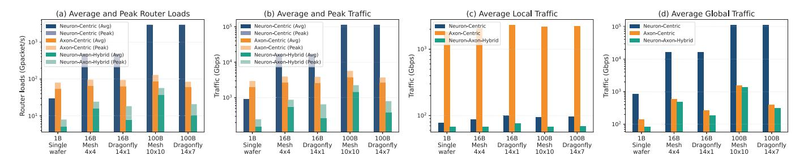
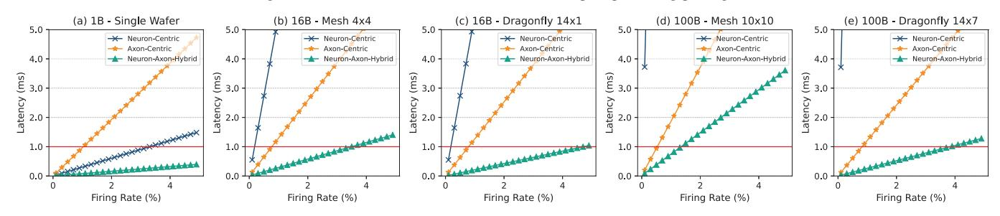
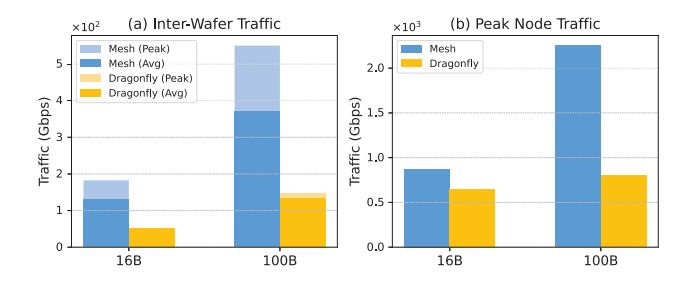

# C. Performance

1) Comparison of Processing Paradigms: We evaluate the communication performance of different neuromorphic processing paradigms. Fig. 12(a) reports the average and peak router load (packet/s), and Fig. 12(b) shows the corresponding traffic rate (bits/s). Across all configurations, NAHP consistently achieves the lowest router load and traffic, reducing

[\*] Crossbar architectures impose strict fan-in limitations, rendering them unsuitable for large-scale sparse connectivity.

Fig. 12. Communication overhead across neuromorphic processing paradigms.

Fig. 13. Per-step simulation latency comparison across neuromorphic processing paradigms. Firing rates are swept from 0.1% to 4.9% in 0.2% increments.

average traffic by  $2.6\text{--}300\times$  and peak traffic by  $2.5\text{--}140\times$  relative to the baselines. In the 1B single-wafer case, NAHP reduces average traffic by  $6.2\times$  and  $13\times$  compared to neuron-centric and axon-centric processing, respectively; in the 100B dragonfly configuration, the reductions reach  $300\times$  and  $6.9\times$ .

To analyze traffic composition, we further separate local and global components in Fig. 12(c) and Fig. 12(d), respectively. Fig. 12(c) focuses on local (intra-region) traffic. The axoncentric paradigm exhibits high local traffic due to the lack of path reuse. In contrast, neuron-centric shows much lower local traffic, while NAHP further reduces it by compressing local neuron identifiers. In the 100B dragonfly configuration, NAHP reduces local traffic by  $1.4-32 \times$  compared to the baselines. Fig. 12(d) shows the global (inter-region) traffic. Here, neuroncentric incurs the highest overhead due to highly redundant global broadcast. Axon-centric performs better, but still incurs non-trivial cost due to fully independent long-range unicasts. NAHP achieves the lowest global traffic by using region-level boundary triggering mechanism to reuse intra-region routing paths and compact global axon identifiers to reduce packet sizes. In the 100B dragonfly configuration, NAHP reduces global traffic by  $1.3-360\times$  across paradigms, consistently demonstrating its advantage at large scale. Overall, NAHP paradigm suppresses total traffic through selective routing and region-aware data layout, offering superior scalability for brain-scale neuromorphic systems.

Fig. 13 reports per-step communication latency under varying firing rates. The horizontal red line marks the 1 ms threshold, which matches the typical time step used in biological simulation experiments. Given that average firing rates in the human brain are commonly on the order of 15–30Hz, a real-time whole-brain system should sustain at least a  $\sim$ 3% per-step firing activity at a 1 ms time scale. Reaching this regime is important for enabling biological real-time brain simulation.

Fig. 14. Memory usage across processing paradigms.

Across all scales, the neuron-centric paradigm exhibits the steepest latency growth; in the 100B system, latency already exceeds 1 ms even at a 0.1% firing rate. At the 16B and 100B scales, once firing rates enter the  $\sim\!1\%$  regime, both baseline paradigms violate the 1 ms latency bound. In contrast, NAHP consistently achieves the lowest latency across firing rates and configurations, sustaining up to a 3.8% firing rate even in the 100B dragonfly deployment. Notably, at the 1B scale, NAHP increases the maximum sustainable firing rate under the 1 ms bound by  $3.7\times$  and  $12\times$  over neuron-centric and axon-centric, respectively. At the 100B dragonfly scale, the gains remain substantial at  $14\times$  and  $4.7\times$ .

We evaluate per-node storage in Fig. 14. The horizontal red line marks the common baseline of neuron state and synaptic weights (1.54GB/node; Sec. IV-B) required by all designs, and any additional storage reflects indexing overhead. Neuron-centric designs replicate global neuron directories at every node, causing index size to grow with model scale and pushing per-node storage toward terabytes at the 100B scale. In contrast, NAHP reduces indexing by using local neuron indices for intra-region connections and compact global axon

Fig. 15. Impact of interconnect topology on inter-wafer and peak node traffic.

Fig. 16. Per-step simulation latency comparison between wafer-scale and PCB-based implementations under mesh and dragonfly topologies.

indices for sparse inter-region projections. After subtracting the shared 1.54GB baseline, NAHP reduces indexing overhead by 1.2–7,400× compared to competing schemes in the 100B dragonfly configuration.

2) Impact of Inter-wafer Topology and Integration Method: We examine how inter-wafer topology affects communication efficiency under large-scale deployment. All results in this comparison use NAHP to ensure a consistent baseline across topologies. As shown in Fig. 12(b) and Fig. 12(d), both total and global traffic are sensitive to the underlying topology, especially at large scale. Compared to mesh, the switchless dragonfly reduces hop counts and mitigates traffic concentration, improving communication efficiency. In the 100B-scale configuration, it reduces global traffic by up to  $2.7\times$ , highlighting its suitability for large-scale deployments.

To further quantify the impact on inter-wafer traffic, we report the average and peak per-NC inter-wafer traffic in Fig. 15(a), which is particularly important because cross-wafer links have the highest hop latency and are typically the most expensive and throughput-limiting component in the scale-out fabric. The mesh topology exhibits severe hotspots due to limited path diversity and concentrated long-range flows. In contrast, the dragonfly topology flattens the distribution, reducing peak inter-wafer traffic by 3.4–3.7× by spreading inter-wafer routes more evenly across the network. In addition, Fig. 15(b) reports the peak traffic handled by the most congested node. Again, dragonfly reduces peak node traffic by 1.3–2.8×, directly contributing to lower communication latency and improved scalability.

We extend the step-level latency analysis to compare WSI and PCB-based implementations across interconnect topologies. In the PCB configuration, D2D delay is set to 100 ns and

router throughput to 100 Gbps as reported for Loihi [5]. As shown in Fig. 16, WSI consistently outperforms PCB-based designs due to dense on-wafer integration and low-latency inter-die links. Overall, WSI systems sustain up to 13× higher firing rates than PCB-based systems, which fail to support even a 0.5% firing rate because of board-level propagation delays and limited bandwidth. In WSI systems, topology plays a critical role. The mesh topology exhibits steeper latency growth and stronger traffic concentration at central routers, sustaining only a 1.3% real-time firing rate at the 100B scale. In contrast, the dragonfly topology benefits from a low diameter to sustain the lowest latency, achieving up to 3.8%. This corresponds to a 2.9× improvement over mesh, highlighting dragonfly's scalability advantage. PCB implementations follow the same topology-dependent trend but remain limited by their higher baseline latency, further emphasizing the necessity of dense wafer-scale links for biologically plausible real-time brainscale simulation.

#### V. Conclusion

Scaling neuromorphic computing to whole-brain models requires co-design across the processing paradigm, interconnect, and physical integration. WaferBRAIN achieves this through three key innovations: (1) A NAHP paradigm with regionlevel boundary triggering mechanism, which combines local broadcast with global unicast. This design reduces average and peak router traffic by up to  $300\times$  and  $140\times$ , lowers global traffic by up to 360×, sustains real-time operation at firing rates  $14 \times$  higher than neuron-centric and  $4.7 \times$  higher than axon-centric at 100B scale, and minimizes indexing overhead by up to  $7,400\times$ . (2) A 3D-WSI substrate that provides sufficient DRAM capacity for synaptic storage, enabling billion-neuron-scale deployment per wafer. Compared with PCB-level integration, it achieves a 13× improvement in sustainable firing rates, highlighting the critical role of dense on-wafer connectivity for real-time whole-brain simulation. (3) A switchless dragonfly inter-wafer topology, which balances global bandwidth and shortens path lengths. Compared to mesh, it reduces peak inter-wafer traffic by  $3.7\times$ , peak pernode load by  $2.8\times$ , and improves sustainable firing rates by 2.9× at the 100B scale. In summary, calibrated on a 12-inch prototype Lyra X with realistic hop latencies, these results highlight WaferBRAIN's scalability and real-time execution advantage, providing a practical path toward whole-brain digital neuromorphic simulation.

## ACKNOWLEDGEMENTS

This work was supported in part by the Key-Area Research and Development Program of Guangdong Province, China, under Grants 2023B0303030003 and 2023B0303040002, and in part by the China Postdoctoral Science Foundation under Grant 2023M740775.

