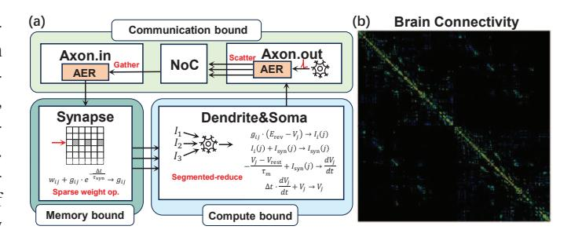

# WaferBRAIN: Whole-Brain Scale Neuromorphic Architecture Based on Wafer-Scale Integration

Yukun Feng1,2,†, Hao Jia2,†, Liangyu Gan1,2, Haoming Chu2, Yufan He2, Jiaxin Yin2, Lirong Zheng2, Ning Ma2,\*, Yuxiang Huan2,\*

1Faculty of Science and Technology, University of Macau, Macao, China 2Guangdong Institute of Intelligence Science and Technology, Guangdong, China

{fengyukun,jiahao}@gdiist.cn, yc57997@um.edu.mo, {chuhaoming,heyufan,yinjiaxin,zhenglirong,maning,yxhuan}@gdiist.cn

Abstract—Scaling neuromorphic systems to whole-brain models is constrained by inefficient processing paradigms and long, sparse off-chip links in PCB integration. We present Wafer-BRAIN, a wafer-scale neuromorphic architecture that co-designs event representation, routing, storage, and topology for wholebrain scale cortical models. WaferBRAIN adopts a neuron-axon hybrid paradigm: local broadcast within brain regions, targeted unicast across regions, and boundary-triggered scheduling to mitigate hotspots, reducing router traffic by up to 300×, latency by up to  $14\times$ , and indexing storage by up to  $7,400\times$ . For further scaling-out of the single neuromorphic wafer chips, a switchless dragonfly inter-wafer network shortens paths and balances traffic, reducing inter-wafer congestion by 3.4–3.7 $\times$ . Calibrated with a 12-inch prototype *Lyra X*, WaferBRAIN sustains the firing rates required for biological real-time simulation, achieving per-step communication latencies consistently below the 1 ms simulation time step. Furthermore, 3D Wafer-Scale Integration provides sufficient DRAM capacity to support 1B neurons and 256B synapses per wafer, and compared with neuromorphic processors by PCB-level integration, it improves sustainable firing rates by 13×. Together, these advances enable real-time whole-brain neuromorphic simulation on digital wafer-scale platforms.

Index Terms—neuromorphic architecture, 3D wafer-scale integration, whole-brain simulation, interconnect architecture

## I. INTRODUCTION

Simulating brain-scale neurodynamics is not only a milestone in neuroscience but also a key step in revealing how large-scale connectivity and event-driven computing can coexist efficiently in silicon systems. Achieving whole-brain scale simulations requires collaborative progress in both biology and engineering [20]. With recent advances in neuroscience that have mapped increasingly complete and quantitative neural connectivity atlases, the need for hardware platforms capable of handling substantial spike-event throughput in real time has become more urgent.

Large-scale neuromorphic processors generally adopt highly interconnected cores, tightly integrating computation and storage functionalities [1], [5], [6], [25], [26], [29], [42]. Moreover, neuromorphic systems leverage distributed inter-core communication links to propagate sparse spike events in parallel, thereby enhancing overall spike transmission capacity. While these platforms enabled early demonstrations of neuromorphic computing, they do not scale to substantially

† These authors contributed equally to this work. \* Corresponding authors.

Fig. 1. Comparison of PCB and wafer-scale integration. Die-to-die bandwidth denotes the communication between nodes on different dies.

larger networks. Most prior systems rely on SRAM-based or crossbar-based synaptic storage together with PCB-level multichip integration, which fundamentally constrains memory capacity and communication. At the target biological scale (100 billion neurons and 10 trillion synapses) [12], [28], a wholebrain model would require an enormous number of compute nodes. Therefore, as the network scale expands, communication bandwidth has rapidly become a major bottleneck.

Recent advances in wafer-scale integration (WSI) [22], [30], [31], [39] offer a transformative path for scaling neuromorphic systems. By leveraging advanced packaging technologies such as CoWoS [14] and 3D integration [17]-[19], wafer-scale architectures can significantly expand chip area and consolidate compute, memory, and interconnect resources within a single wafer-scale substrate. Recent advances in lithography, wafer bonding, and yield-aware routing have made it feasible to fabricate ultra-large chips with high-density metal routing layers, enabling die-to-die (D2D) latency on the order of 1 ns and bandwidths exceeding 1 Tbps [22], [31], [39], along with 3D-stacked memory capacity of up to 2 TB. Moreover, the massive core count on a single wafer reduces chip-tochip traffic and eliminates the need for costly chip-to-chip interfaces. As summarized in Fig. 1, these advantages make 3D-stacked memory WSI (3D-WSI) uniquely suited for largescale neuromorphic systems that demand extreme interconnect efficiency, low latency, and high throughput. Thus, rethinking neuromorphic architecture in the 3D-WSI context is key to practical whole-brain scale simulation.

First, 3D-WSI lifts the hard-capacity wall without consuming front-side logic area, letting each node host far more neurons and improving locality; yet the memory sys-

tem is no longer SRAM-centric. We must exploit a hierarchical memory system that keeps hot state data in SRAM and places connection data in 3D-DRAM, while redesigning data structures (contiguity-aware adjacency blocks, compressed IDs, coalesced DMA/prefetch) to balance compute–communication–memory and amortize DRAM latency. At whole-brain scale, multi-wafer deployment becomes necessary; adopting a low-diameter inter-wafer fabric instead of a mesh or torus reduces hop counts and hotspots, thereby lowering traffic and latency.

Second, mainstream communication schemes and connection representations impose substantial traffic and storage overheads. For spike-event transmission, unicast fails to exploit shared-path reuse, concentrating load near sources and increasing cumulative hop cost; broadcast floods the network with redundant traffic; and multicast relies on large per-node routing tables that inflate memory. On the connectivity side, neuroncentric indexing is redundant (storing large fan-in entries), while crossbar-based organizations cap fan-in and fare poorly on sparse, irregular networks. As systems toward whole-brain scale, these costs compound, turning interconnect traffic and indexing/memory usage into first-order bottlenecks.

Motivated by the limits of conventional neuromorphic systems and the emerging potential of 3D-WSI, we propose WaferBRAIN, a wafer-scale neuromorphic architecture for whole-brain simulation. WaferBRAIN introduces a neuronaxon hybrid processing (NAHP) paradigm that marries the path-reuse benefits of neuron-driven broadcast with the selectivity of axon-driven unicast, reducing both traffic and indexing overheads. Connectivity is organized hierarchically: neuron-driven broadcast within regions for dense local fanout, and axon-driven unicast across regions for sparse longrange projections. A region-level boundary-triggered mechanism relocates inter-region unicasts to boundary nodes, further reducing hotspots and cumulative hop cost. On the memory side, WaferBRAIN employs a wafer-native hierarchy: hot neuron state and event queues reside in on-chip SRAM, while synapses and fan-in/out metadata are placed in 3Dstacked DRAM using compact identifiers and contiguity-aware adjacency blocks to enable coalesced DMA-balancing compute, communication, and memory. For scale-out, we combine a switchless-dragonfly fabric with WC-to-NC sharding and preplanned deterministic unicast paths, providing low diameter and high throughput for brain-scale sparse communication. We evaluate WaferBRAIN on brain-scale workloads, reporting communication traffic, storage cost, topology efficiency, and single-step latency. The main contributions of this work are:

- We present WaferBRAIN, a neuromorphic architecture on 3D-WSI that co-designs topology, routing, and connection representation, enabling 1B-neuron simulation on a single 12-inch wafer.
- We provide a systematic analysis of neuron-centric and axon-centric paradigms, identifying scaling limits in routing reuse, indexing overhead, and memory under brainscale connectivity.
- We propose a region-level boundary-triggered NAHP

Fig. 2. (a) Event-driven SNN computation and dominant bottlenecks. AER: Addressing Event Representation. (b) Structural connection matrix of the human brain: dense intra-regional connections and sparse inter-regional projections [13].

- scheme that combines local neuron-driven broadcast and global axon-driven unicast, reducing traffic by  $2.6-300 \times$  and single-step latency by  $4.7-14 \times$  at whole-brain scale.
- We design NAHP's storage organization as a wafer-native hierarchy that keeps hot neuron state and spike queues in on-chip SRAM, while placing synapses and axon-in/out in 3D-stacked DRAM. With compact identifiers and contiguity-aware adjacency blocks for coalesced DMA, it reduces indexing overhead by up to 7,400×.
- We present a switchless dragonfly scale-out fabric and routing design: table-free mesh-XY on-wafer; small route info to select the egress across the node/wafer/POD hierarchy; and per-egress sharding with preallocated deterministic routes that materialize unicast paths. The fabric lowers peak traffic by 2.8×, and achieves 13× lower latency than PCB-level integration and 2.9× lower latency than a 2D-mesh baseline.

