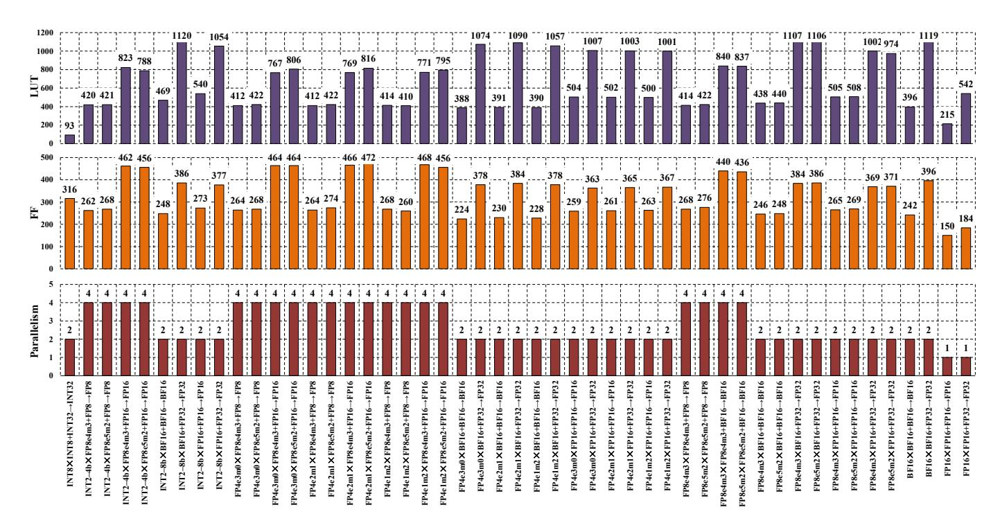
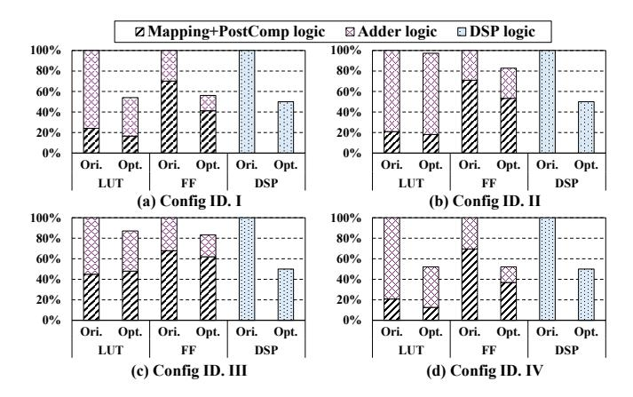
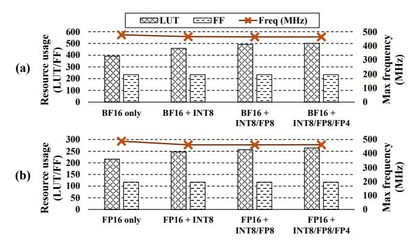
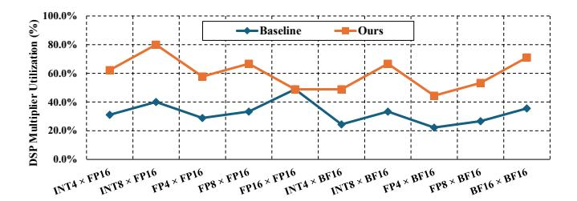
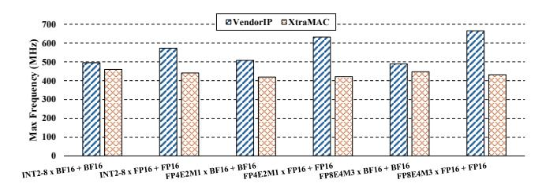
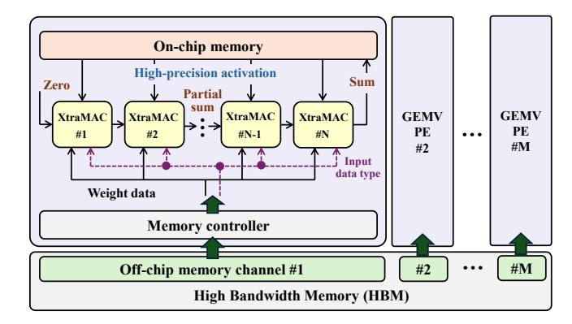
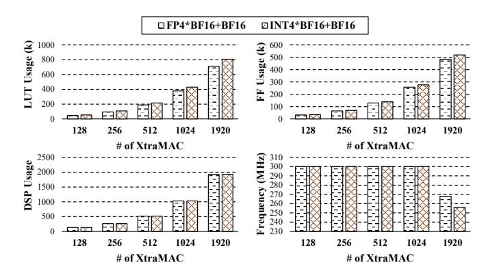
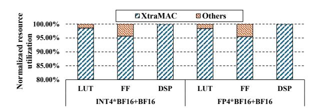
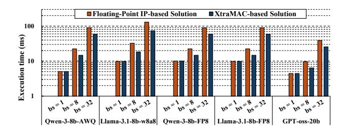

# *A. Experimental Setting*

All designs, including XtraMAC and the baselines, are implemented using Vivado 2022.2 and Vitis 2022.2 on the AMD Xilinx Alveo U55c FPGA card. To ensure a fair comparison, we apply the same tool configurations and compilation settings across all implementations. For floating-point operations, we adopt the round-to-nearest-even (RN-even) rounding mode and flush subnormal inputs to zero. For integer operations, we use two's-complement signed representation, apply saturation on overflow, and truncate extra bits during accumulation.

## *B. Mixed-Precision Evaluation*

We evaluate XtraMAC under various datatype configurations to analyze its mixed-precision capability and adaptive parallelism. In this subsection, each row in Fig. [6](#page-7-0) corresponds to a standalone MAC instance synthesized with a

Fig. 6. Resource consumption and parallelism of XtraMAC across all  $A \times B + C \rightarrow P$  configurations. For brevity, constant metrics (DSP = 1, latency = 4 cycles, II = 1) are omitted. The full exponent-mantissa formats (e.g., E4M3, E5M2) are shown only at the first occurrence of each data type configuration.

single active datatype configuration, and XtraMAC's runtime datatype switching mechanism is disabled. Fig. 6 reports resource consumption for LUT, FF, and DSP usage, along with performance metrics including latency, initiation interval, and achievable parallelism. Across all configurations, XtraMAC maintains a four-cycle latency and an initiation interval of one, indicating that datatype variation does not affect pipeline depth. In general, lower-precision formats such as FP4 and FP8 achieve higher packing parallelism (up to four MAC lanes per DSP), whereas higher-precision formats like BF16 are limited to two lanes per DSP because their wider mantissas reduce spatial packing opportunities.

For detailed resource characterization, the integer mode (INT8×INT8→INT32) provides two-way parallelism with the lowest LUT usage among all evaluated configurations. Floating-point configurations require substantially more LUTs and FFs due to the mantissa-alignment logic in the floating-point adder, where the barrel shifter dominates resource consumption. As the adder bitwidth increases, both the shift range and the shifter complexity grow super-linearly, leading to a significant increase in LUT and FF utilization.

#### C. Runtime Datatype Switching Evaluation

We evaluate the hardware efficiency of runtime datatype switching using representative datatype combinations derived from Fig. 1. Table III summarizes the post-synthesis resource consumption of XtraMAC for all evaluated cases. Across these configurations, XtraMAC maintains a constant DSP cost, shares LUT and FF usage across the supported datatypes, and preserves a latency of four clock cycles and an initiation

TABLE III
RESOURCE CONSUMPTION FOR RUNTIME-SWITCHING EVALUATION.

| Config ID | Data Type Combinations                | Model Name(s)                    | LUT | FF  | DSP |
|-----------|---------------------------------------|----------------------------------|-----|-----|-----|
| I         | INT4×BF16 + BF16 BF16×BF16 + BF16  | Qwen3-8b-AWQ                     | 436 | 302 | 1   |
| П         | INT8×INT8 + INT32 BF16×BF16 + BF16 | Llama-3.1-8b-W8A8                | 568 | 513 | 1   |
| Ш         | FP8×FP8 + BF16 BF16×BF16 + BF16    | Qwen3-8b-FP8 Llama-3.1-8b-FP8 | 948 | 622 | 1   |
| IV        | FP4×BF16 + BF16 BF16×BF16 + BF16   | GPT-oss-20b †         | 395 | 274 | 1   |

 $^\dagger$  The multiplication of UE8M0 with BF16 in GPT-oss-20b is implemented by offsetting the BF16 exponent, so it is not treated as a separate MAC operation.

interval of one. To quantify the benefits of resource sharing, Fig. 7 further breaks down LUT and FF usage into mapping and post-processing logic, arithmetic logic, and adder logic.

Config I reuses both the arithmetic core and the adder unit, while the mapping logic remains separate because integer and floating-point operands require different alignment procedures. As a result, the LUT and FF usage of the adder logic is reduced by approximately 50% relative to a naive design that instantiates separate MAC units for each datatype, whereas the mapping cost shows almost no change. Config II shares only the arithmetic core, as INT32 and BF16 accumulations follow different normalization and saturation rules. Moreover, the mapping logic cannot be reused because integer formats do not include exponent alignment, leading to negligible resource reduction. Config III enables partial reuse of the BF16 adder lanes because FP8 and BF16 operate at different levels of

Fig. 7. Normalized resource breakdown for different Config IDs in Table III.

vector parallelism, four lanes versus two lanes. In this case, two of the four BF16 adder lanes can be shared directly to FP8 adders, which provides approximately 30% LUT and FF savings in the adder logic. Config IV achieves near-complete reuse across the mapping, arithmetic, and adder units. Both MAC types operate with a parallelism of two, and FP4 operands can be expanded to BF16 by zero-padding without requiring exponent alignment or rounding adjustment. This compatibility enables full hardware sharing and results in the lowest LUT and FF utilization among all configurations.

## D. Scalability Evaluation of XtraMAC

To evaluate the scalability of XtraMAC, we progressively increase the number of supported datatype combinations starting from BF16 and FP16 MAC baselines, incrementally enabling INT8, FP8 (E4M3), and FP4 (E2M1) mixed-precision modes. At each stage, we synthesize the design and measure FPGA resource utilization and maximum frequency. As shown in Fig. 8, LUT usage increases gradually as additional datatypes are enabled, due to the extra peripheral logic required for operand mapping and post-compute normalization. DSP usage remains constant across all configurations, confirming that the core multiplier is fully shared across all formats. The maximum frequency decreases slightly, from 483 MHz to 462 MHz, indicating that XtraMAC scales gracefully with the number of supported datatypes.

## E. Comparison with SOTA MAC IPs on FPGAs

1) Mixed-precision comparison: We compare XtraMAC with the AMD Xilinx Floating-Point Operator IP [1], the vendor's standard MAC implementation for floating-point data formats. Both designs use a non-blocking AXI interface, RN-even rounding, and flush subnormal values to zero. All implementations operate with an initiation interval (II) of 1 and same latency for a fair comparison, and resource utilization is reported after synthesis. Since the vendor operator does not support mixed-precision computation, we augment it with a commonly used open-source integer-to-floating-point conversion module [10], [17] to enable mixed-precision inputs.

Table IV reports resource consumption normalized by parallelism under representative mixed-precision operand formats;

Fig. 8. Scalability evaluation of XtraMAC with increasing mixed-precision datatype support, using a single DSP slice. (a) FP16-based MAC, progressively adding INT8, FP8, and FP4 multiplier operand datatypes. (b) BF16-based MAC, progressively adding the same multiplier operand datatypes.

TABLE IV
NORMALIZED RESOURCE UTILIZATION COMPARISON BY PARALLELISM.

| Type(A)† | Type(B) | Type(C) | Type(P) | Res. | VendorIP [1] | XtraMAC ‡ | Red.(%) | Comp.Den.(†) |
|----------|---------|---------|---------|------|--------------|----------------------|---------|--------------|
|          |         |         |         | LUT  | 331          | 235                  | 29.0%   | 1.4x         |
| INT2-8   | BF16    | BF16    | BF16    | FF   | 222          | 124                  | 44.1%   | 1.8x         |
|          |         |         |         | DSP  | 1            | 0.5                  | 50.0%   | 2.0x         |
|          |         |         |         | LUT  | 387          | 270                  | 30.2%   | 1.4x         |
| INT2-8   | FP16    | FP16    | FP16    | FF   | 262          | 137                  | 47.7%   | 1.9x         |
|          |         |         |         | DSP  | 1            | 0.5                  | 50.0%   | 2.0x         |
|          |         |         |         | LUT  | 301          | 196                  | 34.9%   | 1.5x         |
| FP4      | BF16    | BF16    | BF16    | FF   | 226          | 115                  | 49.1%   | 2.0x         |
|          |         |         |         | DSP  | 1            | 0.5                  | 50.0%   | 2.0x         |
|          |         |         |         | LUT  | 357          | 251                  | 29.7%   | 1.4x         |
| FP4      | FP16    | FP16    | FP16    | FF   | 266          | 131                  | 50.8%   | 2.0x         |
|          |         |         |         | DSP  | 1            | 0.5                  | 50.0%   | 2.0x         |
|          |         |         |         | LUT  | 301          | 219                  | 27.2%   | 1.4x         |
| FP8      | BF16    | BF16    | BF16    | FF   | 226          | 123                  | 45.6%   | 1.8x         |
|          |         |         |         | DSP  | 1            | 0.5                  | 50.0%   | 2.0x         |
|          |         |         |         | LUT  | 357          | 253                  | 29.1%   | 1.4x         |
| FP8      | FP16    | FP16    | FP16    | FF   | 266          | 133                  | 50.0%   | 2.0x         |
|          |         |         |         | DSP  | 1            | 0.5                  | 50.0%   | 2.0x         |

† FP4 = E2M1, FP8 = E4M3.

we divide each design's total LUT, FF, and DSP usage by its number of MAC lanes to obtain per-operation utilization. Across these configurations, XtraMAC reduces LUT usage by an average of 30.0%, FF usage by 47.9%, and DSP usage by 50.0% compared with the vendor IP. These reductions stem from XtraMAC 's adaptive parallelism for low-precision computation, which packs multiple mixed-precision lanes into a single DSP slice and increases effective multiplier utilization. Moreover, the bit-mapping datapath eliminates redundant bit operations and datatype-specific logic, reducing overall LUT and FF overhead. As illustrated in Fig. 9, our data-packing strategy sustains high DSP utilization across all datatype combinations, enabling substantially more resource-efficient MAC execution than the vendor IP [1]. We further report compute density for LUTs, FFs, and DSPs as the ratio between the vendor IP resource usage and the XtraMAC usage; across all evaluated formats and resource types, XtraMAC achieves a compute density improvement between  $1.4\times$  and  $2.0\times$ , indicating that each unit of hardware contributes more effective compute capability.

We further evaluate the maximum frequency against the vendor IP with a single DSP slice. As shown in Fig. 10,

THE LEMM, FIG. 124MJ.

The LEMM, IT & LEMM, IT & LEMM, IT & LEMM, IT & LEMM, IT & LEMM, IT & LEMM, IT & LEMM, IT & LEMM, IT & LEMM, IT & LEMM, IT & LEMM, IT & LEMM, IT & LEMM, IT & LEMM, IT & LEMM, IT & LEMM, IT & LEMM, IT & LEMM, IT & LEMM, IT & LEMM, IT & LEMM, IT & LEMM, IT & LEMM, IT & LEMM, IT & LEMM, IT & LEMM, IT & LEMM, IT & LEMM, IT & LEMM, IT & LEMM, IT & LEMM, IT & LEMM, IT & LEMM, IT & LEMM, IT & LEMM, IT & LEMM, IT & LEMM, IT & LEMM, IT & LEMM, IT & LEMM, IT & LEMM, IT & LEMM, IT & LEMM, IT & LEMM, IT & LEMM, IT & LEMM, IT & LEMM, IT & LEMM, IT & LEMM, IT & LEMM, IT & LEMM, IT & LEMM, IT & LEMM, IT & LEMM, IT & LEMM, IT & LEMM, IT & LEMM, IT & LEMM, IT & LEMM, IT & LEMM, IT & LEMM, IT & LEMM, IT & LEMM, IT & LEMM, IT & LEMM, IT & LEMM, IT & LEMM, IT & LEMM, IT & LEMM, IT & LEMM, IT & LEMM, IT & LEMM, IT & LEMM, IT & LEMM, IT & LEMM, IT & LEMM, IT & LEMM, IT & LEMM, IT & LEMM, IT & LEMM, IT & LEMM, IT & LEMM, IT & LEMM, IT & LEMM, IT & LEMM, IT & LEMM, IT & LEMM, IT & LEMM, IT & LEMM, IT & LEMM, IT & LEMM, IT & LEMM, IT & LEMM, IT & LEMM, IT & LEMM, IT & LEMM, IT & LEMM, IT & LEMM, IT & LEMM, IT & LEMM, IT & LEMM, IT & LEMM, IT & LEMM, IT & LEMM, IT & LEMM, IT & LEMM, IT & LEMM, IT & LEMM, IT & LEMM, IT & LEMM, IT & LEMM, IT & LEMM, IT & LEMM, IT & LEMM, IT & LEMM, IT & LEMM, IT & LEMM, IT & LEMM, IT & LEMM, IT & LEMM, IT & LEMM, IT & LEMM, IT & LEMM, IT & LEMM, IT & LEMM, IT & LEMM, IT & LEMM, IT & LEMM, IT & LEMM, IT & LEMM, IT & LEMM, IT & LEMM, IT & LEMM, IT & LEMM, IT & LEMM, IT & LEMM, IT & LEMM, IT & LEMM, IT & LEMM, IT & LEMM, IT & LEMM, IT & LEMM, IT & LEMM, IT & LEMM, IT & LEMM, IT & LEMM, IT & LEMM, IT & LEMM, IT & LEMM, IT & LEMM, IT & LEMM, IT & LEMM, IT & LEMM, IT & LEMM, IT & LEMM, IT & LEMM, IT & LEMM, IT & LEMM, IT & LEMM, IT & LEMM, IT & LEMM, IT & LEMM, IT & LEMM, IT & LEMM, IT & LEMM, IT & LEMM, IT & LEMM, IT & LEMM, IT & LEMM, IT & LEMM, IT & LEMM, IT & LEMM, IT & LEMM, IT & LEMM, IT & LEMM, IT & LEMM, IT & LEMM, IT & LEMM, IT & LEMM, IT & LEMM, IT & LEMM, IT & LEMM, IT & LEMM,

Fig. 9. DSP utilization under different data types. (FP8=E4M3, FP4=E2M1).

Fig. 10. Maximum frequency comparison with a single DSP slice.

XtraMAC runs on average 22% slower than the vendor IP [1] based MAC implementation. This reduction is expected: each XtraMAC configuration provides  $2\times$  data parallelism per DSP compared to the  $1\times$  baseline, which increases peripheral LUT and FF usage and introduces heavier routing congestion. Despite the frequency reduction, all XtraMAC configurations exceed 400 MHz, well above the typical operating frequency of FPGA accelerator deployments. Because the  $2\times$  parallelism doubles the per-DSP throughput, XtraMAC still delivers approximately  $1.56\times$  higher effective throughput per DSP even after accounting for the frequency gap, confirming that the improved compute density more than compensates for the modest frequency overhead.

2) Runtime datatype switching comparison: We evaluate XtraMAC's capability to switch between data formats dynamically during execution. Two baselines are included for comparison: the vendor's IP [1] with spatial replication of INT8 and BF16 MAC units, and the TATAA accelerator [38]. All designs alternate between INT8-based and BF16-based MAC operations to emulate workloads that require runtime datatype switching. Resource per operation is obtained by dividing the total resources by the number of BF16 or INT8 lanes realized in each design. For a fair comparison, all implementations use identical interface configurations and operate with an initiation interval (II) of 1 and a four-cycle latency.

Table V shows that XtraMAC provides substantial reductions in per-operation resource consumption under runtime precision switching. Relative to TATAA [38], XtraMAC reduces LUT usage by 59.7%, FF usage by 72.5%, and DSP usage by 93.8%. Relative to the vendor IP [1], the reductions are 35.5% for LUTs, 58.7% for FFs, and 75.0% for DSPs. These results indicate that XtraMAC achieves significantly higher hardware efficiency for floating-point computation while maintaining reasonable per-INT8 resource usage compared to INT8-optimized designs such as TATAA [38].

The inefficiency of the baselines in floating-point compu-

TABLE V
Normalized resource consumption per operation.

| Design                  |   | Resource per BF16 operation |       |      |   | Resource per INT8 operation |       |      |
|-------------------------|---|-----------------------------|-------|------|---|-----------------------------|-------|------|
|                         |   | LUT                         | FF    | DSP  |   | LUT                         | FF    | DSP  |
| Vendor IP [1]           |   | 220.0                       | 310.5 | 1    |   | 110.0                       | 155.3 | 0.5  |
| TATAA [38] † |   | 352.0                       | 467.0 | 4    |   | 22.0                        | 29.2  | 0.25 |
| XtraMAC                 | 1 | 142.0                       | 128.3 | 0.25 | 1 | 142.0                       | 128.3 | 0.25 |

† For TATAA, we evaluate only the FP adder and multiplier and omit the fapp units (approximate sqrt/div), yielding lower resource usage than the full design in [38].

Fig. 11. Mixed-precision GEMV architecture based on XtraMAC.

tation arises from how each design handles datatype heterogeneity. The vendor IP [1] spatially replicates independent INT8 and BF16 pipelines, preventing reuse of arithmetic or alignment logic across precisions and thereby duplicating hardware. TATAA [38] instead maps BF16 MACs onto its INT8 datapath, but must decompose each BF16 operation into multiple INT8 micro-operations with additional control and operand-adjustment hardware, which reduces utilization and BF16 efficiency. In contrast, XtraMAC employs a shared bit-mapping front-end that normalizes heterogeneous formats before entering the arithmetic core, so all precisions reuse the same multiplier—adder pipeline without duplication, substantially improving overall hardware efficiency under the same resource budget.

#### VI. CASE STUDY: MIXED-PRECISION LLM INFERENCE

This section demonstrates how XtraMAC can be integrated into a practical tile-based GEMV pipeline and quantifies its benefits for mixed-precision LLM inference. We first describe the system-level integration of XtraMAC, then characterize the mixed-precision requirements of representative LLM workloads. Next, we evaluate a mixed-precision GEMV kernel based on XtraMAC and compare it against state-of-the-art GPU kernels. Finally, we extend an analytical simulation framework to estimate end-to-end LLM inference latency using XtraMAC-accelerated GEMV operators.

#### A. Integration of XtraMAC into Tile-Based GEMV

Figure 11 illustrates how XtraMAC is incorporated into a tile-parallel GEMV engine. Modern FPGA GEMV pipelines [23], [42] implement streaming multiply–accumulate (MAC) chains within each processing element (PE), where

| TABLE VI                                          |  |
|---------------------------------------------------|--|
| REPRESENTATIVE QUANTIZED LLM DEPLOYMENT PROFILES. |  |

| Checkpoints           | Downloads* | Practical use cases †                                                                                        |
|-----------------------|------------|-------------------------------------------------------------------------------------------------------------------------|
| Qwen-3-8B- AWQ     | 222,126    | Edge AI reasoning with 2–3% accuracy loss; long-context NLP with 91–97% benchmark retention and a 4× context extension. |
| Llama-3.1-8B- W8A8 | 27,536     | Commercial chatbots with 50% memory reduction, 2× throughput, and 99–100% accuracy for multilingual customer service.   |
| Qwen-3-8B- FP8     | 429,968    | Local agentic tasks and data analytics workflows; supports 131k-token contexts for scalable multilingual RAG.           |
| Llama-3.1-8B- FP8  | 168,122    | Multilingual assistants with 99.52% accuracy recovery; optimized for fast commercial API deployments.                   |
| GPT-oss-20B           | 4,633,438  | Consumer fine-tuning, customizable inference latency, and low-latency analysis for agent-based data research.           |

\* Download counts recorded on HuggingFace during October 2025.

weights are supplied directly from HBM and activations are buffered on-chip for reuse. XtraMAC preserves this interface and replaces the scalar MACs in prior designs without modifying the PE topology, tiling strategy, or global dataflow.

During execution, each wide memory-interface word (typically 256 or 512 bits) read from HBM is split into perlane weight segments and dispatched to the corresponding XtraMAC instances within the PE. Each XtraMAC instance receives its weight segment alongside the corresponding activation value from the on-chip buffer. A per-tile datatype control signal, stored in memory alongside the weight tiles, is propagated synchronously with the operands to all XtraMAC units within the tile, ensuring that each instance applies the correct mapping rule and accumulation path at runtime. The resulting per-lane partial sums are accumulated across the cascaded MAC chain and written back as the final GEMV output, with multiple PEs operating concurrently across HBM channels to preserve bandwidth-scaling behavior.

## B. Mixed-Precision Requirements in LLM Workloads

Modern LLM deployments such as Llama [16], Qwen [41], and GPT-oss [30] heavily rely on quantization to reduce memory footprint and latency while preserving accuracy. Rather than adopting a single numeric format, practical systems combine integer and floating-point datatypes across layers. As summarized in Table I, weight-only quantization uses integer weights with FP activations; weight-activation approaches quantize both operands; and mixed-format checkpoints (e.g., GPT-oss) interleave FP4/FP8 with BF16 for stability. Table VI profiles representative quantized checkpoints deployed in multilingual assistants, long-context RAG, and on-device LLMs. Collectively, these models indicate active deployment of INT4, FP4, and FP8 formats and highlight the need for GEMV engines that natively support mixed-precision and runtime datatype switching.

## C. Mixed-Precision GEMV Kernel Evaluation

Across all evaluated models, these two patterns consistently dominate decode-time GEMV: (i) INT4×BF16→BF16 and

Fig. 12. Post-implementation resource usage (LUT, FF, DSP) and frequency for mixed-precision GEMV kernel with various numbers of XtraMAC.

(ii) FP4×BF16→BF16. These two patterns therefore serve as representative GEMV kernels for evaluating XtraMAC. All FPGA experiments are conducted on an AMD Xilinx U55c accelerator card equipped with 32 HBM channels. The XtraMAC-based GEMV kernel is synthesized and implemented using Vivado 2022.2 and Vitis 2022.2 with postplace-and-route timing. Power consumption is measured using xbutil under steady-state streaming. For comparison, GPU baselines are conducted on an NVIDIA H100 PCIe card using CUTLASS [29]; execution time is measured with official GEMV kernels, and power is monitored using nvidia-smi. This setup ensures a consistent and reproducible evaluation environment across both platforms.

To exploit HBM bandwidth, the GEMV workload is partitioned into M tiles, each mapped to a processing element (PE) connected to a distinct HBM channel. Weights are stored in HBM, whereas activations are buffered on-chip. Inside each PE, the dot product is realized through a chain of cascaded XtraMAC modules. For a given HBM-channel bitwidth, weight precision, and datatype-dependent parallelism P, the number of cascaded XtraMAC instances per channel is determined by

$$N_{\rm MAC} = \frac{\rm BitWidth_{channel}}{\rm BitWidth_{weight} \times P}$$

In implementation, each HBM channel provides a 512-bit interface; with INT4 weights (4 bits) and P=2 lanes per XtraMAC, a single channel supplies  $512/(4\times2)=64$  MAC inputs per cycle. Thus, a design with 32 HBM channels can instantiate up to 2048 XtraMAC instances in principle, while our implementation adopts a configuration with 1920 cascaded XtraMAC instances (spread across 30 active HBM channels) to reserve one channel for activation read and one for writeback, and to ensure routing timing closure.

Post-implementation results in Figure 12 indicate that LUT, FF, and DSP utilization scale linearly with the number of instantiated XtraMAC modules. The design sustains 300 MHz across configurations up to 1024 instances and exhibits only moderate frequency degradation (250–270 MHz) at 1920 instances due to routing congestion near the HBM interface. Because the kernel is bandwidth-bound at scale, these timing

† Accuracy loss in use cases only reflects model-level quantization effects.

Fig. 13. System-level resource breakdown (512-XtraMAC configuration).

TABLE VII
COMPARISON OF MIXED-PRECISION GEMV PERFORMANCE.

| $1\times4096\times4096\;\mathbf{GEMV}$ |                         |                  |                           |              |              |  |  |
|----------------------------------------|-------------------------|------------------|---------------------------|--------------|--------------|--|--|
| Design                                 | Time (ms)               | Power (W)        | Energy (J)                | Speedup      | Energy Eff.  |  |  |
| CUTLASS (H100) XtraMAC (U55c)       | 0.0294 <b>0.0246</b> | 135 <b>85</b> | 0.00397 <b>0.00209</b> | 1.0× 1.2× | 1.0× 1.9× |  |  |
| $1\times4096\times12288\;\text{GEMV}$  |                         |                  |                           |              |              |  |  |
| Design                                 | Time (ms)               | Power (W)        | Energy (J)                | Speedup      | Energy Eff.  |  |  |
| CUTLASS (H100) XtraMAC (U55c)       | 0.0879 <b>0.0743</b> | 135 <b>85</b> | 0.01187 <b>0.00632</b> | 1.0× 1.2× | 1.0× 1.9× |  |  |

reductions have negligible impact on overall throughput. Figure 13 further presents the system-level resource breakdown under the 512-XtraMAC configuration. The XtraMAC instances dominate resource consumption, accounting for 98.5% of LUTs, 95.6% of FFs, and 100% of DSPs. The remaining resources are consumed by supporting logic, including datatype control registers and on-chip activation buffers. HBM controllers reside in the Alveo static shell [2] and are excluded from user-logic resource accounting. All non-MAC components are registered in parallel with the operand datastream and introduce no additional pipeline stages, preserving the fixed latency and II = 1 of the MAC pipeline.

Table VII presents the performance comparison against the H100 GPU. Despite the GPU's substantially higher peak memory bandwidth (2 TB/s versus 460 GB/s), the XtraMAC-based FPGA kernel achieves  $1.2\times$  lower latency and  $1.9\times$  higher energy efficiency on the  $1\times4096\times4096$  and  $1\times4096\times12288$  GEMV workloads. These gains arise from the efficient mixed-precision MAC datapath in XtraMAC, the absence of format-conversion overheads, and the kernel's ability to sustain high effective HBM utilization (approximately 74%). As a result, the FPGA design operates close to its bandwidth roofline and surpasses the GPU on bandwidth-bound GEMV workloads.

#### D. End-to-End Mixed-Precision LLM Inference Simulation

We evaluate system-level behavior using the analytical framework of [7], which models transformer layers as alternating compute and memory phases under idealized streaming and weight-reuse assumptions. All models in Table VI are simulated on the AMD Alveo V80 accelerator (2.6M LUTs, 10,848 DSPs, 300 MHz, and 810 GB/s HBM). The baseline instantiates the vendor Floating-Point IP using the resource profiles in Table IV, while our configuration replaces these units with XtraMAC. All other components, including datatype packing rules, checkpoint-derived MAC counts, and tiling behavior, are kept fixed so that performance differences reflect only the arithmetic-unit density.

Fig. 14. Decode-stage execution time for different LLMs at context length 512 and batch sizes  $\{1, 8, 32\}$ .

Figure 14 reports decode latency at a context length of 512 for batch sizes  $\{1, 8, 32\}$ . At batch size 1, all five evaluated models (Qwen-3-8B-AWQ, Llama-3.1-8B-W8A8, Qwen-3-8B-FP8, Llama-3.1-8B-FP8, and GPT-oss-20B) operate in a memory-bound regime. Weight streaming dominates the end-to-end latency (approximately 4.4–10.0 ms), and compute differences between the baseline and XtraMAC have negligible impact. As the batch size increases, the compute workload grows while the weight-fetch cost remains nearly constant, placing all models in a compute-bound regime at batch sizes 8 and 32. In this region, the reduced LUT and DSP footprint of XtraMAC enables more MAC units to be instantiated on the FPGA platform, which produces consistent reductions in total latency. At batch size 32, XtraMAC delivers improvements ranging from  $1.5 \times$  to  $1.8 \times$  for the end-to-end LLM inference task. These trends align with the proportion of mixed-precision GEMV operations in each model and confirm that arithmeticunit density, rather than memory bandwidth, becomes the dominant performance limiter at large batch sizes.

## E. Design Guidelines

In this subsection, we summarize several guidelines for integrating XtraMAC into system-level designs.

First, XtraMAC maintains a constant latency and an initiation interval of one across all supported datatypes, and can therefore serve as a drop-in replacement for scalar MAC units in existing GEMV/GEMM pipelines, requiring no changes to pipeline depth, scheduling logic, or interface timing. Second, runtime datatype switching is equally straightforward: a pertile control signal propagated synchronously with the operand datastream is sufficient, so mixed-precision workloads can be scheduled as if all datatypes share a single unified pipeline, without the need for pipeline flushes or reconfiguration. Last, from a quantization perspective, lane packing efficiency scales inversely with operand bitwidth. Sub-8-bit quantization schemes (e.g., INT4, FP4) can therefore be prioritized in FPGA deployments to maximize per-DSP parallelism, directly translating into higher overall throughput.

#### VII. RELATED WORK

In this section, we review existing approaches to mixedprecision MAC computation and runtime datatype switching, and position XtraMAC against their remaining limitations.

## *A. Fixed-Precision Designs*

General-purpose processors expose multiple numerical formats via fixed hardware pipelines. Modern CPUs support integer and low-precision floating-point arithmetic through instruction-set extensions such as AVX-512, AMX, and ARM SVE, while GPUs accelerate machine learning workloads using Tensor Cores with support for FP16, BF16, FP8, and INT8 [\[27\]](#page-13-11), [\[28\]](#page-13-12). Domain-specific accelerators such as Google TPU [\[15\]](#page-12-15), [\[18\]](#page-13-21), [\[37\]](#page-13-22) employ systolic arrays optimized for a fixed set of precisions (e.g., BF16 and INT8), with each datatype served by dedicated compute pipelines. However, across all these designs, mixed-precision computation is handled either by upcasting low-precision operands to a common high-precision format, or by routing different datatypes through physically separated execution pipelines. Both strategies leave hardware resources idle when only a subset of datatypes is active, and neither exploits the fine-grained bitlevel parallelism available within a shared datapath.

## *B. Configurable-Precision Designs*

A second class of designs introduces runtime precision adaptivity. BitFusion [\[33\]](#page-13-23) fuses 2-bit processing elements dynamically to match the integer bitwidth of each DNN layer. Stripes [\[19\]](#page-13-24) employs bit-serial computation so that execution latency scales proportionally with operand precision. OLAccel [\[31\]](#page-13-25) supports operand-level precision variability through heterogeneous MAC units and temporal decomposition. More recently, FlexiBit [\[34\]](#page-13-26) proposes a configurable bit-parallel reduction tree supporting arbitrary FP and INT precisions, including non-power-of-two formats. However, BitFusion [\[33\]](#page-13-23), Stripes [\[19\]](#page-13-24), and OLAccel [\[31\]](#page-13-25) support only integer formats and lack native floating-point computation. FlexiBit, while supporting FP formats, is an ASIC design and thus requires hardware re-fabrication to accommodate new quantization schemes. None of these designs support cycle-level runtime switching between heterogeneous INT and FP formats within a shared datapath.

XtraMAC bridges these gaps by unifying integer, floatingpoint, and mixed-precision multiplication within a single resource-compact FPGA datapath. By reducing all MAC formats to a shared integer mantissa product and decoupling accumulation paths, XtraMAC achieves cycle-level runtime datatype switching with constant latency and high throughput.

## VIII. CONCLUSION

MAC operations dominate the computational cost of modern LLM inference, yet existing FPGA MAC designs remain inefficient because they either upcast low-precision operands or replicate datatype-specific datapaths, resulting in poor DSP utilization and limited runtime flexibility. This work introduces XtraMAC, a compact, datatype-adaptive MAC architecture that supports mixed-precision computation with cycle-level runtime switching. The key architectural novelty of XtraMAC lies in unifying INT and FP formats through a shared integerproduct formulation, enabling multiple low-precision lanes to be packed within a single DSP while maintaining a fixed latency. Compared with state-of-the-art MAC designs, Xtra-MAC significantly improves hardware efficiency, delivering 1.4–2.0× higher compute density while reducing LUT, FF, and DSP usage by 30.0%, 47.9%, and 50.0%, respectively.

## ACKNOWLEDGMENT

This work is supported by the Ministry of Education AcRF Tier 3 grant, Singapore (MOE-MOET32024-0003), and a Google Gift 2025. We also thank the AMD Heterogeneous Accelerated Compute Clusters (HACC) program [\[3\]](#page-12-16) for the generous hardware donation.

## REFERENCES

- [1] *AMD Xilinx Floating-Point Operator v7.1 LogiCORE IP Product Guide (PG060)*, Advanced Micro Devices, Inc., accessed Oct. 2025. [Online]. Available:<https://docs.amd.com/v/u/en-US/pg060-floating-point>
- [2] AMD, "Alveo U55C accelerator card: Support and downloads," [https://www.amd.com/en/products/accelerators/alveo/u55c/a-u55c](https://www.amd.com/en/products/accelerators/alveo/u55c/a-u55c-p00g-pq-g.html)[p00g-pq-g.html,](https://www.amd.com/en/products/accelerators/alveo/u55c/a-u55c-p00g-pq-g.html) accessed Oct. 2025.
- [3] AMD Xilinx, "Heterogeneous accelerated compute cluster (HACC) at NUS," [https://xacchead.ddns.comp.nus.edu.sg/,](https://xacchead.ddns.comp.nus.edu.sg/) accessed Oct. 2025.
- [4] AMD Xilinx, Inc., "Vivado design suite reference guide: Modelbased dsp design using system generator (ug958)," accessed Oct. 2025. [Online]. Available: [https://docs.amd.com/r/en-US/ug958-vivado](https://docs.amd.com/r/en-US/ug958-vivado-sysgen-ref/DSP48E2)[sysgen-ref/DSP48E2](https://docs.amd.com/r/en-US/ug958-vivado-sysgen-ref/DSP48E2)
- [5] A. Arora, M. Ghosh, S. Mehta, V. Betz, and L. K. John, "Tensor slices: FPGA building blocks for the deep learning era," *ACM Trans. Reconfigurable Technol. Syst.*, vol. 15, no. 4, Dec. 2022.
- [6] J. Chee, Y. Cai, V. Kuleshov, and C. De Sa, "Quip: 2-bit quantization of large language models with guarantees," in *Proceedings of the 37th International Conference on Neural Information Processing Systems*, ser. NIPS '23. Red Hook, NY, USA: Curran Associates Inc., 2023.
- [7] H. Chen, J. Zhang, Y. Du, S. Xiang, Z. Yue, N. Zhang, Y. Cai, and Z. Zhang, "Understanding the potential of fpga-based spatial acceleration for large language model inference," *ACM Trans. Reconfigurable Technol. Syst.*, vol. 18, no. 1, Dec. 2024.
- [8] Y. Chen, C. Gong, and B. He, "HiPACK: Efficient sub-8-bit direct convolution with SIMD and bitwise management," in *Proceedings of the 58th IEEE/ACM International Symposium on Microarchitecture (MICRO)*, 2025, pp. 1579–1591.
- [9] Y. Chen, J. Dotzel, and M. S. Abdelfattah, "M4bram: Mixed-precision matrix-matrix multiplication in fpga block rams," in *2023 International Conference on Field Programmable Technology (ICFPT)*, 2023, pp. 69– 78.
- [10] J. Dawson, "Integer-to-floating point converter (Verilog implementation)," [https://github.com/dawsonjon/fpu/blob/master/int](https://github.com/dawsonjon/fpu/blob/master/int_to_float/int_to_float.v) to float/int to [float.v,](https://github.com/dawsonjon/fpu/blob/master/int_to_float/int_to_float.v) accessed Oct. 2025.
- [11] T. Dettmers, R. Svirschevski, V. Egiazarian, D. Kuznedelev, E. Frantar, S. Ashkboos, A. Borzunov, T. Hoefler, and D. Alistarh, "Spqr: A sparsequantized representation for near-lossless llm weight compression," *arXiv preprint arXiv:2306.03078*, 2023.
- [12] A. Ehliar, "Area efficient floating-point adder and multiplier with IEEE-754 compatible semantics," in *2014 International Conference on Field-Programmable Technology (FPT)*. IEEE, 2014, pp. 131–138.
- [13] E. Frantar, S. Ashkboos, T. Hoefler, and D. Alistarh, "GPTQ: Accurate post-training quantization for generative pretrained transformers," *arXiv preprint arXiv:2210.17323*, 2022. [Online]. Available: [https:](https://arxiv.org/abs/2210.17323) [//arxiv.org/abs/2210.17323](https://arxiv.org/abs/2210.17323)
- [14] Y. Fu, E. Wu, A. Sirasao, S. Attia, K. Khan, and R. Wittig, "Deep learning with INT8 optimization on Xilinx devices," Xilinx, Inc., White Paper WP486 v1.0.1, April 2017. [Online]. Available: [https://docs.amd.](https://docs.amd.com/api/khub/documents/z7yAy_aweTmRYkGaTVyhbw/content) [com/api/khub/documents/z7yAy](https://docs.amd.com/api/khub/documents/z7yAy_aweTmRYkGaTVyhbw/content) aweTmRYkGaTVyhbw/content
- [15] Google Cloud, "Cloud TPU v5e," [https://cloud.google.com/tpu/docs/](https://cloud.google.com/tpu/docs/v5e) [v5e,](https://cloud.google.com/tpu/docs/v5e) accessed Oct. 2025.
- [16] A. Grattafiori, A. Dubey *et al.*, "The Llama 3 herd of models," *arXiv preprint arXiv:2407.21783*, 2024. [Online]. Available: [https:](https://arxiv.org/abs/2407.21783) [//arxiv.org/abs/2407.21783](https://arxiv.org/abs/2407.21783)
- [17] D. K. Hartman, "Floating point multiply/add unit for the M-Machine node processor," Master's thesis, Massachusetts Institute of Technology, Cambridge, MA, May 1996. [Online]. Available: <http://hdl.handle.net/1721.1/38791>

- [18] N. P. Jouppi, C. Young, N. Patil, D. Patterson, G. Agrawal, R. Bajwa, S. Bates, S. Bhatia, N. Boden, A. Borchers *et al.*, "In-datacenter performance analysis of a tensor processing unit," in *Proceedings of the 44th annual international symposium on computer architecture (ISCA)*, 2017, pp. 1–12.
- [19] P. Judd, J. Albericio, T. H. Hetherington, T. M. Aamodt, and A. Moshovos, "Stripes: Bit-serial deep neural network computing," in *Proceedings of the 49th Annual IEEE/ACM International Symposium on Microarchitecture (MICRO)*, 2016, pp. 19:1–19:12.
- [20] M. Kerner, K. Tammemae, J. Raik, and T. Hollstein, "Triple fixed-point ¨ MAC unit for deep learning," in *2021 Design, Automation & Test in Europe Conference & Exhibition (DATE)*, 2021, pp. 1404–1407.
- [21] S. Liang, S. Yin, L. Liu, W. Luk, and S. Wei, "FP-BNN: Binarized neural network on FPGA," *Neurocomputing*, vol. 275, pp. 1072–1086, 2018.
- [22] J. Lin, J. Tang, H. Tang, S. Yang, W.-M. Chen, W.-C. Wang, G. Xiao, X. Dang, C. Gan, and S. Han, "AWQ: Activation-aware weight quantization for on-device LLM compression and acceleration," in *Proceedings of Machine Learning and Systems (MLSys)*, vol. 6, 2024, pp. 87–100.
- [23] J. Liu, S. Zeng, L. Ding, W. Soedarmadji, H. Zhou, Z. Wang, J. Li, J. Li, Y. Dai, K. Wen, S. He, Y. Sun, Y. Wang, and G. Dai, "FlightVGM: Efficient video generation model inference with online sparsification and hybrid precision on FPGAs," in *Proceedings of the ACM/SIGDA International Symposium on Field Programmable Gate Arrays (FPGA)*, 2025, pp. 2–13.
- [24] X. Liu, Y. Chen, P. Ganesh, J. Pan, J. Xiong, and D. Chen, "HiKonv: High throughput quantized convolution with novel bit-wise management and computation," in *2022 27th Asia and South Pacific Design Automation Conference (ASP-DAC)*, 2022, pp. 140–146.
- [25] Y. O. M. Moctar, N. George, H. Parandeh-Afshar, P. Ienne, G. G. Lemieux, and P. Brisk, "Reducing the cost of floating-point mantissa alignment and normalization in FPGAs," in *Proceedings of the ACM/SIGDA International Symposium on Field-Programmable Gate Arrays (FPGA)*, 2012, pp. 255–264.
- [26] NVIDIA Corporation, "NVIDIA A100 tensor core GPU architecture," NVIDIA, White Paper, May 2020. [Online]. Available: [https://resources.](https://resources.nvidia.com/en-us-tensor-core/nvidia-ampere-architecture-whitepaper) [nvidia.com/en-us-tensor-core/nvidia-ampere-architecture-whitepaper](https://resources.nvidia.com/en-us-tensor-core/nvidia-ampere-architecture-whitepaper)
- [27] ——, "NVIDIA A100 tensor core GPU datasheet," [https://www.nvidia.](https://www.nvidia.com/content/dam/en-zz/Solutions/Data-Center/a100/pdf/nvidia-a100-datasheet-us-nvidia-1758950-r4-web.pdf) [com/content/dam/en-zz/Solutions/Data-Center/a100/pdf/nvidia-a100](https://www.nvidia.com/content/dam/en-zz/Solutions/Data-Center/a100/pdf/nvidia-a100-datasheet-us-nvidia-1758950-r4-web.pdf) [datasheet-us-nvidia-1758950-r4-web.pdf,](https://www.nvidia.com/content/dam/en-zz/Solutions/Data-Center/a100/pdf/nvidia-a100-datasheet-us-nvidia-1758950-r4-web.pdf) 2021, accessed Oct. 2025.
- [28] ——, "NVIDIA H100 tensor core GPU architecture," NVIDIA, White Paper, 2022. [Online]. Available: [https://resources.nvidia.com/en-us](https://resources.nvidia.com/en-us-tensor-core/nvidia-h100-whitepaper)[tensor-core/nvidia-h100-whitepaper](https://resources.nvidia.com/en-us-tensor-core/nvidia-h100-whitepaper)
- [29] ——, "CUTLASS 3.x performance profiling results," [https://github.com/](https://github.com/NVIDIA/cutlass) [NVIDIA/cutlass,](https://github.com/NVIDIA/cutlass) 2025, accessed Oct. 2025.
- [30] OpenAI, "gpt-oss-120b & gpt-oss-20b model card," *arXiv preprint arXiv:2508.10925*, 2025. [Online]. Available: [https://arxiv.org/abs/2508.](https://arxiv.org/abs/2508.10925) [10925](https://arxiv.org/abs/2508.10925)
- [31] E. Park, D. Kim, and S. Yoo, "Energy-efficient neural network accelerator based on outlier-aware low-precision computation," in *Proceedings of the 45th Annual International Symposium on Computer Architecture (ISCA)*, 2018, pp. 688–698.
- [32] M. R. Pillmeier, M. J. Schulte, and E. G. Walters III, "Design alternatives for barrel shifters," in *Advanced Signal Processing Algorithms, Architectures, and Implementations XII*, vol. 4791. SPIE, 2002, pp. 436–447.
- [33] H. Sharma, J. Park, N. Suda, L. Lai, B. Chau, V. Chandra, and H. Esmaeilzadeh, "Bit Fusion: Bit-level dynamically composable architecture for accelerating deep neural network," in *Proceedings of the 45th Annual International Symposium on Computer Architecture (ISCA)*. IEEE, 2018, pp. 764–775.
- [34] F. Tahmasebi, Y. Wang, B. Y. H. Huang, and H. Kwon, "FlexiBit: Fully flexible precision bit-parallel accelerator architecture for arbitrary mixed precision AI," 2024. [Online]. Available: [https://arxiv.org/abs/](https://arxiv.org/abs/2411.18065) [2411.18065](https://arxiv.org/abs/2411.18065)
- [35] Y. Umuroglu, N. J. Fraser, G. Gambardella, M. Blott, P. Leong, M. Jahre, and K. Vissers, "FINN: A framework for fast, scalable binarized neural network inference," in *Proceedings of the ACM/SIGDA International Symposium on Field-Programmable Gate Arrays (FPGA)*, 2017, pp. 65– 74.
- [36] Y. Umuroglu, L. Rasnayake, and M. Sjalander, "BISMO: A scalable ¨ bit-serial matrix multiplication overlay for reconfigurable computing," in *2018 28th International Conference on Field Programmable Logic and Applications (FPL)*. IEEE, 2018, pp. 307–314.

- [37] A. Vahdat, "Ironwood: The first Google TPU for the age of inference," [https://blog.google/products/google-cloud/ironwood-tpu-age-of](https://blog.google/products/google-cloud/ironwood-tpu-age-of-inference/)[inference/,](https://blog.google/products/google-cloud/ironwood-tpu-age-of-inference/) accessed Oct. 2025.
- [38] J. Wu, M. Song, J. Zhao, Y. Gao, J. Li, and H. K.-H. So, "TATAA: Programmable mixed-precision transformer acceleration with a transformable arithmetic architecture," *ACM Trans. Reconfigurable Technol. Syst.*, vol. 18, no. 1, pp. 14:1–14:31, 2025.
- [39] G. Xiao, J. Lin, M. Seznec, H. Wu, J. Demouth, and S. Han, "Smoothquant: Accurate and efficient post-training quantization for large language models," in *International conference on machine learning*. PMLR, 2023, pp. 38 087–38 099.
- [40] Xilinx, Inc., *UltraScale Architecture DSP Slice User Guide (UG579)*, Xilinx, Inc., 2023. [Online]. Available: [https://docs.xilinx.com/v/u/en-](https://docs.xilinx.com/v/u/en-US/ug579-ultrascale-dsp)[US/ug579-ultrascale-dsp](https://docs.xilinx.com/v/u/en-US/ug579-ultrascale-dsp)
- [41] A. Yang *et al.*, "Qwen3 technical report," *arXiv preprint arXiv:2505.09388*, 2025. [Online]. Available: [https://arxiv.org/abs/](https://arxiv.org/abs/2505.09388) [2505.09388](https://arxiv.org/abs/2505.09388)
- [42] S. Zeng, J. Liu, G. Dai, X. Yang, T. Fu, H. Wang, W. Ma, H. Sun, S. Li, Z. Huang, Y. Dai, J. Li, Z. Wang, R. Zhang, K. Wen, X. Ning, and Y. Wang, "FlightLLM: Efficient large language model inference with a complete mapping flow on FPGAs," in *Proceedings of the ACM/SIGDA International Symposium on Field Programmable Gate Arrays (FPGA)*, 2024, pp. 223–234.
- [43] X. Zhang, J. Wang, C. Zhu, Y. Lin, J. Xiong, W.-m. Hwu, and D. Chen, "DNNBuilder: An automated tool for building high-performance DNN hardware accelerators for FPGAs," in *Proceedings of the IEEE/ACM International Conference on Computer-Aided Design (ICCAD)*, 2018, pp. 1–8.
- [44] Y. Zhao, C.-Y. Lin, K. Zhu, Z. Ye, L. Chen, S. Zheng, L. Ceze, A. Krishnamurthy, T. Chen, and B. Kasikci, "Atom: Low-bit quantization for efficient and accurate LLM serving," in *Proceedings of Machine Learning and Systems (MLSys)*, vol. 6, 2024, pp. 196–209.