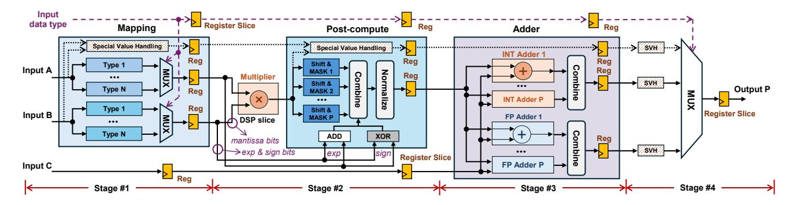

# *C. Parallel Mixed-Precision MACs on a Single DSP Slice*

In FPGA implementation, a DSP slice computes a single wide integer multiplication

$$P_{\text{DSP}} = A_{\text{DSP}} \cdot B_{\text{DSP}},$$

where ADSP and BDSP are bit vectors on the two input ports. Conventional fixed-precision designs place each operand in the least-significant bits, leaving most of the multiplier unused and resulting in low DSP bit utilization. However, as shown in Section [III-A,](#page-3-2) all MAC datatypes ultimately reduce to integer mantissa multiplication after appropriate operand mapping. This enables multiple low-precision lanes to be packed into disjoint bit regions of the DSP inputs, thereby exploiting the full multiplier width [\[8\]](#page-12-4), [\[14\]](#page-12-9), [\[24\]](#page-13-9).

To perform this packing, the mapping stage assigns each mantissa or integer magnitude to a non-overlapping bit range:

$$A_{\text{DSP}} = \sum_{i} (a_i \ll s_i), \qquad B_{\text{DSP}} = \sum_{j} (b_j \ll t_j), \quad (9)$$

where si and tj are per-lane shift offsets selected to avoid cross-lane interference. These offsets depend on the datatype combination (INT, FP, or INT×FP), but the DSP always receives well-formed integer operands regardless of precision.

Once packed, the DSP performs one wide multiplication, and all lane products appear at predetermined bit positions:

$$P_{\text{DSP}} = \sum_{i,j} (a_i b_j) \ll (s_i + t_j).$$
 (10)

In the post-compute stage, each lane product is extracted using a fixed shift-and-mask operation:

$$P_{i,j} = (P_{DSP} \gg (s_i + t_j)) \& (2^S - 1),$$
 (11)

where S is the bit stride allocated per lane. Let Wlane denote the maximum bit-width of any supported product |ai · bj |. To guarantee no overlap, the stride must satisfy

$$S \geq W_{\text{lane}} + G$$
,

where G is a small guard margin (typically one bit) used to absorb carries.

By incorporating lane packing into the mapping stage and integrating product extraction into the post-compute stage, the unified multiplication datapath of Section [III-A](#page-3-2) naturally extends to support parallel mixed-precision MACs. As a result, multiple INT, FP, or INT×FP operations can be executed in parallel within a single DSP slice by sharing the same datapath across different datatypes.

The parallelism of shared DSP multiplier is constrained by DSP input widths. For a given datatype, once its per-lane stride S is determined, the maximum achievable parallelism is

Parallelism 
$$\leq \min\left(\left|\frac{L_A}{S}\right|, \left|\frac{L_B}{S}\right|\right),$$
 (12)

where LA = 27 and LB = 18 are the DSP48E2 input widths. Importantly, different datatypes (e.g., INT4×BF16, FP8×FP8, INT8×INT8) have different operand precisions and thus correspond to different stride values S. Once the stride for a datatype is fixed, the achievable parallelism for that datatype follows directly from Eq. [\(12\)](#page-4-0) and depends solely on LA, LB.

In summary, by reducing all numerical formats to products and packing these lanes into the DSP inputs at bit-precise offsets, XtraMAC enables a single DSP multiplier to be shared across integer, floating-point, and mixed-precision MACs. The polynomial structure of packed multiplication in Eq. [\(10\)](#page-4-1) preserves strict lane isolation, while per-lane normalization and exponent reconstruction restore correct floating point and

Fig. 5. Overview of the XtraMAC architecture supporting N datatype combinations and up to P-way parallelism. (SVH: special value handling).

mixed-precision semantics. The bit-level control forms the basis of our mixed-precision support and allows multiple lowprecision MAC lanes to execute in parallel.

## D. Special Value Handling

1) Numerical Coverage: XtraMAC adopts flush-to-zero (FTZ) and denormals-are-zero (DAZ) semantics throughout the computation datapath, consistent with the numerical conventions widely employed in modern floating-point compute hardware, such as NVIDIA A100/H100 Tensor Cores [27], [28] and the AMD Xilinx Floating-Point Operator [1]. Subnormal inputs are treated as zero upon ingestion and outputs falling below the minimum value are flushed to zero. NaN inputs propagate as canonical quiet NaN (qNaN), infinity is preserved with its sign, and conflicting cases such as  $\infty \times 0$  and  $+\infty + (-\infty)$  resolve to qNaN. For formats that do not encode infinity, all-ones exponent encodings are treated as NaN. Integer-to-floating-point conversion is exact, and floating-point accumulation applies round-to-nearest-even (RN-even) throughout.

2) Pipeline-Invariant Exception Handling: A key design requirement is that exception handling must not disrupt the timing behavior of the main datapath. XtraMAC achieves this by detecting all special cases, including NaN, infinity, subnormal, and overflow, at the input and encoding them as status flags that are forwarded through the same matched register slices as the operands, ensuring that control and data remain temporally aligned throughout the pipeline. At the output, the appropriate result is selected through purely combinational logic, requiring no stalls, pipeline flushes, or control flow divergence. Overflow is resolved by saturating the result to  $\pm\infty$  through the same flag selection mechanism, ensuring uniform treatment across all exception types. Thus, the pipeline's latency and throughput are preserved unconditionally, independent of whether inputs are normal or exceptional.

