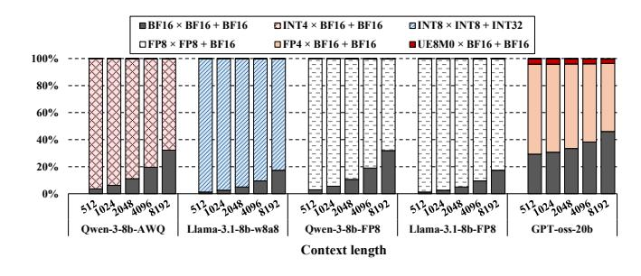
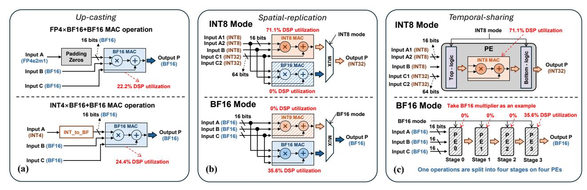
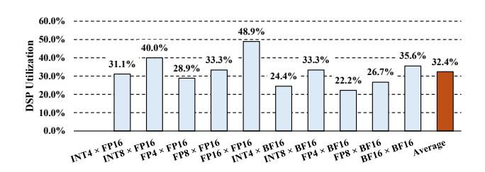
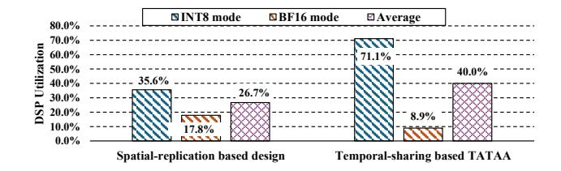

# XtraMAC: An Efficient MAC Architecture for Mixed-Precision LLM Inference on FPGA

Feng Yu\* , Hongshi Tan\* , Yao Chen†,‡, Weng-Fai Wong\* , Bingsheng He\*,‡ \**School of Computing, National University of Singapore*, Singapore †*School of Computer Science and Technology, Huazhong University of Science and Technology*, Wuhan, China {yuf, hongshi}@u.nus.edu, {dcswwf, dcsheb}@nus.edu.sg, chenyao cs@hust.edu.cn

*Abstract*—The widespread adoption of mixed-precision quantization in large language models (LLMs) has created demand for hardware that can efficiently perform multiply–accumulate (MAC) operations across mixed datatypes and switch datatypes at runtime. Existing FPGA-based MAC solutions fall short due to limitations in fixed-datatype design, inefficient spatial or temporal resource sharing, and poor support for mixed-precision execution. These limitations collectively lead to under-utilization of DSP resources, limiting achievable parallelism and throughput. In this work, we present XtraMAC, a novel MAC architecture that unifies integer, floating-point, and mixed-precision operations within a single, datatype-adaptive microarchitecture. XtraMAC decomposes all supported MAC formats into a shared integer mantissa product with lightweight sign and exponent handling, enabling dynamic operand packing and efficient DSP resource sharing with constant latency and initiation interval of one across all datatypes. Evaluated on an AMD Xilinx U55c FPGA, XtraMAC achieves 1.4–2.0× higher compute density, reduces per-operation LUT, FF, and DSP consumption by 27–51%, and delivers up to 1.9× greater energy efficiency and 1.2× speedup on representative mixed-precision LLM workloads. The implementation of XtraMAC is open-sourced at [https://github.com/Xtra-](https://github.com/Xtra-Computing/XtraMAC)[Computing/XtraMAC.](https://github.com/Xtra-Computing/XtraMAC)

*Index Terms*—MAC architecture, mixed-precision arithmetic, runtime datatype switching, DSP packing, FPGA.

## I. INTRODUCTION

Multiply–accumulate (MAC) operations are the fundamental building blocks for a broad spectrum of computational tasks, ranging from digital signal processing to deep learning. In recent years, large language models (LLMs) have emerged as the most prominent and demanding consumers of MAC computation, as their inference workloads are dominated by matrix multiplications involving billions of parameters. This explosive growth in MAC demand has catalyzed the adoption of low-precision quantization techniques to reduce both memory footprint and computational energy. Quantization methods [\[6\]](#page-12-0), [\[11\]](#page-12-1), [\[13\]](#page-12-2), [\[22\]](#page-13-0), [\[39\]](#page-13-1), [\[44\]](#page-13-2) target different model components (weights, activations, MoE experts) with mixed numeric formats and assign different datatypes across layers based on their quantization sensitivity, e.g., lower-bit integers for compute-intensive layers and floating-point formats for numerically sensitive ones [\[13\]](#page-12-2), [\[22\]](#page-13-0), [\[39\]](#page-13-1). As summarized in Table [I,](#page-0-0) this results in diverse MAC datatype combinations across different quantization schemes and model components.

TABLE I DIVERSITY OF MACS ACROSS LLM QUANTIZATION SCHEMES.

| Category           | Examples          | Projection / FFN MACs     | Attention MACs    |
|--------------------|-------------------|---------------------------|-------------------|
| Weight-only quant. | AWQ, GPTQ, SpQR   | INT × FP + FP → FP        | FP × FP + FP → FP |
| Weight–act quant.  | SmoothQuant, Atom | INT × INT + INT → INT     | FP × FP + FP → FP |
| Native LLMs        | GPT-oss-20b, 120b | MXFP4/BF16*× FP + FP → FP | FP × FP + FP → FP |

\* In GPT-oss models, the MoE blocks use MXFP4, others use BF16 datatypes.

Fig. 1. Distribution of MAC operations during the decode stage for various quantized LLM checkpoints in Table [VI](#page-10-0) across different context lengths. Each segment represents a unique MAC configuration; non-MAC operations are omitted as they account for less than 1% of total operations.

However, this proliferation of mixed-precision quantization introduces a new challenge for hardware design. We define a MAC operation as P = A×B + C, and identify two distinct computational patterns that arise in practice. The first is mixed-precision MAC, in which the multiplicands A and B are represented in heterogeneous numeric formats or bitwidths (e.g., INT4×BF16). The second is runtime datatype switching, in which a single hardware unit must alternate among distinct MAC datatypes as execution traverses different model components. For example, a single forward pass may transition from INT4×BF16 in projection layers to BF16×BF16 in attention layers. As shown in Figure [1,](#page-0-1) Qwen-3-8B-AWQ executes over 68% of its decode-stage MACs in INT4×BF16 for projection layers while its attention layers retain BF16×BF16, exemplifying the coexistence of both patterns within a single model. This dynamic heterogeneity demands hardware that can natively support both patterns without performance degradation.

Field-programmable gate arrays (FPGAs) have emerged as a promising platform for addressing these challenges, owing to their ability to implement customized compute pipelines with

‡Yao Chen and Bingsheng He are the corresponding authors.

TABLE II Survey of FPGA-based MAC designs for mixed precision (MP) and runtime datatype switching (RDS) support.

| Name                                | Year | DataType(A)                | DataType(B)                | DataType(C)                | DataType(P)                | MP | RDS | Note                                          |
|-------------------------------------|------|----------------------------|----------------------------|----------------------------|----------------------------|----|-----|-----------------------------------------------|
| FINN [35]                           | 2017 | Binary                     | Binary                     | Integer                    | Integer                    | Х  | Х   | Fixed architecture for binary neural networks |
| FP-BNN [21]                         | 2017 | Binary                     | Binary                     | Integer                    | Integer                    | X  | X   | Fixed architecture for binary neural networks |
| DNNBuilder [43]                     | 2018 | Fixed-point                | Fixed-point                | Fixed-point                | Fixed-point                | X  | X   | Precision set at synthesis time               |
| BISMO [36]*                         | 2019 | Integer                    | Integer                    | Integer                    | Integer                    | 1  | 1   | Runtime switchable integer bit width          |
| Xilinx FP Operator [1] † | 2020 | Floating-point             | Floating-point             | Floating-point             | Floating-point             | X  | X   | Format chosen at synthesis time               |
| Triple MAC [20]                     | 2021 | Fixed-point                | Fixed-point                | Fixed-point                | Fixed-point                | X  | X   | Static precision; width chosen at design time |
| TATAA [38] ‡             | 2025 | INT8 or BF16               | INT8 or BF16               | INT32 or BF16              | INT32 or BF16              | X  | 1   | Runtime switchable between INT8 and BF16      |
| Ours                                | 2025 | Integer, floating-point | Integer, floating-point | Integer, floating-point | Integer, floating-point | ✓  | 1   | Runtime switchable across all datatypes       |

BISMO supports arbitrary integer bit-width selection at runtime, but the maximum permissible precision is fixed at synthesis time due to FPGA resource constraints.

fine-grained, bit-level control over arithmetic and dataflow. In particular, the datapaths leading to the primary computational units in FPGAs, the DSP cores, can be tailored to accommodate diverse datatype requirements. Nevertheless, existing solutions for mixed-precision MAC support on FPGAs remain suboptimal. Conventional approaches to leveraging DSPs in FPGAs for mixed-precision computation and runtime datatype switching can be broadly categorized as follows:

- Operand upcasting, which promotes low-precision operands to match a fixed high-precision MAC unit, resulting in significant waste of the DSP bit space;
- Spatial replication or temporal sharing, which instantiates
  multiple datatype-specific datapaths or reuses a single datapath across cycles to support runtime datatype switching,
  leading to low effective DSP utilization, as only a subset of
  resources is active at any moment.

For example, the AMD Xilinx Floating-Point Operator [1] achieves average **32.4**% DSP bit-utilization efficiency when executing low-precision workloads, as all operands must be upcast into a fixed high-precision floating-point format. For runtime datatype switching, the spatial-replication based design duplicates multiple datatype-specific datapaths using the same Floating-Point Operator IP [1] further reduces efficiency: only one datapath is active at a time while the others remain idle, resulting in an effective DSP utilization of average **26.7**%. Temporal-sharing architectures such as TATAA [38] decompose a BF16 MAC into four sequential INT8 operations, yielding 71.1% utilization for INT8-based MAC computation but only **8.9**% effective utilization for BF16-based MAC computation due to the multi-cycle decomposition.

The root cause of these inefficiencies is a theoretical disconnect between the processing patterns and the fixed resource granularity of FPGA DSP slices. While DSP packing has been shown to substantially boost utilization for integer-only workloads [8], [24], current solutions lack the bit-level analysis needed to extend this technique to current workloads. As a result, each DSP delivers throughput far below its arithmetic ceiling, and this shortfall widens as LLMs increasingly mix precisions and switch datatypes within a single forward pass.

In this work, we bridge this gap by introducing a resourcecompact MAC architecture that is natively aware of mixed precision and supports runtime datatype switching within a unified datapath. Our key contributions are:

- We present a unified formulation showing that the multiplication component of integer, floating-point, and mixedprecision MACs can all be decomposed into an integer mantissa product with lightweight sign and exponent handling.
- We propose XtraMAC, a datatype-adaptive MAC architecture that decouples format interpretation from arithmetic execution, unifying integer, floating-point, and mixed-precision MAC operations within a single shared datapath.
- We develop a DSP-centric design principle that exploits dynamic bit mapping and multi-lane packing to maximize multiplier utilization, and adopt a fixed four-stage pipeline to sustain a constant latency and initiation interval of one across all supported datatypes.
- We demonstrate that XtraMAC improves compute density by 1.4–2.0× and reduces LUT, FF, DSP usage by 30.0%, 47.9%, 50.0% compared with state-of-the-art FPGA baselines, achieving 1.2× lower GEMV latency and 1.9× higher energy efficiency compared with GPU baseline.

#### II. BACKGROUND AND DESIGN MOTIVATION

Motivated by the mixed-precision and runtime datatypeswitching demands of LLM workloads, we first formalize DSP utilization under widely adopted conventions, and then review prevailing MAC microarchitectures in FPGA-based solutions, with particular emphasis on their DSP utilization.

#### A. DSP Utilization

In modern FPGAs, hardened DSP slices center on a dedicated multiplier that serves as the primary arithmetic resource and performs integer multiplication. The associated pre-addition, post-addition, and pipeline logic is structurally simpler and incurs substantially lower area and power overheads compared with the multiplier itself [4], [40]. Therefore, following the operand-bit-based utilization model in [9], we quantify DSP utilization based on how effectively the multiplier hardware is exercised. Let  $w_a$  and  $w_b$  denote the effective bit-widths of the multiplicands involved in an operation, we define the DSP utilization as

$$U_{\rm DSP} = (w_a + w_b)/W_{\rm mul},$$

where  $W_{\mathrm{mul}}$  is the sum of the two input-port widths of the DSP multiplier. In this paper, we target the DSP48E2 primitive widely deployed in modern Xilinx FPGAs, whose multiplier accepts a 27-bit A-port operand and an 18-bit B-port operand, giving  $W_{\mathrm{mul}}=45$  bits [4].

† Operands A, B, C and output P must share the same floating point datatype. 

† Operands A, B, C and output P must share the same datatype, either all INT8 or all BF16.

Fig. 2. Overview of existing FPGA-based MAC architectures supporting mixed precision and runtime datatype switching. (a) Upcasting-based method using FP Operator [1] for mixed precision. (b) Spatial replication for multi-datatype support [1]. (c) Temporal-sharing based multi-datatype support (TATAA [38]).

Fig. 3. DSP utilization of the upcasting-based design under different mixed-precision datatype combinations (FP8 = E4M3, FP4 = E2M1).

#### B. Current MAC designs in FPGA-based solutions

MAC designs in FPGA-based solutions have evolved to support a variety of numerical formats, ranging from binary, integer, fixed-precision arithmetic to full-precision floating-point. As summarized in Table II, these designs demonstrate the flexibility of reconfigurable logic for arithmetic specialization but reveal persistent limitations in mixed-precision support and runtime datatype switching.

1) Lack of Efficient Mixed-Precision Support: Early FPGAbased accelerators, such as FINN [35], FP-BNN [21], and DNNBuilder [43], target fixed integer or fixed-point formats with precision determined at synthesis time. Consequently, most FPGA MAC architectures are optimized for fixed or uniform operand types and provide limited support for mixedprecision computation. In practice, mixed-precision operations are typically handled by upcasting low-precision operands to the highest supported precision and executing them on a high-precision MAC datapath. As illustrated in Fig. 2(a), and exemplified by the AMD Xilinx Floating-Point Operator [1], low-precision operands are padded or promoted to match the highest supported precision, and all operations are executed on a fixed high-precision datapath. This design results in significant hardware inefficiency: a large portion of the DSP bit capacity remains unused, as quantified in Fig. 3.

2) Inefficient DSP Utilization and Limitations in Runtime Datatype Switching: Recent designs supporting runtime datatype switching on FPGAs predominantly adopt one of two microarchitectural strategies: spatial replication or temporal

Fig. 4. DSP utilization comparison on existing FPGA-based MAC architectures supporting runtime datatype switching in Fig.2.

sharing. Representative designs are illustrated in Fig. 2(b) and (c). While each approach offers certain advantages, both introduce inherent limitations and inefficiencies in DSP utilization, particularly when accommodating the diverse numeric requirements of LLM workloads.

**Spatial Replication.** As shown in Fig. 2(b), designs such as those described in [5] address runtime datatype switching by duplicating MAC units for each datatype and employing a multiplexer (MUX) to select the active datapath at runtime. For example, an INT8/BF16-configurable instance instantiates both INT8 and BF16 MACs, toggling between them with a control signal. While this method enables zero-latency switching and avoids pipeline bubbles, it incurs substantial hardware overhead as the number of supported formats increases. Idle MAC units for inactive datatype remain unused, leading to poor resource efficiency and failing to leverage the concurrency benefits inherent to low-precision computation. In Fig. 4, the average DSP utilization drops to 26.7%.

**Temporal Sharing.** As shown in Fig. 2(c), a more sophisticated approach in TATAA [38], which reuses integer MAC units for both INT8 and BF16 computation by decomposing each BF16 operation into a sequence of INT8 micro-operations executed over multiple cycles. This strategy avoids the need for separate BF16 logic, reducing area overhead. However, it comes at the expense of spatial parallelism and throughput: each BF16 operation monopolizes four processing elements (PEs) and pipeline stages, effectively capping peak BF16 throughput at one quarter of that achievable for INT8, given the same hardware footprint. As quantified in Fig. 4, the DSP

utilization drops to 8.9% when supporting BF16-based MAC, which significantly reduces the hardware effectiveness.

These pronounced inefficiencies in DSP utilization underscore a fundamental microarchitectural problem, one that becomes increasingly problematic as mixed-precision floatingpoint computation and runtime datatype switching grow prevalent in state-of-the-art LLM inference workloads.

## *C. Our Observations*

The above quantitative results point to a common root cause: a mismatch between the bit-level processing patterns of lowprecision MAC operations and the fixed resource granularity of FPGA DSP slices. Existing designs either upcast lowbit operands to a wide format or serialize high-precision operations over a narrow low-precision core. In both cases, the DSP multiplier is used as an opaque, single-lane primitive, rather than as a bit-space that can be systematically partitioned and shared across datatypes. Furthermore, both approaches treat datatype switching as a coarse control problem over whole datapaths, instead of a fine-grained organization of workload allocation within the DSP bit-space.

These observations suggest that substantial further gains are unlikely to be achieved by incremental datapath tweaks alone. Instead, we rethink mixed-precision MAC support from a processing-pattern perspective: how low- and mixed-precision INT/FP multiplications decompose into bit-level operations that can be allocated to the DSP multiplier based on its given processing characteristics, and how the DSP utilization could be improved with proper parallelism supported by the microarchitecture of the MAC. The next section develops this processing-pattern formulation, which forms the theoretical basis for the XtraMAC architecture and its ability to achieve high DSP utilization and fine-grained runtime datatype switch.

## III. PROCESSING PATTERN FORMULATION

To fully exploit the sharing and performance potential of mixed-precision MAC architectures, we first analyze how lowand mixed-precision MAC operations map onto the native multipliers and accumulators of DSP slices in FPGAs. Unlike conventional fixed-precision designs, these MAC operations introduce heterogeneous operand widths that misalign with DSP bit-granularity, giving rise to distinct sub-DSP packing and lane parallelism patterns. Hence, a resource-compact MAC architecture must be grounded in a systematic characterization of these bit-level processing patterns. We begin with normalized, non-exceptional values to establish the core formulation, and extend the analysis in a later subsection to cover special values and rounding. Under these conventions, XtraMAC produces bit-exact results matching NVIDIA A100/H100 Tensor Cores [\[27\]](#page-13-11), [\[28\]](#page-13-12) and the official AMD Floating-Point Operator [\[1\]](#page-12-3) across all supported datatypes.

## *A. Shared Multiplication Datapath across Different Datatypes*

For a floating-point operand x = sx · 2 ex · mx in IEEE format, we assume that the mantissa mx includes the implicit leading-one bit (i.e., mx ∈ [1, 2) for normalized values). The product of two such values x and y naturally decomposes as

$$x \cdot y = (s_x \oplus s_y) \cdot 2^{e_x + e_y - \text{bias}} \cdot (m_x \cdot m_y), \tag{1}$$

when adopting the MAC constructed with FPGA DSP slice, the DSP computes only the mantissa product mxmy, while sign and exponent are processed separately [\[1\]](#page-12-3), [\[4\]](#page-12-5). After multiplication, the product mantissa is normalized by a leadingzero count (LZC):

$$\Delta = LZC(m_x m_y), \quad m^{\text{norm}} = (m_x m_y) \ll \Delta,$$
 (2)

$$e^{\text{out}} = e_x + e_y - \text{bias} - \Delta. \tag{3}$$

For mixed-precision INT×FP computation, the integer operand a is interpreted as a two's complement value and decomposed into sign and magnitude:

$$a = s_a \cdot m_a,$$

where ma is treated as an integer mantissa after sign extraction. Since an integer carries no exponent encoding, we assign it a logical unbiased exponent of zero, which corresponds to a biased exponent value equal to the bias of the floating-point output format (e.g., 127 for FP32 and BF16, or 15 for FP16). The floating-point operand y is represented same as the x, with my including the leading-one bit. Their product becomes

$$a \cdot y = (s_a \oplus s_y) \cdot 2^{e_y - \text{bias}} \cdot (m_a \cdot m_y), \tag{4}$$

so that the DSP multiplier again computes only the mantissa product mamy. The exponent path forwards ey, subtracts the format bias, and applies the normalization shift:

$$\Delta = LZC(m_a m_y), \quad m^{\text{norm}} = (m_a m_y) \ll \Delta,$$
 (5)

$$e^{\text{out}} = e_y - \text{bias} - \Delta.$$
 (6)

Eqs. [\(1\)](#page-3-0) and [\(4\)](#page-3-1) show that both FP×FP and INT×FP multiplication share the same core operation: the DSP computes an integer mantissa product, while sign and exponent are handled outside the DSP. This indicates that a common multiplication datapath can be shared across different datatypes. The only differences arise in how operands are mapped into (s, m, e) fields and how the exponent is updated after normalization. Hence, across all integer, floating-point, and mixed-precision formats, multiplication can be described as follows:

- 1) Mapping: extract or construct sign, mantissa, and exponent for each input operand of the DSP slice.
- 2) DSP multiplication: compute product mprod = mA · mB.
- 3) Post-compute: apply LZC-based normalization and update the exponent according to the operand formats.

This formulation shows that datatype-specific behavior is confined to lightweight mapping and post-compute logic, while the DSP slice consistently performs the same integer multiplication. Consequently, a single multiplier datapath can support FP×FP, INT×FP, and pure integer multiplication with minimal additional hardware.

## *B. Datatype-specific Accumulation*

Unlike the multiplication stage, which naturally shares a unified integer–mantissa structure across all data types, addition behaves fundamentally differently due to incompatible computation patterns arising from their distinct bit semantics. For integer addition, two's-complement integers x, y satisfy

$$x + y = (x \oplus y) \oplus \operatorname{carry}(x, y),$$

which maps directly to the FPGA's ripple-carry chain. A wintbit integer adder therefore exhibits linear resource cost:

$$C_{\rm int}(w_{\rm int}) \approx \alpha_{\rm int} \, w_{\rm int},$$
 (7)

where αint denotes the LUT cost per bit imposed by the carrychain fabric.

For floating-point addition, given x = sx2 exmx and y = sy2 eymy, define the exponent gap

$$\Delta e = e_x - e_y.$$

Assuming ex ≥ ey, the smaller mantissa must be right-shifted by an *arbitrary* distance determined at runtime:

$$m_s = m_x \pm \left( m_y \cdot 2^{-\Delta e} \right).$$

The resulting mantissa must then be normalized using LZC:

$$\Delta = LZC(m_s), \quad m_{\text{out}} = (m_s \ll \Delta), \quad e_{\text{out}} = e_x - \Delta.$$

Because ∆e may take any value in the exponent range, the alignment step must support a variable-distance right shift across the full mantissa width wfp; similarly, normalization requires a variable-distance left shift. Implementing such shifts on FPGA requires a logarithmic barrel shifter. A classical barrel shifter for an wfp-bit mantissa contains log2 wfp stages of wfp multiplexers [\[32\]](#page-13-13), giving

$$N_{\text{MUX}} = w_{\text{fp}} \log_2 w_{\text{fp}},$$

and the LUT cost scales superlinearly:

$$C_{\text{shifter}}(w_{\text{fp}}) \approx \beta_{\text{sh}} w_{\text{fp}} \log_2 w_{\text{fp}},$$
 (8)

where βsh denotes the LUT cost per multiplexer stage. Prior work confirms that these alignment and normalization shifters dominate the LUT footprint of FPGA floating-point adders [\[12\]](#page-12-8), [\[25\]](#page-13-14).

Thus, these characteristics highlight the inherently datatypespecific nature of accumulation. Integer addition typically requires a wide bit width wint (for example, 32 bits for INT4/INT8 accumulation [\[26\]](#page-13-15), [\[28\]](#page-13-12)) but avoids expensive shifting by relying on efficient carry-chain logic. Floatingpoint addition operates on narrower mantissas wfp (for example, 10-bit for FP16, 7-bit for BF16) but incurs substantial cost due to alignment and normalization shifters. Consequently, a unified INT–FP adder would force integer additions to traverse the same alignment and normalization shifters as floating-point additions, even though integer addition fundamentally requires no shifting. This wastes shifter area, which must be sized for the wider integer width wint, making it significantly less resource-efficient than maintaining separate adder paths.

