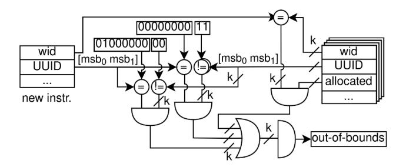
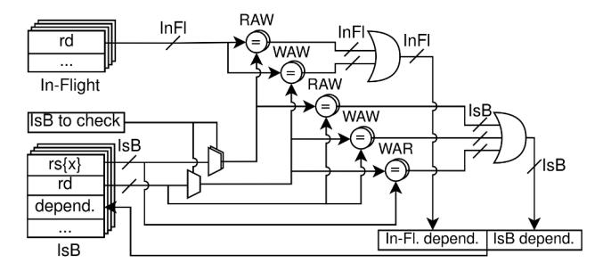

# *B. Frontend-based sCROOGe execution scheme*

In this section, the frontend-based sCROOGe execution scheme is presented, highlighting the extensions and design disparities between the GhoST [13] and SIMIL [24] implementations and our sCROOGe RTL design.

Fig. 3: Out-of-bounds UUID checking mechanism for MSB transitions of 11 to 00 and 00 to 01.

Fig. 4: Dependence Checker of frontend-based sCROOGe.

Issue Buffer. In GhOST [13], an arbiter issues in-order instructions from the IBuffer to the Issue Buffer (IsB). In sCROOGe, the IBuffer supplied by the Decode stage was omitted, since the throughput of the Fetch and Decode stages is one instruction per cycle. Moreover, GhOST's control flag responsible for synchronization management is not required, as the scheduling of instructions under synchronization is handled in the Schedule stage, as described in Section IV.

In-Flight Instruction Buffer. To correctly track dependencies to account for data hazards, we need to store the destination register of executing instructions that have passed the IsB substage in a buffer up until their writeback. This is referred to as the In-Flight buffer (InFL). Each entry comprises two fields, an allocation bit and the respective instruction's destination register, which effectively contains the warp ID.

Dependence Checker. This component (Fig. 4) identifies data dependencies of IsB instructions by comparing source (rs) and destination register (rd) fields in both the InFl and IsB and assigns a dependence bit-vector in the target IsB entry. Read-After-Write (RAW) hazards are detected by comparing the three rs fields of the IsB entry with all rd registers in InFl and IsB, and for the Write-After-Write (WAW) it compares the selected rd with other rds. Write-After-Read (WAR) hazards are found by comparing the selected rd with rs registers in the IsB only, since beyond the Issue stage execution is in-order, making rs–to–rd checks in InFl unnecessary.

Issue Arbiter. This circuit selects an entry from the "independent instructions" pool to pass on to the Scoreboard stage and update the InFl allocation arbiter. If there are no independent instructions, it selects one from the "per-warp oldest" set, emerged from UUID comparisons. For both sets, the policy is to trivially select the instruction with the lowest IsB ID.

The instruction flow of the sCROOGe frontend scheme is illustrated in Fig. 5. A newly decoded instruction is placed in the IsB by the IsB allocation arbiter 1 . For this operation, at least one IsB entry needs to be vacant, and the UUID bounds conditions need to be satisfied as displayed in Fig. 3; otherwise, the instruction remains in the supplying register. In the following cycle, the Dependence Checker 2 operates on the instruction and accordingly updates the respective IsB entry. The "independent" and "per-warp oldest" bit-vectors are produced by sequential circuits whose inputs are the dependence vectors and the UUIDs of the allocated IsB entries. This circuit also deems non-independent all memory instructions that are not the oldest available. Subsequently, the Issue arbiter 3 operates, provided that a free InFl entry exists or the instruction does not require a writeback. The dependence bit for all IsB entries indexed by the newly issued instruction's IsB ID is unset, since IsB hazards no longer apply. The corresponding bit in the InFl section is updated according to hazards with the introduced In-Flight instruction. As of the WAR hazards from a newly issued instruction, they are removed, as they cannot arise for In-Flight instructions. In the next cycle, the InFl entry selected by the InFl allocation arbiter 4 is allocated, and the IsB entry selected by the Issue arbiter is vacated. Regarding pipeline stages 5 - 8 , their functionality is the same as in the baseline model, save for the InFl entry ID field that is carried through up to the Writeback stage. The latter 9 takes place by updating the rd value in the RF. Since the results of threads within the same warp can arrive asynchronously, writeback 8 completion is signaled by the end-of-packet (eop) bit, also flushing the appropriate InFl buffer entry, and unsetting the respective dependence bits.

