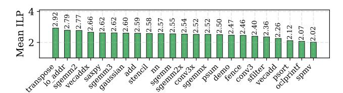

# B. ILP Analysis

Regarding the Vortex workloads' exploitable ILP, a detailed analysis on instruction traces drawn from kernels is performed.

Fig. 10: Average ILP across applications.

Fig. 11: Reorder distance percentages of backend sCROOGe across CU counts, with 12 RRS entries.

The dynamic instruction stream is split into basic blocks by memory fences and control instructions, respecting true data dependencies, as well as dependencies through memory within each block. The average ILP is calculated as the fraction of the total number of instructions for warp 0 (since uniform behavior was seen across warps), divided by the longest chain of dependent instructions within the workload. Fig. 10 shows variation in the average ILP across workloads (2.02-2.92).

The backend sCROOGe scheme issues instructions in-order, so in stall-free scenarios the instruction stream minimally deviates from the baseline. However, when individual instructions start stalling, backend sCROOGe dynamically reorders ready-to-execute operations ahead of earlier issued stalled ones. Fig. 11 displays the percentage of instructions that dispatched OoO per each reorder distance. Most of them overtake only one instruction ahead, while less than 10% overtake four or more instructions, regardless of the CU size. Moreover, larger CU configurations enable deeper reordering and therefore have better potential in exploiting ILP, coinciding also with their performance improvement seen in Fig. 14.

TABLE III: Pipeline stage delays (psec) for the baseline and both sCROOGe schemes, synthesized at 1GHz frequency.

|          | Schedule | Issue | $Commit \rightarrow Issue$ | Execute |
|----------|----------|-------|----------------------------|---------|
| Baseline | 634      | 295   | 353                        | 993     |
| Frontend | 634      | 600   | 390                        | 993     |
| Backend  | 634      | 901   | 466                        | 993     |

