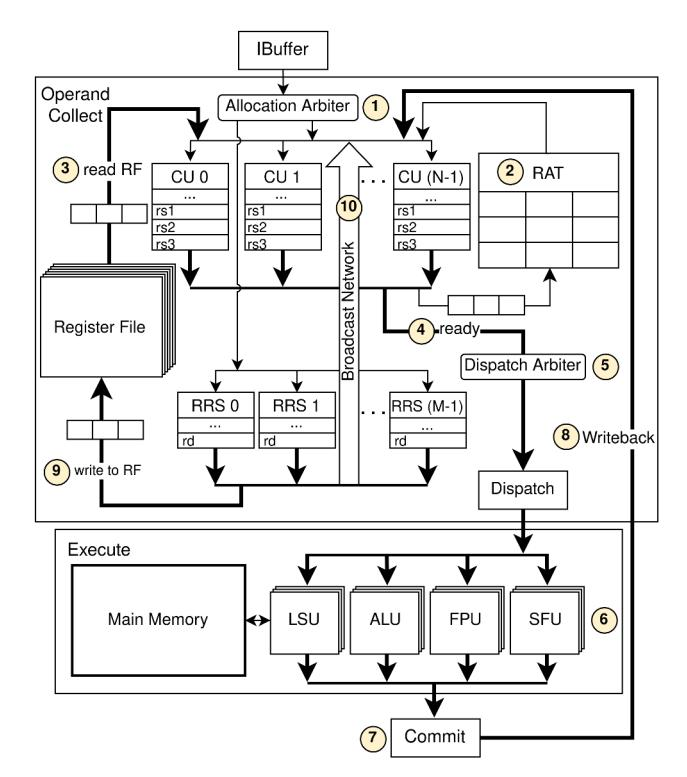

# *C. Backend-based sCROOGe execution scheme*

Similarly to Section V-B, we outline the micro-architectural details of the backend-based sCROOGe micro-architecture. Collector Units. Traditional GPU architectures use CUs to hold instruction data until source registers are read from the RF [50]. In LOOG [28], instruction reordering occurs in the Operand Collect (OC) stage, where CUs act as Reservation Stations (RSs). In sCROOGe, a configurable number of CUs enables exploration of reordering at varying depths. CUs track instruction metadata (PC, warp ID, active threads, etc.) from Issue to Dispatch, after which relevant fields are maintained by the RRS. They store flags regarding allocation status, operand retrieval from the RF or from a result broadcast, and operand readiness. Register data and immediate values needed in later pipeline stages are also preserved by the CU.

Register Alias Table. Rather than using a scoreboard to monitor RAW dependencies, sCROOGe employs a Register Alias Table (RAT). This also eliminates WAR and WAW hazards through register renaming, replacing the register name with the corresponding RRS ID. Each RAT entry is composed of two components: a bit indicating whether the register's data needs to be sourced from the RF and an RRS ID field.

Fig. 5: Frontend-based sCROOGe instruction flow.

Register Renaming Stack. In the initial iteration of LOOG [28], CUs serve as RSs of the Tomasulo algorithm, keeping instructions' data up to writeback for result broadcast monitoring. This prolonged allocation significantly increases stalls due to limited CUs; however, scaling their availability would incur large area overheads. To remedy this, the RRS serves as a light-weight mechanism to provide identifiers stored in the RAT in place of CU IDs, allowing CUs to be released immediately after Dispatch. A CU is substantially larger than an RRS entry; for a configuration with a 32 warps, 32 threads and 12 CUs, a CU requires over four times the number of bits with an area overhead of approximately 21.382µm2 or 2.28% of the total design area (0.9387mm2 as shown in Section VII), with the respective overhead for an RRS entry being only 0.873µm2 , or 0.09%. Fig. 6 illustrates the impact of the RRS on CU availability by showing the Cumulative Distribution Function (CDF) of stalls attributed to unavailable CUs across workloads and SM configurations. Compared to sCROOGe with no RRS, the RRS-enhanced one significantly reduces the occurrence of such stalls. Notably, for 80% of applications across configurations, the percentage of no-available-CU stalls is higher than 42% when no RRS is utilized, and higher than only 23% with an RRS of size 12.

The instruction flow of the backend-based sCROOGe is outlined in Fig. 7. The Scoreboard stage is eliminated due to the relocation of data dependence tracking to the OC. When an instruction transitions to the OC, the allocation arbiter 1 validates three conditions: the presence of an empty CU, UUID

Fig. 6: CDF of No-Available-CU stalls for backend sCROOGe.

Fig. 7: Backend-based sCROOGe instruction flow.

bounds compliance, and sufficient writeback resources (either a free RRS entry or no writeback required). If satisfied, an unoccupied CU and - if necessitated by a writeback operation - an RRS entry are allocated, with the RRS ID being stored in the CU. In the next clock cycle, the recently allocated CU consults the RAT 2. It copies the renamed source registers into their respective fields, determining whether the data should be accessed from the RF or obtained via broadcast. If the instruction requires a writeback, the CU writes its RRS ID in the respective RAT rd field. Thus, subsequent instructions with a RAW dependence upon it will stall until its result is broadcast. Next, the CU collects the appropriate rs values. Should any operands require direct retrieval from the RF 3, a reading status is assigned to the CU. To decide which CU is granted RF access, three arbiters were tested: lowest CU ID first, Round-Robin (RR), RR for RF access and CU allocation. The best in terms of performance and logic

Fig. 8: Writeback and Broadcast stages of backend-based sCROOGe Pipeline.

complexity was found to be the first one. The chosen CU will proceed to fetch its operands sequentially (one per cycle). Once the data is acquired and each operand is valid, the CU is flagged as ready 4. From this pool of ready CUs, one is selected each cycle to be promoted to the Execution 6 stage by the Dispatch arbiter 5. When an instruction passes the Commit **7** stage, it may need to write back the result, which is routed to the OC stage, where the CUs and RF are located. Until writeback completion, the incoming data are temporarily stored in a dedicated field within the RRS entry. Once the eop signal is detected, the corresponding entry in the RAT is reevaluated. If the instruction's RRS ID matches this field, it transfers the result to the RF and updates the RAT; otherwise, this task falls to another RRS entry with the same rd. The write operation to the RF **9** occurs in the following cycle, alongside the update of all CUs' data that depend on the broadcast result. Subsequently, the RRS entry is ready for deallocation. For the instructions in the OC to ascertain the correct RRS entry to retrieve broadcast data from, each CU retains the ID of the RRS entry on which it is contingent.

Memory Operation Reordering. Prior art in OoO GPUs [28] explored the reordering of memory instructions in the Load-Store Queue (LSQ). To ensure program correctness when dispatching two warp memory instructions OoO, every address of the first should be compared to all addresses of the second, causing the probability of a conflict to scale proportionally to the square of the warp size and increase with the SM warp count. Fig. 9 shows the maximum attainable speedup by memory reordering, which is proven negligible across all configurations, limited to less than 1.1% on average. To estimate the upper bound on cycles saved through memory

Fig. 9: Memory reordering speedup ceiling.

reordering, we construct a per-warp Directed Acyclic Graph (DAG), that represents the true register dependencies among warp instructions as described in Section VII-B. We analyze deviations in the longest dependence chain accounting for gain in cycles by reordering memory operations when possible.

To assess the viability of such a mechanism, we implement it within the backend-based sCROOGe. In prior simulatorbased studies [28], address dependency-aware dispatching happens within one cycle, necessitating the use of LSQ  $size^2 \times$  $T^2$  4-byte address comparators per SM. Adopting an RTLaware standpoint enables exploration of the trade-off between the mechanism's logic complexity and added latency. From instructions in the LSQ -where memory operations reside instead of CUs- that are marked as ready 4, one can be selected each cycle. By storing its target addresses in an intermediate register, we detect conflicts with all other LSQ entries before updating a dependence bitmap. This introduces a one-cycle pipeline penalty for dispatching memory operations, but reduces the required comparators to  $LSQ\_size \times T^2$ . We measure the area and power overhead of this more light-weight mechanism on the {4,16} design point -which exhibits the highest speedup ceiling of 1.1%- configured with four LSQ entries and four CUs. The area and power overheads are found to be 8.7% and 9.3%. Given the limited speedup potential and the prohibitive LSQ overhead, this component is excluded from the backend-based sCROOGe implementation.

