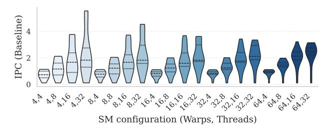
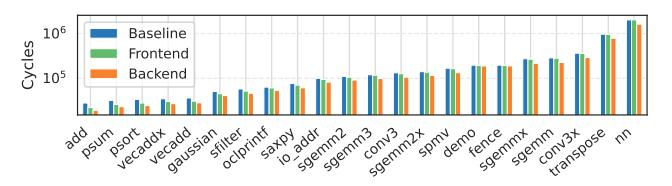
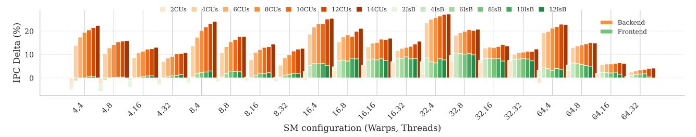
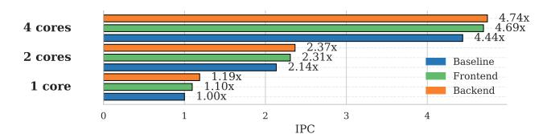
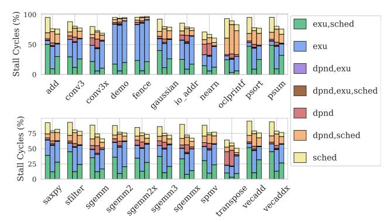
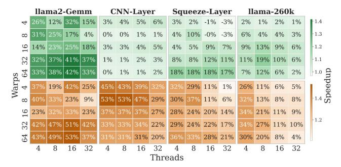
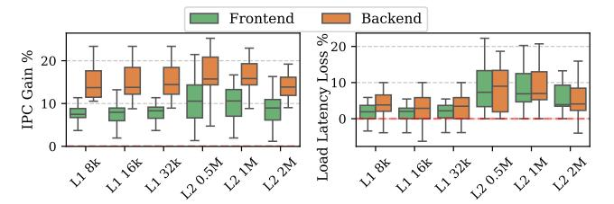

# C. Timing-aware Performance Evaluation

To assess the timing impact of hardware additions required by the sCROOGe schemes, we synthesize the aforementioned micro-architectural configurations at 22nm technology at their maximum achievable frequency of 1GHz. Table III provides the critical path delays of sCROOGe's dominant pipeline stages. Evidently, the Execution stage delivers the global critical path delay. As expected, this delay remains stable across

Fig. 12: Baseline Vortex IPC per SM configuration.

Fig. 13: Absolute cycles of the baseline and both sCROOGe schemes for each application in the (32,4) configuration.

examined micro-architectures since none of sCROOGe OoO schemes modify it. Issue stage modifications are significant for both sCROOGe schemes, especially for the backend-based one, as it approaches (without surpassing) the timing of the global critical path of Execution stage. Notably, the long result bus connecting the Commit and Issue stages does not alter the critical paths as significantly, since it has been optimized to connect only to the CUs and not directly to the RF.

Since both the baseline and the examined sCROOGe schemes can be clocked with the same maximum frequency, it is safe to comparatively evaluate performance through the IPC rate. Fig. 12 demonstrates the performance scaling of the baseline for different warp and thread counts. Evidently, performance shows weak sensitivity to warp count, while near-linear scaling is demonstrated with increasing threads. Therefore, thread-level scaling yields higher IPC due to its inherent correlation with throughput; however, most workloads saturate their performance at four concurrent warps. Regarding the distribution of IPC across benchmarks, high diversity is observed in terms of performance as the number of threads scales -directly correlating to the diverse amount of TLP exhibited across workloads. For instance, for an SM of 32 warps, performance scales near linearly for the average benchmark while saturation is observed at 32 threads for the maximum.

Fig. 13 illustrates the execution cycles in the baseline and both sCROOGe schemes for all of the 22 individual apps under examination. As observed, notable speedups are obtained for most of the applications (27.3%) and 6.7% for the backend-and frontend- based scheme respectively).

Fig. 14 depicts the performance gains obtained by both sCROOGe schemes across warp-thread configurations and differently sized critical components, i.e., the number of IsB entries for the frontend scheme and the CUs count for the backend. The backend implementation always outperforms

Fig. 14: Speedup w.r.t. baseline for differently scaled frontend- and backend-based sCROOGe configurations.

Fig. 15: Total IPC comparison between 1, 2, and 4 SMs configured for 16 warps and 32 threads per warp.

the frontend one, which is expected given its more complex and potent reordering mechanism outlined in Section V-C. Evidently, speedup for the backend-based scheme decreases as the number of threads increases, while mixed behavior is seen for the frontend-based scheme regarding this parameter. Moreover, no specific trend can be seen with respect to varying warp capacities, supporting the claim that workloads exhibiting both sufficient and insufficient TLP benefit from execution on the implemented OoO mechanisms. Notably, minor speedups can be observed for the frontend scheme in most configurations and even slowdowns for the smallest ones. These slowdowns are attributed to the introduction of extra pipeline stages, which, in certain cases, outweigh the performance benefits gained through instruction reordering.

Finally, Fig. 15 shows the performance scaling behavior of sCROOGe when extending the design beyond a single SM, scaling accordingly the workload of each examined benchmark (weak scaling analysis). Both the frontend- and backend-based OoO schemes retain their relative performance advantage over the in-order baseline as the number of SMs increases, demonstrating that the architectural benefits of sCROOGe persist under multi-SM configurations. The marginal reduction in speedup observed at higher SM counts is attributed to increased contention in shared resources, particularly at the global memory interface. The observed scalability of the evaluated workloads across multiple SMs, demonstrates that the proposed OoO mechanisms effectively harness intra- and inter-warp ILP even under elevated TLP conditions.

New performance counters were added in the Vortex pipeline to collect stall information about the baseline and both sCROOGe schemes. The stalls are counted in the scheduler (sched) when the Fetch stage is empty and the scheduler has no warp instruction to forward, in the execution units (exu) when structural hazards occur, in the OC stage where RF reads are

Fig. 16: Stalls breakdown of the baseline (left), frontend OoO (middle) and backend OoO (right), w.r.t. the baseline cycles (16 warps, 32 threads per warp).

serialized, and finally in the corresponding unit for handling data dependencies according to the scheme under examination. The last two categories are denoted as dependence (dpnd) stalls. One or more stall types can occur in each cycle. In Fig. 16, these stall types are presented as percentages of the total baseline execution. The total stalls correlate with the schemes' performance gains across applications (-11.8% and -14.8% on average for the frontend and backend schemes). Interestingly, scheduler stalls are minimized in both OoO schemes (-51% and -61% respectively) and dependence-exclusive stalls are diminished in the backend OoO scheme. Despite introducing additional potential sources of stalls, the scheme effectively mitigates them through efficient reordering of instructions and a significant reduction of RF accesses.

We extend our set of workloads to cover critical ML applications that span representative fields of the AI ecosystem, such as Convolutional Neural Networks (CNNs) and Large Language Models. Fig. 17 depicts the performance improvement of the frontend OoO with 12 IsBs and backend OoO with 14 CUs relative to baseline across four such applications. *llama2-Gemm* corresponds to a full tensor operation from llama2-48M [73] performed as fused multiply-add operations (FP32 FMADD) in the FPU. *CNN-Layer* corresponds to a convolutional layer from AlexNet [43]. Focusing on the class of embedded GPUs, as outlined in Sections VII-A and VII-F, we further assess a *SqueezeLayer* from SqueezeNet's Fire module, which uses 1×1 convolutions to feed expand [26].

Fig. 17: Speedup on ML workloads of OoO schemes across SM configurations (top: frontend, bottom: backend).

Fig. 18: Performance and load latency of the OoO schemes w.r.t. to L1 and L2 sizes (16 warps, 32 threads per warp).

Both layers are drawn from the Tango Suite [37]. *llama-260k* refers to the end-to-end execution of a 260k parameter model [20] of the llama architecture [73]. Notably, *llama2-Gemm* benefits significantly from both schemes and across the same configurations. In contrast, *CNN-Layer* benefits from the backend-based scheme, which leverages register renaming, but shows minimal improvement on the frontend-based scheme. The *Squeeze-Layer* and *llama-260k* demonstrate similar behavior across OoO schemes and configurations.

#### D. Sensitivity analysis of memory hierarchy parameters

Fig. 18 shows the performance gain and load latency reduction distributions for both OoO schemes when varying L1 and L2 data cache capacities (half and double). Slight speedup gains (< 2%) for both schemes appear with larger L1 capacity, without a clear load latency trend. Increasing L2 capacity reduces both speedup and latency loss, notably for the backend-based scheme, by 2.5% and 6% respectively, as higher L2 hit rates limit OoO benefits by shortening memory stalls. The instruction cache and the number of banks in L1/L2 show minimal sensitivity in similar experiments, yielding nearly identical speedup distributions (8% and 15% for the frontend and backend-based scheme).

