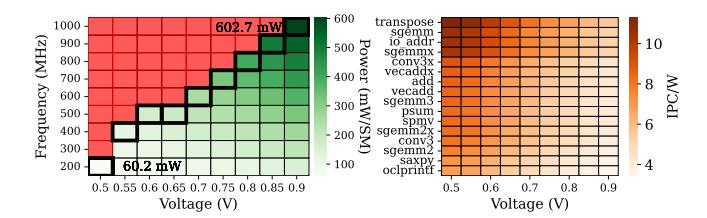
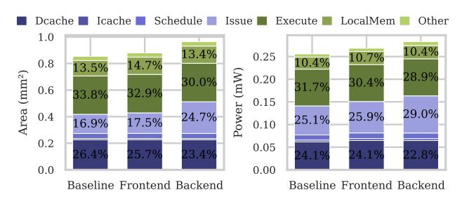

# E. Insights from Post-Synthesis Area and Power Evaluation

The hardware complexity of both OoO schemes scales linearly with OoO critical components, as shown in Fig. 19. While the frontend scheme maintains remarkably consistent relative overheads across configurations, peaking at only 7.5% for area and 8.2% for power, the backend scheme's costs

Fig. 19: Area & power overheads across sCROOGe schemes for different SM configurations, synthesized at 400 MHz.

Fig. 20: Area and power of sCROOGe schemes w.r.t. timing constraints, for 4 IsB entries, 8 CUs and 32 threads per warp.

substantially surpass these values at 28.6% and 32.1% respectively, with slopes diverging sharply for upscaled {warp, thread} configurations. These observations stem from the underlying circuit implementation: whereas frontend modifications primarily scale through sequential elements (registers), the backend additions introduce significant combinational logic, which scales non-linearly with the warps and threads to manage the increased interconnect.

Fig. 20 depicts the area and power of sCROOGe schemes when synthesized across different clock frequency constraints. Area scales quite efficiently (also validating the sCROOGe design's efficiency) since for a frequency scaling of 5×, the area increase is around 6%. As expected, this is not the case for power scaling, where a 4× increase is observed. This is attributed to the synthesis tool's effort to meet timing constraints through standard cell sizing i.e. by placing cells with greater driving strength, resulting in smaller delay and higher power consumption and area. As mentioned in Section II and seen in Table II, the drastically different area and power overheads of the OoO schemes between simulation and RTL validation for the configuration of 64 warps and 32 threads (representative of commercial NVIDIA GPUs) shed doubt on the relevance of the aforementioned mechanisms for these GPUs.

Fig. 21 depicts the power of the backend sCROOGe scheme

Fig. 21: Power under valid operating conditions (64 warps, 32 threads per warp) and IPC/W for applications with IPC>1.

Fig. 22: Area and power breakdown of the proposed execution schemes per component.

across a range of voltage–frequency operating points2. We invoke Synopsys PrimeTime augmented with Unified Power Format (UPF) to ensure accurate power intent modeling. Power estimates were derived by leveraging the characterization capabilities of the Synopsys toolchain and interpolating across the GlobalFoundries 22 nm PVT corner libraries. As shown, power increases predictably with both parameters, across feasible operating points. For each voltage, the energy efficiency (GOPS/W) of the timing optimal design (highlighted boxes) is also observed in the right panel, per application. As expected, a decreasing efficiency trend is evident; Power rises quadratically with voltage, while throughput increases only linearly, i.e. frequency scales roughly proportionally to V in the valid operating range (left subfigure). As a result, an almost linear decline is seen in GOPS/W as voltage increases.

Fig. 22 displays a detailed power breakdown of the baseline and scaled-up OoO execution schemes w.r.t. their most significant components. As outlined in Sections V-B and V-C, the Issue stage solely contributes to the area and power overheads of the proposed execution schemes. Due to the minimal modifications, the frontend scheme introduces minor overheads. In Table IV, we assess whether a baseline Vortex configuration with increased warp capacity would outperform an upscaled configuration of a backend OoO scheme occupying the same area. Notably, the OoO configurations always outperform the baseline with marginally less area values, by an average of 14.4%. This further supports the hypothesis that TLP-driven performance gains are nearing saturation, whereas ILP remains a promising avenue for improvement.

TABLE IV: Iso-area comparison of sCROOGe with a baseline of increased warps (W) and the same threads per warp (T).

| Backend-based OoO |               |               | Baseline       |                         | δ <b>IPC</b> (%)                    |               |                         |                                                 |
|-------------------|---------------|---------------|----------------|-------------------------|-------------------------------------|---------------|-------------------------|-------------------------------------------------|
| W                 | T             | CU            | RRS            | A $(\mu m^2)$           | IPC   W                             | T             | A $(\mu m^2)$           | IPC   IPC Gain                                  |
| 32 32 32    | 8 16 32 | 14 10 8 | 28 20 16 | 479,2 716,8 850,5 | 1.46   64 1.99   64 2.26   64 | 8 16 32 | 501,0 742,1 854,4 | 1.26   16.30% 1.79   11.61% 1.96   15.30% |

#### F. Right-Sizing the OoO schemes across SM configurations

In this section, we assess the efficiency of OoO GPU designs on a per-{warp,thread} configuration basis and across the Area-Delay Product (ADP) and Energy-Delay Product (EDP) Figures-of-Merit (FoM). The design space includes IsB entries and CUs, which directly determine the reordering potential of the OoO schemes. Fig. 23 illustrates the values of both FoM, normalized to the baseline and reported as the geometric mean over the whole set of workloads. The optimal CU and IsB count per {warp,thread} configuration leading to a FoM improvement is annotated. An emerging trend is that for the lowest warp counts, the effective instruction window for reordering is underutilized, and for the highest ones, it is congested to such a degree that the cost of upscaling OoO structures has diminishing returns in performance. The latter design points benefit from OoO execution by operating on smaller instruction windows (CU counts), yielding EDP improvement of up to 18.6%. Considering this analysis, we observe that design points employing 16 warps provide optimal CU sharing and exhibit the greatest improvements, up to 12.4% for the frontend- and up to 27.9% for the backend- based scheme. As shown, the {64,32} configuration is inefficient on both OoO schemes, while configurations with 4 or 8 warps, as well as {64,16}, are inefficient solely on frontend-based sCROOGe.

We further categorize applications into low-ILP and high-ILP classes, defined as the groups of eight at the extremes of Fig. 10. On average, optimal CU and IsB points shift by +1 and +0.75 for the high-ILP class w.r.t. the low-ILP class. Workloads of the high-ILP class can better exploit the upscaled OoO resources because of higher reordering potential. The area and power cost of upscaling is offset, providing a 1.62% and 3.06% improvement of EDP for the high ILP class on the frontend- and backend-based scheme respectively.

#### G. Cross-Validation of Synthesis Trends via Full-PnR Flow

Due to the prohibitive turnaround time of the full-Place-and-Route (PnR) flow, we use synthesis for our complete DSE. We validate these results on selected configurations based on Fig. 23 by executing the physical implementations of the designs using the Cadence tool suite, encompassing standard cell placement, clock tree synthesis, and detailed routing, with a conservative target clock frequency of 400 MHz to guarantee timing closure, in sync with our post-synthesis analysis. As illustrated in Fig. 24, the comparison between post-synthesis and post-PnR power values confirms that the relative overheads identified in synthesis are preserved in a fully

 $^2 The$  frontend-based sCROOGe scheme presents near-identical valid points and power values (<  $1.2\%\Delta power)$  across operating conditions.

Fig. 23: sCROOGe schemes right-sizing across {Warp,Thread} configurations regarding ADP, EDP FoM. Optimal CU and IsB counts are outlined and FoM improvement on the optimal values is annotated.

Fig. 24: Post-PnR power deviation from synthesis. CUs and IsBs correspond to efficient points of Fig. 23. The annotated bars describe the measured overheads w.r.t. the baseline.

routed implementation; hence, the FoM in Fig. 23 are largely sustained. While absolute switching power increases post-route due to wire-load-capacitance induced power, accounting on average for 20% of the total compared to the 4% estimated during synthesis, this shift affects all designs uniformly. This discrepancy is mostly attributed to early-stage synthesis failing to account for clock tree buffer insertion or the precise parasitic resistance and capacitance of the metal layers. The stability observed validates our synthesis-based analysis as a high-fidelity proxy for the proposed architectural trade-offs, with power overhead deviations between post-synthesis and post-PnR remaining within 0.8% for the frontend and 1.7% for the backend OoO scheme relative to the baseline.

