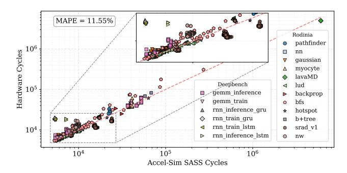

# I. INTRODUCTION

In the advent of Artificial Intelligence (AI), High-Performance Computing (HPC), and Big Data, Graphics Processing Units (GPUs) have become the dominant hardware accelerator, serving a multitude of computing domains. Initially destined to accelerate graphics rendering and gaming applications, their massive parallelism, efficient execution, and concomitant power efficiency have steered them into the acceleration of general-purpose workloads.

The above merits arise from a stall-hiding mechanism inherent to the GPU that utilizes context-switching in the presence of Thread-Level-Parallelism (TLP), overlaying the execution of active threads with stalled ones. While this model aligns naturally with highly parallel graphics tasks, its integration to general-purpose computing has limitations, as many workloads exhibit insufficient TLP, resulting in frequent stalls and underutilization of resources, hence sub-optimal performance [28], [49]. While intuitive, increasing the number of concurrent warps is shown to introduce contention in the GPU cache hierarchy, leading to performance deterioration [38], [40], [49], [78]. Techniques opting to alter instruction scheduling [3], [16], [33], [46], [53], [67], [69], [77], or introduce warp size manipulations [19], [44], [52] suffer from high complexity and are bounded by the in-order instruction sequence. Notably, the most modern GPU architectures (NVIDIA Blackwell [25], Ampere [63] and Volta [62]) can schedule only one warp instruction [17] per processing block (sub-core) per cycle, while higher per-warp concurrency arises from in-flight instructions.

To advance beyond the already fully exploited TLP, several Out-of-Order (OoO) approaches have been introduced [13], [21], [24], [28], [41], [51], [76], to harness the underutilized Instruction-Level Parallelism (ILP). Some require compiler support [21], [51], or switch between in-order and OoO modes [21], [41], inducing hardware overheads to save the processor state. Among them, LOOG [27], [28] stands out as the state-of-the-art (SoTA) GPU backend-based reordering scheme -taking place in the Operand Collect (OC) stage of the pipeline- using register renaming, while GhOST [13] and SIMIL [24] are the most prevalent light-weight frontend-based OoO mechanisms -implemented in the Issue Stage.

However, all prior designs have been evaluated in simulation-based environments [8], [39] which, despite their drastic improvements, still exhibit substantial performance inaccuracies, as they rely on high-level, empirical microarchitectural models. AccelWattch [35], the SoTA power modeling framework for GPUs, exhibits similar inefficiencies due to its extrapolation over outdated McPAT [48] models. Moreover, prior works neither account for nor optimize delicate but critical circuit-level effects (e.g. frequency degradation, pipeline timing variability) introduced by OoO microarchitectural structures, which only emerge through postsynthesis analysis. Currently, such circuit-level evaluation capabilities are available only for in-order GPU designs through RTL frameworks such as MIAOW [9] and Vortex [71], leaving the circuit-level implications of OoO execution unexplored.

\*These authors contributed equally and share first authorship.

Fig. 1: Simulated vs Hardware-measured cycles per-kernel on the Rodinia-3.1 and Deepbench benchmark suites.

To address these limitations, we introduce sCROOGe, a circuit-level micro-architectural platform for the assessment and optimization of OoO GPGPUs, that supports design customization, exploration, and high-fidelity evaluation of both frontend and backend OoO execution schemes. In contrast to SoTA simulator-based approaches that rely on high-level approximations, sCROOGe enables cycle- and timing-accurate performance modeling, along with precise area, power, and frequency assessments derived by the ASIC flow (Table I). Moreover, we resolve key implementation ambiguities often overlooked in prior high-level proposals, such as the instruction sequencing mechanism, that is necessary across all aforementioned OoO schemes and not modeled to date. We further enable accurate modeling of overheads when scaling interconnected hardware modules, thereby bridging the gap between simulation and hardware-realistic implementations. Additionally, we introduce several design optimisations, namely: i) light-weight unique instruction identifiers (UUIDs) for efficient instruction tracking, ii) the right-sizing of the newly implemented RRS, iii) an optimized routing scheme for the OC stage to reduce interconnection complexity, iv) advanced scheduling techniques for independent instruction dispatch in frontend OoO schemes, which allow for the removal of centralized structures such as the scoreboard and v) reassessment of hardware-costly structures such as LOOG's [28] Load-Store Queue (LSQ) under post-synthesis aware constraints.

Leveraging sCROOGe's synthesizable GPGPU model, we conduct an extended post-synthesis evaluation of backend-and frontend-based OoO execution schemes by exploring key GPU architectural parameters as well as OoO specific components. We explore how these parameters affect area, power, and frequency, enabling component right-sizing and design optimization. Our experimental evaluation reveals performance gains of up to 27.3% in general purpose workloads and up to 53% in Machine Learning (ML) applications across different micro-architectural arrangements, highlighting the sensitivity of OoO effectiveness to resource provisioning. Within backend-based designs, performance scaling of up to 5.8% is observed through CU scaling and an improvement of 12% and 27.9% in *Area-Delay Product (ADP)* and *Energy-Delay Product (EDP)* respectively across our design space. To

TABLE I: Qualitative comparison of prior art OoO GPUs.

| Technique       | OoO Mechanism      | Evaluation  |       |                    |                    |  |
|-----------------|--------------------|-------------|-------|--------------------|--------------------|--|
| 1               |                    | Performance | Clock | Power              | Area               |  |
| WarpedP [41]    | Backend            | PTXPlus     | Х     | GPUWattch          | Х                  |  |
| HAWS [21]       | Compiler, Frontend | Multi2Sim   | X     | X                  | CACTI [75]         |  |
| Turbulence [51] | ISA, Frontend      | SASS        | X     | GPUWattch          | X                  |  |
| LOOG [28]       | Backend            | PTXPlus     | X     | GPUWattch          | GPUWattch          |  |
| SOCGPU [23]     | Frontend           | SASS        | X     | AccelWattch        | Part. Synth. 14nm  |  |
| SIMIL [24]      | Frontend           | SASS        | X     | AccelWattch        | Part. Synth. 14nm  |  |
| GhOST [13]      | Frontend           | SASS        | X     | Part. Synth. 45nm  | Part. Synth. 45nm  |  |
| sCROOGe         | Frontend, Backend  | RTL         | /     | Synthesis 22, 2 nm | Synthesis 22, 2 nm |  |

enable direct comparisons with SoTA in-order GPU schemes, we perform an extensive comparative analysis against isoarea in-order Streaming Multiprocessors (SMs) enhanced with additional concurrent warps. The OoO SMs produced by sCROOGe outperform their iso-area in-order counterparts by an average of 14.4%, further validating the feasibility of adopting the examined OoO execution schemes in GPUs. We validate our synthesis-based results through post- Place-and-Route (PnR) measurements on a representative subset of our configuration space and scaling to a 2nm [18], [30] technology node, confirming the persistence of key power, area and efficiency trends.

