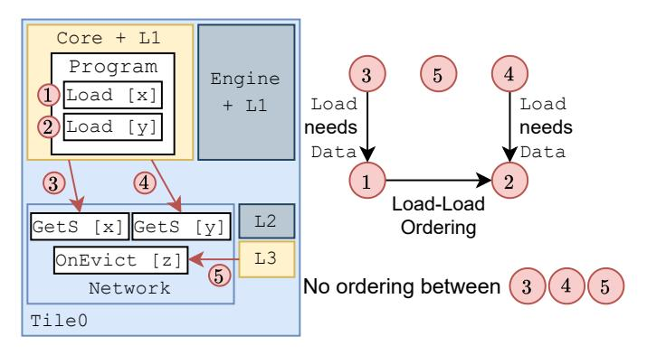
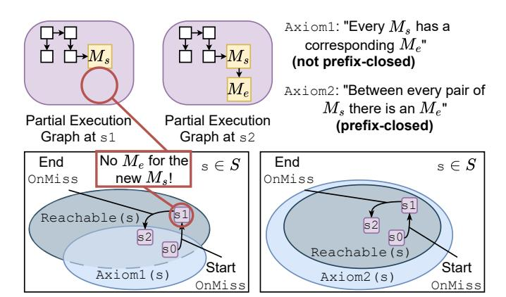

# C. Model Parameterization

Our model is parameterized over the size of all caches, the executing program, the number of cores, and the mapping of addresses to L3 banks. By making these parameters generic instead of concrete values, we ensure that when we prove facts about the transition system (§VII-A), we in fact prove them for *any* configuration of these values. This parameterization makes our proof notably harder, as we now cover a wider range of possibilities. However, our proof becomes much more useful, as it applies to *all* configurations of these parameters.

#### D. Environmental Transitions

In systems like täkō, callback code can execute due to events like evictions or prefetches. Hardware controls when these events happen, so they may interleave arbitrarily with main program threads. To model such variable timing, we use environmental transitions (transitions that are not dependent on instructions) [64] to overapproximate cache behavior. Environmental transitions decouple memory hierarchy transitions from the instructions on cores and engines, enabling us to model cases where an instruction triggered a memory request, as well as cases where the same request was triggered by a prefetch or eviction. Using environmental transitions thus ensures that our proof of consistency (§VII) is sound even under varied prefetching and cache replacement policies.

Fig. 15: Environmental transitions in action. For the five pictured potential transitions, 3, 4, and 5 can occur at any time without any dependencies on each other. The Loads (1, 2) are dependent on the Data being in their cache.

Figure 15 illustrates environmental transitions in the context of two loads. Consider modeling a load's execution if its data is not present in the L1, e.g., the load of [x] in Figure 15. Instead of making the load send a GetS to the L2 state machine, we decompose this transition into two independent ones (1) and (3) in Figure 15). (1) is a PerformLoad step that can only execute if the data is in the L1, and (3) is a SendGetS step that can execute whenever the data is not in the cache. We thus capture executions in which a GetS is triggered without a specific load causing it (e.g., on a prefetch), as well as executions where the events are causally linked. Thus, even though Figure 15 has the load of [x] (1) before the load of [y](2) in program order, their requests to the memory hierarchy (3) and (4)) are not ordered with respect to each other due to environmental transitions, as they could be prefetched out of order. Callback scheduling and running are also environmental transitions, since misses, evictions, and writebacks can occur arbitrarily. Thus, the eviction of [z] (5) in Figure 15 can also be interleaved with other transitions arbitrarily.

We allow callback environmental transitions to repeat if their preconditions are met. For instance, our model can execute repeated OnMiss-OnEvict sequences for an address [x] without a core ever requesting [x]. This is because a prefetch could bring [x] in and the cache could then evict it at any time. Allowing such loops enables our model to overapproximate replacement policy or prefetcher-based triggering of callbacks that might cause unexpected outcomes. Our proof in §VII is valid across all such callback combinations.

#### VII. A MACHINE-CHECKED CONSISTENCY PROOF

Here, we describe how we produce a machine-checked, all-program proof that our täkō ISA-level MCM (§IV) is sound with respect to our model of the täkō hardware (§VI).

#### A. Proof by Induction

Induction is a powerful proof technique that can prove properties about infinite executions of a state machine while only reasoning about one transition at a time. In the realm of hardware, where many designs are modeled as state machines, this approach is broadly applicable [13, 51, 56, 63].

Fig. 16: A Venn diagram motivating inductive invariants. Non-reachable states can leave the P(s) set by transitioning (X), so a strengthening Inv(s) is constructed such that any transition of a state in Inv(s) (Y) remains in Inv(s).

Given a state machine and a property P(s), induction requires us to prove two things: a) that the initial state satisfies P(s), and b) that all transitions preserve P(s). This proves that P(s) is maintained throughout the execution.

Formally, the second obligation is  $P(s) \land Next(s, s') \Longrightarrow P(s')$ ), i.e., if we are in a state satisfying P, any transition from that state should lead to another state that satisfies P. Alas, this proposition simply does not hold for most systems.

To understand why, consider Figure 16's Venn diagram. The outer rectangle represents all possible states in the system, including states not reachable by the state machine. The outer circle represents P(s); i.e., all states s for which P holds. It is possible that a transition like  $\widehat{\mathbf{X}}$  exists, such that the above implication is violated. This *does not* mean that our system is incorrect, as  $\widehat{\mathbf{X}}$  originates in an unreachable state and is thus a spurious counterexample. But it *does* mean we cannot directly use P in our inductive proof.

Instead, we use an *inductive invariant* (Inv(s)) in Figure 16), a strengthening of P(s) (i.e.,  $Inv(s) \Longrightarrow P(s)$ ) which is always preserved under Next (as exemplified by Y). Our proof obligation is then to show that  $Inv(s) \land Next(s,s') \Longrightarrow Inv(s')$  and  $Init(s) \Longrightarrow Inv(s)$ . This ensures that P(s) holds throughout the execution, because  $Inv(s) \Longrightarrow P(s)$ . Finding an inductive invariant for a system is a key challenge when verifying a system inductively [36, 50, 70].

#### B. Intermediate State Machine

We wish to demonstrate via induction that each axiom in our MCM holds for all executions. However, recall that axioms are properties of execution graphs, meaning they hold for a full execution of a program. In contrast, our operational model is a transition system that incrementally builds the execution with each transition. Inductive proofs (§VII-A) require a property to hold during these intermittent stages as well. Thus, we first need a notion of a partial execution graph which represents the execution graph of a program that has not yet completed running. To that end, we first build an intermediate state machine (henceforth ISM for short) that is much simpler than the operational model in §VI. The state of this ISM includes a partial execution graph for a program, and its transitions represent how running a program updates this graph. We then require that each axiom, when strengthened with an inductive invariant (§VII-A), is true for the partial graph at Init(s), and is preserved by Next's additions to these partial graphs.

Fig. 17: Two formulations of an axiom restricting the number of Ms and Me events in an execution graph. While both are true about full executions of our operational model, Axiom1 is not provable using induction, because there are transitions from reachable states (e.g., s0 → s1) where Axiom1 temporarily fails to hold. Axiom2 (MeInt in our MCM), phrased in a prefix-closed manner, avoids this issue by ensuring that the axiom holds for all reachable partial executions as well.

