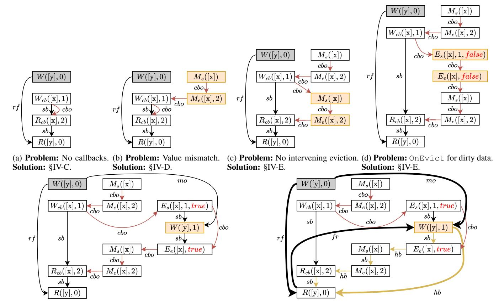

# D. Ensuring Callback Value Correspondence

Figure 7b includes an OnMiss to generate a value for [x]. However, note that the OnMiss generates a value of 2 for [x] (the  $M_e([x], 2)$  node). This is then overwritten by the write of 1 to [x] (the  $W_{cb}$  node). The subsequent read of [x] (i.e., the  $R_{cb}$  node) runs after the write to [x], and so should see the updated value of 1. However, it currently reads a 2.

To fix this problem, we need to add an axiom to ensure that reads of phantom addresses (and eviction callbacks) do not read values that have been overwritten. Specifically, we must ensure that for a given address a, if there is no intervening

(e) Problem: Violates happens-before visibility for [y]. Solution: §IV-F.

(f) Final execution graph for outcome r1=2, r2=0

Fig. 7: (a-e) Faulty candidate execution graphs for Figure 4a's tak¨ o program with an outcome of r1=2, r2=0. (f) The final ¯ execution graph for the outcome r1=2, r2=0 once all relevant events, relations, and axioms are added. §IV explains how we encode the semantics of caches and callbacks into axioms to enforce that impossible outcomes like r1=2, r2=0 are forbidden.

write (e.g., a Wcb) to a in cbo order between the end of an OnMiss (i.e., an Me) for a and a read (e.g., an Rcb) of a, then the value of the read must match the value of the Me. On the other hand, if there is an intervening write to a in cbo order between the Me and the Rcb to a, then the value of the Rcb must match the value of the most recent such write in cbo. The latter case occurs when a phantom address is brought into the cache and then written to. Both cases are depicted below:

To express this constraint formally, we first define a viscb relation to denote phantom writes and OnMiss results that are visible to phantom reads and eviction callbacks. We then require that viscb ⊆ val (CboVal in Figure 6). The val relation links elements with the same value, so this constraint requires that elements linked by viscb must have the same value. This constraint ensures that phantom reads and eviction callbacks must have values that are actually visible to them.

Returning to Figure 7b, now the only way the read of [x]

could get a value of 2 in our program is if another OnMiss ran and generated that value of 2, which was then read by the Rcb node. Adding this extra OnMiss to the graph gives us Figure 7c, which we discuss in the next section.

