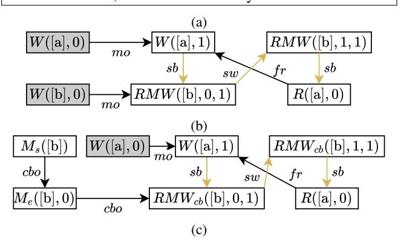

# *G. Summary*

In this section, we showed how we encoded reasoning about tak¨ o's callbacks and cache events into our ISA-level MCM for ¯ tak¨ o. We could not discuss all our MCM axioms from Figure 6 ¯ due to space constraints, but we discussed many important ones. We have encoded all of our axioms as well as our tak¨ o¯ litmus tests in Alloy [21] to support use of our MCM. A programmer can now simply use our MCM to check whether a given outcome is possible for their tak¨ o program, without ¯

| Core 0                                                  | Core 1               | [b].OnMiss   |  |  |
|---------------------------------------------------------|----------------------|--------------|--|--|
| (i1) [a] ← 1                                            | (i3) RMW([b], r1, 1) | (i5) [b] ← 0 |  |  |
| (i2) RMW([b], , 1)                                   | (i4) r2 ← [a]        |              |  |  |
| mprmw ([b] is a regular address, no OnMiss):         |                      |              |  |  |
| r1 = 1, r2 = 0 forbidden by our MCM                     |                      |              |  |  |
| mpcb ([b] is a phantom address, OnMiss included): |                      |              |  |  |
| r1 = 1, r2 = 0 forbidden by our MCM                     |                      |              |  |  |

Fig. 9: (a) The mprmw (no callback) and mpcb (OnMiss for [b]) litmus tests. (b) A forbidden execution of mprmw where the RMWs augment the hb relation to outlaw the reading of 0 for [a]. (c) An analogous forbidden execution of mpcb showing the same pattern when [b] is a phantom address.

needing to understand the intricacies of a tak¨ o implementation. ¯ §V shows how to use our MCM to analyze tak¨ o programs. ¯

