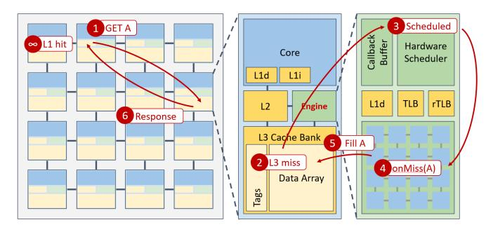

# täkōFormal: Enabling Robust Software for Programmable Memory Hierarchies (Extended Version)

Pranav Srinivasan Manos Kapritsos Yatin A. Manerkar University of Michigan {pransrin, manosk, manerkar}@umich.edu

Abstract—Accelerators provide large performance and energyefficiency benefits, but can significantly change the hardwaresoftware interface. The täko programmable memory hierarchy accelerates data movement by enabling programmers to run userdefined callback functions triggered by cache misses, evictions, and writebacks. However, it also leads to drastically increased complexity and counterintuitive outcomes. In response, we develop an ISA-level memory consistency model (MCM) for täkō that captures the semantics of its operation, and we show how it enables programmers to formally reason about their täkō programs. We also prove the soundness of this ISA-level MCM by constructing a detailed täkō implementation model and verifying that all executions of the implementation model are allowed by our ISA-level MCM. Along the way, we discover useful insights about microarchitectural modeling and verification that are applicable to hardware in general.

This is the extended version of the ISCA 2026 paper "täkōFormal: Enabling Robust Software for Programmable Memory Hierarchies". This version adds material on additional litmus tests to Section V to further explore the programmability of täkō using our ISA-level MCM.

Index Terms—memory consistency models, programmable memory hierarchies, formal verification, computer architecture.

#### I. INTRODUCTION

With the end of Moore's Law, hardware innovation has moved towards increasing performance via accelerator-level parallelism [19]. Innovation in this direction involves hardware and software changes that provide significant performance and energy-efficiency gains.

These benefits come with new challenges. Accelerators today have various shapes and sizes, and often change the hardware-software interface [22, 55, 61]. These changes make it difficult for non-experts to understand, program, and verify such systems. Precisely defining a hardware-software interface and verifying implementations against it is essential. In the past, a lack of careful reasoning about this interface has led to critical vulnerabilities, unintuitive program outcomes, and design specification ambiguities [7, 24, 28, 41, 60].

Formal methods have been used to define hardware-software interface specifications for traditional architectures for many years [5, 49, 52, 53], as well as to verify hardware implementations against such specifications [10, 11, 39]. However, barring a few exceptions (e.g., [6, 57, 58]), most formal methods work still assumes a traditional view of the computing stack rather

Fig. 1: Image and caption from [55] showing the organization of a täkō program. An application registers an address range whose semantics are defined by software callbacks. These callbacks run in-cache on programmable engines.

than the accelerator-rich landscape of today. Furthermore, the accelerator design space is so rich and varied that one cannot create a single effective methodology for formally specifying and verifying all possible accelerators. Still, architects and formal methods experts must work together to develop new techniques for modeling and verifying classes of accelerators that have not been previously studied.

In this work, we focus on developing a verified formal hardware-software interface for the täkō [55] programmable memory hierarchy (PMH). Figure 1 shows täkō's high-level operation: users can write *callbacks* that run on cache misses, evictions, and writebacks. These callbacks give the user increased control over data movement, enabling various performance and energy-efficiency benefits.

We chose to formally model and verify täkō for multiple reasons. Firstly, täkō fundamentally changes the hardware-software interface. In addition to its callbacks triggered by cache events, it supports *phantom addresses* which are not backed by main memory. These features lead to complicated executions and counterintuitive program outcomes, requiring programmers to understand the intricacies of the memory hierarchy (e.g., details of prefetching and replacement policies) to understand how their programs will behave. This complexity makes täkō a challenging and worthwhile case study for formal methods. Secondly, täkō is intended to be a general-purpose accelerator. The täkō paper shows how täkō can be used to improve the performance and energy efficiency of a diverse set of workloads, including graph traversals, scatter-updates,

| Core 0        | [x].OnMiss   |
|---------------|--------------|
| (i1) [x] ← 1  | (i3) [x] ← 2 |
| (i2) r1 ← [x] |              |

(a)

| Core 0                  | [x].OnMiss           |
|-------------------------|----------------------|
| (1) [x] misses in cache |                      |
|                         | [x] ← 2 (2) (i3)1 |
| (3) (i1) [x] ← 1        |                      |
| (4) [x] evicted         |                      |
| (5) [x] misses in cache |                      |
|                         | [x] ← 2 (6) (i3)2 |
| (7) (i2) r1 ← [x]       |                      |
| (b)                     |                      |

Fig. 2: (a) A sample tak¨ o program. (b) A possible execution ¯ of said program. The evictions and misses from the cache, which were previously hidden hardware details, now impact the outcome of the program.

and non-volatile memory transactions. Thus, insights gained from modeling and verifying tak¨ o are likely to be more broadly ¯ applicable than those gained from modeling a more specialized accelerator. Finally, no implementation of tak¨ o currently exists ¯ beyond the closed-source simulator used for the tak¨ o paper. ¯ Thus, there is no way for researchers other than the authors of tak¨ o to validate whether a t ¯ ak¨ o implementation is correct. ¯ A formal hardware-software interface for tak¨ o would enable ¯ such verification, and we create such an interface in this paper.

As an example of how tak¨ o programs can execute in coun- ¯ terintuitive ways, consider the program in Figure 2a, in which a program thread writes to an address [x] and subsequently reads from it. In this case, [x] is a phantom address with an OnMiss callback registered for it. When an access to [x] misses in the cache, the callback runs, populating the cache with a value of 2 for [x]. In an execution where [x] is brought into the cache to execute (i1) and remains there for the execution of (i2), the value of 2 would be overwritten to 1 by (i1), and thus (i2) would read the value of 1 into r1. However, if an eviction occurs between these instructions, (i2) would miss in the cache, causing the OnMiss to be invoked again. In this case, the previously written value is *dropped entirely*, since phantom addresses are not backed by main memory. An execution illustrating this counterintuitive behavior is shown in Figure 2b. In this case, the intervening cache eviction and subsequent OnMiss cause the value that is loaded by (i2) to completely forget the occurrence of the previous write. In such a system, the previously hidden details of cache features, such as a prefetching or cache replacement policy, now have a direct impact on the functional results of the program.

tak¨ o's linkage of cache features to program results funda- ¯ mentally changes the memory consistency model (MCM) of an ISA that may implement tak¨ o. MCMs constrain the values that ¯ can be read by load instructions in parallel programs, so precisely specifying MCMs and verifying their implementations is critical to parallel system correctness. A formally specified MCM for an architecture also enables proving correctness of compilation to that architecture, as well as program synthesis [16] (code generation with correctness guarantees) for that architecture. Defining the MCM of an architecture like tak¨ o¯ requires reasoning beyond what is used in traditional systems, because conventional MCMs have no notion of phantom addresses or cache-event-triggered callbacks.

In this work, we develop new formalisms for reasoning about cache events, callbacks, and phantom addresses to create a new ISA-level MCM for tak¨ o (§IV). This MCM is ¯ *axiomatic*, i.e., executions must obey a set of axioms (properties) to be correct under the MCM. In §V, we show how programmers can use our MCM to reason about realistic tak¨ o programs. ¯

To verify that our MCM accurately captures tak¨ o function- ¯ ality, we create a detailed *operational* (state machine-based) model of a tak¨ o implementation (§VI). We then formally prove ¯ (§VII) that for all programs, any execution possible on the operational model is also allowed by our ISA-level MCM. This proof is machine-checked, which means that a verification engine ensures that the steps we write in our proof do indeed prove all required theorems.

In the course of our formalization, we come to the realization that architects and formal methods experts have different needs from formal models – not just for tak¨ o, but in general. ¯ While formal methods experts are concerned with verifiability, architects desire the flexibility to change design features that may improve performance or energy efficiency.

Our work serves the needs of *both* camps. For tak¨ o, our for- ¯ malisms must account for prefetching and cache replacement policies because they can affect tak¨ o correctness. However, the ¯ best prefetching and replacement policies for a desired level of performance and energy efficiency may not be known until late-stage implementation. Thus, we parameterize our operational model across prefetching policies, cache replacement policies, and network-on-chip specifics so that architects can change them in a tak¨ o implementation without compromising ¯ their conformance with our MCM. On the formal methods side, we formulate our axioms to be prefix-closed [25, 47], a property which enables inductive proofs of implementations against these axioms across all programs.

This work makes the following contributions:

- First Cache-Aware ISA-level MCM. We develop the first MCM capable of reasoning about the semantics of cache misses, evictions, writebacks, callbacks, and phantom addresses at an ISA level.
- Parameterized Formal Implementation Model of tak¨ o.¯ We construct a detailed microarchitectural model of tak¨ o¯ in Dafny [31]. This model parameterizes over tak¨ o-¯ adjacent properties that can impact performance (cache replacement policy, prefetching policy, network-on-chip specifics), ensuring that proofs about this model are valid for all choices of these parameters.
- Machine-Checked Soundness Proof of our MCM. We formally prove that for all programs, any execution of our operational model is also allowed by our ISA-level MCM, ensuring that our ISA-level MCM accurately represents

Fig. 3: Image from [55] showing the order of events in tak¨ o¯ when an OnMiss occurs for an L3 phantom address.

tak¨ o functionality. To our knowledge, this is the first ¯ end-to-end machine checked proof of an operational implementation against an axiomatic ISA-level MCM.

• General Formal Modeling and Verification Insights. We discover that architects and formal methods experts have different needs from a formal model, and that a model must serve both communities to be truly effective. We also discover that enforcing prefix-closure [25, 47] for axioms is extremely useful for enabling inductive proofs of microarchitectural implementations against axiomatic ISA-level MCMs.

