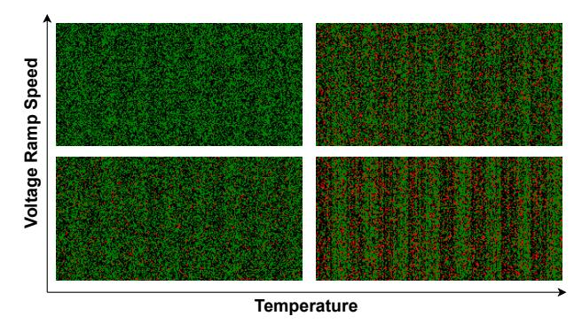
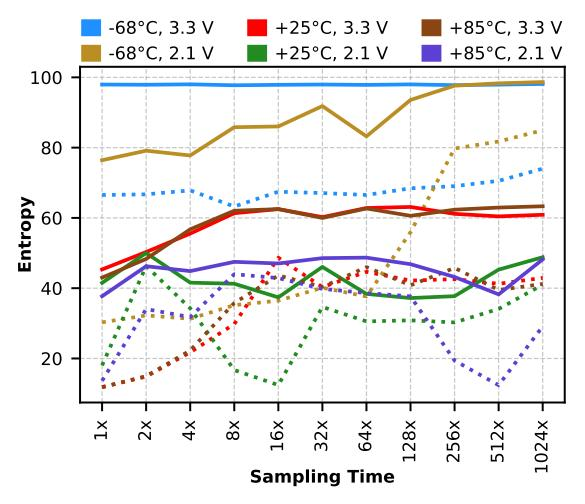

# A. Reference Entropy Sources

SRAM and ring oscillators (RO) are among the most widely used sources of true randomness in commercial resource-constrained devices. Our survey reveals that most UlSWaP TRNGs do not explicitly disclose their underlying entropy source. However, UlSWaP devices, particularly those based on ARM Cortex-M architectures, commonly employ RO jitter as the primary noise source for their TRNGs [4]. To evaluate the security of this prevalent design choice, we require a reliable reference. Additionally, six of the nine device families in our suite lack an integrated hardware TRNG. Given that SRAM is standard in UlSWaP devices, an SRAM-based TRNG serves as an ad-hoc alternative. Accordingly, we characterize both SRAM-based and RO-based entropy sources to assess the security of this broad class of TRNGs.

1) SRAM-based Entropy Source: SRAM-based entropy sources derive randomness from manufacturing-time variation and operational noise at power-up. To characterize SRAM behavior across environmental corners, we collect 4 KB of power-up state from an MSP432P401R Launchpad [85] over

&lt;sup>5Average power cycle time for our DUTs is 3 secs. (2s off, 1s on).

&lt;sup>6For certain security primitives, such as ring oscillators, randomness tends to increase from the most to the least significant bits. To expose potential weaknesses, we focus our analysis on the most significant bits.

Fig. 5: Heatmaps of 4KB of SRAM state across 20 power cycles. Green: 0, Black: 1, Red: Unstable cells. Startup state instability decreases at cold temperature whereas layout asymmetries become more apparent at slow voltage ramp rate.

20 power cycles. The MCU's internal voltage regulation circuitry normally prevents direct manipulation of the power supply. However, because passive components such as decoupling capacitors and inductors are located outside the SoC to save die area, manage heat and maintain a wholly digital process, removing the inductive component enables direct access to the SRAM power rail, bypassing regulation circuits between Vdd and the internal power line that supplies SRAM. We externally supply power to this rail via an RC circuit connected to our power controller (Figure 3), allowing precise ramp-up control.7 Each power cycle includes a 10 s downtime to ensure the voltage fully resets before the next measurement.

*a) SRAM a viable entropy source:* Holcomb et al. [32] demonstrate that 512 bytes of SRAM power-up state can yield a 128-bit random sequence. Under nominal conditions, we observe that 4 KB of SRAM power-up state yields 0.149 bits of entropy per bit and a Moran's I of 0.032, making SRAM a viable source of entropy when conditioned with pseudo random functions. While SRAM cannot generate unbounded entropy as it requires power-cycling for new states, this characteristic suits energy harvesting devices operating intermittently.

*b) When SRAM fails as a viable entropy source:* Figure 5 presents heatmaps of SRAM power-up states across various environmental corners. Our experiments reveal two competing phenomena influencing SRAM behavior: data retention and cell bias due to layout asymmetries. We observe that lower temperatures increase data retention, becoming marked below -40 C. Consequently, at -68 C, 4KB of SRAM state yields 0.004 per-bit entropy. In contrast, at higher temperatures, data retention is very low due to SRAM's insufficient internal capacitance. This lack of data retention combined with the increased thermal noise makes power-up states of SRAM cells more random (per-bit entropy = 0.108 at +85 C). However, this apparent randomness masks a biasing pattern.

Fig. 6: 8-bit entropies of 1000 32-bit sequences from RO TRNG under all operational corners. Solid line shows Shannon's Entropy, dotted line shows min-entropy. Sampling times set as multiples of RO's oscillation period under each corner. RO TRNG randomness improves at lower temperature and higher supply voltage. Also, increasing the sampling time has a generally positive effect on entropy accumulation.

| Operating Conditions | -68◦C    | +25◦C    | +85◦C    |
|----------------------|----------|----------|----------|
| 3.3 V                | 4.00 MHz | 8.54 kHz | 6.27 kHz |
| 2.1 V                | 463 kHz  | 1.01 kHz | 1.33 kHz |

TABLE III: Oscillation frequencies of the five-stage boardlevel RO at different operational corners. Clearly, RO oscillates faster at lower temperature and higher supply voltage directly affecting the TRNG quality as shown in Figure 6.

This pattern is always present in a given SRAM powerup state due to SRAM array layout asymmetries biasing cells closer to the Vdd or ground lines. Slow voltage rampup reduces the uncertainty present during the power-on race, causing SRAM cells to favor states dictated by layout-induced biases. Consequently, at +85 C with slow ramp, 4 KB of SRAM state shows significant stripping with a Moran's I of 0.127. At cold temperatures, however, slow voltage ramp competes with data retention causing a slight increase in the number of unstable cells (per-bit entropy = 0.05) without significant increase in the stripping (Moran's I = 0.015).

Summary: SRAM-based TRNGs suffer from two attackercontrollable sources of insecurity: data retention at cold temperatures and structural asymmetry imprinting at slow voltage ramp rates. This sensitivity to environmental influence makes SRAM-based TRNGs Class 2 secure.

*2) Ring Oscillator-based Entropy Source:* Jitter in RO frequency exhibits strong sensitivity to operational variations arising from variations in propagation delay. For process nodes above 22 nm, the randomness quality of an RO degrades with increasing temperature and decreasing supply voltage.

7Since voltage-level corners are not meaningful for SRAM-based TRNGs, we instead evaluate voltage-ramp-rate corners.

Elevated temperatures reduce carrier mobility in semiconductor materials,8 lengthening the propagation delay of each inverter stage. Although higher temperatures also lower threshold voltages which slightly improve switching speed, carrier mobility degradation dominates at these process node sizes. Similarly, a lower supply voltage decreases the switching speeds of transistors by slowing the charging and discharging of input parasitic capacitances. The resulting slower oscillation produces fewer jitter events per unit time as the transition wave circumvents the feedback loop fewer times, thereby reducing overall non-determinism in the RO's sampled output.

To validate this behavior, we implement a board-level RObased TRNG using five CMOS inverter gates. A Raspberry Pi 3B samples Vout through its GPIO pins (rated 3.3 V) using a custom C program that directly accesses memorymapped registers to satisfy real-time sampling requirements. Figure 6 shows the variation of 8-bit block entropy with sampling time, while Table III lists the measured oscillation frequencies of the RO under different operating conditions, confirming the predicted trends. The results show that sequence entropy depends on the RO's oscillation frequency and therefore on environmental conditions that directly modulate that frequency. Moreover, entropy increases with sampling time and then saturates, as jitter in the oscillations accumulates over successive traversals of the RO transition waveform.

Summary: Randomness of CMOS RO-based TRNGs degrades as temperature rises and supply voltage falls, enabling attackers to influence their outputs. Since RO-based TRNG quality varies substantially across process nodes and inverterstage configurations, we classify these designs as Class 4 secure, potentially degrading to Class 2 secure depending on the specific RO implementation.

