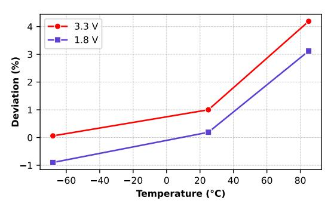

# *B. Commercial Devices*

We audit nine commodity UlSWaP families spanning 189 devices to identify RNGs suitable for secure intermittent systems. Table IV summarizes the main findings of our assessment. Our analysis identifies 88 devices with PRNGs seeded non-randomly (Class 1) and 44 devices with fixed device-level PRNG seed (Class 3). Among 50 devices with on-chip TRNGs, 27 meet Class 2 security and only 23 provide trustworthy entropy (Class 5). We also find bus-snooping vulnerabilities in off-chip TRNGs on SAM L10/L11 Xplained Pro boards. Finally, we find that 7 devices feature a Hybrid RNG (HRNG) with indication of environmental influence (Class 4) and vulnerable intermediate software state (Class 3). We further characterize each RNG by its conditioning Pseudo Random Function (PRF) and throughput. In the following sections, we examine each RNG type in detail.

*1) PRNGs with non-random seeds:* Five out of nine device families, spanning 88 devices, lack a dedicated RNG. They only offer pseudo random generation through C Standard Library's rand() API, failing to meet NIST SP 800-90C [10] requirements due to absence of an entropy source. Moreover, these PRNGs fail the NIST tests under intermittent collection because they reinitialize from a constant seed. The Adafruit Metro M0 Express [1] (SAM D21) also supports Circuit-Python's random.getrandbits() and os.urandom() APIs, but since the SAM D21 lacks a TRNG, calls to os.urandom() raise a NotImplementedError. In that case, seeding falls back to system uptime, which resets on power cycles (error ≈ 100 ns), producing repeating sequences that again fail the NIST tests.

PRNGs initialized with non-random seeds are unsuitable for intermittent use. We recommend using a TRNG to continuously reseed the PRNG with high-entropy input to maintain unpredictability across power cycles.

*2) PRNGs with device-specific seed:* 44 devices from Texas Instruments' MSP430FR59x/69x family incorporate a HW AES accelerator to implement a PRNG for cryptographic applications [65]. At its core, this PRNG, called the Counter Mode Deterministic Random Byte Generator (CTR-DRBG), uses the AES accelerator as a stream cipher to generate random bits in 128-bit multiples for key or key-material generation. The CTR-DRBG operates in three phases: *instantiation*, *working-state update*, and *random-bit generation*.

When invoked, the RNG API checks the value of an 8-bit instantiated\_flag stored in the .infoD FRAM section. If the flag is unset, the API performs instantiation using a 128-bit fixed seed located in device descriptor memory (TLV) at 0x1A30 and a 64-bit nonce at 0x1A0A. 9 The AES accelerator expands them into a 128-bit cipher key and 128-bit data block forming the 256-bit working state. The API then calls ctr\_drbg\_update(), which increments and encrypts the data twice with the key to produce a new working state, before saving it to .infoD and setting the instantiated\_flag to 0xAA. Once instantiated, the PRNG generates random bytes by incrementing and encrypting the data block with the key until it reaches the requested length. Finally, ctr\_drbg\_update() refreshes the working state. In subsequent calls, instantiation is skipped.

Under continuous collection, NIST tests reveal no statistical weaknesses. Because the API updates the working state to non-volatile FRAM, the device continues generating unique sequences under intermittent operation as well. However, the TLV region containing the initial seed and nonce is readable by co-resident software as well as external interfaces (debugger and DMA). Although TLV is read-only, knowledge of these constants exposes the entire pseudorandom sequence. More critically, the .infoD FRAM section, holding both the working state and instantiated\_flag, is fully accessible for read and write operations, allowing an attacker to not only reconstruct but also manipulate the PRNG state.

To demonstrate the extent of this vulnerability in the realworld, we construct an exploit showing how access to the

8This is only true above cryogenic temperatures. At sub-cryogenic temperatures, impurity scattering dominates lattice scattering, causing a decline in carrier mobility with decrease in temperature.

9Both values are programmed during production and remain constant.

| Device Family     | Device Count | RNG Type | Entropy Source    | PRF Applied               | PRF Platform | RNG Security    | Throughput (bits/cycle) |  |
|----------------------|-----------------|-------------|----------------------|------------------------------|-----------------|--------------------|-------------------------|--|
| TM4C123x [87]        | 51              | PRNG        | Х                    | LCG                          | SW              | Class 1            | 0.4054                  |  |
| Apollo3 [2]          | 7               | PRNG        | Х                    | LCG                          | SW              | Class 1            | 0.3333                  |  |
| MSP432Px [84]        | 14              | PRNG        | Х                    | LCG                          | SW              | Class 1            | 0.3750                  |  |
| FE310-G002 [75]      | 1               | PRNG        | Х                    | LCG                          | SW              | Class 1            | 0.0006*                 |  |
| SAM D21 [56]         | 15              | PRNG        | System Uptime        | Yasmarang                    | SW              | Class 1            | 0.0085                  |  |
| MSP430FR59x/69x [86] | 44              | PRNG        | Device-Specific Seed | AES-128-CTR                  | SW+HW           | Class 3            | 0.2402                  |  |
|                      |                 | TRNG        | ND                   | ND                           | ND              | Insecure           | 0.0007                  |  |
| SAML10/L11 [57]      | 27              | (off-chip)  | (off-chip)           | (off-chip)                   | (off-chip)      | (bus-snooping)     | 0.0007                  |  |
|                      |                 | TRNG        | ND                   | ND                           | ND              | Class 2            | 0.3810                  |  |
| MSPM0 L-Series [88]  | 23              | TRNG        | Thermal Noise        | Stream Cipher Bitwise XOR | HW              | Class 5            | 0.1250 - 1.0000         |  |
| Apollo4 [3]          | 7               | HRNG        | ND                   | ND SHA512 AES-CTR      | SW+HW           | Class 3 Class 4 | 0.0001                  |  |

TABLE IV: RNG evaluation results. LCG: Linear Congruential Generator. ND: Not Disclosed. \*Subsequent requests execute faster due to pre-initialization and caching, but since operation is intermittent, we report the first-request throughput.

PRNG's internal state compromises message confidentiality. 10 Two MSP430FR5994 boards using a Diffie-Hellman key exchange protocol generate 2048 bits of random data to derive a shared secret. We reconstruct the CTR-DRBG algorithm in software on our workstation and, using the knowledge of fixed seeds and nonces, reproduce their exact 2048-bit random streams and derive the shared secret. Now, if the devices contain pre-instantiated PRNGs, an attacker has to search the generated sequences to locate the correct 2048-bit random stream to derive the secret. To simplify this, we exploit write access to the working state. We load a malicious patch on each device to reset the instantiated\_flag before the API check, forcing re-instantiation. Since re-instantiation uses the initial seed and nonce, the PRNGs repeat the same sequence of bits, enabling immediate recovery of the shared secret.

PRNGs seeded with a fixed device-specific seed lose security when the seed, nonce, or internal state become accessible. Periodic reseeding with TRNG entropy ensures prediction resistance and preserves cryptographic strength.

3) Off-chip TRNGs: SAM L10/L11 Xplained Pro [55] include the off-chip cryptographic accelerator ATECC508A [54] which supports authentication using ECDH, ECDSA and SHA256 protocols. This accelerator features an internal FIPScompliant RNG for the purpose of preventing replay attacks during public-private key pair generation, as well as to support any cryptographic protocol on the MCU that requires random numbers. However, since the RNG resides off-chip, it remains vulnerable to bus snooping attacks. To validate this, we place probes on the MCU's I2C SDA and SCL pins (PA16 and PA17 on SAML11 Xplained Pro), and monitor them on an oscilloscope, successfully capturing the random bits transferred from the accelerator to the MCU. Notably, the SiFive HiFive1 Rev B development board [76], which we use to evaluate the FE310-G002 MCUs, also includes an ESP32 WiFi and Bluetooth module [23] that features a TRNG. However, the MCU lacks

Fig. 7: Percentage deviation in actual collisions from expected collisions for  $2^{16}$  random samples generated from SAML11E16 under different environmental conditions. Indicates exponential relation between deviation and temperature.

Fig. 8: Heat gun setup for ATSAML11E16A evaluation; proving attackers do not need precise control to weaken TRNGs.

a direct interface for requesting randomness from the off-chip module; therefore, we exclude it from our evaluation.

Off-chip TRNGs are vulnerable to bus-snooping attacks.

4) On-chip TRNGs: On-chip TRNGs embed the entropy source in the SoC, providing stronger protection against software and physical attacks. This section evaluates their behavior under varying conditions and notes potential limitations.

10 Extends to message integrity as well.

[A] SAM L10/L11. 27 devices from Microchip's SAM L10 and SAM L11 families feature an on-chip TRNG. The on-chip TRNG produces a 32-bit random number in 84 cycles and stores it in the memory-mapped register TRNG\_REGS->TRNG\_DATA for consumption. The documentation provides no details on the entropy source used or any conditioning algorithm. Both continuous and intermittent samples pass the NIST tests, though the collision test reveals a pattern emerging with variation in environmental conditions.

Figure 7 shows that increasing the temperature increases the number of collisions while voltage11 is inversely proportional. Moreover, there appears to be an exponential relationship between deviation from expected collisions and temperature. At +85 C and 3.3 V, we observe the highest number of collisions with 4.2% deviation from expected collisions, while -68 C and 1.8 V register the lowest number of collisions at -1% deviation from expected. The TRNGs behavior aligns with the characteristics of a ring oscillator which we describe in §VI-A2. To scope the extent of this deviation, we subject the SoC to +215 C12 using a heat gun (Figure 8) and run our tests again. At this elevated temperature, the on-chip TRNG fails 8 out of 15 NIST tests, rendering it Class 2 secure.

SAM L10/L11 TRNGs are sensitive to environmental factors, showing exponential deviation from true randomness with increasing temperature. Do not deploy these devices in scenarios where attackers control ambient conditions or in extreme thermal environments.

[B] MSPM0 L-series. MSPM0 L-series MCUs, spanning 23 devices, include an on-chip TRNG that provides entropy for cryptographic PRNG algorithms. The TRNG employs an analog Johnson-Nyquist noise source digitized by a deltasigma modulator and powered through a dedicated internal Low-Dropout Regulator (LDO) to resist power-based attacks. The resulting digital noise passes through a conditioning block, reportedly stream-cipher-based, followed by a configurable decimation stage (1-8 samples). Decimation occurs via bitwise XOR operations; in this study, decimation is disabled (rate=1) to analyze minimally conditioned outputs. Although higher decimation increases entropy, it reduces throughput, as summarized in Table IV. The final 32-bit random number is stored in the memory-mapped register trng->DATA\_CAPTURE, with all operations implemented in hardware, ensuring no software intervention during generation.

The TRNG integrates startup and continuous health tests to detect entropy loss or module faults. Failure triggers an ERROR state that halts operation. Notably, during startup, predetermined test patterns cause the first 32-bit word to be deterministic and must therefore be discarded, effectively halving the throughput for intermittently powered deployments. Empirical evaluation shows that both continuous and intermittent outputs pass all NIST tests. The µRNG framework reports no statistical weaknesses or deviations across voltage or temperature variations. The internal LDO, however, prevents direct testing of supply-dependent effects. These results suggest that the MSPM0 L-series on-chip TRNG is robust against intermittent operation and environmental influence.

MSPM0 L-series TRNGs exhibit strong environmental resilience and high physical security but provide lower throughput for intermittent applications, which constrains frequently reseeded systems.

*5) Hybrid RNGs (HRNG):* Seven MCUs from Ambiq's Apollo4 ultra-low power series offer an on-chip TRNG. The Apollo4 documentation reveals no architectural details beyond compliance with BSI AIS-31 [73] and NIST SP 800-90B [90], rendering the design essentially a black box. Since the provided RNG API uses statically linked cryptocell and mbedtls shared libraries, we reverse engineer the binary to understand the RNG process. We find that Apollo4 RNG API employs a hybrid scheme: the on-chip TRNG seeds a PRNG based on a HW AES accelerator. On each API call, the TRNG generates a 24-byte seed at 0x400c0114 within the crypto subsystem on-chip peripheral address space, which the API copies to SRAM before requesting another 24 bytes and concatenating them. The combined 48-byte value is hashed with a software implementation of SHA-512 to seed an AES-CTR PRNG. Because the raw seed resides in SRAM during seeding, we control the final output of the RNG API.

We patch the LLF\_RND\_TRNG\_ReadEhrData() macro to access this raw seed and reroute execution to our instrumentation code, which copies the 24-byte sequence to on-chip nonvolatile memory. Notably, reading the final four bytes of the random seed within the crypto address space before halting the TRNG triggers a hardware refresh that regenerates the random sequence and increments a counter at 0x400c0134 by 0x4001. While we do not know the exact relationship between the random sequence and the counter, we observe that collecting TRNG output after a power cycle resets the counter to 1, thereby reducing its likelihood of masking any drop in entropy of the noise source. We store this counter (4 bytes) along with 16 most significant bits of the raw TRNG output in each collection trial for further inspection.

We do not detect any statistically significant weaknesses in the random seed, however, we observe a deviation in the counter value with temperature. At -40 C, the counter value deviates to 0x4002 in 6 out of 2 16 trials. This deviation increases to 666 trials at +85 C, where we also observe a counter value of 0x8003 in three instances. We repeat this experiment multiple times to verify the behavior of the counter across temperature variations, and consistently observe fewer than 10 deviations at -40 C and more than 600 at +85 C. These deviations indicate repeated re-invocations of the TRNG, consistent with hardware health-test failures prescribed by NIST SP 800-90B. Although entropy remains high, the temperature

11Actual voltage measured at the SoC power rails is 1.27 V and 1.3 V. This results from the presence of a buck converter on the power path that steps down the input voltage supply to the SoC.

12Maximum temperature we observe that the SoC can withstand; external components of evaluation kit not subjected to +215 C.

dependency of the counter suggests environmental susceptibility of the noise source, likely based on a ring-oscillator mechanism, though not conclusively confirmed.

Without details on the TRNG architecture and hardwarelevel conditioning, we cannot know if environmental influence is accounted for or represents a weakness. Hence we recommend avoiding Apollo4 MCUs in attacker-controlled or extreme thermal environments. Moreover, since an attacker is able to interpose between the TRNG and PRNG stages, securing the HRNG's intermediate state is critical.

## *C. Practical Implications*

Weak RNGs compromise the security guarantees of derived keys and nonces. Class 1 and Class 2 devices are particularly vulnerable because they generate low entropy outputs across power cycles and environmental conditions. Low entropy leads to weak or duplicate key material, as prior work demonstrates [28], [30], [38]. To illustrate this risk, we evaluate the Adafruit Metro M0 Express, which seeds its random.getrandbits() API using system uptime. We request 128 bits of randomness to seed software implementations of SHA-512 and AES-CTR PRNG and generate 2048-bit random sequences for Diffie-Hellman key exchange. Because uptime varies by only ∼100 ns across power cycles, the exchange produces 121 repeating shared secrets. Class 1–2 RNGs further embed latent structures, including biased, partially known, or correlated bits, that previous works based on lattice-based cryptanalysis [12], [14], [15], [33], [60] show leads to secret recovery after observing only a few sequences.

Class 3 and off-chip RNGs expose a different attack surface: recovery of internal seed material. In §VI-B2, we show that access to the MSP430FR59x/69x CTR-DRBG internal state enables an attacker to recover the Diffie-Hellman shared secret. To demonstrate this vulnerability on other Class 3 and offchip RNGs, we setup an Apollo4 Blue Plus and a SAML11 Xplained Pro to perform a Diffie-Hellman exchange. On the Apollo4, we use the native cryptocell and mbedtls libraries to generate the random output. On the SAML11 board, we request 128 bits of randomness from the off-chip ATECC508A module and supply them to software implementations of SHA-512 and AES-CTR PRNG. By intercepting the Apollo4's 48-byte TRNG seed written to SRAM and probing the SAML11's I2C SDA and SCL lines to its ATECC508A module, we reconstruct both devices' 2048-bit random streams and derive the shared secret on our workstation.

Since Diffie-Hellman underpins the TLS handshake, these vulnerabilities render intermittent platforms with Class 1-3 and off-chip RNGs incompatible with secure network protocols. Key and nonce recovery also undermines cryptographic checkpointing schemes [20], [39], [40], [80], [91] designed to address a central barrier to intermittent computing: security of data at rest. µRNG detects RNG vulnerabilities and helps intermittent system designers select suitable platforms to avoid these attack classes.

