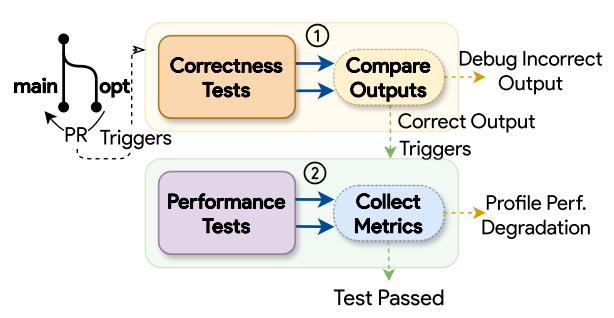

# **CCS Concepts**

Hardware → Emerging architectures;
 Software and its engineering → Architecture description languages;
 Semantics;
 Simulator / interpreter;
 Correctness;
 Software reliability.

#### ACM Reference Format:

Devansh Jain, Marco Frigo, Jai Arora, Akash Pardeshi, Zhihao Wang, Krut Patel, and Charith Mendis. 2025. TAIDL: Tensor Accelerator ISA Definition Language with Auto-generation of Scalable Test Oracles. In 58th IEEE/ACM International Symposium on Microarchitecture (MICRO '25), October 18–22, 2025, Seoul, Republic of Korea. ACM, New York, NY, USA, 18 pages. https://doi.org/10.1145/3725843.3756075

#### 1 Introduction

The increasing demand for machine learning (ML) workloads has brought innovations across the system stack, from applications to hardware designs. On one front, there have been multiple tensor accelerator designs (NPUs) proposed at top-tier computer architecture venues [20, 47, 51, 80, 101, 114]. On another front, there have been multiple systems and compiler optimization work proposed at top-tier systems and compiler venues [21, 31, 42, 44, 106, 116].

#### 1.1 Problem

Although plenty of work has been done on both fronts, we note a subtle disconnect between the software and hardware research. Systems and compiler optimizations are mainly targeted and tested on *existing* CPU and GPU designs. Software works that evaluate on tensor accelerators [72, 84, 119] have been mainly limited to a handful of proprietary and mature designs, such as Google TPU [69] with proprietary mature compiler support. A vast majority of accelerator designs have not been used for software evaluations.

To understand this disconnect, we analyze the tooling available for popular accelerator platforms (summarized in Table 1). These tools allow developers to build (*Programmability*), validate (*Correctness Testing*), and optimize (*Performance Testing*) software support for hardware. We observe two major disparities between hardware with mature software support (CPUs, GPUs, and commercial accelerators) and those without (academic accelerators).

|                            |                    | Programmability   | Correctness Testing    | Pei                 | Performance Testing |  |
|----------------------------|--------------------|-------------------|------------------------|---------------------|---------------------|--|
|                            |                    | Well-Documented   | Test Oracle            | Publicly-Accessible | Performance Model   |  |
| Hardware Category          | Target             | ISA Specification | (Functional Simulator) | Hardware            | (Timing Simulator)  |  |
| CPUs                       | Intel Xeon Gold    | √ [og]         | <b>√</b>               | ✓                   | <b>√</b>            |  |
|                            |                    | [37]              | [39]                   |                     | [4]                 |  |
| GPUs                       | NVIDIA A100        | [41]              | [48]                   | ✓                   | [11, 73]            |  |
| Commercial Accelerators | AMD AI Engine [36] | <b>√</b> [59]  | <b>√</b> [61]       | ✓                   | <b>√</b> [60]       |  |
|                            | Google TPU [69-71] | <b>✓</b> [27]  | ✓ [26]              | ✓                   | <b>√</b> [100]      |  |
|                            | AWS Trainium [64]  | <b>√</b> [65]  | <b>√</b> [66]       | ✓                   | ×                   |  |
| Academic Accelerators   | Eyeriss [23]       | X                 | X                      | X                   | Х                   |  |
|                            | MAERI [80]         | Х                 | X                      | X                   | ✓                   |  |
|                            | FEATHER [114]      | X                 | X                      | X                   | ✓                   |  |
|                            | Gemmini [51]       | <b>√</b> [102]    | [103]                  | ×                   | <b>√</b> [5, 99] |  |

Table 1: Summarizing the status of ISA semantics and simulation tools relevant for software development. We observe that CPUs, GPUs, and commercial accelerators have well-defined ISA semantics and simulation tools. Most academic accelerators have neither a well-documented ISA nor a complete set of simulation tools (lack correctness testing tools).

Observation 1: Limited programmability due to lack of well-defined software-hardware interfaces. The first difference we observe for many accelerator designs is the lack of instruction set architectures (ISAs) or assembly-like kernel programming languages, commonly called virtual ISAs, which serve as well-defined hardware-software interfaces. CPUs and GPUs have mature ISAs (like x86 [37]) or virtual ISAs (like NVPTX [41]) that have played a pivotal role in enabling software tools such as compilers [42, 83] and high-performance libraries [40, 50]. Commercial tensor accelerators like Google TPU [69-71], AWS Inferentia [62] & Trainium [64] have proprietary ISAs with open-source kernel programming languages (like Pallas TPU [27] and AWS NKI [65]) that have enabled successful software tools such as Google XLA-TPU compiler [31] and AWS Neuron SDK [63]. A vast majority of tensor accelerators proposed in academia [20, 23, 47, 74, 80, 114] remain under-explored by the software community due to the lack of well-documented ISAs and, as a result, limited programmability.

ISA semantics provide a clear and precise specification of how hardware instructions behave. These semantics lead to multiple downstream use cases in software development and research. For CPU architectures, they have been used in traditional compiler passes [16, 82], automated compiler construction techniques [12, 18, 22, 87, 95], emulation [52], finding miscompilation bugs [88, 89], software verification [107], ISA-level security analysis [14], and to discover inconsistencies between vendor manuals and actual hardware behavior [46, 54]. These applications show that ISA semantics aid programmability of hardware, making it easier for developers and researchers to build mature software support and, thus, are critical for the wider adoption of new accelerator designs.

Observation 2: Lack of *fast* tooling to test software *correctness*. The second difference we observe for many accelerator designs is the lack of *fast* correctness testing infrastructures that are fundamental to maintaining correct functionality of the software stack, especially for compilers and hand-optimized assembly

kernels. To ensure correctness, hardware platforms provide either physical chip implementations or software test oracles that can validate the behavior of programs against expected results. The term "test oracle", used in Sail [52] and software testing literature [6, 13], also appears as "functional simulator" in some prior works. Intel provides a test oracle, Intel SDE [39], which has enabled developers to test x86 ISA extensions like AMX [38] before the chips were available. Test oracles [26, 61, 66] provided by commercial accelerators [36, 62, 64, 69–71] have enabled rapid iteration and debugging workflows [25]. Such workflows are not feasible for pre-silicon designs proposed in academia due to the lack of *fast* test oracles.

Figure 1: Summarized view of a typical testing infrastructure used in compiler development to merge a new change (opt) into the production branch (main). Performance tests ② are triggered only if opt passes correctness tests ①.

Typical testing infrastructures (as shown in Figure 1) of compilers [7, 21, 31, 63] often rely on both correctness and performance tests, where performance tests ② are only triggered if all correctness tests pass ①. Compiler fuzzing techniques based on output comparison using physical chips and test oracles have uncovered several bugs in mainstream compilers [91, 118, 122] and ML compilers [43, 68, 85, 86, 110] for CPUs and GPUs. Test oracles [26] have also been used to discover bugs in accelerator compilers like

(a) Visualization of Intel AMX instruction topbusd on 1KB tile registers

(b) Corresponding TAIDL definition

Figure 2: Visualization of Intel AMX instruction tdpbusd where only steps ① and ⑥ perform the actual computation. Step ③ shows the data layout transformation applied to tile register src1, where groups of 4 columns are flattened in a "zig-zag" pattern, resulting in a 64x16xi8 matrix. Note that the implementation of the instruction does not generate this intermediate matrix; rather, it relies on the data paths within the systolic-array-based architecture of the Intel AMX TMUL compute unit to manage the data layout. The input matrices to step ④ are of two different types, with the accumulation type as signed 32-bit integer.

JAX Pallas TPU [28]. This shows that *fast and accurate test oracles ensure software correctness* and, thus, are critical for building robust software stacks for pre-silicon designs of tensor accelerators.

Tensor accelerator platforms provide various performance models ranging from cycle-accurate timing simulators [5, 60] to fast approximate analytical [99, 114] and learned [100] cost models. Such tools are extensively studied and established within the architecture community. Therefore, our focus is on improving programmability and correctness testing tools, not on performance modeling.

In summary, we observe that limited programmability and correctness testing infrastructure for a majority of tensor accelerators has resulted in a gap between software and hardware research. Hardware architects need to provide well-defined ISA semantics and fast test oracles for wider adoption of their accelerator designs.

#### 1.2 Challenges

Designing well-defined ISA semantics and fast test oracles for tensor accelerators poses two key challenges - *expressivity* and *scalability*.

Challenge 1: Precisely expressing complex tensor operations. While tensor accelerator designs are often designed to optimize matrix multiplication and convolution operations, these are often accompanied by complex data layout transformations such as reshaping, padding, transposing, and tiling. Additionally, tensor accelerators often support multiple data types with varying precision, like mixed precision training [93] in FP32/FP16 and INT32/INT8. The semantics of such operations are often complex and are not easily expressible in existing scalar ISA description languages such as Sail [52]. For example, consider the Intel AMX instruction tdpbusd visualized in Figure 2 (a) – only steps ④ and ⑥ perform the actual computation of matrix multiplication and addition. Step ③ performs data layout transformation on the second tile register (src1) by collapsing four contiguous columns into a single column. Step ④ computes over inputs of unsigned (red) and signed (blue) 8-bit integers and accumulates over signed 32-bit integer (purple).

Challenge 2: Developing *fast and scalable* test oracles. Building test oracles for tensor accelerator ISAs that scale well with the size of the input tensors is shellowing. Simulating the properties

the size of the input tensors is challenging. Simulating the execution of instructions on these large tensors can be computationally expensive. Many existing test oracles are designed with hand-crafted data structures written in programming languages like C++ and compiled using general-purpose compilers like GCC. Often, these test oracles, like Gemmini Spike [103], are single-threaded and thus do not scale as input tensors become large (more details in §7). This makes them unsuitable for simulating large tensor operations that are common in ML workloads. Additionally, these test oracles are designed for a specific accelerator, and transferring such tooling to a new accelerator design requires considerable engineering effort.

#### 1.3 Our Solution

In this paper, we introduce the first instruction specification language targeting tensor accelerators, **TAIDL** (**Tensor Accelerator ISA Definition Language**), that standardizes the way ISAs and their semantics are developed for tensor accelerators. We leverage this standardization to introduce techniques that *automatically* generate fast and scalable test oracles for any given accelerator ISA specified in TAIDL. Since these techniques are parameterized based on TAIDL, they significantly reduce the engineering effort needed to build such tools targeting multiple accelerator platforms.

TAIDL is designed to express the *intent* of the instructions – i.e., their semantics – without delving into hardware implementation details. This follows from the fact that an ISA acts as a contract between the hardware and software, abstracting away low-level microarchitectural details from the exposed programming model.

Addressing Challenge 1. TAIDL allows us to express complex tensor operations like data layout transformations using a rich set of tensor operators. In this paper, we use the XLA-HLO operators defined in the tensor compiler XLA [31]. Figure 2 (b) shows the TAIDL definition of AMX instruction tdpbusd. The complex data

layout transformation in step ③ is compactly represented by a series of reshape and transpose operators (orange box). The compute in step ④ is precisely represented with convert operators (green box). This allows us to *precisely express* complex tensor operations in a high-level language that is easy to understand and expressive enough to capture the complexities of tensor accelerators.

Addressing Challenge 2. Since TAIDL models ISA semantics using high-level tensor operators like XLA-HLO, it allows us to develop novel techniques to *automatically* generate test oracles that can be compiled using production-grade tensor compilers such as XLA. Unlike existing test oracles, these auto-generated test oracles are multi-threaded and deployable on GPUs. As a result, they are orders of magnitude faster and also scalable to large tensors. Since the auto-generation is *parameterized* by TAIDL constructs, we can generate *fast and scalable* test oracles for any ISA defined in TAIDL.

In summary, this paper makes the following contributions.

- We propose the first instruction specification language for tensor accelerators, TAIDL, that can be used to develop ISAs and their semantics. (§3)
- We demonstrate the expressivity of TAIDL by instantiating existing ISAs of both academic and industrial accelerators with diverse memory and compute capabilities. (§4)
- We discuss key language properties that enable architects to define new tensor accelerator ISAs in TAIDL. (§5)
- We present techniques to automatically generate fast and scalable test oracles from TAIDL definitions. (§6)
- We evaluate the scalability of the auto-generated test oracles against existing instruction-level test oracles Gemmini Spike and Intel SDE. Our results show that the autogenerated test oracles are significantly faster. (§7)
- We present case studies on practical usage of the generated test oracles by simulating an end-to-end I-BERT model [75] and integrating it with Exo's testing infrastructure [57]. (§8)

TAIDL has been released at https://github.com/act-compiler/taidl.

#### 2 Background

We first provide the necessary background on ISA & its semantics, tensor accelerators, simulation tools, and the XLA compiler.

#### 2.1 ISA and ISA Semantics

An Instruction Set Architecture (ISA) is a specification that defines the interface between the hardware and software. It defines the set of instructions that a processor can execute and the format of these instructions. The ISA acts as a contract between the hardware and software. ISA semantics describe the intent or behavior of these instructions. The software stack, especially compilers, is designed to target a specific ISA. The semantics are defined in terms of the state of the processor, the inputs, and the outputs of the instructions. Semantics for CPU ISAs like x86 [37] and GPU ISAs like NVPTX [41] are documented using C-style pseudocode formats.

The ISA is a key abstraction that enables software portability across different hardware implementations. The microarchitecture can vary across different implementations of the same ISA. For example, the x86 ISA is implemented by various generations of modern Intel and AMD processors, but the microarchitectures of these processors are different (like pipeline depth, cache hierarchy).

These processors have different performance characteristics, power consumption, and area, but the result of executing the same program should be the same across all implementations. In other words, an ISA defines the computational capabilities of a hardware, while the microarchitecture defines how these capabilities are realized.

#### 2.2 Tensor Accelerators and ISAs

Tensor accelerators (a.k.a. NPUs, Neural Processing Units) are a class of hardware accelerators optimized for tensor computations, leveraging various microarchitectural innovations such as systolic-array-based executions. Several tensor accelerators (e.g., TPUs [69–71], Eyeriss [23], Gemmini [51], MAERI [80], FEATHER [114]) have been proposed, with varying instruction granularities, memory hierarchies, dataflow configurations, and computational capabilities.

A typical tensor accelerator ISA would need to support a wide range of tensor operations, data layout transformations, and memory access patterns. Figure 2 (a) visualizes the ISA semantics of Intel AMX instruction tdpbusd, showing the complex steps around a simple matrix multiplication (step ④) of 16×64 and 64×16 matrices. To illustrate the expressivity and evaluate TAIDL, we select three accelerators with already existing ISAs that have diverse memory hierarchies and compute capabilities: Google TPUv1 [71], Intel AMX [38], and Gemmini [51] to instantiate their ISA semantics.

Tensor Processing Unit (TPU) is an accelerator designed by Google for ML workloads. TPUv1 is designed for inference workloads, and its design consists of a 256×256 systolic array to perform weight-stationary matrix multiplication, as well as dedicated hardware to perform non-linear activations and pooling operations. We model TPUv1 ISA as per the details presented in [71].

Intel Advanced Matrix Extensions (Intel AMX) [38] is a new built-in accelerator that improves the performance of deep-learning training and inference on the latest Intel cores. Its architecture consists of two main components - two-dimensional registers (tiles) and an accelerator engine (TMUL) that operates on the tiles. The Intel AMX ISA extension provides instructions, with semantic definition [37], to interact with the accelerator.

Gemmini [51] is an open-source full-stack generator of reconfigurable dataflow systolic-array-based accelerators. The accelerator primarily consists of a systolic array that performs matrix multiplications, which supports both output-stationary and weight-stationary dataflows. It is one of the few open-source accelerators with a well-documented ISA [102] and a test oracle [103].

#### 2.3 Simulation Tools

In the absence of physical chips, simulators play a key role in evaluating an accelerator. These simulators are broadly used for two tasks – measuring performance and testing correctness.

(1) Measuring Performance. The simulation methodology closest to hardware execution is simulating the RTL design using tools like Synopsys VCS [67] and Verilator [111]. These RTL simulators are cycle-accurate but are very slow. Event-driven simulators, like gem5 [15], model hardware microarchitecture at a higher level of abstraction, enabling faster simulations by sacrificing a bit of accuracy. Alternatively, software tools like compilers [7, 31] use significantly faster approximate performance cost models [3, 72, 92, 123] in lieu of these simulators to decide on optimizations.

(2) Testing Correctness. Software test oracles are used to test the correctness of the generated machine code and to debug the software stack. They perform instruction-level simulations and are significantly faster than cycle-level simulators. These simulations mask the microarchitectural details and focus on the correctness of the results rather than performance modeling. For example, Gemmini has a hand-designed test oracle Spike [103], and Intel provides the Intel Software Development Emulator (Intel SDE) [39] as a tool for emulating ISA extensions such as Intel AMX [38].

Importance of correctness testing in software development pipelines. Developers writing optimized kernels and software, such as compilers, have two main objectives – correctness and performance. Most software that runs on any hardware undergoes processing by compilers, and thus, its correctness is paramount. Without the correctness constraint, an optimization pass can simply replace the code with no-ops ("Engineering a Compiler" [115], Page 5). Therefore, it is important to test for both the correctness and the performance of software, including those that target hardware accelerators such as accelerator compilers and optimized kernels.

Fast and scalable Test Oracles. For pre-silicon hardware, like indesign accelerators and accelerators proposed in academia, software development pipelines entirely rely on available test oracles (if any) for correctness testing. Therefore, these test oracles are expected to be fast (produce results within a few milliseconds) and scalable. However, existing test oracles, like Gemmini Spike [103], are often single-threaded and not easily scalable to large workloads.

Building test oracles that are fast and scale for large workloads requires considerable engineering effort and needs to be repeated for every accelerator. In §6, we *automatically generate* fast and scalable test oracles directly from TAIDL definitions.

#### 2.4 XLA compiler and XLA-HLO IR

The XLA (Accelerated Linear Algebra) compiler [31] is an opensource optimizing tensor compiler developed by Google for compiling machine learning code to CPUs, GPUs, and TPUs. We use the XLA's tensor operators (XLA-HLO) as part of TAIDL definitions.

XLA-HLO supports 120+ operations with proper semantic description [9, 33, 34]. Following are some XLA-HLO operators used in TAIDL definitions of different accelerator ISAs.

*Generalized tensor computations.* XLA-HLO contains several multidimensional tensor operations such as dot\_general (generalized matrix multiplication), reduce, reshape, transpose, broadcast.

*Element-wise scalar functions.* XLA-HLO contains rank-agnostic element-wise tensor operators1, which can be used to represent scalar functions like scalar multiplication, ReLU activation function.

*Branching.* XLA-HLO has conditional and select operators, which can be used to represent branching dependent on tensor data.

Bit-precise type conversion. XLA-HLO supports a variety of type conversion operators, including bitcast, convert, bitcast-convert, used for defining multi-byte memory accesses (such as f32, i32). Proprietary floating point types can be precisely represented using the XLA-HLO operator reduce-precision2 (discussed in §5.5).

