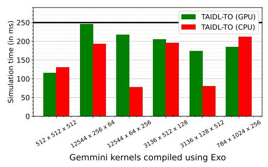

# 8.1 Case Study: Integrating TAIDL-TO into Existing Compiler Testing Infrastructure

As discussed in Figure 1, typical testing infrastructures for compilers rely on correctness tests that use physical chips or test oracles. This is also evident in the Exo compiler [57] that targets the development of high-performance libraries for specialized hardware accelerators like Intel AMX and Gemmini. Exo uses Intel SDE for testing the correctness of its Intel AMX kernels, but lacks a similar level of correctness testing infrastructure for Gemmini kernels.

Figure 21: The simulation time (lower is better) for six Gemmini kernels compiled by Exo [57]. X-axis labels are the size of matrices in  $N \times M \times K$ , where K is the reducing dimension.

We bridged this gap by integrating TAIDL-TO auto-generated for Gemmini ISA (default DIM = 16) into the testing infrastructure of Exo. This increased the coverage of Exo correctness tests to include compiled Gemmini kernels. Unlike the Gemmini kernel library (used in §7.2), Exo-compiled kernels are more complex, with multiple nested and interleaved loops. Additionally, these kernels are up to 20x larger than those of §7.2. Figure 21 shows the average simulation time for these compiled kernels. The simulation times per kernel were still small (less than 0.25 sec), showing the feasibility of integrating TAIDL-TOs into compiler testing infrastructures.

Detected Bug. While we observed no correctness bugs in Exo's default tests, we detected a numerical precision (overflow) bug resulting from missing datatype checks in Exo's replace() scheduling directive. We have reported this bug to Exo developers11.

